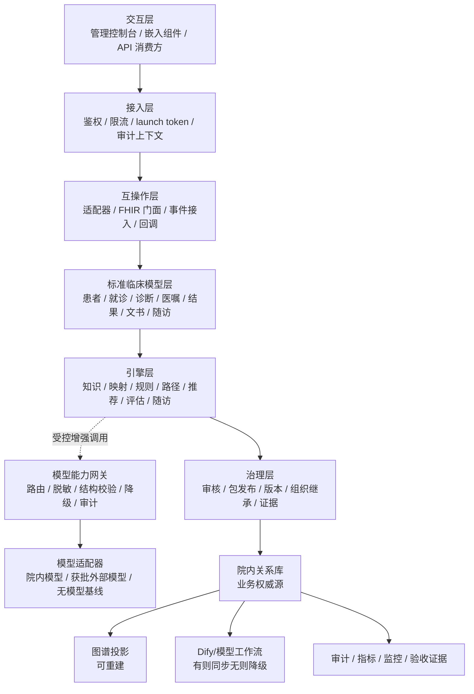
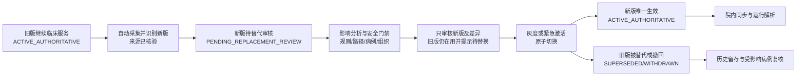

# MedKernel 全业务场景详细设计规范

> 版本：2.0 · 2026-05-24
> 状态：v1.0 GA 唯一实现级详细标准
> 适用对象：产品、前端、后端、AI 团队、测试、实施、临床专家、质控专家
> 范围：S0-S40 全业务场景 + 全医疗专业领域能力 + 系统详细设计 + 可插拔大模型能力 + AI 标准化知识工厂 + 电子病历评级 + 统一验收
> 目标：任何团队成员按本文继续细化或实现，得到一致的页面、流程、API、状态、规则、路径和验收结果。

---

## 0. 设计总则

MedKernel 中文产品名固定为 **集团医疗智能中枢**。本产品不是 HIS、EMR、LIS、PACS 的替代品，而是连接医疗知识、院内数据、规则、路径、推荐、质控和证据的中枢。

本文是唯一承载业务实现细节的规范。后续新增医疗场景、智能能力、评级要求、页面交互、API 契约、规则模板、路径模板或验收细节，必须补入本文既有章节或新增本文内章节，不再新建并行的专项方案文档。

当前实施从 **0 业务引擎全能力上线** 开始。本文的 S0-S40 与全医疗专业领域详细描述继续保留并可继续细化，但在引擎全能力验收前，不按业务菜单拆开发泳道。

| 文档层级 | 文档 | 职责 |
|---|---|---|
| 宪法层 | `CONSTITUTION.md` | 中文名称、产品边界、菜单、状态机、合规硬约束 |
| 体验层 | `MEDKERNEL_PRODUCT_EXPERIENCE_RULES.md` | 全系统产品与交互体验、分页、低打扰、可信解释和验收门禁 |
| 路线层 | `MEDKERNEL_IMPLEMENTATION_LANDING_PLAN.md` | 总体范围、架构原则、阶段节奏、任务拆分 |
| 实现层 | `MEDKERNEL_BUSINESS_SCENARIO_DETAIL_SPEC.md` | 唯一详细规格：全部场景、交互、接口、引擎配置、评级和验收 |

所有业务场景必须满足 10 条统一原则：

| 原则 | 标准 |
|---|---|
| 一条主线 | 试点准备 → 临床运行 → 质控改进 → 合规运维；高级工具隐藏 |
| 一个模板 | 所有配置类能力复用 7 步流：导入/选择 → 校验 → 看影响 → 提交审核 → 灰度 → 全量 → 留证/回滚 |
| 一个状态 | 配置类、变更类、待办类、告警类必须使用产品宪法定义状态机 |
| 一个上下文 | API、规则、路径、推荐、质控均携带组织、患者、就诊、知识包版本、traceId |
| 一个证据链 | 来源、生成、审核、发布、同步、运行、反馈、回滚均可追溯 |
| 一个中文口径 | 客户可见中文统一，英文缩写只保留行业标准 |
| 一个安全边界 | AI 只生成候选；医疗决策必须由医务人员确认 |
| 一个数据权威源 | 业务数据在院内关系数据库；图数据库和 Dify 只做投影或运行器 |
| 一个增强基线 | 大模型通过统一适配层增强全中枢；没有大模型时确定性引擎、检索、人工配置和发布链路仍完整可用 |
| 一个有效知识 | 同一知识身份、组织范围、适用条件和生效时点只能有一个权威有效版本；审核发布新版本后旧版退出新临床决策 |

---

## 1. 全局实现规范

### 1.1 页面统一结构

所有业务页面必须使用同一结构：

| 区域 | 内容 | 规则 |
|---|---|---|
| 顶部标题 | 页面名、组织上下文、状态摘要 | 标题必须是中文业务名 |
| 主操作 | 页面唯一主按钮 | 默认只允许 1 个主按钮 |
| 筛选区 | 默认 3 个以内筛选项 | 其余进入高级筛选 |
| 主内容 | 表格、看板、步骤、画布或详情 | 不同页面可不同，但六态必须一致 |
| 侧边详情 | 来源、影响、解释、审计、技术详情 | 普通模式隐藏 JSON/DSL |
| 底部证据 | 最近发布、traceId、导出审计快照 | 所有关键页面可导出证据 |

### 1.2 六态标准

| 状态 | 展示 | 行为 |
|---|---|---|
| 加载中 | 骨架屏或进度条 | 不闪烁，不显示假数据 |
| 空状态 | 中文说明 + 1 个主动作 | 不出现空白表格 |
| 错误 | 错误原因 + 重试 + traceId | 可复制 traceId |
| 无权限 | 说明权限范围 + 申请入口 | 不暴露敏感数据 |
| 部分成功 | 成功数、失败数、失败明细 | 可重试失败项 |
| 正常 | 主内容 + 状态 + 下一步 | 下一步动作清晰 |

### 1.2.1 大规模知识与资产列表交互

知识、字典、规则、路径、评估指标、候选审核、运行日志和证据记录可能达到万级、百万级，不允许一次性加载或默认铺开所有数据。

| 场景 | 默认交互 | 强制规则 |
|---|---|---|
| 普通知识/资产列表 | 服务端分页 + 默认排序 + 3 个默认筛选 | 默认每页 20，允许 50/100；总数可异步估算；禁止前端一次性拉全量 |
| 审核队列 | 分组队列 + 风险优先 + 待办 SLA 排序 | 默认只看“待我处理 / 高风险 / 新版差异”；重复和旧版进入已拦截视图 |
| 海量检索 | 搜索框 + 高级筛选 + 游标翻页 | 搜索必须支持来源、知识身份、版本、组织、风险、状态、时间范围 |
| 批量处理 | 选择本页 / 选择筛选结果 / 任务化批处理 | 高风险医疗结论不可批量自动通过；批处理必须生成异步任务和审计 |
| 长列表详情 | 列表 + 右侧详情抽屉 | 列表不因打开详情重新加载；详情展示来源、版本、差异、影响和证据 |
| 大表格列 | 默认列 + 列管理 + 视图保存 | 默认列不超过 8 个；技术字段进入详情或专家模式 |
| 运行日志/证据 | 时间倒序 + 时间范围筛选 + 导出任务 | 大范围导出必须异步生成文件并记录审批/审计 |
| 图谱/关系结果 | 分层展开 + 限制节点数 + 继续加载 | 默认展示核心节点，超过阈值按关系类型或证据等级折叠 |

统一分页契约：

| 字段 | 标准 |
|---|---|
| 入参 | `page_size`、`page_token` 或 `page_number`、`sort_by`、`sort_order`、`filters` |
| 出参 | `items`、`next_page_token`、`total_estimate`、`has_more`、`trace_id` |
| 兼容 | 小数据可用页码分页；大数据和日志类必须支持游标分页 |
| 性能 | 首屏 P95 ≤ 1s；筛选 P95 ≤ 2s；导出不阻塞页面 |

默认筛选不得超过 3 个。推荐默认筛选：

| 页面类型 | 默认筛选 |
|---|---|
| 知识资产 | 状态、来源类型、更新时间 |
| 新知/候选审核 | 风险级别、分流类型、待办归属 |
| 字典映射 | 映射状态、来源系统、更新时间 |
| 规则/路径/指标 | 状态、适用组织、版本 |
| 审计/证据 | 时间范围、操作者、对象类型 |

### 1.2.2 全系统产品与交互体验硬规则

全系统产品体验按 [产品体验固定规范](MEDKERNEL_PRODUCT_EXPERIENCE_RULES.md) 执行。本文所有场景、页面、API 和验收继续细化时，必须先满足以下固定规则。

| 规则 | 标准 |
|---|---|
| 角色优先 | 每个页面必须声明主要角色、默认视图、隐藏的专家信息和完成任务 |
| 一页一目标 | 每页最多 1 个主目标、1 个主按钮和 3 个默认筛选 |
| 复杂折叠 | JSON、DSL、trace、图谱原始结构、模型提示词默认进入专家模式 |
| 大规模可用 | 知识、规则、路径、候选、日志和证据从第一天按服务端分页、游标、异步导出设计 |
| 低打扰嵌入 | 临床提醒默认用嵌入卡片或抽屉；非红线风险不得遮挡医生主流程 |
| 可信解释 | 推荐、审核、发布和质控结果必须能看到来源、版本、证据、影响和责任链 |
| 可恢复 | 发布、替换、撤回、同步和批量处理必须有回滚点或撤回解释 |
| 可验收 | 每个页面必须验收六态、权限、降级、性能、证据和审计 |

### 1.3 配置类 7 步流

适用对象：知识包、字典映射、规则、路径、图谱、评估指标、随访计划、适配器、AI 工作流。

| 步骤 | 页面动作 | 系统动作 | 验收 |
|---|---|---|---|
| 1 导入/选择 | 选择模板、导入文件、选择来源 | 生成草稿版本 | 有草稿 ID |
| 2 自动校验 | 展示通过、警告、阻断 | 运行结构、来源、冲突、安全、权限校验 | 阻断项不可发布 |
| 3 看影响 | 展示影响组织、科室、患者、规则、路径 | 模拟执行、差异计算 | 影响范围可导出 |
| 4 提交审核 | 选择审核人、填写说明 | 生成待办和审计 | 状态为待审核 |
| 5 灰度发布 | 选择科室/病区/病种/床位/医生团队 | 创建灰度发布计划 | 有灰度报告 |
| 6 全量发布 | 确认全量 | 写生效版本、同步目标 | 历史版本可追溯 |
| 7 留证/回滚 | 导出证据或回滚 | 生成证据包、回滚点 | 一键回滚可用 |

### 1.4 API 统一输入

所有业务 API 必须带：

| 字段 | 说明 |
|---|---|
| `request_id` | 请求幂等 ID |
| `trace_id` | 全链路追踪 ID，可由前端或网关生成 |
| `tenant_id` | 租户 |
| `group_id` | 集团 |
| `hospital_id` | 医院 |
| `campus_id` | 院区 / 分院 |
| `site_id` | 社区卫生服务中心 / 街道卫生所，可选 |
| `department_id` | 科室 |
| `user_id` | 当前用户 |
| `role_codes` | 当前角色 |
| `patient_id` | 患者主索引，可选 |
| `encounter_id` | 就诊，可选 |
| `package_version` | 知识包 / 配置包版本 |

所有新接口禁止 `@RequestBody Map<String,Object>`，必须使用 Record DTO + Bean Validation。

### 1.5 引擎服务 API 与页面嵌入统一规范

引擎服务必须同时支持 API 对接和页面嵌入：API 负责系统间集成，嵌入能力负责进入医生工作站、电子病历、质控系统和院内门户。

#### 1.5.1 对接方式

| 方式 | 场景 | 强制要求 |
|---|---|---|
| 同步 REST API | 医嘱、诊断、检验结果实时判断 | 超时不阻断医生主流程；记录降级日志 |
| 异步事件 API | 入径、质控、随访、同步任务 | 幂等、重试、死信、回放、审计 |
| 批量 API / 文件 / 中间库 | 老旧系统、病案医保批处理、内网离线 | 批次、差异、失败明细、可续传 |
| FHIR 门面 | 标准化程度较高的医院/集团平台 | 映射核心临床资源，同时保留院内适配器 |
| CDS Hooks 风格事件 | 医生工作流中的临床决策支持 | 支持诊断、医嘱、报告、出院、随访触发 |
| Webhook / 回调 | 发布结果、审核结果、医生反馈通知外部系统 | 签名、白名单、重试、幂等 |

#### 1.5.2 引擎 API 清单

| API 域 | 路径示例 | 输入 | 输出 |
|---|---|---|---|
| 上下文 | `POST /api/v1/engine/context/snapshot` | 患者、就诊、诊断、医嘱、检验、检查、组织 | 标准上下文 ID、缺失字段、映射状态 |
| 临床事件 | `POST /api/v1/engine/events` | 诊断、医嘱、报告、出院、随访事件 | 受理结果、traceId、任务 |
| 字典映射 | `POST /api/v1/engine/terminology/map` | 本地码、系统、科室、上下文 | 标准码候选、冲突、确认要求 |
| 规则执行 | `POST /api/v1/engine/rules/evaluate` | 上下文、规则集、触发点 | 命中、风险级别、解释、动作 |
| 路径运行 | `POST /api/v1/engine/pathways/advance` | 患者路径、节点、事件 | 下一步、变异、随访接续 |
| 专病路径仿真 | `POST /api/v1/engine/specialty-packages/{disease}/simulate` | 专病包版本、样例病例、组织范围 | 节点轨迹、时间窗、规则命中、质控结果 |
| 专病关键时钟 | `GET /api/v1/engine/pathways/{patientPathwayId}/clocks` | 患者路径、关键节点 | 起止时间、超时/缺数、质控指标关联 |
| 辅助诊疗 | `POST /api/v1/engine/diagnosis/assist` | 患者标准上下文 | 疾病候选、鉴别诊断、证据缺口 |
| 治疗推荐 | `POST /api/v1/engine/treatment/recommend` | 疾病候选、风险、知识包 | 方案候选、禁忌、替代方案 |
| CDSS | `POST /api/v1/engine/recommendations/evaluate` | 触发点、上下文、知识包版本 | 提醒卡片、推荐、来源、动作 |
| 医生反馈 | `POST /api/v1/engine/recommendations/{id}/decision` | 采纳/不采纳、原因、医生 | 反馈留痕、疲劳治理输入 |
| 智能评估 | `POST /api/v1/engine/evaluations/run` | 指标集、病例和组织范围 | 评估结果、问题、整改建议 |
| 护理评估与计划 | `POST /api/v1/engine/nursing/assess-and-plan` | 病情、自理能力、护理风险、治疗和路径 | 护理分级候选、风险评估、护理计划候选、复评时间 |
| 报告解读 | `POST /api/v1/engine/reports/interpret` | 检验/影像/病理/功能检查报告、患者上下文 | 异常摘要、趋势、临床关联、处置提示、来源 |
| 床旁知识查阅 | `POST /api/v1/engine/knowledge/search` | 查询词、患者/场景、角色、组织 | 当前权威说明书/指南/制度/路径条款、版本与引用 |
| 随访计划 | `POST /api/v1/engine/followup/plans/generate` | 出院、病种、风险、路径 | 计划、任务、问卷、异常规则 |
| 解释追溯 | `GET /api/v1/engine/explain/{traceId}` | traceId / 推荐 / 规则 ID | 来源、规则、路径、图谱、审计 |
| 权威知识解析 | `POST /api/v1/engine/knowledge/resolve-active` | 知识身份、组织、适用条件、事件时间 | 唯一有效版本、来源、核验时点、替代链 |
| 包同步 | `POST /api/v1/engine/packages/{id}/sync` | 包版本、组织、策略 | 进度、失败项、回滚点 |

#### 1.5.3 嵌入组件与载体

| 组件 | 嵌入位置 | 功能 |
|---|---|---|
| 嵌入式提醒条 | 医嘱、诊断、检验、病历编辑页 | 风险提醒、推荐、采纳/不采纳 |
| 辅助诊疗面板 | 门急诊/病房患者页 | 疾病候选、鉴别诊断、检查治疗候选 |
| 路径节点面板 | 医生工作站、电子病历患者页 | 当前节点、下一步、变异、时间窗 |
| 推荐解释抽屉 | 提醒、质控结果、路径节点 | 来源、证据、规则、图谱、版本 |
| 待办小组件 | 门户、医务处工作台 | 审核、整改、随访异常待办 |
| 质控问题页 | 病案首页、质控系统 | 问题、证据、整改、复核 |
| 护理决策面板 | 护理工作站、移动护理、交班页 | 护理等级候选、评估结果、措施、复评和交班提醒 |
| 报告解读抽屉 | 门诊/住院患者页、报告浏览页 | 异常重点、趋势、危急风险、相关知识和下一步候选 |
| 知识查阅抽屉 | 医生/护士/药师工作站 | 说明书、指南、路径、院内制度查询及当前版本引用 |
| 随访计划页 | 出院小结、随访系统 | 计划预览、问卷、异常回院 |

| 技术载体 | 使用场景 | 强制要求 |
|---|---|---|
| iframe | 多数院内系统，改造成本低 | 签名启动、origin 白名单、CSP、自适应高度 |
| Web Component / JS SDK | 可加载 SDK 的新医生站 | `MedKernel.launch()`、回调、主题和权限上下文 |
| 微前端 | 集团门户、自研 EMR | 版本锁定、独立发布、故障降级占位 |
| 纯 API | 不允许嵌页面的系统 | 院内系统渲染结构化卡片，输出契约一致 |

#### 1.5.4 启动、安全、降级与验收

| 项 | 标准 |
|---|---|
| 启动令牌 | 一次性 launch token，包含用户、角色、组织、患者、就诊、触发点、过期时间 |
| 身份与权限 | 必须绑定身份映射和数据范围，后端校验不可只依赖前端 |
| 数据最小化 | 当前场景仅传必要字段，禁止默认透传整份病历 |
| 反馈闭环 | 采纳、不采纳、关闭、稍后处理全部回传并写审计 |
| 安全 | origin 白名单、签名、过期失效、脱敏、traceId |
| 降级 | 引擎超时或不可用时提示暂不可用，不阻断医生核心业务 |
| 最低验收 | iframe 与纯 API 两种接入通过；诊断、医嘱、检验、出院、随访异常五类触发通过 |

### 1.6 可插拔大模型增强统一规范

大模型不是独立产品入口，也不是核心业务的必需依赖。所有需要语义理解、信息抽取、内容生成、关系发现、解释归纳或自然语言交互的模块，都必须通过统一的 **模型能力网关（Model Capability Gateway）** 调用模型；规则、路径、发布、审核、同步等业务模块不得直接绑定某一家模型服务或某一个 Dify 流程。

| 运行级别 | 定义 | 允许能力 | 交付要求 |
|---|---|---|---|
| B0 无模型基线 | 未部署模型、模型关闭、断网或模型故障 | 已发布知识检索、确定性规则、人工配置、路径执行、字典导入映射、审核发布、院内同步 | 所有 P0 主链路必须可验收 |
| B1 模型辅助 | 调用经批准的本地或外部模型处理受控任务 | 抽取、比对、映射建议、解释草稿、质控候选、随访候选 | 输出标识为 AI 候选，保留来源和模型审计 |
| B2 探索生成 | 模型配合可信来源连接器主动发现更新并生成资产候选 | 最新来源发现、差异总结、新规则/路径/知识包候选、影响分析建议 | 不得自行生效；必须来源确认、质量门禁、专业审核和灰度 |

#### 1.6.1 模型能力网关契约

| 契约项 | 标准 |
|---|---|
| 能力代码 | 使用稳定能力标识，例如 `knowledge.discovery`、`knowledge.extract`、`terminology.map`、`rule.draft`、`pathway.draft`、`cdss.explain`、`quality.semantic-check`、`followup.draft` |
| 输入边界 | 输入必须声明组织范围、患者数据级别、来源约束、知识包版本、脱敏策略、期望结构 schema 和超时 |
| 输出边界 | 输出必须包含 `model_mode`、`model_version`、`prompt_version`、`source_citations`、`confidence`、`risk_level`、`fallback_used` 和 `trace_id` |
| 结构输出 | 医疗资产候选只接受 schema 校验通过的结构化结果；自由文本不能直接进入引擎执行 |
| 路由策略 | 支持关闭、院内模型、获批外部兼容模型、人工/确定性基线的组织级和场景级策略 |
| 故障处理 | 超时、拒答、限流、结构失败、安全阻断均记录原因，并自动回退到 B0 或进入人工处理队列 |
| 审计 | 保存调用目的、最小输入摘要、脱敏策略、模型/提示词/工具版本、输出 hash、耗时、审批和审核结果 |

#### 1.6.2 模型接入 API

| API | 用途 | 无模型返回 |
|---|---|---|
| `GET /api/v1/model-capabilities/status` | 查询当前组织可用能力、模型来源和降级状态 | 返回 B0 能力清单与停用原因 |
| `POST /api/v1/model-capabilities/tasks` | 提交抽取、生成、解释、探索或评估任务 | 受理人工/确定性任务或明确不可增强 |
| `GET /api/v1/model-capabilities/tasks/{id}` | 查看任务状态、来源、输出、门禁和审计 | 返回基线任务进度 |
| `POST /api/v1/model-capabilities/tasks/{id}/retry` | 按批准策略重试或改走本地模型 | 转人工队列或 B0 流程 |
| `POST /api/v1/model-capabilities/policies/validate` | 发布前校验路由、脱敏、审批和降级策略 | 必须验证 B0 验收路径存在 |

### 1.7 AI 开发一致性契约

所有 AI 或开发者继续细化本文、编写代码或拆任务时，必须遵守以下契约。

| 契约 | 标准 |
|---|---|
| 唯一入口 | 实现细节补入本文对应章节、[MEDKERNEL_FOUNDATION_AND_SERVICES.md](MEDKERNEL_FOUNDATION_AND_SERVICES.md)、[MEDKERNEL_PRODUCT_EXPERIENCE_RULES.md](MEDKERNEL_PRODUCT_EXPERIENCE_RULES.md) 或 [backlog.md](backlog.md)，不新建并行方案 |
| 先引擎后业务 | 引擎全能力验收前，先实现基础底座和知识、字典、规则、路径、推荐、评估、随访、包发布、嵌入、模型网关、证据链；不按业务菜单拆分实现 |
| 场景编号 | 业务细节必须挂到 S0-S40 或专业领域包；不能自创同义场景 |
| 菜单归属 | 所有页面归入 5+1 菜单；底座能力不新增一级菜单 |
| API 形态 | 每个接口都有 DTO、校验、错误码、幂等、traceId、组织上下文和审计；禁止 `Map<String,Object>` 作为业务输入 |
| 数据形态 | 每个持久化对象必须声明组织范围、状态机、版本、审计字段、索引和 5 方言迁移策略 |
| 前端形态 | 每个页面必须有 PageShell、六态、1 主按钮、≤3 默认筛选、权限态、traceId 展示位、分页/筛选/详情抽屉和异步导出策略 |
| 产品体验 | 每个页面必须声明角色、主目标、默认视图、专家模式、打扰级别、证据入口和大规模数据处理方式 |
| AI 形态 | 任何模型输出只能是候选、解释或审核建议；必须有来源、结构化输出、风险等级、模型审计和 B0 无模型路径 |
| 验收形态 | 每项能力必须同时写清正常、异常、无权限、缺数据、降级、安全边界和证据 |
| 命名形态 | 对外中文只用集团医疗智能中枢和 5 组业务语言；代码名、接口名、任务名保持稳定，不混用旧产品分层 |

0 业务引擎阶段的允许交付物：

| 类型 | 允许内容 |
|---|---|
| 后端 | 引擎包结构、接口定义、DTO、服务实现、统一响应、错误、审计、组织上下文、Feature Flag、迁移 |
| 前端 | 引擎控制台、路由元数据、菜单、六态、7 步流、状态机、审核、发布、执行、证据和降级状态 |
| 数据 | 知识、字典、规则、路径、推荐、评估、随访、包发布、审计证据等核心表族 |
| AI | 模型能力网关接口、能力代码、策略、结构化输出 schema、来源审计、B0/B1/B2 降级 |
| 测试 | 引擎 E2E、API 契约、状态机、五方言、降级、安全边界和禁用模式扫描 |

0 业务引擎阶段的禁止交付物：

| 禁止项 | 原因 |
|---|---|
| 单病种硬编码路径、规则或指标 | 会污染引擎并制造后续迁移成本 |
| 以 mock 数据伪装业务完成 | 会掩盖真实 API、状态和审计缺口 |
| 业务模块直接调用模型或 Dify | 会破坏统一模型能力网关 |
| 新增分散规格文档 | 会重新制造多事实源 |
| 按业务菜单先拆开发泳道 | 会在引擎能力尚未统一时制造重复实现 |

---

## 2. 全业务场景目录

| 场景 | 名称 | 主角色 | 核心产物 |
|---|---|---|---|
| S0 | 工作台与总览 | 全角色 | 今日待办、风险、发布、同步、价值指标 |
| S1 | 集团与租户开通 | 平台、集团、医院管理员 | 组织、用户、权限、生命周期 |
| S2 | 院内系统接入 | 信息科、实施 | 适配器、字段映射、数据质量 |
| S3 | AI 知识工厂 | 医务处、专家、AI 团队 | 来源、候选、审核、知识包 |
| S4 | 字典映射 | 信息科、专科专家 | 标准字典、院内字典、映射包 |
| S5 | 规则引擎配置 | 医务处、质控办、专家 | 规则集、测试集、发布版本 |
| S6 | 路径引擎配置 | 专科专家、科主任 | 专病路径、节点、变异、随访 |
| S7 | 图谱与来源追溯 | 专家、架构师 | 图谱投影、来源链、冲突 |
| S8 | 临床嵌入运行 | 临床医生 | 提醒、推荐、路径节点、反馈 |
| S9 | 病历内涵质控 | 质控办、医务处、科主任 | 质控规则、问题、整改 |
| S10 | 医保与病案质控 | 医保办、病案室 | DRG/DIP、首页、编码、费用问题 |
| S11 | 智能评估与整改 | 院长、质控办 | 指标、结果、整改闭环 |
| S12 | 智能随访 | 医生、随访团队 | 随访计划、任务、异常回院 |
| S13 | 包发布与院内同步 | 实施、信息科 | 知识包、配置包、同步日志 |
| S14 | 用户、权限与合规 | 合规、信息科 | 身份、权限、审计、证据 |
| S15 | AI 验证与验收 | QA、AI 团队、实施 | S0-S40 实现卡、全领域重点 E2E、证据包 |
| S16 | 辅助诊疗与鉴别诊断 | 临床医生、专科专家 | 疾病候选、鉴别诊断、诊疗方案候选 |
| S17 | 检查检验推荐 | 临床医生 | 检查建议、检验建议、异常解释 |
| S18 | 用药安全与治疗方案 | 临床医生、药师 | 用药推荐、禁忌、相互作用、剂量提醒 |
| S19 | 急危重症与预警 | 急诊、ICU、专科 | 风险预警、处置路径、升级待办 |
| S20 | 护理康复与宣教 | 护理、康复、医生 | 护理计划、康复计划、宣教内容 |
| S21 | 院感与公共卫生 | 感控、公卫、医务 | 感染风险、报告卡、上报事件 |
| S22 | MDT 与专科中心协同 | MDT 团队、专科中心 | 会诊建议、病例摘要、协同任务 |
| S23 | 电子病历评级支撑 | 信息科、医务处、质控办 | 评级能力映射、数据质量指标、实证材料 |
| S24 | 门急诊全过程支持 | 门诊、急诊医生 | 预检分诊、接诊提示、处方检查、留观/入院建议 |
| S25 | 住院诊疗与核心制度 | 病房医生、医务处 | 查房、会诊、转科、交接、出院闭环 |
| S26 | 围手术期、麻醉与输血 | 外科、麻醉、输血科 | 术前评估、核查、时序、用血安全 |
| S27 | 重症与生命支持 | ICU、急诊、专科 | 器官支持风险、评分、治疗监测 |
| S28 | 妇产、儿科与特殊人群 | 妇产科、儿科、药师 | 年龄/孕产/哺乳/剂量与风险规则 |
| S29 | 肿瘤与日间诊疗 | 肿瘤科、日间病房、MDT | 分期、方案、周期、不良反应监测 |
| S30 | 慢病、基层与双向转诊 | 基层、专科、全科 | 分层管理、转诊、复诊、连续随访 |
| S31 | 药事治理与抗菌药物 | 药师、医务处、感控 | 处方点评、抗菌药物、重点监控 |
| S32 | 医疗安全事件管理 | 医务处、质控、护理 | 不良事件、预防策略、改进追踪 |
| S33 | 器械耗材与医疗技术 | 医学装备、手术室、医务处 | UDI、耗材适用、准入和风险提醒 |
| S34 | 科研、真实世界与数据服务 | 科研、伦理、数据管理员 | 脱敏队列、指标数据集、授权证据 |
| S35 | 护理专业智能与护理决策 | 护士、护士长、护理部、医生 | 护理分级候选、护理评估、决策、计划、复评与交班 |
| S36 | 医技报告解读与结果闭环 | 临床医生、检验/影像/病理医师 | 报告摘要、异常/趋势解释、危急闭环、后续建议 |
| S37 | 床旁知识查阅与证据问答 | 医生、护士、药师、医技 | 说明书、指南、路径、制度和来源版本检索 |
| S38 | 营养、心理、疼痛与安宁照护 | 专业团队、临床医生、护理 | 评估、干预计划、会诊触发和连续照护 |
| S39 | 中医药、预防保健与健康管理 | 中医、全科、健康管理、基层 | 适宜技术、治未病、体检干预、健康管理计划 |
| S40 | 医技互认、远程协同与区域共享 | 医联体、医技科、信息科 | 检查检验互认提示、远程协同、跨机构来源证据 |

### 2.1 业务医疗服务包归类

S0-S40 不直接变成开发泳道。引擎全能力验收后，按下列服务包包装业务能力。

| 服务包 | 包含场景 | 统一产物 |
|---|---|---|
| 试点准备服务包 | S1、S2、S3、S4、S5、S6、S13 | 组织、适配器、数据质量、知识包、配置包、字典、规则、路径、发布证据 |
| 临床运行服务包 | S8、S12、S16-S20、S24-S30、S35-S38、S40 | 患者上下文、路径节点、推荐卡、反馈、护理/报告/床旁知识、随访和嵌入证据 |
| 质控改进服务包 | S9、S10、S11、S21、S23、S31、S32、S34 | 指标、问题、整改、复核、医保/病案、公卫、科研数据和价值报告 |
| 合规运维服务包 | S0、S14、S15、S33 | 身份权限、审计、安全、证据、验收、器械耗材和运行状态 |
| 专病路径服务包 | S6、S8、S12、S16-S19、S24-S30、S39 | 专病来源、分型、路径、规则、关键时钟、质控指标、随访和证据 |
| 专业协同服务包 | S20、S21、S22、S31、S35-S38、S40 | 护理、药事、医技、MDT、营养康复心理疼痛、院感公卫和区域协同资产 |

每个服务包必须保持 8 个固定部分：角色、数据、资产、流程、页面、接口、证据、验收。服务包不得新增独立状态机、独立模型调用、独立发布流程或独立证据格式。

---

## 3. 场景详细设计

### S0 工作台与总览

| 项 | 规范 |
|---|---|
| 目标 | 让不同角色 10 秒内知道今天要处理什么、系统是否安全、试点是否可验收 |
| 主按钮 | 继续处理待办 |
| 默认筛选 | 组织、病种、时间 |
| 主卡片 | 系统健康、知识同步、待审核、临床运行、质控整改、价值指标 |
| API | `/api/v1/dashboard/summary`、`/api/v1/dashboard/tasks`、`/api/v1/dashboard/value-metrics` |
| 空状态 | “当前组织暂无待办，可查看配置包或切换组织” |
| 验收 | 院长视角不出现技术词；实施视角能直接进入未完成事项 |

### S1 集团与租户开通

| 项 | 规范 |
|---|---|
| 目标 | 开通集团、医院、分院、街道卫生所、科室和角色 |
| 主流程 | 创建租户 → 导入组织树 → 创建管理员 → 绑定身份 → 选择标准包 → 启动试点生命周期 |
| 必填 | 租户名、集团名、医院名、组织代码、联系人、部署形态、数据权限策略 |
| 状态 | 准备期、试运行期、验收期、推广期、正式运行期、续约/升级期 |
| API | `/api/v1/tenants`、`/api/v1/org-units`、`/api/v1/users`、`/api/v1/lifecycle/stages` |
| 验收 | 一个集团下至少能创建 2 家医院、1 个分院、1 个街道卫生所、3 个科室，并验证继承/覆盖 |

### S2 院内系统接入

| 项 | 规范 |
|---|---|
| 目标 | 让 HIS/EMR/LIS/PACS/医保/病案/随访系统可被接入、体检、同步 |
| 主流程 | 新建适配器 → 选择接入方式 → 字段映射 → 连接体检 → 数据质量检查 → 灰度启用 |
| 接入方式 | HL7 v2、CDA、FHIR、WebService、REST、视图表、中间库、文件、消息队列 |
| 数据质量 | 缺失率、重复率、编码映射率、时间戳异常、患者关联异常 |
| API | `/api/v1/adapters`、`/api/v1/adapters/{id}/health`、`/api/v1/adapters/{id}/field-mapping` |
| 验收 | 适配器断开时不影响医生站主流程；系统给出降级和重试日志 |

### S3 AI 知识工厂

| 项 | 规范 |
|---|---|
| 目标 | 从指南、说明书、文献、政策、院内制度生成可审核的候选知识 |
| 主流程 | 探索策略 → 最新来源发现/导入 → 来源确认与存证 → 解析抽取 → 知识身份/新旧识别 → 有效候选分流 → 自动校验 → 前台审核 → 入包发布 |
| 候选类型 | 字典、规则、路径、图谱、推荐、评估指标、随访计划 |
| 禁止 | AI 候选未经审核直接生效 |
| API | `/api/v1/sources`、`/api/v1/source-discovery-jobs`、`/api/v1/ai-candidates/classify`、`/api/v1/ai-candidates`、`/api/v1/ai-candidates/{id}/review` |
| 验收 | 生成中先识别新主题/新版/重复/旧版/冲突/撤回；重复与过旧内容不进入普通审核；有效候选具备来源发布日期/版本、发现时间、适用时点、风险级别、模型模式和审核记录 |

### S4 字典映射

| 项 | 规范 |
|---|---|
| 目标 | 将院内码表映射到标准术语，支撑规则、路径、推荐和质控 |
| 主流程 | 导入院内码 → 清洗去重 → AI 推荐映射 → 冲突检测 → 人工确认 → 发布映射包 |
| 映射对象 | 诊断、手术、药品、耗材、检验、检查、医嘱、收费、科室、文书、随访项 |
| 冲突类型 | 一对多、多对一、停用码、跨系统不一致、同名异义、同义不同名 |
| API | `/api/v1/terminology/local-terms`、`/api/v1/terminology/mappings`、`/api/v1/terminology/conflicts` |
| 验收 | 未映射队列可追踪；高风险映射必须人工确认 |

### S5 规则引擎配置

| 项 | 规范 |
|---|---|
| 目标 | 普通专家能无代码配置规则，专家模式能表达复杂规则 |
| 主流程 | 选模板 → 配条件 → 配动作 → 加解释 → 加测试病例 → 看影响 → 审核发布 |
| 三种模式 | 模板模式、可视化条件模式、专家 DSL 模式 |
| 触发点 | 诊断保存、医嘱签署、检验回报、检查报告、病历提交、出院签署、随访异常 |
| API | `/api/v1/rules`、`/api/v1/rules/{id}/simulate`、`/api/v1/engine/rules/evaluate` |
| 验收 | 每条规则必须有阳性、阴性、边界、冲突测试病例 |

### S6 路径引擎配置

| 项 | 规范 |
|---|---|
| 目标 | 专科专家可通过模板和画布配置专病路径，并能自动接续随访 |
| 主流程 | 选专病模板 → 配入径条件 → 配节点 → 配分支 → 配变异 → 配随访 → 仿真 → 发布 |
| 节点类型 | 筛查、评估、检查、检验、用药、手术、护理、康复、出院、随访、质控 |
| 分支 | 条件分支、风险分层、患者选择、资源不可用、医生决策、异常回退 |
| API | `/api/v1/pathways/templates`、`/api/v1/pathways/{id}/simulate`、`/api/v1/engine/pathways/advance` |
| 验收 | 路径必须能表达入径、退径、变异、超时、出院、随访和结局评估 |

### S7 图谱与来源追溯

| 项 | 规范 |
|---|---|
| 目标 | 为推荐、规则、路径和质控提供解释，不作为业务权威库 |
| 主流程 | 从关系库业务事实生成图谱投影 → 查询解释 → 展示来源 → 冲突仲裁 |
| 关键约束 | `graph_*` 关系表是权威源；Neo4j 只做可重建投影 |
| API | `/api/v1/graph/query`、`/api/v1/provenance/{traceId}`、`/api/v1/graph/rebuild` |
| 验收 | 关闭图数据库后，系统仍能从关系库生成解释和重新投影 |

### S8 临床嵌入运行

| 项 | 规范 |
|---|---|
| 目标 | 医生不离开工作站即可看到提醒、路径节点和解释 |
| 嵌入方式 | iframe、JS SDK、Web Component、纯 API |
| 启动 | 一次性 launch token，包含用户、组织、患者、就诊、触发点、过期时间 |
| 反馈 | 采纳、不采纳、关闭、稍后处理均回传 |
| API | `/api/v1/engine/recommendations/evaluate`、`/api/v1/engine/recommendations/{id}/decision` |
| 验收 | 引擎超时时不阻断医生开医嘱；必须留降级日志 |

### S9 病历内涵质控

| 项 | 规范 |
|---|---|
| 目标 | 不只查格式和缺项，还能检查诊疗逻辑、核心制度、时序、证据和一致性 |
| 主流程 | 病历提交/定时扫描 → 结构化抽取 → 规则执行 → 问题分级 → 医生整改 → 质控复核 → 闭环 |
| 规则类型 | 完整性、及时性、一致性、合理性、核心制度、诊疗路径、医保病案、语义内涵 |
| API | `/api/v1/medical-record/qc/run`、`/api/v1/medical-record/qc/findings`、`/api/v1/medical-record/qc/rectification` |
| 验收 | 能表达跨文书、跨时间、跨角色、跨系统的复杂规则 |

### S10 医保与病案质控

| 项 | 规范 |
|---|---|
| 目标 | 检查 DRG/DIP、病案首页、编码、费用、医保限制条件 |
| 主流程 | 导入医保/病案规则 → 病案首页校验 → 费用与诊疗匹配 → 问题提示 → 整改闭环 |
| API | `/api/v1/insurance/rulesets`、`/api/v1/insurance/audit`、`/api/v1/medical-record/homepage/qc` |
| 验收 | 首页诊断、手术、费用、年龄、性别、转归、住院天数等可交叉校验 |

### S11 智能评估与整改

| 项 | 规范 |
|---|---|
| 目标 | 将规则命中和质控问题上升为指标、评分、整改和复盘 |
| 主流程 | 配指标 → 运行评估 → 生成问题 → 派单 → 整改 → 复核 → 闭环 → 趋势分析 |
| API | `/api/v1/evaluation/indicators`、`/api/v1/evaluation/results`、`/api/v1/quality/findings` |
| 验收 | 每个指标能追溯到病例、规则、知识来源和组织范围 |

### S12 智能随访

| 项 | 规范 |
|---|---|
| 目标 | 从专病路径自动生成随访计划，并将异常回院纳入 CDSS 和质控 |
| 主流程 | 出院事件 → 风险分层 → 生成计划 → 同步随访系统 → 接收反馈 → 异常回院 |
| API | `/api/v1/followup/plans`、`/api/v1/followup/events`、`/api/v1/engine/followup/plans/generate` |
| 验收 | 随访不做完整呼叫中心，但计划、任务、异常和评价必须可同步 |

### S13 包发布与院内同步

| 项 | 规范 |
|---|---|
| 目标 | 将知识、字典、规则、路径、图谱、评估、随访打包发布到院内 |
| 主流程 | 选资产 → 差异 → 看影响 → 审核 → 灰度 → 全量 → 同步 → 证据 |
| API | `/api/v1/packages`、`/api/v1/packages/{id}/diff`、`/api/v1/packages/{id}/sync` |
| 验收 | 包可导入、导出、签名、校验、灰度、回滚、离线安装 |

### S14 用户、权限与合规

| 项 | 规范 |
|---|---|
| 目标 | 用户、角色、身份、权限、数据范围、审计满足集团医疗场景 |
| 主流程 | 用户导入 → 身份绑定 → 角色授权 → 数据范围 → 操作审计 → 证据导出 |
| API | `/api/v1/users`、`/api/v1/roles`、`/api/v1/permissions`、`/api/v1/audit-events` |
| 验收 | 同一医生在不同院区/科室可有不同角色和数据范围 |

### S15 AI 验证与验收

| 项 | 规范 |
|---|---|
| 目标 | 让 AI 团队能自动验证功能、交互、规则、路径、知识和证据 |
| 主流程 | 生成测试数据 → 执行 API 测试 → 执行 E2E → 对比规则结果 → 导出证据 |
| API | `/api/v1/qa/scenarios`、`/api/v1/qa/runs`、`/api/v1/evidence/export` |
| 验收 | S0-S40 均有实现卡和测试范围；P0 试点链路通过；失败项有截图、traceId、输入、输出和修复建议 |

### S16 辅助诊疗与鉴别诊断

| 项 | 规范 |
|---|---|
| 目标 | 基于患者数据、医学知识、规则、路径和图谱，向医生推荐可能疾病、鉴别诊断和诊疗方案候选 |
| 定位 | 辅助诊疗 / CDSS，不自动诊断、不自动下医嘱、不替代医生判断 |
| 输入 | 主诉、现病史、既往史、体征、诊断、检验、检查、用药、过敏、手术、风险评分、院内路径 |
| 输出 | 疾病候选、鉴别诊断、证据匹配、缺失证据、建议检查、治疗方案候选、风险提示 |
| 推荐方式 | 按“高危先行、证据充分、来源可信、可解释”排序 |
| 医生动作 | 采纳、部分采纳、不采纳、补充资料、加入鉴别、转入路径 |
| API | `/api/v1/engine/diagnosis/assist`、`/api/v1/engine/treatment/recommend`、`/api/v1/engine/explain/{traceId}` |
| 安全 | 必须显示“辅助建议，需医生确认”；高风险治疗建议必须展示禁忌和替代方案 |
| 验收 | 任意疾病候选必须能解释“为什么推荐、缺什么证据、来源是什么、适用范围是什么” |

辅助诊疗输出卡片标准：

| 字段 | 说明 |
|---|---|
| 候选疾病 | 标准诊断名、本地诊断名、编码、置信级别 |
| 支持证据 | 症状、体征、检验、检查、病程、用药反应 |
| 反对证据 | 不符合的症状、缺失检查、排除条件 |
| 鉴别诊断 | 需要排除的疾病、建议补充检查 |
| 诊疗建议 | 检查、治疗、路径、会诊、随访候选 |
| 风险提示 | 禁忌、特殊人群、危急值、药物相互作用 |
| 来源 | 指南、说明书、文献、院内制度、路径版本 |
| 医生反馈 | 采纳/不采纳、原因、补充说明 |

### S17 检查检验推荐

| 项 | 规范 |
|---|---|
| 目标 | 根据疑似疾病、路径节点、风险分层和已有结果推荐下一步检查检验 |
| 输入 | 候选疾病、路径节点、既往检查、检验结果、禁忌、费用和医保限制 |
| 输出 | 推荐项目、必要性、优先级、替代项目、禁忌、时限 |
| API | `/api/v1/engine/orders/exam-recommend`、`/api/v1/engine/orders/lab-recommend` |
| 验收 | 不得重复推荐已完成且仍有效的项目；异常结果必须可进入病程解释和质控 |

### S18 用药安全与治疗方案

| 项 | 规范 |
|---|---|
| 目标 | 提供用药安全校验和治疗方案候选 |
| 输入 | 诊断、年龄、性别、体重、肝肾功能、过敏、妊娠、药物、检验、医保、说明书 |
| 输出 | 推荐用药、禁忌、相互作用、剂量、给药途径、疗程、监测项、替代方案 |
| API | `/api/v1/engine/medication/safety-check`、`/api/v1/engine/treatment/options` |
| 验收 | 任何用药建议必须可追溯到说明书、指南或院内制度；高风险禁忌默认强提醒 |

### S19 急危重症与预警

| 项 | 规范 |
|---|---|
| 目标 | 对急危重症、危急值、病情恶化、VTE、脓毒症等风险进行预警和处置建议 |
| 输入 | 生命体征、危急值、检验趋势、诊断、医嘱、护理记录、评分量表 |
| 输出 | 风险等级、处置建议、升级路径、会诊/抢救待办 |
| API | `/api/v1/engine/risk/early-warning`、`/api/v1/engine/critical-values/handle` |
| 验收 | 高危预警必须支持强提醒、升级通知和闭环记录 |

### S20 护理康复与宣教（路径接续）

| 项 | 规范 |
|---|---|
| 目标 | 将已经确认的护理、康复和宣教计划衔接到专病路径、出院与随访，不替代完整护理专业决策场景 S35 |
| 输入 | 护理决策结果、病种、路径节点、风险评分、手术、治疗、出院状态 |
| 输出 | 路径中的护理任务、康复动作、频次、禁忌、宣教材料、随访接续 |
| API | `/api/v1/engine/nursing/plans`、`/api/v1/engine/rehab/plans`、`/api/v1/engine/education/materials` |
| 验收 | 护理专业计划能进入路径节点和随访计划，并保留由谁确认、何时复评和来源版本 |

### S21 院感与公共卫生

| 项 | 规范 |
|---|---|
| 目标 | 支持院感风险识别、传染病/死亡/VTE 等报告卡预填和上报辅助 |
| 输入 | 诊断、检验、抗菌药物、体温、手术、病区、接触史、死亡记录 |
| 输出 | 院感风险、疑似报告、报告卡预填、待确认任务 |
| API | `/api/v1/engine/infection/risk`、`/api/v1/engine/public-health/report-cards` |
| 验收 | 系统只预填和提醒，上报必须由有权限人员确认 |

### S22 MDT 与专科中心协同

| 项 | 规范 |
|---|---|
| 目标 | 为复杂病例生成结构化摘要、会诊建议和 MDT 协同任务 |
| 输入 | 患者全量摘要、诊断、治疗史、检查检验、路径状态、问题清单 |
| 输出 | 病例摘要、待讨论问题、建议专家、会诊材料、会议结论记录 |
| API | `/api/v1/engine/mdt/case-summary`、`/api/v1/engine/mdt/recommend-experts` |
| 验收 | 摘要必须可追溯来源，不得编造病史；会诊结论由专家确认 |

### S23 电子病历评级支撑

| 项 | 规范 |
|---|---|
| 目标 | 将中枢的接入、知识、CDSS、质控、闭环和数据质量能力沉淀为医院电子病历评级建设证据 |
| 定位 | MedKernel 是评级支撑子系统，不替代医院电子病历全系统，不单独承诺评级结果 |
| 输入 | 目标级别、评价项目、院内系统现状、接口覆盖、数据质量、应用比例、证据材料 |
| 输出 | 能力差距、改进任务、指标快照、实证材料索引、场景演示和审计证据包 |
| API | `/api/v1/emr-rating/targets`、`/api/v1/emr-rating/gaps`、`/api/v1/emr-rating/evidence` |
| 验收 | 能按目标等级输出项目映射、覆盖比例、数据质量、功能截图/日志/审计材料，并标记院方系统依赖项 |

### S24 门急诊全过程支持

| 项 | 规范 |
|---|---|
| 目标 | 在预检、接诊、处方、检查、留观、急诊转住院关键节点提供辅助决策和质控能力 |
| 中枢能力 | 分诊风险候选、疑似疾病提示、重复检查识别、处方安全、危急值提醒、留观/入院路径候选 |
| 对接系统 | 门诊 EMR、急诊系统、HIS、LIS、PACS、处方点评、排队叫号 |
| 规则资产 | 胸痛、卒中、创伤、发热、急性过敏、抗菌药物、门诊处方、急诊留观 |
| 安全边界 | 不替代分诊人员和医生决定；高危提示需确认及处置留痕 |
| 验收 | 预检到去向决定可形成完整事件链；高危病例提示有来源、有反馈、有闭环 |

### S25 住院诊疗与核心制度

| 项 | 规范 |
|---|---|
| 目标 | 支持入院、查房、会诊、转科、交接、出院和死亡病例的诊疗质量闭环 |
| 中枢能力 | 入径候选、住院路径、三级查房/会诊/交接质控、诊疗合理性、出院与随访接续 |
| 对接系统 | 住院 EMR、HIS 医嘱、护理、病案、电子签名 |
| 规则资产 | 入院记录、首次病程、上级医师查房、疑难会诊、转科交接、出院小结、死亡讨论 |
| 安全边界 | 中枢识别缺失或冲突并提示整改，正式文书仍由院内病历系统完成和归档 |
| 验收 | 至少支持常见核心制度时限、跨文书一致性和出院随访闭环 |

### S26 围手术期、麻醉与输血

| 项 | 规范 |
|---|---|
| 目标 | 支持手术前、中、后的安全核查和合理诊疗，覆盖用血闭环 |
| 中枢能力 | 术前检查与风险评估、知情同意时序、预防用药、手术安全核查、麻醉风险、输血指征和不良反应提醒 |
| 对接系统 | 手麻系统、手术室、输血系统、EMR、LIS、HIS |
| 路径资产 | 择期手术、急诊手术、围术期抗菌药物、输血、术后监测 |
| 安全边界 | 不控制手术设备或自动执行输血医嘱；提醒由有资质人员确认 |
| 验收 | 可表达术前到术后跨时间、跨系统、跨角色的安全规则 |

### S27 重症与生命支持

| 项 | 规范 |
|---|---|
| 目标 | 支持危重患者风险分层、治疗监测和升级处置建议 |
| 中枢能力 | 生命体征趋势、器官功能风险、脓毒症/VTE/压疮/跌倒风险、呼吸支持和危急值处置闭环 |
| 对接系统 | ICU 系统、监护、LIS、护理、EMR、医嘱 |
| 资产 | 风险评分定义、监测规则、预警动作、会诊升级路径、护理预防计划 |
| 安全边界 | 不作为生命支持设备控制系统；预警不替代床旁判断 |
| 验收 | 风险提示能回溯原始指标、变化窗口、规则版本和处置反馈 |

### S28 妇产、儿科与特殊人群

| 项 | 规范 |
|---|---|
| 目标 | 处理孕产妇、哺乳、儿童、老年、肝肾功能异常等人群的特殊安全要求 |
| 中枢能力 | 人群标识、剂量计算候选、禁忌提醒、检查适宜性、母婴路径、专用随访 |
| 对接系统 | EMR、妇幼、儿科、药事、LIS、护理 |
| 规则资产 | 妊娠/哺乳用药、儿童体重剂量、老年多重用药、肝肾剂量调整 |
| 安全边界 | 剂量建议必须展示参数和说明书/指南来源，必须由医生确认 |
| 验收 | 特殊人群在所有推荐和规则中均可作为强制条件使用 |

### S29 肿瘤与日间诊疗

| 项 | 规范 |
|---|---|
| 目标 | 支持肿瘤分期、方案周期、日间治疗、不良反应和 MDT 复盘 |
| 中枢能力 | 分期信息结构化、治疗方案候选、周期计划、用药安全、疗效评价、毒性监测和随访 |
| 对接系统 | EMR、日间病房、药事、LIS、PACS、MDT、随访 |
| 资产 | 肿瘤病种知识、分期字典、方案模板、评估规则、不良反应处置路径 |
| 安全边界 | 治疗方案和剂量不自动执行；模型不得生成无来源方案 |
| 验收 | 每个方案候选展示适用分期、支持证据、禁忌、监测与审核意见 |

### S30 慢病、基层与双向转诊

| 项 | 规范 |
|---|---|
| 目标 | 支持集团医院和基层机构的慢病分层、连续管理和双向转诊 |
| 中枢能力 | 风险分层、基层随访计划、复查提醒、转诊建议、医院包向基层适配 |
| 对接系统 | 基层系统、随访平台、医院 EMR、区域平台 |
| 资产 | 高血压、糖尿病、冠心病、卒中康复等长期管理路径和指标 |
| 安全边界 | 中枢生成管理和转诊建议，实际转诊和诊疗由机构流程确认 |
| 验收 | 集团包可下发到街道卫生所并允许配置能力范围和本地覆盖 |

### S31 药事治理与抗菌药物

| 项 | 规范 |
|---|---|
| 目标 | 从单次用药提醒扩展到药事治理、抗菌药物和处方点评 |
| 中枢能力 | 说明书结构化、处方规则、抗菌药物分级/疗程/送检提醒、重点监控、点评问题和趋势 |
| 对接系统 | HIS、药房、审方、LIS、EMR、感控 |
| 资产 | 药品本位码/院内药品映射、说明书事实、抗菌药物规则、点评指标 |
| 安全边界 | 说明书事实必须来自授权或官方来源并保留版本；药师/医生确认干预 |
| 验收 | 药事问题可从提醒进入点评、整改、指标分析和证据包 |

### S32 医疗安全事件管理

| 项 | 规范 |
|---|---|
| 目标 | 支持医疗不良事件、近似差错、投诉关联风险和安全改进 |
| 中枢能力 | 事件分类候选、关联规则/路径/科室、风险趋势、改进任务、效果监测 |
| 对接系统 | 不良事件系统、质控、护理、审计、投诉系统接口 |
| 资产 | 事件分类字典、严重程度、原因分类、改进措施模板、安全指标 |
| 安全边界 | 不替代正式上报、调查或责任认定流程 |
| 验收 | 事件可关联到发生时生效的知识包、规则和路径版本 |

### S33 器械耗材与医疗技术

| 项 | 规范 |
|---|---|
| 目标 | 支持器械耗材目录、UDI、适用条件、风险和医疗技术准入相关提醒 |
| 中枢能力 | UDI 校验、院内映射、适用/禁忌知识、召回或停用同步、技术权限提示 |
| 对接系统 | SPD、物资、手术室、HIS、器械管理 |
| 资产 | UDI、耗材目录、使用条件、准入授权、风险提醒规则 |
| 安全边界 | 物资采购库存和设备控制仍由源系统负责 |
| 验收 | 使用记录与适用规则、器械版本和审核证据可追溯 |

### S34 科研、真实世界与数据服务

| 项 | 规范 |
|---|---|
| 目标 | 在合规前提下向科研、专病队列、质量改进提供数据能力 |
| 中枢能力 | 队列条件配置、脱敏数据集、指标结果导出、数据来源和版本证明 |
| 对接系统 | 科研平台、伦理管理、数据申请、病历/检验/影像索引 |
| 资产 | 数据集定义、脱敏策略、授权范围、导出审批、使用记录 |
| 安全边界 | 未经审批不得导出敏感数据；科研输出不得直接回写临床决策 |
| 验收 | 每次数据服务有申请、审批、脱敏、导出、用途和销毁/到期证据 |

### S35 护理专业智能与护理决策

| 项 | 规范 |
|---|---|
| 目标 | 支撑责任制整体护理，覆盖护理分级、护理评估、护理决策、护理计划、执行反馈、复评和交班闭环 |
| 标准基线 | 采用现行 `WS/T 431-2023 护理分级标准` 与医院护理制度；护理等级最终由具备权限的护理/医疗人员确认 |
| 输入 | 患者病情、诊断、生命体征、自理能力、治疗/手术/管路、皮肤、疼痛、跌倒/坠床、营养、VTE、感染、精神认知、出入量、护理记录 |
| 护理评估 | 护理级别依据候选、自理能力、压疮/跌倒/VTE/导管/疼痛/误吸/营养/谵妄/感染风险、特殊人群与出院准备 |
| 护理决策 | 护理等级建议、观察频次、风险防范、专科护理、管路管理、疼痛/营养/康复/心理转介、升级医生或会诊 |
| 护理计划 | 问题、目标、措施、频次、责任人、执行时限、复评条件、停止条件、交班重点、宣教和随访接续 |
| 事件触发 | 入院、病情变化、术后返回、转科、危急值、跌倒/压疮风险变化、出院前、计划到期、交班 |
| API | `/api/v1/engine/nursing/assess-and-plan`、`/api/v1/engine/nursing/grade-recommend`、`/api/v1/engine/nursing/risks`、`/api/v1/engine/nursing/plans/{id}/reassess` |
| 嵌入 | 护理工作站/移动护理显示评估摘要、待确认护理等级、计划任务、到期复评和交班重点；医生端显示协同信息 |
| 安全边界 | 不自动写入护理级别或替代护士临床评估；高风险升级提醒必须由有权限人员确认和闭环 |
| 验收 | 从入院评估到分级、计划、执行、复评、交班和出院接续可重放；护理等级与风险规则有来源、版本和确认记录 |

### S36 医技报告解读与结果闭环

| 项 | 规范 |
|---|---|
| 目标 | 为临床医生提供检验、影像、超声、病理、内镜、心电/电生理及其他功能检查报告的结构化解读与闭环提示 |
| 输入 | 已签发报告、结构化结果、参考范围、危急值、既往趋势、患者诊断/症状/治疗/路径、报告医师结论 |
| 输出 | 关键异常、趋势变化、危急/紧急标识、与当前问题的关联提示、需关注的阴性/不确定结果、复核/检查/会诊候选、引用知识 |
| 解读层次 | 原报告结论原样呈现；引擎补充面向临床的解释、趋势和提示；医生可查看来源、版本和适用边界 |
| 闭环动作 | 危急值确认、报告已阅、补充检查候选、路径推进、病例讨论/会诊、病历记录提示、质控记录 |
| API | `/api/v1/engine/reports/interpret`、`/api/v1/engine/reports/{id}/acknowledge`、`/api/v1/engine/reports/{id}/follow-up-actions` |
| 安全边界 | 不修改原始报告、不替代检验/影像/病理医师签发意见、不自动下医嘱；危急值按院内制度闭环 |
| 验收 | 解读绑定原报告、知识版本和患者快照；模型不可用时仍显示原报告、趋势规则、危急值及人工处置入口 |

### S37 床旁知识查阅与证据问答

| 项 | 规范 |
|---|---|
| 目标 | 让医生、护士、药师和医技人员在工作站内快速查阅当前权威医疗知识，不离开临床上下文 |
| 知识范围 | 药品/器械说明书、疾病与鉴别知识、指南推荐、临床路径、护理规范、检验/影像/病理解释知识、抗菌药物与医保规则、院内制度、宣教资料 |
| 查询方式 | 关键词、标准术语、当前患者上下文、当前医嘱/报告/路径节点、自然语言问题、来源/版本筛选 |
| 输出 | 当前有效知识卡、来源机构、发布日期/版本、核验时点、适用人群、关键条款、与患者关联提示、历史版本时间轴 |
| AI 增强 | 可摘要、定位相关条款、对比版本和生成带引用解释；不得回答无来源的医疗事实或把未审候选作为结论 |
| API | `/api/v1/engine/knowledge/search`、`/api/v1/engine/knowledge/{identity}/active`、`/api/v1/engine/knowledge/{identity}/lineage` |
| 权限 | 临床查阅已发布权威内容；审核人可见候选与差异；普通临床用户不得误用未审核新版 |
| 验收 | 医生从处方/报告/患者页一键查到当前权威说明书或指南条款；待审新版仅显示“待审核替换”而不参与临床建议 |

### S38 营养、心理、疼痛与安宁照护

| 项 | 规范 |
|---|---|
| 目标 | 支撑跨专业连续照护，覆盖临床营养、心理风险、疼痛管理、安宁疗护和社会支持的评估与计划候选 |
| 能力 | 营养筛查/评估与干预候选、疼痛评估与再评估、心理风险筛查与转介、症状控制、照护目标沟通记录提示、出院/随访接续 |
| 对接 | EMR、护理、营养、康复、随访、会诊系统 |
| 边界 | 不自动确定营养处方、精神诊断或镇痛用药；敏感心理信息受更严格权限保护 |
| 验收 | 每类评估均有量表/来源版本、计划候选、确认责任人、复评和转介闭环 |

### S39 中医药、预防保健与健康管理

| 项 | 规范 |
|---|---|
| 目标 | 在中国医疗服务场景下支持中医药、中西医结合、治未病、体检异常和慢病健康管理配置包 |
| 知识对象 | 中医病名/证候、四诊要素、治法、方药/中成药、适宜技术、中医护理、调护宣教、中西医用药风险、疗效评价与随访 |
| 能力 | 支持独立中医专病路径、中西医结合路径分支、适宜技术规则、方药/中成药说明书与风险知识、体检异常解读候选、健康干预和慢病随访提示 |
| 组织范围 | 中医院/中西医结合科室、综合医院中医科、基层卫生站、健康管理中心 |
| 边界 | 专业内容必须由对应资质人员审核；中医候选不替代急危重症标准救治，不因模型输出自动开具处方或执行技术 |
| 验收 | 支持病名/证候/治法/方药/适宜技术字段、领域包继承、院内自定义、知识版本、审核发布、中西医风险校验、随访接续和来源追溯 |

### S40 医技互认、远程协同与区域共享

| 项 | 规范 |
|---|---|
| 目标 | 支持集团/医联体内检查检验结果可用性判断、互认提示、远程会诊和基层上下转协同 |
| 能力 | 报告来源和质量状态、结果有效期/互认条件候选、重复检查提示、远程报告/会诊请求上下文、跨院路径和随访接续 |
| 对接 | 区域平台、集团平台、LIS/PACS/病理、远程医疗、双向转诊系统 |
| 边界 | 中枢提供互认规则和提示，不代替医院对结果可用性及诊疗决策的最终判断 |
| 验收 | 结果来源、机构、质量状态、版本、互认/不互认理由、医生决策和审计均可追踪 |

### 全医疗专业知识领域覆盖矩阵

“全医疗领域”不是要求中枢替代每一个临床系统，而是要求引擎可为每个专业承载权威知识、规则、路径、评估、推荐/提醒、解释、审核发布、版本替换与证据闭环。

| 专业领域 | 必须支持的引擎知识与业务对象 | 典型运行输出 |
|---|---|---|
| 临床医学各专科 | 疾病、症状、诊断标准、鉴别、治疗、路径、随访、专科指标 | 辅助诊疗、路径节点、风险提示、复诊/随访 |
| 护理 | 护理分级、自理能力、护理风险、专科护理、护理计划、复评、交班、护理质控 | 等级候选、护理计划、任务、复评提醒 |
| 检验、影像、超声、病理、内镜与功能检查 | 项目/报告字典、参考范围、危急值、报告解读知识、检查适应/禁忌、质控指标 | 结果解读、趋势、危急闭环、复核候选 |
| 药学与药物治疗 | 药品目录、说明书、剂量、相互作用、药物监测、抗菌药物、处方点评 | 用药安全提示、审方依据、监测建议 |
| 手术、麻醉、输血、介入与医疗技术 | 准入、分级、围术路径、麻醉/用血安全、器械耗材、操作风险 | 核查提醒、风险评分、时序质控 |
| 急诊、重症与生命支持 | 分诊、预警评分、危急值、脓毒症/VTE/恶化规则、器官支持监测 | 高危预警、升级任务、处置候选 |
| 妇产、儿科、老年与特殊人群 | 人群规则、用药与剂量、安全风险、专科路径、宣教随访 | 特殊风险提示、方案候选 |
| 肿瘤、透析、移植、生殖和日间治疗 | 分期/周期/方案、监测、并发症、长期管理、专病包 | 周期提醒、监测与随访计划 |
| 康复、营养、心理、疼痛和安宁照护 | 量表、计划、转介、目标和结局、持续照护 | 计划候选、复评、转介提醒 |
| 感控、公卫、预防保健和职业健康 | 院感、传染病、报告、接种/筛查、健康干预、暴露管理 | 上报预填、风险提醒、管理计划 |
| 中医药与中西医结合 | 中医药知识、适宜技术、护理、风险、路径和健康管理 | 知识查阅、方案/护理候选、随访 |
| 口腔、眼耳鼻喉、皮肤和其他专科 | 领域字典、路径、诊疗/护理知识、专科操作与随访 | 专科配置包与嵌入提醒 |
| 医保、病案、质控与医院管理 | 支付规则、编码、病历内涵、核心制度、评级和质量指标 | 质控问题、整改、证据包 |
| 科研与真实世界研究 | 队列、指标、脱敏、伦理授权、研究发现候选 | 数据服务、研究提示、不直接生效的候选 |

任何新增专业只需新增领域配置包和适配器，不新增一套独立引擎：其资产必须进入 AI 工厂、标准字典、版本替换、规则/路径/评估、发布同步和审计证据这一统一主链。

### 全医疗专业领域包统一实现模板

中枢不能为每一个专业重写一套产品，也不能只列领域名称而缺少实现契约。矩阵内每一领域必须填写同一份“领域包实现卡”，复用统一知识、版本、审核、规则、路径、推荐、评估、同步和证据底座。

| 实现卡维度 | 每个专业领域必须填写的内容 | 完成门禁 |
|---|---|---|
| 范围与边界 | 服务对象、场景、明确包含/不包含事项、源系统责任边界 | 不替代源系统签发、记录或最终医疗决定 |
| 来源与版本 | 权威来源类型、引用锚点、核验周期、新旧版本替换策略、审核角色 | 仅当前已审核有效版本参与运行 |
| 字典与映射 | 诊断/症状/项目/药品/操作/量表/计划项等标准词和院内码映射 | 未确认映射不得影响高风险执行 |
| 领域资产 | 知识卡、规则、路径/计划、推荐提示、评估指标、随访/闭环动作 | schema、状态机、组织继承和回滚完整 |
| 触发与上下文 | 触发事件、患者/就诊/组织/角色、必要数据和最小字段集 | 缺失、冲突、超时和权限错误有降级 |
| API 与嵌入 | API、事件、工作站嵌入位置、主动作、反馈与已阅/确认回调 | iframe 与纯 API 至少一种可落地方式 |
| AI 与 B0 | 模型增强任务、输出 schema、风险、无模型确定性/人工路径 | 无模型、无 Dify、无图投影仍可运行 |
| 安全与合规 | 医务确认、专业资质、红线、脱敏、审计、导出审批 | 高风险内容不自动执行、不越权展示 |
| 测试与证据 | 正向/反向/缺数/冲突/高风险/降级样例、发布与回滚证据 | 专业审核签署和可重放证据齐备 |

### 全领域功能实施顺序

所有下列领域都属于产品范围。顺序仅用于并行开发排程，不表示后续领域可以从架构、资产 schema 或接口契约中消失。

| 批次 | 领域能力 | 必须完成的实现内容 | 验收产物 |
|---|---|---|---|
| P0 底座与共用临床能力 | 权威知识/字典映射、规则/路径、辅助诊疗、病历质控、评估、随访、护理、医技报告解读、床旁知识查阅 | 标准模型、API/嵌入、AI/B0、审核发布、院内同步、证据链 | 共用引擎 E2E、护理/报告/知识专项验收 |
| P1 高风险与连续照护专业包 | 药事与抗菌药物、手术/麻醉/输血/介入、急诊/重症、妇儿老年特殊人群、肿瘤/透析/日间、康复/营养/心理/疼痛/安宁 | 各领域实现卡、专业来源、风险规则、路径/计划、评估和嵌入 | 专业包审核发布、静默运行和回滚证据 |
| P1 中国场景与协同包 | 中医药/中西医结合、院感/公卫/预防保健、基层慢病/双向转诊、医技互认/远程协同 | 领域字典、路径/健康管理、上报/协同规则、组织复用和权限 | 领域包发布、来源追溯、跨机构审计 |
| P2 扩展专业与数据服务 | 口腔、眼耳鼻喉、皮肤、移植、生殖、职业健康、科研/真实世界等 | 按统一模板配置并接入现有引擎，不新造产品主链 | 配置包、数据服务审批、验收证据 |

### 全领域任务与场景映射

| 领域能力 | 对应场景 | 实现任务 | 首要实现输出 |
|---|---|---|---|
| 通用辅助诊疗、规则、路径与质控 | S5、S6、S9、S11、S16 | `GA-CDSS-ASSIST-01`、`GA-PATH-SPECIALTY-01`、`GA-QC-COMPLEX-01` | 可配置规则/路径、推荐反馈、质控整改和证据 |
| 护理专业 | S20、S35 | `GA-NURSING-01` | 分级候选、护理评估/决策/计划、复评、交班和护理质控 |
| 医技报告与床旁知识 | S17、S36、S37 | `GA-REPORT-01`、`GA-POC-KNOW-01` | 原报告不改写的解读闭环、有效说明书/指南/制度检索 |
| 药事与药物治疗 | S18、S31 | `GA-PHARMACY-01` | 说明书、剂量/禁忌/相互作用、抗菌规则、处方点评 |
| 手术、麻醉、输血、介入与技术 | S26、S33 | `GA-PERIOP-01` | 围术路径、安全核查、用血/准入/器械规则 |
| 急诊、重症与生命支持 | S19、S24、S27 | `GA-CRITICAL-01` | 分诊/恶化预警、危急闭环、升级处置候选 |
| 妇产、儿科、老年和特殊人群 | S28 | `GA-SPECIAL-POP-01` | 人群风险、剂量/禁忌、专科路径与宣教随访 |
| 肿瘤、透析、移植、生殖和日间诊疗 | S29 | `GA-ONCO-RENAL-01` | 周期/方案/监测、并发症管理和长期随访 |
| 康复、营养、心理、疼痛和安宁照护 | S38 | `GA-ALLIED-CARE-01` | 评估、计划、复评、转介与连续照护 |
| 中医药、中西医结合与健康管理 | S39 | `GA-TCM-HEALTH-01` | 病名证候、治法/风险、适宜技术、路径和随访 |
| 院感、公卫、预防与职业健康 | S21 | `GA-INFECTION-PH-01` | 风险提醒、报告预填、干预和审计闭环 |
| 基层慢病、双向转诊和区域协同 | S30、S40 | `GA-PRIMARY-CARE-01`、`GA-REGION-COLLAB-01` | 分层管理、转诊接续、互认/远程协同证据 |
| 其它专科与数据服务 | S33、S34 | `GA-SPECIALTY-EXT-01`、`GA-RWD-01` | 扩展专科配置包、脱敏队列、伦理授权和数据证据 |
| 全领域 AI 标准资产与测试样例 | S3、S13、S15、以上全部领域 | `GA-AIK-STD-12`、`GA-DOMAIN-FIXTURE-01` | 通用领域包 schema、首批专业资产、发布/替换/B0 标准和领域中性样例集 |

| 统一包内容 | 每个领域必须具备 |
|---|---|
| 来源 | 指南/共识/说明书/专业标准/政策/院内制度及版本、引用锚点 |
| 字典 | 疾病、症状、检查、检验、治疗、药品、操作、量表、护理、随访项映射 |
| 规则与路径 | 风险、安全、流程、质控、计划/路径、变异、闭环和退出 |
| 临床服务 | 推荐/解释、报告/知识查阅、确认/反馈、任务和随访接续 |
| 评估 | 临床质量、结局、安全、依从、资源和专业指标 |
| 交付 | API/嵌入、AI 与 B0 路径、样例数据、灰度/回滚、专家签署、证据包 |

---

## 4. 规则引擎详细规范

### 4.1 设计目标

规则引擎必须同时满足两类用户：

| 用户 | 体验 |
|---|---|
| 医务处、质控办、专科专家 | 不写代码，通过模板和条件搭建规则 |
| 高级实施、架构、AI 团队 | 可进入专家模式，用 DSL 表达复杂逻辑 |

### 4.2 三层配置方式

| 层级 | 名称 | 使用者 | 适用规则 |
|---|---|---|---|
| L1 | 模板模式 | 业务专家 | 必填项、时限、阈值、禁忌、映射、简单一致性 |
| L2 | 可视化条件模式 | 专科专家、质控专家 | 多条件组合、跨文书、跨时间、跨系统 |
| L3 | 专家 DSL 模式 | 高级实施、AI 团队 | 复杂时序、集合、窗口、聚合、语义抽取、路径联动 |

### 4.3 规则对象模型

| 对象 | 字段 |
|---|---|
| 规则集 | ID、名称、类型、适用组织、病种、知识包版本、状态 |
| 规则版本 | 版本号、变更摘要、来源、审核人、发布时间、回滚点 |
| 触发点 | 事件类型、同步/异步、阻断策略、超时策略 |
| 条件组 | AND/OR/NOT、条件列表、优先级 |
| 条件 | 数据源、字段、操作符、值、时间窗口、缺失策略 |
| 动作 | 提醒、阻断、派单、推荐、标记问题、生成随访、写评估结果 |
| 解释 | 客户文案、医生文案、质控文案、来源引用 |
| 测试病例 | 输入上下文、预期命中、预期级别、预期解释 |
| 审计 | 创建、修改、审核、发布、运行、反馈 |

### 4.4 操作符库

| 类别 | 操作符 | 示例 |
|---|---|---|
| 基础 | 等于、不等于、包含、不包含、为空、不为空、正则 | 诊断编码属于某集合 |
| 数值 | 大于、小于、区间、变化率、单位换算 | 肌酐超过阈值 |
| 时间 | 之前、之后、距今、窗口内、窗口外、连续 N 次 | 入院后 N 小时内需完成某文书 |
| 集合 | 任一、全部、至少 N 个、无交集、有交集 | 医嘱中存在某类药物 |
| 术语 | 同义词、上下位、标准映射、本地码映射 | 院内药品映射到标准药品类 |
| 文书 | 存在文书、字段缺失、段落缺失、签名缺失 | 缺少术前讨论记录 |
| 语义 | 实体存在、实体否定、实体冲突、结论不一致 | 病程称无过敏，首页记录有过敏 |
| 时序 | 先后顺序、持续时长、延迟、重复 | 抗菌药物使用早于手术切口时间 |
| 路径 | 入径、节点完成、节点超时、变异原因 | 路径节点超时未记录变异 |
| 医保 | 限制条件、适应症、费用匹配、目录版本 | 药品使用不符合医保限制 |

### 4.5 规则动作库

| 动作 | 说明 |
|---|---|
| 仅提示 | 显示低风险提醒，不阻断 |
| 强提醒 | 需要医生确认后继续 |
| 阻断 | 高风险场景，需有权限人员处理 |
| 生成待办 | 给医生、质控、医务、医保、信息科生成任务 |
| 生成质控问题 | 进入整改闭环 |
| 推荐下一步 | 推送路径节点或治疗建议 |
| 生成随访 | 出院或异常后生成随访计划 |
| 标记指标 | 写入智能评估结果 |
| 调用回调 | 通知院内系统 |

### 4.6 规则 DSL 标准

DSL 必须可视化反解，不能成为黑盒。

```json
{
  "rule_code": "MR_QC_TIMELY_ADMISSION_RECORD",
  "trigger": "medical_record.submit",
  "scope": {
    "encounter_type": "inpatient",
    "departments": ["*"]
  },
  "when": {
    "all": [
      { "fact": "encounter.admission_time", "op": "exists" },
      {
        "fact": "documents.admission_record.completed_time",
        "op": "within_hours_after",
        "value": { "hours": 24, "after": "encounter.admission_time" },
        "missing": "fail"
      }
    ]
  },
  "then": [
    {
      "action": "create_quality_finding",
      "severity": "high",
      "message": "入院记录未在规定时限内完成，请补充并提交复核。",
      "evidence": ["encounter.admission_time", "documents.admission_record"]
    }
  ],
  "explain": {
    "source": "院内病历制度/国家病历书写规范模板",
    "note": "具体时限由医院制度参数化配置"
  }
}
```

### 4.7 规则发布门禁

| 门禁 | 标准 |
|---|---|
| 来源 | 必须关联来源或院内制度 |
| 测试 | 至少阳性、阴性、边界、缺失 4 类 |
| 影响 | 必须模拟影响组织、患者数、提醒数 |
| 安全 | 阻断类规则必须有豁免和应急流程 |
| 审核 | 高风险规则双人审核 |
| 灰度 | 正式生效前默认灰度 |

---

## 5. 路径引擎详细规范

### 5.1 路径对象模型

| 对象 | 字段 |
|---|---|
| 路径模板 | 病种、版本、适用组织、来源、状态 |
| 入径条件 | 诊断、症状、检验、检查、风险评分、排除条件 |
| 节点 | 类型、名称、责任角色、时间窗、前置条件、完成条件 |
| 边 | 条件、优先级、分支说明、回退规则 |
| 任务 | 医嘱、检查、检验、护理、康复、随访、质控 |
| 变异 | 类型、原因、责任、是否合理、是否进入质控 |
| 结局 | 完成、退出、转诊、死亡、再入院、随访完成 |

### 5.2 节点类型标准

| 节点 | 配置项 |
|---|---|
| 筛查 | 触发事件、筛查条件、风险等级 |
| 诊断 | 诊断标准、鉴别诊断、必要检查 |
| 评估 | 评分量表、阈值、分层 |
| 检查检验 | 项目、时限、异常处理 |
| 治疗 | 药物、手术、介入、护理、康复 |
| 监测 | 监测项、频率、危急值 |
| 出院 | 出院标准、带药、宣教、复诊 |
| 随访 | 时间窗、问卷、复查、异常回院 |
| 质控 | 指标、问题、整改 |

### 5.3 路径易用配置

| 能力 | 要求 |
|---|---|
| 模板库 | 提供胸痛、卒中、VTE、围手术期、慢病等模板，医院可改 |
| 画布 | 拖拽节点、连线、分支、时间窗 |
| 表单 | 专家不想画图时可用表单配置 |
| 影响分析 | 发布前显示影响病种、科室、患者、规则、随访 |
| 仿真 | 用真实脱敏病例或样例病例跑路径 |
| 变异 | 变异原因标准化，可进入质控 |
| 随访接续 | 出院节点必须生成随访或说明不适用 |

### 5.4 路径运行状态

| 状态 | 说明 |
|---|---|
| 未入径 | 满足候选条件但未确认 |
| 已入径 | 医生或规则确认进入路径 |
| 节点执行中 | 当前节点未完成 |
| 节点超时 | 超过时间窗 |
| 发生变异 | 合理/不合理变异 |
| 已完成 | 路径终点完成 |
| 已退出 | 因转诊、病情变化、医生判断等退出 |
| 随访中 | 出院后进入随访计划 |

### 5.5 专科诊疗路径独立支持规范

专科诊疗路径不能只作为通用流程图上的若干节点。中枢必须提供一套独立的 **专病配置包与运行模型**，复用统一规则/发布/审核底座，同时表达不同专病特有的入径标准、关键时间窗、急危重症升级、跨院转诊、质控指标、护理与随访接续。

| 独立能力 | 实现标准 | 对普通路径配置的增量 |
|---|---|---|
| 专病档案 | 疾病标准编码、分型/分期、适用人群、排除条件、适用组织、来源和有效版本 | 以专病而非页面为发布和继承单位 |
| 分型分支 | 同一病种按分型、风险、治疗条件、转运能力进入不同分支 | 支持互斥/并行分支和再合流 |
| 临床关键时钟 | 记录触发事件、目标时间窗、完成事件、缺数/超时/变异原因 | 支撑急症质量指标而非仅节点完成 |
| 多角色协同 | 急诊、专科、导管/手术、护理、药学、医技、康复、随访、转诊机构的任务编排 | 每个节点明确责任角色和交接证据 |
| 机构能力分层 | 集团标准模板下发；医院按能力、药械目录、转诊网络和制度进行受控覆盖 | 基层/无能力机构可走转诊分支 |
| 专病质控 | 指标定义、分子分母、排除条件、时间窗、资料缺失、整改与趋势 | 路径运行直接产出质控证据 |
| 专病包发布 | 知识、字典映射、规则、路径、报告知识、护理计划、随访、指标和嵌入配置打包 | 所有资产保持同一经审核版本集合 |
| 仿真与回放 | 阳性、阴性、边界、缺失、冲突、转诊和变异样例；按历史包版本回放 | 发布前强制通过高风险用例 |

专病包的配置页仍复用统一 7 步流，普通配置者看到“模板、差异、影响与发布”，专家模式才显示分支表达式、时间窗规则和指标口径。

### 5.6 中医药与中西医结合路径支持

中医方面属于中枢必须能够承载的专业领域，而不是后续外挂。路径引擎需要支持三种形态：

| 形态 | 引擎对象 | 发布与审核要求 |
|---|---|---|
| 独立中医优势病种路径 | 中医病名、证候、治法、方药/中成药、适宜技术、中医护理、疗效评价、调护随访 | 由中医专业人员按权威来源审核，发布中医专病包 |
| 中西医结合路径分支 | 西医诊断/阶段与中医证候并存，定义协同干预、风险提示、评价和随访 | 与主路径建立来源和冲突关系，药物/技术风险双审 |
| 治未病与健康管理包 | 体质/健康风险评估、干预计划、宣教、复评和基层随访 | 不替代诊断治疗，按服务范围和资质授权发布 |

中医药能力作为中枢可发布的专业领域能力保留。中医或中西医结合候选资产必须经专业审核，不得替代或延迟急危重症标准救治路径，不得将未经审核的模型生成方药或适宜技术推送为临床结论。

### 5.7 路径专项实施任务

| ID | 任务 | 优先级 | 完成标准 |
|---|---|---|---|
| GA-PATH-SPECIALTY-01 | 独立专病路径模型与配置包 | P0 | 分型分支、关键时钟、机构能力覆盖、质控指标、仿真、版本和发布可实现 |
| GA-TCM-HEALTH-01 | 中医药/中西医结合与健康管理包 | P1 | 三类路径形态、知识 schema、风险审核、版本和嵌入查询完整 |

---

## 6. 病历内涵质控复杂规则规范

### 6.1 内涵质控范围

病历内涵质控不是简单查漏项，而是检查病历是否真实、及时、完整、规范、逻辑一致、诊疗合理、证据充分、符合核心制度。

| 类型 | 检查内容 |
|---|---|
| 完整性 | 必要文书、必要字段、必要签名、必要知情同意 |
| 及时性 | 入院、首次病程、查房、术前、术后、转科、出院、死亡等时限 |
| 一致性 | 主诉、现病史、诊断、医嘱、检查、病程、出院小结之间一致 |
| 合理性 | 诊疗依据、用药依据、检查依据、手术依据、抗菌药物、输血、危急值处理 |
| 核心制度 | 首诊负责、三级查房、会诊、术前讨论、死亡讨论、危急值、手术安全核查等 |
| 时序 | 医嘱、检查、手术、记录、签名、知情同意的先后关系 |
| 语义 | 否定、程度、部位、时间、诊断依据、异常结果解释 |
| 责任 | 医生、上级医师、科主任、质控员、审核人是否完成职责 |

### 6.2 复杂规则能力矩阵

| 能力 | 示例 |
|---|---|
| 跨文书 | 入院诊断与出院诊断变化需有病程解释 |
| 跨时间 | 手术知情同意必须早于手术开始 |
| 跨系统 | 检验危急值回报后病程记录需有处理说明 |
| 跨角色 | 下级医师记录需上级医师审核或查房体现 |
| 跨术语 | 院内诊断、本地药品、标准编码需完成映射 |
| 跨路径 | 路径节点超时需记录合理变异 |
| 跨质控 | 同类问题重复发生需升级整改 |
| 语义否定 | “否认胸痛”和“主诉胸痛”冲突需识别上下文 |
| 数值单位 | 检验结果单位不同需换算后比较 |
| 证据缺失 | 诊断有结论但缺少支持性检查或病程说明 |

### 6.3 内涵质控规则分类

| 分类 | 规则模板 |
|---|---|
| 文书完整 | 必要文书存在、字段完整、签名完整 |
| 时限合规 | 文书完成时间、审核时间、处理时间 |
| 诊断质量 | 诊断依据、鉴别诊断、诊断变更说明 |
| 医嘱合理 | 适应症、禁忌、剂量、频次、疗程、重复用药 |
| 检查检验 | 异常结果解释、危急值处理、检查与诊断匹配 |
| 手术围术期 | 术前讨论、知情同意、麻醉、手术记录、术后病程 |
| 抗菌药物 | 分级管理、预防用药、疗程、培养和药敏 |
| 输血 | 指征、申请、同意、记录、不良反应 |
| VTE/压疮/跌倒 | 风险评估、预防措施、再评估 |
| 出院质量 | 出院诊断、医嘱、带药、复诊、随访 |
| 死亡病历 | 抢救记录、死亡讨论、死亡诊断、告知 |
| 医保病案 | 首页、编码、DRG/DIP、费用合理性 |

### 6.4 内涵质控规则配置示例

#### 示例 1：诊断与用药适应症一致性

| 项 | 配置 |
|---|---|
| 触发 | 医嘱签署 |
| 条件 | 存在药品 A；患者诊断、症状、检验中均未命中适应症集合 |
| 动作 | 强提醒，不默认阻断 |
| 解释 | 显示药品说明书适应症、患者当前诊断、缺失证据 |
| 反馈 | 医生可选择补充诊断、补充说明、不采纳 |

#### 示例 2：危急值处理闭环

| 项 | 配置 |
|---|---|
| 触发 | LIS 危急值回报 |
| 条件 | 危急值已回报；配置时间窗内无处理医嘱、病程记录或确认 |
| 动作 | 生成高风险质控问题 + 医生待办 |
| 解释 | 显示危急值、回报时间、缺失处理记录 |
| 闭环 | 医生补充处理后质控复核 |

#### 示例 3：术前知情同意时序

| 项 | 配置 |
|---|---|
| 触发 | 手术记录提交 |
| 条件 | 手术开始时间存在；知情同意不存在或签署时间晚于手术开始 |
| 动作 | 阻断病历归档或生成高风险质控问题 |
| 解释 | 显示手术时间、同意书时间、责任人 |

#### 示例 4：出院诊断变更缺少说明

| 项 | 配置 |
|---|---|
| 触发 | 出院小结提交 |
| 条件 | 入院诊断与出院诊断差异超过配置阈值；病程中无诊断修正说明 |
| 动作 | 提醒补充诊断变更依据 |
| 解释 | 展示新增/删除诊断、相关检查、缺失说明 |

### 6.5 内涵质控问题分级

| 级别 | 说明 | 默认动作 |
|---|---|---|
| P0 安全红线 | 可能影响患者安全或违法违规 | 强提醒/阻断/立即派单 |
| P1 高风险 | 影响病历质量、核心制度、医保病案 | 生成整改任务 |
| P2 中风险 | 逻辑不完整、证据不足、时限轻微偏差 | 提醒并纳入质控 |
| P3 低风险 | 文案、格式、可读性、轻微缺项 | 批量提示 |

### 6.6 内涵质控验收

| 验收项 | 标准 |
|---|---|
| 配置易用 | 80% 常见规则可用模板或可视化完成 |
| 复杂表达 | 能表达跨文书、跨时间、跨系统、跨角色规则 |
| 语义抽取 | 能识别实体、否定、时间、程度、诊断依据 |
| 证据充分 | 每个问题展示数据证据、规则来源、命中原因 |
| 闭环完整 | 问题、整改、复核、豁免、归档状态完整 |
| 可解释 | 医生能看懂为什么提示，不出现黑盒结论 |

---

## 7. 系统详细设计规范

### 7.1 总体架构原则

| 原则 | 系统设计要求 |
|---|---|
| 中枢而非替代 | 接入业务系统、输出智能能力，不复制 HIS/EMR 的业务交易功能 |
| 单一权威源 | 院内关系数据库保存业务事实、版本、审核与审计 |
| 投影可失效 | 图数据库、搜索索引、缓存、Dify 可重建、可停用、可降级 |
| 标准与现实兼容 | 内部统一标准临床模型，外部支持 FHIR 与院内私有接口并行 |
| 在线离线均可 | 外网增强能力不可成为院内业务运行前置条件 |
| 可解释可回放 | 所有推荐、质控、路径推进可按当时版本重放和解释 |
| 模型可插拔 | 大模型经统一能力网关接入；启用时增强所有适合的场景，停用时业务基线不失效 |

### 7.2 系统分层



### 7.3 领域模块与所有权

| 模块 | 核心职责 | 主要对象 | 禁止事项 |
|---|---|---|---|
| 组织与身份 | 集团层级、人员、角色、数据范围、身份绑定 | OrgUnit、User、Role、Scope、IdentityBinding | 业务接口绕开数据范围校验 |
| 接入与标准化 | 适配器、事件接收、数据映射、标准上下文 | Adapter、ClinicalEvent、ContextSnapshot | 引擎直接解析任意源系统字段 |
| 来源与知识 | 来源入库、解析、知识候选、审核、版本 | Source、KnowledgeCandidate、KnowledgeAsset | 无来源知识直接发布 |
| 术语与字典 | 标准字典、院内码、映射和冲突 | StandardTerm、LocalTerm、Mapping | 未确认高风险映射用于正式推荐 |
| 规则 | 规则编辑、仿真、执行、解释 | RuleSet、RuleVersion、TestCase、Execution | 发布无测试规则 |
| 路径 | 模板、节点、运行、变异、随访接续 | Pathway、Node、PatientPathway、Variance | 把路径画布当作病历源数据 |
| 推荐/CDSS | 辅助诊疗、治疗候选、提醒、医生反馈 | Recommendation、Decision、Alert | 自动诊断或自动写医嘱 |
| 护理智能 | 护理分级候选、评估、计划、复评、交班协同 | NursingAssessment、NursingGrade、NursingPlan、Reassessment | 未经确认自动变更护理等级或执行护理处置 |
| 报告与知识服务 | 报告解读、趋势、危急闭环、床旁权威知识查阅 | DiagnosticReport、ReportInterpretation、KnowledgeQuery | 改写原始报告或展示未审知识为有效结论 |
| 评估与质控 | 指标、病历质控、整改、电子病历评级证据 | Indicator、Finding、Task、Evidence | 只提示不形成闭环 |
| 包发布与同步 | 资产集合、灰度、同步、回滚 | Package、Release、SyncLog | 投影失败破坏权威版本 |
| 审计与合规 | 日志、证据、脱敏、签名、导出审批 | AuditEvent、Evidence、Export | 无审计导出敏感数据 |

### 7.4 标准临床模型

引擎不得直接使用各系统的原始字段判断医疗逻辑。所有业务先进入标准临床模型：

| 标准对象 | 最小内容 | 对应来源 |
|---|---|---|
| Patient | 主索引、人口学特征、特殊人群标记、过敏 | MPI、EMR、HIS |
| Encounter | 就诊类型、入出院、科室、医生、床位 | HIS、EMR |
| Condition | 诊断、疑似疾病、分期分型、主次诊断 | EMR、病案 |
| Symptom/Sign | 症状、体征、严重程度、时间、否定语境 | 病历 NLP、结构化表单 |
| Observation | 检验、生命体征、评分、危急值、单位 | LIS、监护、护理 |
| DiagnosticReport | 检验、影像、超声、病理、内镜、心电/功能检查的已签发报告、结论、关键发现 | LIS、PACS/RIS、病理、内镜、心电系统 |
| Medication | 用药、剂量、途径、频次、疗程、处方状态 | HIS、EMR、药事 |
| Procedure | 手术、操作、麻醉、输血、器械耗材 | 手麻、EMR、病案 |
| Document | 病历文书、段落、签名、完成时间 | EMR |
| NursingAssessment/Plan | 护理等级、评估项、风险、护理问题、目标、措施、复评、交班 | 护理系统、移动护理、MedKernel |
| CarePlan/Pathway | 路径、节点、计划、执行和变异 | MedKernel、EMR |
| FollowUp | 随访计划、任务、问卷、结果、异常 | 随访系统 |
| Claim/Cost | 医保、费用、DRG/DIP、编码 | 医保、病案、HIS |

每个标准对象必须保留 `source_system`、`source_record_id`、`mapped_version`、`event_time`、`received_time`、`quality_status` 和 `trace_id`。

### 7.5 数据存储与投影

| 存储 | 数据内容 | 权威性 | 故障处理 |
|---|---|---|---|
| 关系数据库 | 全部业务事实、知识资产、映射、规则、路径、推荐、反馈、评估、随访、审核、发布和审计 | 唯一权威源 | 必须高可用、备份恢复、迁移一致 |
| 图数据库 | 图谱查询投影、影响路径、来源关系 | 非权威 | 可停用，按关系库重建 |
| Dify | 可选 AI 工作流运行投影 | 非权威 | 未部署或异常时使用内置编排 |
| 大模型服务 | 本地或经审批外部模型的生成/理解执行能力 | 非权威、可选增强 | 不可用时按能力策略回退到确定性/人工基线 |
| 文件/对象存储 | 原始来源、离线包、证据附件、导出物 | 内容文件权威，元数据在关系库 | hash 校验、签名、版本绑定 |
| 缓存/搜索 | 查询加速、全文检索 | 非权威 | 失效后回查关系库 |

### 7.6 核心表族

| 表族 | 表或聚合 | 必备字段 |
|---|---|---|
| 组织安全 | `org_unit`、`user_account`、`role_assignment`、`data_scope`、`identity_binding` | tenant、org、状态、有效期、审计 |
| 临床上下文 | `clinical_event`、`context_snapshot`、`canonical_resource` | 事件类型、患者、就诊、来源、版本、质量 |
| 来源知识 | `source_document`、`source_version`、`source_fragment`、`citation`、`knowledge_identity`、`knowledge_asset_version`、`knowledge_supersession` | 来源级别、知识身份、版本、片段锚点、替代关系、hash、语言 |
| AI 治理 | `model_provider`、`model_capability_policy`、`prompt_template`、`model_invocation`、`generation_job`、`candidate_asset`、`safety_check`、`review_task` | 能力代码、模型/提示词/工具版本、数据策略、来源、置信、风险、降级、审核 |
| 术语映射 | `standard_term`、`local_term`、`term_mapping`、`mapping_conflict` | 标准体系、编码、版本、确认人 |
| 规则路径与专病包 | `rule_set`、`rule_version`、`rule_test_case`、`specialty_package`、`specialty_profile`、`pathway_template`、`pathway_node`、`patient_pathway`、`clinical_clock`、`specialty_metric_binding` | 组织范围、资产版本、状态、来源、专病分支、关键时间窗 |
| 临床智能 | `recommendation`、`recommendation_evidence`、`clinical_decision`、`alert_feedback` | 触发点、建议、证据、医生反馈 |
| 质控评估 | `indicator`、`quality_finding`、`rectification_task`、`evaluation_result` | 级别、责任、闭环、病例证据 |
| 随访 | `followup_plan`、`followup_task`、`followup_event`、`outcome_measure` | 时间窗、结果、异常、接续 |
| 发布同步 | `asset_package`、`release_plan`、`activation_transaction`、`knowledge_invalidation`、`affected_case_task`、`sync_target`、`sync_log`、`projection_job` | 包版本、范围、激活/失效、受影响对象、灰度、回滚 |
| 审计证据 | `audit_event`、`evidence_snapshot`、`export_approval` | trace、主体、动作、对象、前后版本 |

### 7.7 版本、继承与发布模型

| 设计项 | 规范 |
|---|---|
| 版本不可变 | 已发布的知识、规则、路径、包不可原地修改，只能生成新版本 |
| 唯一权威生效 | 以 `knowledge_identity + organization_scope + applicable_population/context + effective_time` 判定生效域，每个域最多一个 `ACTIVE_AUTHORITATIVE` 版本 |
| 替代而非覆盖 | 新版本审核并激活时，以事务方式标记旧版 `SUPERSEDED` 或 `WITHDRAWN`；旧内容不得删除，必须保留来源、审核和历史运行证据 |
| 分层继承 | 平台 → 集团 → 医院 → 院区/分院 → 基层站点 → 科室 → 专病团队 |
| 覆盖可解释 | 本地覆盖必须说明差异、来源、原因和影响范围 |
| 安全红线 | 高风险禁忌和法定规则不能被下级静默关闭 |
| 发布方式 | 草稿 → 审核 → 静默观察 → 灰度 → 全量 → 下线/回滚 |
| 历史重放 | 运行结果绑定当时的患者快照和资产包版本，支持事后复现 |
| 运行解析 | 新事件仅可解析生效中的权威版本；历史旧版仅用于既往结果解释、审计和合规重放，不可混入新推荐 |
| 紧急失效 | 新增禁忌、警示、召回、强制规范撤回等重大安全变化，可走紧急审核/立即生效并启动影响病例处置 |

### 7.8 运行方式与降级

| 场景 | 正常运行 | 降级要求 |
|---|---|---|
| 在线提醒 | 事件触发规则/CDSS，返回嵌入卡片 | 超时不阻断诊疗；展示不可用并审计 |
| 辅助诊疗 | 标准上下文 + 知识/路径/规则生成候选 | 模型不可用时只返回确定性规则与知识检索 |
| 图谱解释 | 图数据库投影查询 | 投影不可用时走关系库关系查询 |
| AI 工作流 | 内置编排或同步 Dify | Dify 缺失自动走内置编排 |
| 最新知识探索 | 来源连接器检索版本变化，模型汇总差异并起草候选 | 定时/手动连接器和离线导入仍发现版本；人工完成比对与建包 |
| 权威知识替换 | 审核后的新版本原子激活，旧版本退出实时解析并生成影响处置任务 | 人工发布同样执行唯一有效版本约束和旧版失效隔离 |
| 护理评估与计划 | 发布规则/量表叠加模型生成护理候选、复评与交班摘要 | 量表、确定性规则、模板计划和人工确认可运行 |
| 报告解读 | 模型归纳报告重点、趋势和临床关联，规则识别危急结果 | 原报告呈现、危急规则、趋势计算与人工解读可运行 |
| 床旁知识查阅 | 模型在有效知识范围内摘要和关联患者上下文 | 关键词/结构化检索可返回当前权威来源和版本 |
| 文档抽取与术语映射 | 模型抽取事实和推荐映射，规则校验 | 结构解析、字典检索、人工确认可完成发布 |
| 规则/路径/随访生成 | 模型从来源起草候选并生成测试建议 | 模板配置、人工编辑、确定性测试执行可用 |
| 病历质控与智能评估 | 确定性规则叠加语义质控候选和整改解释 | 确定性规则、指标计算、整改闭环继续运行 |
| 批量质控 | 异步任务扫描病例 | 可断点续跑，失败病例单独重试 |
| 离线医院 | 离线包导入和本地执行 | 不依赖外网、云模型或外部 Dify |

### 7.9 安全与合规实现

| 能力 | 要求 |
|---|---|
| 鉴权 | OAuth2/OIDC 与院内身份绑定，CA/电子签名接口预留或集成 |
| 数据权限 | 组织范围 + 角色 + 资产范围 + 场景动作四维校验 |
| 隐私 | 最小必要、脱敏、字段级加密、导出审批、访问审计 |
| AI 安全 | 输入脱敏、来源约束、候选标识、人工确认、提示词和模型版本记录 |
| 临床安全 | 高风险规则、静默试运行、灰度、反馈和应急回滚 |
| 数据主权 | 内网默认不出院；任何外部调用必须可关闭、审批和追踪 |
| 证据 | 权限、审核、发布、同步、运行、反馈、整改和导出均可形成证据包 |

### 7.10 非功能指标

| 类别 | GA 标准 |
|---|---|
| 可用性 | 核心管理与离线引擎可用性目标 >= 99.9%，投影组件故障不影响权威业务数据 |
| 性能 | 在线提示接口需定义医院可配置目标，默认以 P95 低延迟和不阻断工作流为原则 |
| 幂等 | 临床事件、同步、回调、发布、整改动作全部支持幂等 |
| 可观测 | traceId、审计、业务指标、同步状态、模型/投影降级状态可见 |
| 可迁移 | 五数据库方言迁移与一致性检查，包可导入导出 |
| 可测试 | 确定性规则可回归；AI 候选有基准集和专家复核集 |
| 可本地化 | 默认简体中文，支持多语言资源和医学原文保留 |

### 7.11 系统详细设计实施任务

| ID | 任务 | 优先级 | 完成标准 |
|---|---|---|---|
| GA-SYS-01 | 标准临床模型与事件上下文 | P0 | 12 类标准对象、来源映射、质量字段、事件契约落库和 API 完成 |
| GA-SYS-02 | 引擎领域边界与服务契约 | P0 | 模块依赖单向、OpenAPI/事件契约、权限审计要求固定 |
| GA-SYS-03 | 关系库权威源与投影同步 | P0 | 图谱/Dify 投影可关闭、可重建、可审计、可降级 |
| GA-SYS-04 | 版本继承与发布框架 | P0 | 资产不可变版本、组织继承、灰度、回滚、历史重放完成 |
| GA-SYS-05 | 在线/异步/批量/离线运行框架 | P1 | 四类运行模式都有故障和重试验证 |
| GA-SYS-06 | 安全合规与证据框架 | P1 | 数据权限、脱敏、审计、导出审批和证据包可验证 |
| GA-SYS-07 | 非功能验收基线 | P1 | 性能、可用、可观测、多方言、降级和恢复测试报告完整 |
| GA-SYS-08 | 权威知识版本解析与原子替换框架 | P0 | 唯一有效约束、替代链、运行解析、紧急失效、影响病例任务和历史重放完整 |

### 7.12 全中枢大模型能力适配架构

#### 7.12.1 设计边界

| 约束 | 规范 |
|---|---|
| 不渗透业务依赖 | 业务服务只依赖模型能力网关契约，不引用具体厂商 SDK、模型名称或 Dify 节点 ID |
| 不替代权威数据 | 模型输入来自标准上下文或已登记来源；输出只形成候选、解释或建议，不成为未审核事实 |
| 不绑定部署形态 | 同一能力可选择院内模型、经审批外部模型或关闭增强；策略按集团/医院/科室/场景继承和覆盖 |
| 不破坏离线运行 | 没有模型、没有 Dify、没有图数据库、没有外网时，发布知识包和确定性引擎仍完成临床/质控主链路 |

#### 7.12.2 全业务增强与基线矩阵

| 业务能力 | 大模型增强点 | 无模型正常能力 | 风险控制 |
|---|---|---|---|
| 来源与最新知识 | 发现可能更新来源、提炼差异、推荐优先审核项 | 官方连接器定时检查、手动同步、离线导入、版本差异列表 | 模型不得声称“最新”而无来源发布日期和检索时间 |
| 文档与说明书 | 章节识别、事实抽取、表格理解、多语翻译候选 | 文件解析、字段人工录入、原文锚点和版本存证 | 禁忌/剂量/适应症高风险双审 |
| 标准与院内字典 | 同义词发现、编码候选、冲突解释 | 批量导入、规则匹配、人工确认和回滚 | 高风险映射不自动确认 |
| 规则与病历质控 | 从条款生成 DSL 候选、语义缺陷候选、测试用例建议 | 可视化/DSL 人工配置、确定性执行和回归测试 | 阻断规则必须测试和双审 |
| 路径与专病配置包 | 生成节点、变异、随访及科室覆盖建议 | 模板编辑、路径发布、节点推进与变异留痕 | 治疗节点由专家确认 |
| 图谱与解释 | 实体关系候选、证据摘要、冲突提示 | 关系库事实维护和查询、投影重建 | 图谱和模型均非权威源 |
| 辅助诊疗/CDSS | 鉴别诊断、检查/治疗候选、可读解释 | 已发布知识检索、规则提醒、路径建议 | 医师确认，禁止自动诊断/开医嘱 |
| 护理专业智能 | 评估归纳、护理等级/计划候选、复评与交班摘要 | 护理量表、分级规则、计划模板和任务闭环 | 护士/有权限人员确认，禁止自动落级 |
| 医技报告解读 | 异常摘要、趋势解释、临床关联和随访候选 | 原报告、危急值规则和趋势计算 | 原报告权威，提示不替代签发意见 |
| 床旁知识服务 | 语义查阅、患者相关条款提取、版本差异解释 | 结构化检索当前权威知识 | 仅已审核生效内容供临床使用 |
| 智能评估与运营质控 | 语义评估建议、整改建议、趋势解释 | 指标计算、命中清单、整改任务闭环 | 评级证据以可重算事实为准 |
| 随访、康复与宣教 | 个体化计划/问卷/宣教候选、异常摘要 | 发布模板、路径触发任务、异常规则 | 危险回院条件固定规则优先 |
| 医保、病案、公卫、院感 | 条款比对、材料预填建议、变化影响归纳 | 目录规则、编码校验、表单和上报接口 | 法定上报/支付结论人工确认 |
| 多语言与交互支持 | 翻译候选、术语释义、审核助手 | i18n 资源、标准中文和人工维护 | 医学译文经审核方可发布 |
| 测试与验收 | 生成边界病例、交互巡检建议、日志归纳 | 固定用例、API/E2E/规则回归、证据导出 | AI 不自行宣告临床验收通过 |

#### 7.12.3 模型路由、数据和降级策略

| 项 | 必备实现 |
|---|---|
| 策略层级 | 平台默认 → 集团 → 医院 → 科室 → 场景；下级不能开启上级禁止的外部数据发送 |
| 路由模式 | `DISABLED`、`LOCAL_ONLY`、`APPROVED_EXTERNAL`、`LOCAL_THEN_EXTERNAL`；默认为 `DISABLED` 或 `LOCAL_ONLY` |
| 数据策略 | 每个能力声明字段白名单、脱敏模板、是否允许患者数据、是否允许外发、审批编号 |
| 调用控制 | 超时、并发、限额、敏感词/红线过滤、结构校验、来源约束、重试、熔断 |
| 降级记录 | 每次降级记录能力、原因、原路由、实际运行级别、是否影响用户任务及补偿动作 |
| 前台表达 | 仅在相关详情展示“AI 增强已启用/未启用/已降级”和来源信息，不增加复杂技术操作 |

#### 7.12.4 模型能力验收

| 验收组 | 必测内容 |
|---|---|
| 无模型组 | 删除/关闭全部模型配置后，来源导入、规则执行、路径推进、质控整改、包发布和同步通过 |
| 本地模型组 | 院内模型完成抽取/生成任务，数据不离院，模型和提示词版本可追踪 |
| 外部模型组 | 仅在审批和脱敏策略生效时调用，越权字段被阻断，外调审计可导出 |
| 故障切换组 | 超时、限流、结构失败、Dify 不可用、断网时进入 B0/人工流程且不破坏正式资产 |
| 医疗安全组 | 无来源生成、高风险无审核、自动写医嘱、过期来源冒充最新均被阻断 |

#### 7.12.5 模型赋能底座实施任务

| ID | 任务 | 优先级 | 完成标准 |
|---|---|---|---|
| GA-LLM-01 | 模型能力网关与 provider 无关契约 | P0 | 能力代码、统一 DTO、结构输出、调用审计和适配 SPI 固定 |
| GA-LLM-02 | 模型路由、组织继承与功能开关 | P0 | 院内/获批外部/禁用模式可配置、可校验、可回滚 |
| GA-LLM-03 | 数据最小化与外调安全策略 | P0 | 字段白名单、脱敏、审批、阻断和证据完整 |
| GA-LLM-04 | 提示词、工具和模型版本治理 | P0 | 输出可重放、版本可回滚、审计可导出 |
| GA-LLM-05 | 全业务模型增强接入矩阵 | P1 | 表内全部适用业务均接入能力代码且有 B0 实现卡 |
| GA-LLM-06 | 可信来源探索编排 | P0 | 受控检索、检索时点、来源核验和候选生成闭环 |
| GA-LLM-07 | 模型安全和医学回归评测 | P1 | 引用真实性、红线、基准集和专家复核报告完整 |
| GA-LLM-08 | 无模型与故障降级验收 | P0 | 关闭模型及外部组件后核心场景全通过并有证据 |

---

## 8. AI 医疗知识工厂标准化生成规范

### 8.1 定位与目标

AI 工厂不是自由问答系统，而是将可信来源转成可治理、可审核、可发布、可运行、可同步的标准化医疗资产工厂。

| 目标 | 标准 |
|---|---|
| 全类型覆盖 | 生成字典、说明书事实、指南建议、规则、路径、图谱、推荐模板、评估指标、随访计划、护理知识与计划候选、报告解读知识、床旁知识卡及多专业照护资产 |
| 持续新知发现 | 通过可信来源连接器和大模型辅助，定时/手动探索来源更新、识别差异并生成待审候选 |
| 权威版本替换 | 新规范经审核发布后成为适用范围内唯一有效版本，旧版本退出新临床判断但保留审计和历史重放 |
| 标准化 | 每类资产有固定 schema、编码、来源、版本、适用范围和审核状态 |
| 可解释 | 任何生成项能定位到原文片段或院内制度条目 |
| 可治理 | 候选、冲突、审核、发布、停用、回滚和反馈完整 |
| 可运行 | 发布后可被规则、路径、CDSS、质控、随访引擎执行 |
| 数据院内化 | 原始文档、结构化资产、提示词版本、审核和同步记录均进入院内权威库或院内文件存储 |

### 8.2 来源资产范围与可信分级

| 来源级别 | 来源类型 | 用途 | 审核要求 |
|---:|---|---|---|
| A | 法律法规、国家行政部门规范、强制标准、正式药品/器械说明书 | 红线、强规则、合规和安全 | 必须保存原文版本，高风险双审 |
| B | 国家/专业学会正式指南、国家临床路径、质量控制指标 | 路径、规则、推荐、评估 | 专科专家审核 |
| C | 高质量专家共识、系统综述、临床研究文献 | 候选推荐、解释补充 | 标识证据级别，不直接生成强制红线 |
| D | 集团/医院制度、院内目录、科室路径 | 本地覆盖和流程要求 | 医院授权人审核 |
| E | 历史运行反馈、脱敏真实世界数据 | 优化提示、评估建议、研究发现 | 不直接改变医疗规则，必须再审核 |

### 8.2.1 最新医疗知识自动探索规范

“最新医疗知识”必须解释为 **截至某次检索时间，经登记可信来源确认的新版本或新增来源**，不能解释为大模型自身记忆中的最新答案。模型负责扩展检索线索、理解变化和生成候选，来源连接器、原文存证、专业审核和发布链路负责真实性与临床生效。

| 探索对象 | 可信来源入口 | 自动探索动作 | 输出 |
|---|---|---|---|
| 药品与器械说明书、批准和安全信息 | 国家药监部门官方数据与医院获授权资料 | 检查新增、修订、停用、警示变化，提取章节差异 | 说明书事实/安全规则候选、停用影响清单 |
| 法规、规范、质量指标与评级要求 | 国家卫生健康行政部门及政府正式发布渠道 | 按主题和发布日期发现变化，定位替代/废止关系 | 规则、指标、证据模板候选 |
| 指南、临床路径、专家共识 | 获授权的国家/学会/专业机构发布入口 | 按专病和证据主题识别新版本、补充版和冲突 | 路径、推荐、随访、质控候选 |
| 文献证据 | 获授权文献检索源、医院订阅或人工导入 | 按专病问题和证据类型检索，生成证据摘要和待审提示 | 证据候选，不直接改变强规则 |
| 院内制度和目录 | 集团/医院制度库、药事/医保/病案目录 | 识别本地变化与上级包差异 | 本地覆盖候选与冲突仲裁任务 |
| 护理、医技和照护专业标准 | 国家卫生健康部门标准、专业质控指标、院内授权规范 | 识别护理/报告/营养/康复等专业规则更新 | 专业知识、评估、计划和质控候选 |

| 强制字段 | 说明 |
|---|---|
| `discovery_job_id` / `discovery_policy_id` | 探索任务和策略，说明为何检查该主题 |
| `checked_at` / `knowledge_as_of` | 实际检索时间和本批知识可声明的时点 |
| `source_url_or_file` / `publisher` | 原始来源地址或院内文件及发布机构 |
| `publication_date` / `effective_date` / `source_version` | 发布、生效与版本信息 |
| `previous_version` / `diff_summary` | 与已发布资产相比的差异及影响摘要 |
| `retrieval_method` / `model_mode` | 连接器、人工导入或模型辅助模式 |
| `verification_status` | 待确认、已核验、无变化、冲突、不可获取、已停用 |

### 8.2.2 探索运行、降级与审核闭环

| 阶段 | 有大模型增强 | 无大模型/模型不可用 | 不可跳过的控制 |
|---|---|---|---|
| 制定策略 | 模型根据专科范围建议查询词、关联主题和更新频率 | 管理员选择来源、专科和固定检查周期 | 来源白名单、授权、组织范围 |
| 发现更新 | 模型配合受控检索工具扩展候选来源并归并版本 | 连接器按已登记来源抓取元数据和 hash，人工导入新增来源 | 检索时间、原文存证、来源真实性验证 |
| 分析差异 | 模型总结章节变化、影响资产和风险优先级 | 系统展示文本/结构差异，由专家标记影响 | 不能仅依据摘要发布 |
| 生成资产 | 模型起草字典、规则、路径、推荐、指标和随访候选 | 专家基于模板人工配置或复制旧版修改 | schema、引用锚点、风险分级 |
| 审核发布 | 模型辅助解释冲突和生成测试建议 | 完整使用人工审核、仿真、灰度和发布 | 高风险双审、回滚、审计 |

探索调度必须支持按来源、专科、资产类型和风险等级配置周期，支持人工立即触发与离线来源包导入。任何“已是最新”的页面表述必须同时展示 `knowledge_as_of` 和核验来源；超出更新周期未复核的资产显示“待复核”，但是否停用由发布策略和医疗负责人决定。

### 8.2.3 生成期新旧识别与审核分流

大模型每次生成医疗知识前，必须先查询院内权威知识库并解析 `knowledge_identity`，把来源内容与当前权威版本及历史版本比对。未经新旧识别的生成结果不得进入专业审核队列，以免专家反复审核旧材料或把较旧内容误认为更新。

| 分流类型 `candidate_disposition` | 判定要求 | 系统动作 | 是否进入专业审核 |
|---|---|---|---|
| `NEW_TOPIC` 新主题 | 未找到同一知识身份，且来源已核验 | 生成新知识候选并标注首次发布 | 是 |
| `NEW_VERSION` 新版本 | 同一知识身份，来源版本/生效日期较新，或内容存在可验证修订 | 绑定现行版作为替代目标，进入版本替换审核 | 是 |
| `SAFETY_WITHDRAWAL` 安全撤回 | 来源包含召回、禁用、禁忌升级、强制撤销或紧急警示 | 进入高风险紧急审核并预生成影响处置任务；必要时先限制/停用危险旧版 | 是，最高优先级 |
| `SOURCE_CONFLICT` 来源冲突 | 不同权威来源在同一适用域存在不一致建议，无法按规则直接裁决 | 进入冲突仲裁，不生成可发布结论 | 是，仲裁通道 |
| `LOCAL_OVERRIDE_IMPACT` 本地覆盖受影响 | 上级新版本影响医院/科室现行覆盖 | 创建覆盖复核任务，保留本地规则直至裁决或安全红线强制替换 | 是，组织负责人 |
| `EXACT_DUPLICATE` 完全重复 | 同来源版本/hash/结构化事实与现行或已处理版本一致 | 合并记录到既有版本的发现日志，不新建审核任务 | 否 |
| `OLDER_THAN_ACTIVE` 旧于现行 | 发布/生效版本早于当前权威版本且不构成新证据冲突 | 存档并标记旧资料，不参与候选和推荐 | 否 |
| `UNRESOLVED_IDENTITY` 身份不明确 | 模型或规则无法可靠判断知识身份/版本关系 | 转信息整理/人工分类队列，不进入医学通过审核 | 否，先分类 |

| 比对层次 | 实现标准 |
|---|---|
| 确定性优先 | 先使用官方编号、批准文号、指南名称+版本、生效日期、canonical code、来源 hash 和适用域匹配 |
| 语义辅助 | 大模型仅为名称变化、章节改写、同义术语和差异摘要提供匹配候选，不可独立确认版本替代关系 |
| 人工裁决 | 身份匹配不确定、权威来源冲突或本地覆盖受影响时，必须由对应专业角色确认 |
| 幂等去重 | 同一来源版本和同一内容 hash 重复导入、重复探索、模型重试均落到同一比对结果，不重复生成待办 |

审核台默认只显示 `NEW_TOPIC`、`NEW_VERSION`、`SAFETY_WITHDRAWAL`、`SOURCE_CONFLICT` 和需裁决的 `LOCAL_OVERRIDE_IMPACT`；审核人可在“已拦截”视图查询重复或旧版识别记录，但不能误将其发布为当前知识。常规 `NEW_VERSION` 待审时继续运行现行已审版；对已核验的禁用、召回或重大安全警示，系统可按授权紧急策略先停用或限制危险旧版并提供人工安全处置，新版仍须审核后才可正式用于临床。

### 8.3 标准术语与编码策略

| 资产 | 首选标准化方式 | 院内适配策略 |
|---|---|---|
| 诊断 | 国家临床版编码及 ICD 兼容映射 | 保存院内诊断码与确认映射 |
| 手术操作 | 国家/院内手术操作目录及 ICD-9-CM-3 兼容映射 | 支持院内细分码覆盖 |
| 药品 | 批准文号、通用名、规格、剂型、药品本位信息和说明书版本 | 映射院内药品、商品名和库存码 |
| 器械耗材 | UDI 与院内耗材目录 | 保存适用科室、规格和停用状态 |
| 检验检查 | 院内项目为落地主轴，提供国际术语映射能力 | 单位、参考值、危急值按医院确认 |
| 文书和事件 | 标准临床模型 + 医院文书目录 | 保留源系统和文书模板版本 |
| 护理 | 现行护理分级标准、护理风险量表和院内护理目录 | 保存医院量表版本、护理等级确认和计划模板覆盖 |
| 报告知识 | 检验/检查/病理等院内报告目录与专业质控知识 | 保留报告类型、危急值规则、解释模板和签发边界 |
| 交换接口 | FHIR 门面、HL7/CDA/DICOM/私有接口适配 | 不要求医院先完成全量标准改造 |

对受授权或许可限制的国际术语体系，只在取得合法使用条件和医院实施要求明确后启用；系统必须支持以中国现行院内/国家目录为落地基准。

### 8.4 知识资产统一元数据

任何标准化资产都必须带以下元数据：

| 字段 | 说明 |
|---|---|
| `asset_id` / `asset_type` | 资产标识与类型 |
| `knowledge_identity` / `asset_version` | 同一医学知识主题的稳定身份与不可变版本 |
| `canonical_code` / `display_name` | 标准代码与中文标准名 |
| `synonyms` | 别名、缩写、院内称谓 |
| `source_id` / `source_version` / `citation_anchor` | 来源、版本、原文定位 |
| `discovery_job_id` / `knowledge_as_of` / `checked_at` | 最新知识探索任务、可声明时点和核验时间 |
| `comparison_target_version_id` / `candidate_disposition` | 与现行版本比对目标及新主题、新版、重复、旧版、冲突、撤回等分流结果 |
| `duplicate_of_version_id` / `change_type` | 被去重目标及新增、修订、废止、警示等变化类型 |
| `evidence_level` | 证据或来源级别 |
| `applicable_population` | 年龄、性别、孕哺、肝肾、疾病等适用人群 |
| `organization_scope` | 平台、集团、医院、科室等适用范围 |
| `valid_from` / `valid_to` | 生效期 |
| `generation_job_id` / `model_mode` / `model_version` / `prompt_version` | AI 生成方式和模型溯源；无模型时记录 `DISABLED` 或 `BASELINE` |
| `review_status` / `reviewers` | 审核状态和审核人 |
| `release_version` / `package_id` | 发布版本与所属包 |
| `supersedes_version_id` / `superseded_by_version_id` | 新旧知识的替代链 |
| `activation_status` / `activated_at` / `invalidated_at` | 候选、生效、被替代、撤回及其切换时间 |
| `risk_level` | 临床风险级别 |
| `hash` | 内容校验值 |

### 8.5 标准化资产模型

| 资产类型 | 必备结构 | 被谁使用 |
|---|---|---|
| 标准术语 | 名称、编码、别名、上下位、适用系统、映射状态 | 字典映射、标准上下文 |
| 药品说明书事实 | 药品、适应症、禁忌、用法用量、相互作用、不良反应、特殊人群、来源章节 | 用药安全、治疗建议 |
| 器械说明书事实 | UDI、适用范围、禁忌、警示、操作条件、来源章节 | 器械安全、围术期 |
| 指南建议 | 主题、人群、条件、推荐动作、推荐级别、证据、原文引用 | 规则、路径、推荐解释 |
| 规则候选 | 触发点、条件、动作、级别、解释、测试病例、来源 | 规则引擎、质控 |
| 路径候选 | 入径、节点、边、时间窗、变异、出院、随访、来源 | 路径引擎 |
| 图谱事实 | 主体、关系、客体、限定条件、证据、冲突状态 | 来源追溯、解释投影 |
| 诊疗推荐模板 | 患者条件、候选疾病/方案、必要检查、禁忌、反馈动作 | 辅助诊疗/CDSS |
| 评估指标 | 指标定义、分子、分母、排除条件、评分、责任、来源 | 智能评估、评级证据 |
| 随访计划 | 人群、时间窗、任务、问卷、异常触发、回院条件 | 随访引擎 |
| 病历内涵与核心制度 | 文书类型、必要内容、时限、角色、跨文书/时序要求、制度来源 | 病历质控、评级证据 |
| 医保与病案事实 | 支付目录、限制条件、编码要求、DRG/DIP 规则、版本 | 医保审核、病案质控 |
| 公共卫生与院感规则 | 报告条件、表单字段、上报时限、感染风险、处置要求 | 公卫预填、感控提醒 |
| 护理分级与护理评估 | 分级依据、自理能力、风险量表、评估触发、复评条件、确认角色、来源版本 | 护理决策、路径、护理质控 |
| 护理计划与交班知识 | 护理问题、目标、措施、频次、任务、交班重点、停止条件、宣教和随访 | 护理工作站、移动护理、路径、随访 |
| 医技报告解读知识 | 报告类型、关键发现、结果语义、趋势、危急条件、关联诊疗问题、解读边界、来源 | 报告解读、CDSS、质控 |
| 床旁知识卡 | 查询主题、当前有效条款、来源版本、适用范围、患者关联提示、历史链 | 医生/护士/药师查阅、嵌入组件 |
| 多专业照护计划 | 康复、营养、心理、疼痛、安宁等评估、目标、措施、复评、转介和边界 | 连续照护、会诊、随访 |
| 专病路径包 | 病种/分型、入径/排除、关键时钟、路径节点、变异、报告/护理/随访、质控指标、组织覆盖 | 各专科诊疗路径端到端运行 |
| 中医药与中西医结合资产 | 中医病名、证候、治法、方药/中成药、适宜技术、中医护理、中西医风险、疗效与随访 | 中医专病路径、中西医结合分支、健康管理 |
| 宣教知识 | 适用人群、宣教内容、注意事项、复诊条件、来源 | 出院、随访、患者教育接口 |
| 院内制度与本地策略 | 制度条款、适用组织、覆盖对象、优先级、冲突关系 | 本地配置、审核、仲裁 |

### 8.6 生成流水线


### 8.7 生成任务状态机

| 阶段 | 状态 | 输出 | 阻断条件 |
|---|---|---|---|
| 来源 | 待登记、已授权、已冻结、已停用 | 来源版本 | 来源未知或授权不足 |
| 探索 | 待检查、检查中、发现变化、无变化、待核验、获取失败 | 新版本线索、差异清单、可声明时点 | 未核验来源不得进入候选发布 |
| 解析 | 待解析、解析中、解析成功、解析失败 | 引用片段 | 无法定位原文 |
| 身份比对 | 待匹配、新主题、新版本、重复、旧于现行、冲突、撤回、待人工识别 | 知识身份、现行对照版本、审核分流 | 重复/旧版不得进入普通审核 |
| 生成 | 待生成、生成中、候选完成、生成失败 | 带分流标识和版本关系的候选资产 | schema 不合法或无法说明与现行版关系 |
| 校验 | 待校验、警告、阻断、通过 | 校验报告 | 无来源、红线冲突、高风险不确定、旧知识误送审核 |
| 审核 | 待审核、退回、通过、拒绝 | 审核结论 | 缺专业审核 |
| 验证 | 待仿真、静默运行、达标、不达标 | 影响/表现报告 | 误报、漏报或风险超线 |
| 发布 | 待灰度、灰度中、全量、生效、回滚、下线 | 资产包版本 | 同步失败或安全事件 |

### 8.8 生成和审核责任矩阵

| 资产 | AI 职责 | 审核人 | 高风险加签 |
|---|---|---|---|
| 字典映射 | 推荐代码与冲突 | 信息科 + 专科 | 影响规则/计费时需医务/医保 |
| 说明书事实 | 抽取结构化事实 | 药师/器械管理员 | 禁忌和剂量由药事负责人 |
| 指南建议 | 抽取条件、动作、证据 | 专科专家 | 治疗红线由医务处 |
| 规则 | 生成候选与测试病例 | 专科/质控 | 阻断规则双人审核 |
| 路径 | 生成候选节点和分支 | 专科/科主任 | 高风险治疗由医务处 |
| 推荐模板 | 生成建议和解释 | 专科/药师 | 诊疗风险高时双审 |
| 质控指标 | 生成口径候选 | 质控办 | 评级/国家上报由医务处 |
| 随访计划 | 生成任务和异常触发 | 专科/随访团队 | 危险回院规则由专科 |

### 8.9 AI 质量门禁

| 门禁 | 检查 | 通过标准 |
|---|---|---|
| 来源真实性 | 是否存在原文、版本、锚点、hash | 100% 可回溯 |
| 结构完整性 | schema 必填、编码、单位、范围 | 阻断项为 0 |
| 医学冲突 | 指南、说明书、制度、历史版本冲突 | 所有冲突已标识并仲裁/保留待审 |
| 安全红线 | 禁忌、过敏、特殊人群、危急值、自动决策 | 高风险未审核不得发布 |
| 测试病例 | 规则和路径的阳性、阴性、边界、缺失、冲突用例 | 高风险资产全部具备 |
| 语言一致性 | 中文术语、缩写、文案、单位 | 无不受控混写 |
| 运行表现 | 静默运行准确性、干扰度、覆盖率 | 达医院批准阈值 |
| 数据安全 | 脱敏、外部调用审批、数据范围 | 无越权或未审外传 |
| 时效真实性 | 发现任务、发布日期、版本、核验时间、差异与过期状态 | 不出现无检索依据的“最新”声明 |
| 生成去重分流 | 身份匹配、版本先后、hash 去重、冲突/撤回分类、待办幂等 | 重复或旧版进入普通审核数为 0 |
| 无模型可运行 | 关闭模型后来源导入、人工配置、审核、包发布和同步 | 核心流程验收全通过 |

### 8.10 知识包标准

| 包类型 | 内容 | 发布对象 |
|---|---|---|
| 基础标准包 | 标准术语、通用来源、基础安全规则、公共指标 | 平台/集团 |
| 专病包 | 指南建议、路径、规则、推荐、随访、评价 | 医院/科室/专病中心 |
| 药事安全包 | 说明书、药品映射、禁忌、相互作用、抗菌规则 | 医院/药事 |
| 质控与评级包 | 病历质控、指标、证据模板、评级项目映射 | 医院/质控 |
| 基层连续管理包 | 慢病、随访、转诊、基层适用规则 | 基层/医联体 |
| 护理专业包 | 护理分级、护理评估、护理计划、专科护理、复评和护理质控 | 医院/护理部/病区 |
| 医技报告与知识服务包 | 检验/影像/病理/功能报告解读、危急规则、医生查阅知识卡 | 医院/医技/临床科室 |
| 综合照护包 | 康复、营养、心理、疼痛、安宁及健康管理规则和计划 | 医院/专科/基层 |
| 中医药/中西医结合专业包 | 病名证候、治法、方药/技术风险、路径分支、护理、评价与随访 | 中医院/中医科/中西医结合科/基层 |
| 院内定制包 | 本地字典、制度、阈值、覆盖策略 | 特定组织 |

所有知识包必须支持签名、依赖校验、差异展示、组织范围、灰度发布、离线导入、回滚和证据导出。

### 8.11 AI 工厂实施任务

| ID | 任务 | 优先级 | 完成标准 |
|---|---|---|---|
| GA-AIK-STD-01 | 来源与标准资产 schema | P0 | 全类资产元数据和校验规则明确，覆盖诊疗、质控、医保、公卫、护理和院内制度 |
| GA-AIK-STD-02 | 文档解析、引用锚点与版本存证 | P0 | 任一候选可定位原文和 hash |
| GA-AIK-STD-03 | 术语编码与院内映射流水线 | P0 | 标准词、本地词、映射和冲突闭环 |
| GA-AIK-STD-04 | 规则/路径/推荐/指标/随访候选生成 | P0 | 候选进入统一审核台 |
| GA-AIK-STD-05 | 安全校验和冲突仲裁 | P0 | 高风险发布前阻断和双审 |
| GA-AIK-STD-06 | 静默运行、反馈和回归评测 | P1 | 有基准集、结果报告和迭代闭环 |
| GA-AIK-STD-07 | 知识包/配置包生成与院内同步 | P1 | 支持离线、灰度、回滚和证据 |
| GA-AIK-STD-08 | 最新知识探索、差异检测与过期治理 | P0 | 定时/手动/离线发现，保留检索时点、版本差异、核验和待审闭环 |
| GA-AIK-STD-09 | 权威知识替换、旧版失效与影响处置 | P0 | 新版审核生效后旧版不再参与新临床决策，替代链、紧急撤回、病例复核和证据完整 |
| GA-AIK-STD-10 | 生成期知识身份识别、去重与审核分流 | P0 | 自动采集生成时鉴定新旧；重复/旧版不进入普通审核；新版/撤回/冲突按通道分流，重复导入不重复建待办 |
| GA-AIK-STD-11 | 待审新版共存与替换提醒 | P0 | 新版未审核时仅供新版差异审核，旧版继续运行；界面和待办提示替换，未审新版不参与临床执行 |
| GA-AIK-STD-12 | 全医疗专业领域标准资产模板与首批专业资产 | P0 | 通用领域包 schema 完成；护理、报告解读、床旁查阅和综合照护的来源、审核、版本替换、发布和无模型路径可实现 |

### 8.12 AI 工厂页面与交互规范

AI 工厂不新增一级菜单，分别纳入“试点准备”和“质控改进”的既有入口：

| 页面/视图 | 菜单归属 | 主目标 | 主按钮 | 必须显示 |
|---|---|---|---|---|
| 来源资料库 | 试点准备 / 配置包中心详情 | 管理指南、说明书、文献、制度和政策 | 登记来源 | 来源等级、版本、授权、同步状态、适用范围 |
| 探索策略与新知队列 | 试点准备 / 配置包中心详情 | 配置专科更新检查并处理新增/变更来源 | 发起探索 | 检索时点、来源版本、变化摘要、模型模式、核验状态 |
| 同步任务视图 | 试点准备 / 配置包中心详情 | 查看定时/手动/离线同步 | 发起同步 | 成功/失败/差异/重试/审计 |
| 解析、身份比对与抽取结果 | 试点准备 / 配置包中心详情 | 查看原文、现行知识与新旧识别结果 | 生成有效候选 | 原文定位、hash、知识身份、对照版本、分流类型、拦截原因 |
| AI 知识审核台 | 质控改进 / AI 知识审核 | 处理真正新增、变更、安全撤回或冲突的待审核资产 | 提交审核结论 | AI 标识、现行版对照、分流类型、来源、风险、差异、影响、审核意见 |
| 冲突仲裁视图 | AI 知识审核详情 | 处理指南/说明书/院内制度冲突 | 确认仲裁 | 冲突双方、优先依据、适用组织、结论 |
| 仿真与静默报告 | AI 知识审核详情 | 评估候选在病例上的表现 | 进入灰度 | 命中、误报疑似、影响患者、科室、风险 |
| 知识包发布视图 | 试点准备 / 配置包中心 | 将审核资产发布到组织范围 | 开始灰度 | 包差异、目标组织、同步目标、回滚点 |
| 反馈优化视图 | 质控改进 / 评估结果 | 根据运行反馈提出版本优化 | 新建候选版本 | 医生反馈、质控问题、运行指标、证据 |

统一交互规则：

| 规则 | 要求 |
|---|---|
| 审核左右对照 | 左侧原文，右侧候选资产，中部或抽屉显示影响与冲突 |
| 高风险优先 | 默认排序为红线风险 > 患者影响数 > 待办时限 |
| 审核队列去旧 | 默认审核队列禁止出现完全重复和旧于现行候选；此类结果只在“已拦截”查询视图展示 |
| 批量只限低风险 | 高风险规则、治疗建议、禁忌、说明书关键事实不可批量自动通过 |
| 专家修改保留差异 | 人工改写必须与 AI 初稿、来源原文形成差异审计 |
| 一键追溯 | 任意发布资产都可回到来源、解析、生成、审核、仿真、发布记录 |
| 降级可见 | Dify/外部模型不可用时显示当前使用内置编排或本地模型，不影响审核和发布流程 |
| 最新性可见 | 新知队列和已发布知识均展示核验截止时间、来源版本和下次检查时间 |

知识量过大时的页面规则：

| 区域 | 规则 |
|---|---|
| 来源资料库 | 默认按来源类型和更新时间分页；同一来源多版本折叠展示，展开后再加载历史版本 |
| 新知队列 | 默认只显示需处理的新主题、新版本、安全撤回和冲突；重复、旧版和身份不明进入独立视图 |
| 审核台 | 高风险逐条审核；低风险可批量提交，但批量范围必须显示筛选条件和影响数量 |
| 差异对照 | 长文档按章节锚点分页；默认定位到变更片段，不整篇渲染 |
| 影响分析 | 患者、科室、规则、路径和包依赖分别分页；总影响数可异步计算 |
| 发布差异 | 包内资产按类型分页；默认展示阻断项、警告项和新增/替换摘要 |
| 历史版本 | 默认只展示当前版、上一版和待替换版；完整历史通过时间线分页查询 |

### 8.13 权威知识版本替换与旧版失效规范

#### 8.13.1 权威知识唯一性定义

MedKernel 不允许以“多条都可用”的方式处理互相替代的医疗知识。AI 生成的是新版本候选，专业审核和发布激活才决定哪一个版本可以被临床引擎使用。

| 概念 | 定义 |
|---|---|
| 知识身份 `knowledge_identity` | 一个可被更新和替代的医学主题，例如某药品禁忌条款、某病种路径建议或某质控规则主题 |
| 适用域 | 组织范围 + 人群/场景/病种/药品等适用条件 + 生效时间区间 |
| 权威有效版本 | 指定适用域内唯一允许参与新规则执行、推荐、路径和质控的已审核版本 |
| 待替代新版 | AI/人工发现并确认版本较新、尚未审核激活的候选；常规更新时可与现行旧版共存用于审核比较，但绝不参与临床引擎执行 |
| 被替代版本 | 已被新版取代，禁止用于新临床决策，仅保留历史解释、审计、监管和重放 |
| 撤回版本 | 因错误、安全风险、来源撤回或紧急警示停止使用的版本，不可作为回滚目标，除非重新审核发布 |

数据库必须建立约束或发布事务校验，保证同一适用域同时最多存在一个 `ACTIVE_AUTHORITATIVE` 版本；允许存在一个或多个 `PENDING_REPLACEMENT_REVIEW` 新版候选用于比较审核。医院本地合法覆盖属于更精确适用域，但必须能解释与上级版本的差异和依据。

#### 8.13.2 替换生命周期



| 阶段 | 必须执行 | 输出 |
|---|---|---|
| 变化识别 | 绑定新来源与被替代来源，确认发布日期、生效日期、替代/撤销关系 | 来源替代链、差异摘要 |
| 候选生成 | 自动鉴定新旧后，新资产必须填写 `supersedes_version_id`、变更风险、受影响规则/路径/图谱/推荐；旧版保持生效 | `PENDING_REPLACEMENT_REVIEW` 新版候选 |
| 影响分析 | 检查组织覆盖、知识包依赖、临床规则、在径患者、近期推荐/用药风险和离线站点 | 影响清单、处置优先级 |
| 审核 | 审核队列仅提交新版及其与在用旧版的差异；常规更新期间旧版继续服务并提示待替换；已核验的禁忌、召回、重大警示、强制规范失效可先紧急限制/停用旧版并走加急审核 | 审核结论、替换提醒、紧急处置、激活策略 |
| 激活替换 | 同一事务内激活新版、失效旧版、写替代链、刷新运行缓存/投影并生成同步任务 | 唯一有效版本、发布证据 |
| 后置处置 | 对受影响运行任务、在径患者和离线未同步目标派发复核/补同步/风险告知任务 | 处置闭环与审计 |

#### 8.13.3 旧知识隔离与临床安全

| 风险 | 强制控制 |
|---|---|
| 新版未审核时误用于临床 | 未审核新版只出现在审核比较和替换提醒中；运行引擎继续只使用当前已审核旧版 |
| 已确认旧版存在重大安全风险 | 不等待新版普通审核周期；按授权立即限制/撤回旧版、触发人工干预和加急审核，未审新版仍不自动执行 |
| 专家被迫重复审核旧知识 | 审核任务对象为新版差异及替代动作；旧版作为只读现行对照，不创建重复审核任务 |
| 新推荐误用旧知识 | 运行时只查询当前适用域的 `ACTIVE_AUTHORITATIVE`；缓存、搜索、图谱和 Dify 投影必须随替换失效或重建 |
| 历史记录无法解释 | 既往推荐和质控结果固定绑定当时资产版本；旧版可重放但界面明显标注“历史版本，禁止新决策使用” |
| 正在执行的患者路径受影响 | 替换任务自动识别在径/已触发患者，生成医师复核待办；安全风险变化不得等待下一次自然触发 |
| 回滚重新引入危险旧版 | 被撤回的高风险版本不得一键回滚；回滚目标仍需通过当前安全校验和授权确认 |
| 院内/离线节点仍持有旧包 | 发布引擎记录目标版本、水位与失败站点；高风险替换必须告警、补同步并限制旧包继续服务 |
| 上下级包冲突 | 法定要求和高风险安全规则更新不可被下级静默覆盖；本地差异必须进入冲突仲裁 |

#### 8.13.4 权威替换 API、数据和页面

| 类型 | 最小实现 |
|---|---|
| API | `POST /api/v1/knowledge-identities/{id}/versions/{versionId}/replacement-analysis`：生成被替代资产、依赖和病例影响分析 |
| API | `POST /api/v1/ai-candidates/classify`：按知识身份与现行权威版本分类新主题、新版、重复、旧版、冲突或撤回 |
| API | `POST /api/v1/knowledge-identities/{id}/versions/{versionId}/activate`：审核后原子替换，并返回旧版失效与同步结果 |
| API | `POST /api/v1/knowledge-identities/{id}/versions/{versionId}/withdraw`：紧急撤回并触发风险处置 |
| API | `GET /api/v1/knowledge-identities/{id}/lineage`：展示来源、候选、审核、发布、替代和撤回链 |
| 数据 | `knowledge_identity`、`knowledge_asset_version`、`knowledge_supersession`、`activation_transaction`、`knowledge_invalidation`、`affected_case_task` |
| 页面 | “版本替换审核”使用左右对照：现行版、新版、权威来源差异、影响患者/路径/规则、替代生效时间、紧急处置状态 |
| 页面 | 资产详情仅将当前权威版本作为默认主视图；旧版进入“历史版本”时间轴，禁止误认为当前可用 |
| 页面 | “已拦截候选”展示重复/旧版/未识别记录和判定依据，支持复核分类但不得直接发布 |
| 页面 | 在用旧版存在待审新版时显示“发现新版，待审核替换”提醒，仅提供进入新版审核入口，不提供把未审新版应用到临床的操作 |

#### 8.13.5 替换验收

| 验收项 | 通过标准 |
|---|---|
| 唯一有效约束 | 构造同一适用域两版本并发激活，数据库/服务必须拒绝第二个有效版本或在事务中完成原子替换 |
| 生成期去重 | 重复导入同一来源版本、再次模型生成或导入旧版内容，系统不得新增普通审核待办或产生可发布候选 |
| 待审共存边界 | 新版待审核期间，审核台只呈现新版差异；临床请求继续使用已审核旧版，并显示待替换提醒，不调用未审知识 |
| 临床解析隔离 | 替换完成后的新诊疗请求仅命中新版；历史请求可按旧版重放且显示历史标识 |
| 高风险紧急更新 | 模拟说明书禁忌或安全警示变化，系统能撤回旧版、触发受影响患者/路径复核和同步告警 |
| 投影与离线一致 | 图谱、搜索、Dify 和离线站点出现旧版本时可检测、补同步或降级，不向新决策返回旧版 |
| 审计证据 | 任何替换能导出来源核验、版本差异、审核、激活事务、失效旧版、影响处置与同步结果 |

---

## 9. 电子病历系统应用水平分级评价适配规范

### 9.1 标准依据与产品边界

本规范以国家卫生健康委办公厅发布的国卫办医函〔2018〕1079 号《电子病历系统应用水平分级评价管理办法（试行）》及《电子病历系统应用水平分级评价标准（试行）》为评级基线。该通知要求二级以上医院按时参加评价，并明确电子病历信息化建设要提升医疗服务和管理信息化水平。

| 边界 | 标准 |
|---|---|
| 评级对象 | 医院以电子病历为核心的整体信息系统及实际应用水平，不是单一中枢产品 |
| MedKernel 职责 | 提供标准化数据、统一知识、辅助诊疗、路径、质控、闭环、数据质量和证据导出能力 |
| 不承诺事项 | 不宣传“采购本产品即可通过某级评级”，不替代 HIS/EMR/LIS/PACS/护理/手麻等必要系统建设 |
| 项目目标 | 医院目标等级在实施立项时配置；中枢产品能力完整支撑 5/6 级建设，并预留 7/8 级跨机构和持续改进能力 |

评价设计必须同时覆盖四个维度：

| 评价维度 | 中枢实现要求 |
|---|---|
| 系统功能 | 对接、标准化、知识、CDSS、规则路径、质控、随访、审计可用 |
| 有效应用范围 | 按组织、科室、场景、时间窗统计实际调用率、覆盖率、闭环率 |
| 技术基础环境 | 身份、签名、权限、审计、容灾、网络和数据安全、院内离线可验收 |
| 数据质量 | 完整性、规范性、一致性、及时性、映射率、可追溯性可量化 |

### 9.2 等级目标映射

| 等级 | 标准主题 | MedKernel 支撑能力 | 产品策略 |
|---:|---|---|---|
| 0-2 | 独立系统建立和部门内信息交换 | 非目标主战场，可通过适配器和导入能力接入基础数据 | 向上升级准备 |
| 3 | 部门间数据交换 | HIS/EMR/LIS/PACS/病案/医保适配，患者主索引，院内字典映射 | 基础接入门槛 |
| 4 | 全院信息共享，初级医疗决策支持 | 全院标准上下文、药品/检查/检验规则、嵌入式提醒、统一知识查询 | 试点医院最低交付能力 |
| 5 | 统一数据管理，中级医疗决策支持 | 标准临床模型、知识包、规则/路径、辅助诊疗、病历质控、指标计算 | GA 完整交付目标 |
| 6 | 全流程医疗数据闭环管理，高级医疗决策支持 | 跨环节事件闭环、复杂内涵质控、CDSS 反馈、路径变异、随访接续、整改闭环 | GA 设计能力目标 |
| 7 | 医疗安全质量管控，区域医疗信息共享 | 医疗安全指标、集团/医联体共享、外院数据接入、跨机构诊疗协同 | 集团增强版本预留 |
| 8 | 健康信息整合，医疗安全质量持续提升 | 跨机构医疗/健康/随访数据融合、区域质量对标、持续优化 | 长期演进预留 |

### 9.3 评价业务项目覆盖矩阵

| 评价业务方向 | 中枢直接能力 | 依赖院内系统 | 应生成的证据 |
|---|---|---|---|
| 病房医嘱处理 | 用药安全、治疗建议、医嘱触发 CDSS、反馈留痕 | HIS/EMR 医嘱录入与签署 | 触发日志、提醒结果、医生反馈、覆盖率 |
| 检验检查申请与报告 | 推荐、重复检查识别、危急值闭环、结果解释 | LIS/PACS/RIS | 结果接入日志、危急值处置闭环 |
| 病房病历记录 | 文书内涵质控、跨文书一致性、时限和签名检查 | EMR 文书编辑和归档 | 规则命中、整改、复核、关闭记录 |
| 患者管理与评估 | 患者主索引、风险评估、入径、病情预警 | EMR/护理/监护 | 患者上下文、评估记录、预警处置 |
| 医嘱执行与护理 | 护理/康复计划候选、执行异常质控 | 护理系统、移动护理 | 计划同步、执行反馈、异常闭环 |
| 门急诊业务 | 辅助诊疗、急危重预警、处方和检查推荐 | 门诊/急诊 EMR | 推荐、采纳和安全提醒证据 |
| 手术、麻醉、监护、输血 | 围术期路径、时序规则、安全红线 | 手麻、监护、输血系统 | 时序校验、红线问题、处置审计 |
| 药事管理 | 药品字典、说明书、禁忌、相互作用、合理用药 | 药库/药房/审方 | 来源版本、命中和干预反馈 |
| 病案和医保 | 首页质控、编码/DRG/DIP、费用规则 | 病案、医保结算 | 病案问题、编码建议、整改证据 |
| 病历质量控制 | 内涵质控规则、问题分级、整改闭环 | EMR、质控组织流程 | 问题台账、闭环率、抽检/全量结果 |
| 知识获取与管理 | 指南、说明书、文献、规则、路径、知识包审核发布 | 专家治理制度 | 来源、审核、发布、更新和使用记录 |
| 医疗质量指标 | 指标引擎、单病种、路径、随访和质量持续改进 | 医院质量管理机制 | 指标口径、分子分母、趋势、整改 |
| 电子认证与签名 | 身份绑定、操作审计、CA/签名对接能力 | 医院 CA 和电子签章系统 | 签章状态、时间戳和审计映射 |
| 安全与业务连续性 | 权限、数据墙、脱敏、离线、回滚、证据包 | 医院机房、网络、灾备体系 | 安全配置、演练、备份恢复记录 |
| 区域共享和健康整合 | 集团跨院共享、随访、区域数据接口预留 | 区域平台/医联体授权机制 | 交换记录、授权、数据质量、对标指标 |

### 9.4 评级导向的数据质量指标

| 指标 | 定义 | 默认预警线 |
|---|---|---|
| 患者匹配成功率 | 可与 MPI 正确关联的数据数 / 输入数据数 | < 99% 预警 |
| 标准编码映射率 | 已确认映射的关键术语数 / 在用关键术语数 | < 95% 预警 |
| 文书及时完成率 | 时间窗内完成文书数 / 应完成文书数 | 按医院目标配置 |
| 危急值闭环率 | 已确认并处置的危急值数 / 危急值总数 | < 100% 高风险 |
| 推荐可追溯率 | 有来源和版本的推荐数 / 推荐总数 | 必须为 100% |
| 质控问题闭环率 | 已关闭问题数 / 到期应关闭问题数 | 按科室 SLA 配置 |
| 事件完整率 | 包含必要上下文的临床事件数 / 临床事件总数 | < 98% 预警 |
| 电子签名覆盖率 | 有效签名关键文书数 / 应签名关键文书数 | 按目标等级配置 |
| 数据同步及时率 | 时限内完成同步批次数 / 同步批次总数 | < 99% 预警 |

### 9.5 评级证据包

每个目标等级都要可导出独立证据包：

| 目录 | 内容 |
|---|---|
| `01_target-and-gap/` | 目标等级、评价项目映射、差距清单、整改计划 |
| `02_function/` | 页面截图、接口清单、配置版本、功能演示脚本 |
| `03_application-scope/` | 组织/科室覆盖、实际调用、应用比例、用户反馈 |
| `04_data-quality/` | 数据质量指标、未映射、异常数据、整改结果 |
| `05_cdss-and-quality/` | 推荐、采纳、病历质控、路径、整改闭环案例 |
| `06_security-and-audit/` | 权限、签名、审计、脱敏、备份恢复、容灾材料 |
| `07_integration/` | 院内系统接口、区域共享、同步记录和降级记录 |
| `08_verification/` | 自动测试、人工验证、场景演示和签署结论 |

### 9.6 评级实施任务

| ID | 任务 | 优先级 | 完成标准 |
|---|---|---|---|
| GA-EMR-LEVEL-01 | 目标等级配置与项目映射 | P0 | 可按医院/院区设置目标等级并生成差距矩阵 |
| GA-EMR-LEVEL-02 | 评级数据质量指标引擎 | P0 | 可按评价周期统计质量指标和异常明细 |
| GA-EMR-LEVEL-03 | CDSS 与质控实证采集 | P0 | 推荐、采纳、质控、整改均形成证据记录 |
| GA-EMR-LEVEL-04 | 评级证据包导出 | P1 | 一键导出八类目录及材料索引 |
| GA-EMR-LEVEL-05 | 目标 5/6 级场景验收 | P1 | 全院共享、统一知识、复杂质控、闭环管理场景通过 |
| GA-EMR-LEVEL-06 | 7/8 级集团与区域能力预留 | P2 | 跨机构交换、随访健康信息、区域质量对标契约完成 |

---

## 10. 统一验收定义

每个场景交付必须包含：

| 交付物 | 标准 |
|---|---|
| 页面 | 按六态、主按钮、筛选、详情、审计实现 |
| API | OpenAPI、DTO、校验、错误码、审计、幂等 |
| 数据 | DDL、索引、组织上下文、版本、状态 |
| 权限 | 菜单、动作、数据范围、角色 |
| 规则 | 状态机、测试病例、影响分析、发布记录 |
| E2E | Playwright 或等价脚本，含截图和 traceId |
| 证据 | 来源、审核、发布、运行、反馈、回滚 |

### 10.1 场景实现卡模板

所有 S0-S40 场景开始开发前，必须按同一模板形成实现卡；未填完整不得进入开发。

| 字段 | 填写标准 |
|---|---|
| 场景 ID / 名称 | 对应本文 S 编号，不自创同义场景 |
| 用户与目的 | 主角色、次角色、要完成的医学/管理任务 |
| 进入条件 | 组织、权限、患者/病例上下文、资产包版本、触发事件 |
| 主流程 | 页面步骤、API 调用、事件、审核/确认节点 |
| 异常流程 | 缺数据、无权限、超时、映射失败、模型失败、同步失败 |
| 页面 | 菜单归属、页面/嵌入组件、主按钮、筛选、六态、中文文案 |
| API/事件 | DTO、校验、错误码、幂等、traceId、回调 |
| 数据 | 表族、字段、状态、版本、组织范围、审计 |
| 引擎资产 | 知识、字典、规则、路径、图谱、推荐、指标、随访 |
| 医疗安全 | 来源、风险级别、人工确认、红线、降级、回滚 |
| 权限合规 | 角色、数据范围、脱敏、导出审批、证据 |
| 验收数据 | 正向、反向、边界、缺失、冲突、高风险病例 |
| DoD | 功能、测试、截图、日志、证据包、专家确认 |

### 10.2 同一实现约束

| 维度 | 唯一标准 |
|---|---|
| 页面交互 | 页面结构、六态、7 步流、状态机均复用本文定义 |
| API | 统一上下文、DTO、响应信封、错误码、幂等、审计 |
| 医学资产 | 只能使用 AI 工厂标准化资产或经审核的院内配置 |
| 权威知识 | 每个适用域只解析唯一有效版本；新版激活替代旧版，旧版不得参与新临床判断 |
| 引擎执行 | 规则/路径/推荐/质控均绑定当前有效发布版本和患者快照；历史重放显式使用历史版本 |
| 待审版本 | 新版未审核时可与现行已审旧版并存于知识库，但只审核新版差异、只执行旧版，并明确提示待替换 |
| AI 输出 | 只作为候选或解释；须标识、审核、确认 |
| 模型适配 | 一律经模型能力网关；每个适用能力必须声明模型增强路径与 B0 无模型路径 |
| 测试 | 每个场景至少覆盖正常、异常、缺失、权限、降级、安全边界 |
| 交付 | 代码、迁移、接口、页面、测试、证据和文档同一任务交付 |

### 10.3 大模型赋能与无模型双轨验收

| 验收项 | 通过标准 |
|---|---|
| 场景盘点 | S0-S40 的实现卡中，凡具备模型增强价值的流程均填写能力代码、输入范围、输出 schema、风险、路由和 B0 降级 |
| 最新知识 | 通过模型增强运行一次可信来源探索并产出待审差异；关闭模型后仍可通过定时/手动/离线来源检查与人工建包完成发布 |
| 版本替换 | 审核新版后原子替换旧版，实时解析仅返回新版；旧版只可历史重放，高风险变更能触发病例复核和旧包同步处置 |
| 待审安全 | 自动识别新版后，在审核结论形成前，旧版仍提供临床执行；未审新版不可命中推荐/规则/路径/质控执行，仅生成替换审核提醒 |
| 护理专业 | 覆盖护理分级候选、综合评估、护理决策、计划、执行、复评和交班；由有权限人员确认，依据版本可追溯 |
| 报告解读 | 覆盖检验/影像/病理/功能报告解读和危急闭环；原报告不被改写，模型关闭后关键规则仍可运行 |
| 床旁查阅 | 医生、护士、药师能在工作站查询当前有效说明书、指南、路径和制度；待审版本不作为知识答案 |
| 多专业领域 | 护理、医技、药事、康复、营养、心理、疼痛、安宁、中医药、预防健康和区域协同均可按统一引擎框架发布领域包 |
| 专科路径 | 专病包支持分型、关键时钟、组织覆盖、质量指标、仿真、版本发布和随访接续，不退化为通用画布 |
| 领域包实现 | 矩阵内各专业领域均有实现卡、审核责任、资产 schema、API/B0 路径、测试和发布证据；不得只保留名称 |
| 中医药支持 | 能发布独立中医或中西医结合领域包；中医候选不得替代或延迟急危重症标准救治，不得未经审核进入临床执行 |
| 全域增强 | 至少覆盖知识、字典、规则、路径、图谱解释、辅助诊疗、质控评估、随访、多语言/审核助手和 AI 测试支持 |
| 基线完整 | 模型、Dify 与图数据库全部关闭时，知识/配置包、规则、路径、质控、审核、同步和证据链仍通过验收 |
| 安全审计 | 任一模型调用均能说明数据策略、模型模式、来源、提示词/模型版本、输出 hash、审核动作和降级情况 |
| 临床边界 | 模型不自动确诊、不自动开医嘱、不绕过高风险审核、不把未核验内容标为最新 |

### 10.4 详细规范持续细化规则

本文允许继续细化，但必须按固定粒度补充，保证 AI 开发一致性。

| 细化对象 | 必填内容 |
|---|---|
| 新场景 | 归属 S0-S40 或新增本文内子节、主角色、菜单归属、输入上下文、主流程、异常流程、验收数据 |
| 新页面 | URL、菜单、角色、主按钮、默认筛选、六态、权限、API、状态机、审计和截图验收 |
| 新 API | Method、Path、DTO、Bean Validation、响应、错误码、幂等、权限、审计、降级 |
| 新数据表 | 表族、字段、主键、唯一约束、索引、组织字段、状态、版本、审计字段、5 方言注意事项 |
| 新 AI 能力 | 能力代码、输入边界、输出 schema、来源、风险、模型路由、B0 降级、审核责任 |
| 新专业领域包 | 来源版本、资产 schema、触发/API/嵌入、审核角色、安全边界、无模型路径、测试证据 |
| 新验收 | 正常、异常、缺数据、权限、降级、安全红线、性能、证据导出 |

细化时只增加必要细节，不复制整段旧方案，不创建第二事实源。

---

## 11. 参考基线

| 来源 | 用途 |
|---|---|
| [病历书写基本规范（试行）](https://www.nhc.gov.cn/wjw/gfxwj/200205/8348500efb5b490c8db6519e818e96e3.shtml) | 病历书写、内容、签名、文书规范 |
| [国家卫生健康委：电子病历系统应用水平分级评价管理办法及评价标准](https://www.nhc.gov.cn/yzygj/c100068/201812/b01f63185ef74a41afa30adeb5c58ccf.shtml) | 功能、应用范围、技术环境、数据质量和评级证据基线 |
| [医疗质量管理办法解读](https://www.nhc.gov.cn/zwgk/jdjd/201610/8e7ef364c1a84f33a7e40291eaf70a3f.shtml) | 医疗质量安全核心制度和质量管理工具 |
| [急诊医学等专业医疗质量控制指标（2024 年版）解读](https://www.gov.cn/zhengce/202405/content_6951262.htm) | 专业质控指标的定位和内涵 |
| [HL7 FHIR R5 Overview](https://hl7.org/fhir/overview.html) | 标准互操作与临床资源建模 |
| [CDS Hooks Specification](https://cds-hooks.hl7.org/1.0/) | 临床工作流触发和提醒卡片模型 |
| [国家药品监督管理局数据查询](https://www.nmpa.gov.cn/datasearch/home-index.html) | 药品、医疗器械等官方数据来源接入参考 |
| [国家卫生健康委：护理分级标准（WS/T 431-2023）](https://www.nhc.gov.cn/wjw/pjl/202309/7e933e1560ef4b5c970db5facb74db63.shtml) | 护理分级、护理专业资产和复评规则基线 |
| [国家卫生健康委：医疗质量安全核心制度要点解读](https://www.nhc.gov.cn/zwgk/jdjd/201804/5dfb30387c74412194c7f05b878d4f87.shtml) | 分级护理、危急值、查对、抗菌药物、临床用血等制度基线 |
| [国家卫生健康委：超声诊断等 5 个专业医疗质量控制指标（2022年版）](https://www.nhc.gov.cn/yzygj/c100068/202205/164e6556f6d34c33a3344fec9a2c5074.shtml) | 超声、康复、临床营养、麻醉、消化内镜等专业资产和质控基线 |
| [国家卫生健康委、国家中医药局：医疗机构临床路径管理指导原则](https://www.gov.cn/gongbao/content/2018/content_5254330.htm) | 专科路径本地化、实施、变异与评价边界；中医药路径支持依据 |
| [北京市中医药管理局：95 个中医优势病种中医临床路径和诊疗方案发布信息](https://zyj.beijing.gov.cn/sy/wxxw/201912/t20191219_1322288.html) | 中医专业路径资产来源接入和版本治理的公开参考入口 |

---

## 附录 E6-A · W3-W7 旧实现 URL 路径表（参考用）

> 此附录是 GA-ENG-BASE-09 净化时从旧 Controller 提取的设计精华，**仅作为未来 E6 业务服务包装的设计起点参考**。
> 这些 URL 在 BASE-09 后已从代码中删除，业务包装阶段会按引擎能力重新设计。

| 旧 URL 路径 | HTTP | 旧职能 | 建议未来对接的引擎能力 |
|---|---|---|---|
| `/api/v1/advanced/llm/chat` | POST | 通用 LLM chat | GA-ENG-LLM-01 模型能力网关 |
| `/api/v1/advanced/llm/explain` | POST | LLM 解释 | GA-ENG-LLM-01 |
| `/api/v1/advanced/llm/versions` | GET | LLM 版本快照 | GA-ENG-LLM-01 |
| `/api/v1/advanced/chatbot/*` | POST | 合规 chatbot | GA-ENG-LLM-01 + GA-SVC-COMPLIANCE-02 |
| `/api/v1/advanced/academic/export` | POST | 学术导出 | GA-SVC-DOMAIN-02 科研真实世界 |
| `/api/v1/advanced/domestic-check` | GET/POST | 国产化自检 | GA-ENG-BASE-07（已合并） |
| `/api/v1/quality/insurance/drg/rulesets` | GET | DRG 规则集 | GA-SVC-QUALITY-02 病案医保 |
| `/api/v1/quality/insurance/drg/sync` | POST | DRG 同步 | GA-SVC-QUALITY-02 |
| `/api/v1/quality/variance/*` | GET/POST | 路径变异 | GA-ENG-PATH-01 路径引擎 |
| `/api/v1/quality/ncis/*` | GET/POST | NCIS 上报 | GA-SVC-DOMAIN-02 院感公卫 |
| `/api/v1/quality/medicalrecord/homepage` | GET/POST | 病历首页 | GA-SVC-QUALITY-02 |
| `/api/v1/clinical/mpi/patients` | GET | MPI 患者主索引 | GA-SVC-CLINICAL-01 |
| `/api/v1/clinical/mpi/stats` | GET | MPI 统计 | GA-SVC-CLINICAL-01 |
| `/api/v1/clinical/mpi/federation/*` | GET/POST | MPI 联邦 | GA-SVC-CLINICAL-01 |
| `/api/v1/clinical/cdss/alerts` | GET | CDSS 提醒列表 | GA-ENG-CDSS-01 推荐引擎 |
| `/api/v1/clinical/cdss/alerts/{id}/{decision}` | POST | CDSS 决策回流 | GA-ENG-CDSS-01 |
| `/api/v1/clinical/udi-check/*` | GET/POST | UDI 校验 | GA-SVC-CLINICAL-03 |
| `/api/v1/clinical/publichealth/report` | POST | 公卫上报 | GA-SVC-DOMAIN-02 院感公卫 |
| `/api/v1/tenant/rules/*` | GET/POST | 规则管理 | GA-ENG-RULE-01 + GA-ENG-API-05 |
| `/api/v1/tenant/pathways` | GET | 路径模板 | GA-ENG-PATH-01 + GA-ENG-API-06 |
| `/api/v1/tenant/pathways/{id}/publish` | POST | 路径发布 | GA-ENG-PKG-01 |
| `/api/v1/tenant/hrp/interop/*` | POST | HRP 互操作 | GA-SVC-PILOT-02 |
| `/api/v1/platform/branding/*` | GET/POST | 品牌定制 | GA-SVC-PILOT-01 |
| `/api/v1/platform/success/*` | GET/POST | 客户成功 | GA-SVC-PILOT-01 |
| `/api/v1/platform/license/*` | GET/POST | 离线许可 | GA-SVC-COMPLIANCE-02 |
| `/api/v1/platform/emergency/*` | GET/POST | 应急预案 | GA-SVC-COMPLIANCE-02 |
| `/api/v1/compliance/tenant-wall` | GET/POST | 租户墙 | GA-SVC-COMPLIANCE-01 |
| `/api/v1/compliance/dr/*` | GET/POST | 灾备 | GA-SVC-COMPLIANCE-02 |
| `/api/v1/compliance/signature/*` | POST | 医师签名 | GA-SVC-CLINICAL-02 |
| `/api/v1/compliance/data-export/*` | POST | 数据出境评估 | GA-SVC-COMPLIANCE-02 |
| `/api/v1/compliance/dlm/*` | GET/POST | 数据生命周期 | GA-SVC-COMPLIANCE-02 |
| `/api/v1/compliance/waf/*` | GET/POST | WAF 配置 | GA-SVC-COMPLIANCE-02 |
| `/api/v1/compliance/tsa/*` | POST | 可信时间戳 | GA-SVC-COMPLIANCE-02 |
| `/api/v1/compliance/masking/*` | GET/POST | 脱敏配置 | GA-SVC-COMPLIANCE-01 |

> **保留**：`/api/v1/compliance/audit/*` 系列接口属于 BASE-04 审计链合法产物，不在此清单内、不删除。

---

## 附录 E6-B · W3-W7 旧 DTO 字段表（参考用）

| 旧 DTO | 关键字段 | 业务含义 | 未来对接 |
|---|---|---|---|
| `CdssAlert` | id, patientLabel, ruleSource, adoptionRate, status, owner | CDSS 提醒卡 | GA-ENG-CDSS-01 |
| `PathwayTemplate` | id, name, disease, department, nodes, status | 路径模板 | GA-ENG-PATH-01 |
| `DrgRuleset` | version, releaseDate, ruleCount, source, status | DRG 月更版本 | GA-SVC-QUALITY-02 |
| `MpiPatient` | mpiId, maskedName, gender, age, idLast4, mergedCount, status | 主索引患者 | GA-SVC-CLINICAL-01 |
| `Rule` | id, name, dsl, riskLevel, status | 规则定义 | GA-ENG-RULE-01 |
| `LlmRequest` | prompt, temperature, providerHint, scenarioCode | LLM 调用 | GA-ENG-LLM-01 |
| `LlmResponse` | text, providerId, tokens, latencyMs, fallback | LLM 响应 | GA-ENG-LLM-01 |

## 附录 E6-C · W3-W7 旧状态机迁移（参考用）

| 状态机 | 旧状态值 | 转移规则 | 未来引擎 |
|---|---|---|---|
| CDSS 提醒 | `pending → adopting → closed` 或 `pending → remediating → closed` | 提醒由 CDSS 触发；医师采纳/不采纳后留痕 | GA-ENG-CDSS-01 |
| 路径模板 | `draft → pending_review → published → active → archived` | 路径设计 → 审核 → 发布 → 运行 → 归档 | GA-ENG-PATH-01 + 7 步流 |
| DRG 规则集 | `staged → active → archived` | 月更预发布 → 生效 → 归档 | GA-SVC-QUALITY-02 |
| MPI 患者 | `active → merged_into` | 重复主索引并入主记录 | GA-SVC-CLINICAL-01 |
| 规则 | `draft → testing → approved → published → retired` | 规则全生命周期 | GA-ENG-RULE-01 + 7 步流 |

> 以上三份附录仅作为 **E6 业务包装阶段的设计起点参考**。BASE-09 净化后这些类型在代码中已被删除；E6 阶段会基于引擎能力、按当前 ApiResult/ProblemDetail/@DataScope/审计链规范重新设计。

---

**End of MedKernel Business Scenario Detail Spec.**
