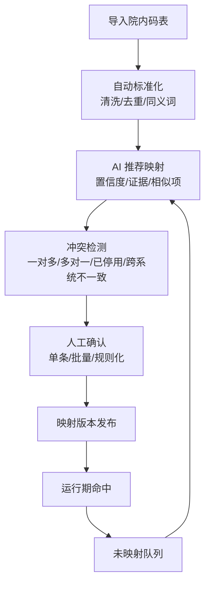
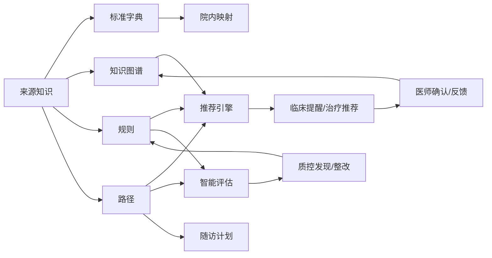
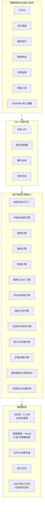
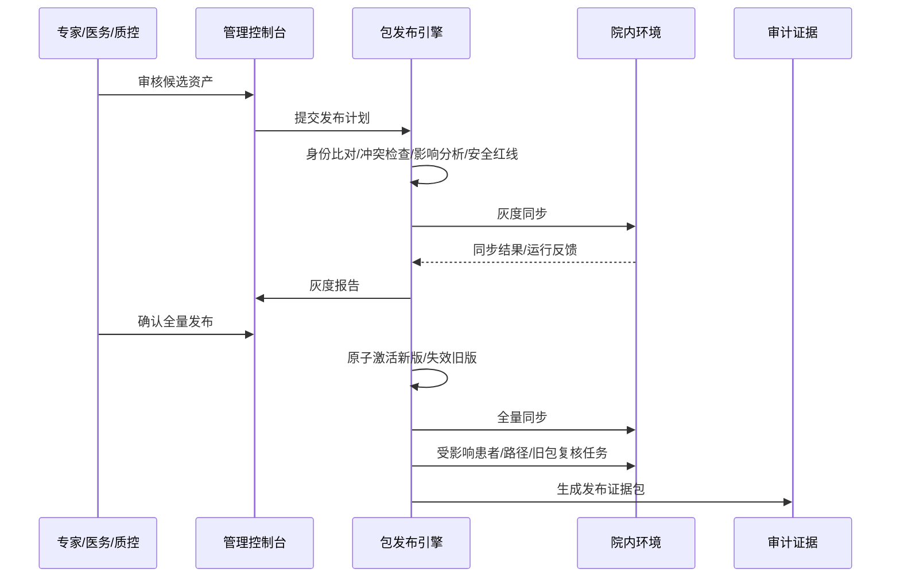
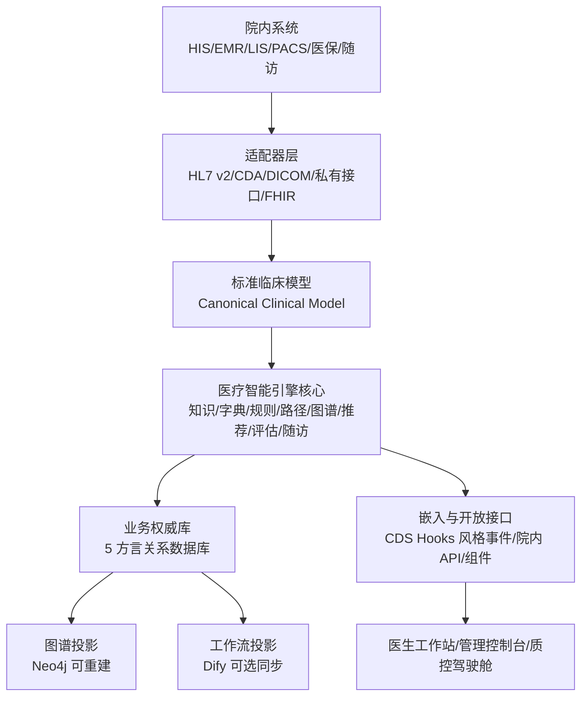

# MedKernel 集团医疗智能中枢实施落地方案

> 版本：4.5 · 2026-05-28
> 状态：v1.0 GA 0 业务引擎全能力上线基线
> 适用对象：产品、架构、前端、后端、AI 知识团队、QA、实施交付、试点医院项目组
> 主线结论：以项目重启节点后的代码骨架和当前权威文档为基础，把已确认的业务设计统一收束为“集团医疗智能中枢”。MedKernel 只做引擎核心、管理控制台、嵌入能力、API、知识包、配置包和审计证据，不做 HIS/EMR/LIS/PACS 替代品，也不做患者端完整运营系统。当前优先目标不是先按业务菜单拆分，而是按 0 业务模式把医疗智能引擎全能力端到端上线。

---

## 0. 执行摘要

当前重构不能继续把业务拆散、重命名、弱化，也不能先按菜单拆业务导致引擎能力割裂。主线必须重新拉直：

**MedKernel = 集团医疗智能中枢**。它面向集团、医院、分院、社区卫生服务中心、街道卫生所、科室、病区、医生团队，提供医疗知识、字典映射、专科路径、规则引擎、图谱、临床推荐、智能评估、质控改进、审计证据和院内同步的一体化底座。这里的“引擎核心”是中枢的内部能力形态，不作为对外主品牌名。

命名必须固定：

| 类型 | 标准名称 | 说明 |
|---|---|---|
| 中文产品名 | **集团医疗智能中枢** | 所有客户可见页面、文档、汇报、标题统一使用 |
| 英文 / 代码名 | **MedKernel** | 保留用于仓库、包名、API、部署物 |
| 内部架构能力 | 医疗智能引擎核心 / 引擎核心 | 只用于描述知识、规则、路径、图谱、推荐、评估等底层能力 |

禁止再使用含“引擎中心”的名称作为中文产品名。

重构后必须满足五条硬约束：

| 硬约束 | 落地解释 | 验收方式 |
|---|---|---|
| 0 业务引擎先行 | 先打通知识、字典、规则、路径、推荐、评估、随访、包发布、嵌入、模型网关和证据链 | 不出现单病种硬编码业务、不按业务菜单割裂引擎实现 |
| 最简洁 | 仍使用 5 组主菜单 + 1 个隐藏高级工具，不新增“知识工厂”等一级菜单 | 客户首屏不超过 5 个一级入口，默认页不暴露 JSON、DSL、图谱边表 |
| 最易用 | 普通用户走向导、审核、发布；专家才进入规则、路径、图谱、映射细调 | 每个核心配置都复用 7 步流，默认 1 个主按钮、最多 3 个默认筛选 |
| 世界级体验 | 全系统遵守产品体验固定规范，复杂能力渐进披露，大规模知识可分页、可筛选、可批量、可导出 | 不出现前端全量加载、低价值强提醒、无行动驾驶舱、不可追溯 AI 建议 |
| 最完整 | 知识、字典、说明书、指南、文献、规则、路径、图谱、推荐、评估、随访、护理、医技报告、中医药、集团化、用户体系、院内同步全部进入当前版本能力范围 | A1-A9 全功能验收剧本、领域实现卡、知识包导出、院内同步、前台审核、人工调整、审计证据通过 |

本文是给 AI 团队执行的落地方案。产品硬约束、菜单、状态机、7 步流和医疗安全边界以 [CONSTITUTION.md](CONSTITUTION.md) 为准；页面、交互、分页、嵌入、可信解释和体验验收以 [产品体验固定规范](MEDKERNEL_PRODUCT_EXPERIENCE_RULES.md) 为准；文档阅读与冲突裁决顺序以仓库根目录 `AGENTS.md` 为准。历史设计中仍有效的能力范围已经吸收到本文、产品宪法、产品体验规范和业务场景详细规范中，当前实施不得再引用旧版本归档目录作为事实源。

为避免“大而散”，本方案先按 [基础底座与引擎服务能力总览](MEDKERNEL_FOUNDATION_AND_SERVICES.md) 阅读：基础底座负责稳定、复用、治理和降级；引擎服务能力负责先把知识、字典、规则、路径、推荐、评估、随访、包发布、嵌入、模型网关和证据链端到端上线；业务服务包装在引擎全能力验收后再拆。

接口管理也遵守同一条线：当前章节只列底座与引擎的稳定 API；S0-S40 业务场景统一按 `API 归类` 管理，不能把后续业务包装接口误写成当前已落地契约。

---

## 1. 权威输入与现状核查

### 1.1 权威输入

本次重构必须从以下当前资料确认业务范围和实现顺序：

| 来源 | 用途 |
|---|---|
| [docs/MEDKERNEL_FOUNDATION_AND_SERVICES.md](MEDKERNEL_FOUNDATION_AND_SERVICES.md) | 基础底座与引擎服务能力总览，用于先理解整体方案结构 |
| [docs/CONSTITUTION.md](CONSTITUTION.md) | 产品宪法：菜单、状态机、7 步流、合规、租户生命周期 |
| [docs/MEDKERNEL_PRODUCT_EXPERIENCE_RULES.md](MEDKERNEL_PRODUCT_EXPERIENCE_RULES.md) | 全系统产品与交互体验固定规范：角色、页面、分页、低打扰、可信解释、体验验收 |
| [docs/DOCUMENTATION_LANGUAGE_POLICY.md](DOCUMENTATION_LANGUAGE_POLICY.md) | 当前文档与 AI 协作语言规则：文档主体使用简体中文，功能完成后 PR 合并远程 `main` |
| [docs/backlog.md](backlog.md) | 当前任务台账 |
| [docs/MEDKERNEL_BUSINESS_SCENARIO_DETAIL_SPEC.md](MEDKERNEL_BUSINESS_SCENARIO_DETAIL_SPEC.md) | 唯一实现级详细规范：全业务场景、系统详细设计、可插拔大模型、最新知识、权威版本替换、API/嵌入、引擎、质控、评级、验收 |
| [openspec/specs/medkernel/spec.md](../openspec/specs/medkernel/spec.md) | OpenSpec 当前稳定产品能力规格 |
| [openspec/changes/](../openspec/changes/) | OpenSpec 当前进行中的变更；2026-05-28 核查时为空 |
| [openspec/archive/](../openspec/archive/) | 已完成 OpenSpec 变更的审计归档，只追溯历史决策，不作为当前事实源 |
| [docs/superpowers/specs/](superpowers/specs/) | Superpowers 近期设计说明，只作任务证据 |
| [docs/superpowers/plans/](superpowers/plans/) | Superpowers 近期实施计划，只作任务证据 |

### 1.2 现有代码骨架核查

当前代码不是空仓，必须保留并重构，不要推倒重来：

| 层 | 当前状态 | 必须调整 |
|---|---|---|
| 后端 | JDK 21、Spring Boot 3.3、Spring Security、Spring Data JDBC、Flyway、5 方言目录已存在；当前主包已收敛为 `engine`、`shared`、`compliance`；E1/E2 已落地上下文、事件、知识、字典、规则、路径、推荐、评估、随访、包发布、嵌入、模型网关、大规模列表、系统运行和审计接口 | E3/E4/E5 仍需继续补齐执行链、嵌入验收、模型策略、证据包和降级链；不得把已存在 API 等同于全能力验收完成 |
| 数据库 | `h2/postgres/oracle/dm/kingbase` 均有 `V1` 至 `V19` 迁移，覆盖组织权限、知识、字典、上下文、事件、观测、规则、路径、推荐、评估、包发布、随访、嵌入、模型网关和大规模列表导出任务 | 后续新增表族必须保持 5 方言同步、中文注释、索引/约束一致和迁移合同测试 |
| 前端 | React 18、Antd 5、Vite、FSD 骨架可运行；`routes.ts` 已是路由、菜单、面包屑、权限和体验声明单一元数据；当前 IA 为 27 个可见二级菜单 + 5 个隐藏高级工具；字典、规则、路径、推荐/CDSS、评估、随访等页面已接入引擎 API | 未进入 E6 的业务服务页仍按占位或受控样板处理，不得用业务假数据闭环冒充完成 |
| 文档 | 权威文档已收束到 README、文档中心、产品宪法、体验规范、实施方案、详细规范、台账与 OpenSpec 当前规格；`openspec/archive/` 和 `docs/superpowers/` 只作审计/任务证据 | 根 README、文档索引、OpenSpec、AI 协作规则和模块 README 必须保持中文、远程 `main` 单主干、`codex/*` 默认短分支和无旧版本包袱口径一致 |

### 1.3 当前最大风险

| 风险 | 表现 | 处理原则 |
|---|---|---|
| 业务范围丢失 | 重构后只剩菜单和页面，AI 知识、字典、路径、随访、评估等核心弱化 | 本文把它们恢复为引擎核心资产 |
| 产品形态发散 | 知识工厂、图谱、规则、质控各自变成独立产品 | 统一进入 5 组菜单和 7 步流，不新增主路径 |
| 只做演示不落地 | 前端可点，后端 mock，不能院内同步 | 每条能力必须有表、API、状态机、审核、发布、同步、审计 |
| main 单线协作混乱 | 多 AI 同时改 main 或长分支漂移 | 采用 trunk-based：main 受保护，短分支并行，PR 小步合并 |
| AI 自动生成不可控 | 生成规则、推荐、路径后直接生效 | AI 只能生成候选，必须来源追溯、风险校验、专家审核、灰度发布 |

---

## 2. 产品定位与边界

### 2.1 做什么

MedKernel 交付的是集团医疗智能中枢，包含五类产物：

| 产物 | 说明 |
|---|---|
| 管理控制台 | 给集团、医院、信息科、医务处、质控办、专家使用的配置、审核、发布、监控界面 |
| 引擎核心 | 知识工厂、字典映射、规则引擎、路径引擎、图谱引擎、推荐引擎、评估引擎、审计引擎，以及统一的可插拔模型能力网关 |
| 嵌入组件 | 给 HIS/EMR/CDR/医生工作站嵌入的提醒、路径节点、待办、解释、采纳反馈组件 |
| API 与事件 | 接入 HIS、EMR、LIS、PACS、病案、医保、HRP、随访平台、院内消息平台 |
| 知识包与配置包 | 将标准知识、院内映射、规则、路径、图谱、评估指标、随访计划打包发布到院内 |

### 2.2 不做什么

| 不做 | 正确边界 |
|---|---|
| 不替代 HIS / EMR / LIS / PACS / CDR | 通过适配器读取事件、上下文、结果，并返回提醒、推荐、待办、质控问题 |
| 不做完整患者端 APP | 只生成随访计划、问卷、触发事件、风险回院建议，交给院内随访系统或第三方执行 |
| 不做无约束聊天机器人 | AI 能力必须沉淀为候选知识、候选规则、候选路径、解释和审核建议 |
| 不把大模型作为运行前提 | 需要智能增强的地方统一预留模型适配；没有模型时依靠已发布知识、确定性引擎和人工治理正常运行 |
| 不做自动开医嘱 | 推荐和提醒必须由医师确认，采纳或不采纳都要留痕 |
| 不做一次性项目文档 | 每个配置都要能版本化、灰度、回滚、导出证据 |

---

## 3. 全量业务范围

### 3.1 引擎资产总表

所有医疗业务内容都要落成“可治理资产”，不能只是页面文字：

| 资产域 | 资产内容 | AI 自动生成 | 人工能力 | 发布形态 |
|---|---|---|---|---|
| 来源资产 | 指南、共识、文献、药品说明书、器械说明书、医保政策、院内制度、质控标准 | 以可信来源为边界自动探索更新、解析、去重、分段、引用定位、版本比对 | 来源授权、真实性核验、可信级别、适用范围、停用 | 来源包 |
| 标准字典 | 诊断、手术操作、药品、耗材、检验、检查、医嘱、收费、医保、科室、文书、护理、康复、随访项 | 自动生成目录、同义词、上下位关系、标准编码候选 | 专家维护目录、合并拆分、停用、优先级 | 标准字典包 |
| 院内字典 | HIS/EMR/LIS/PACS/医保/病案/HRP 的本地码表 | 自动发现未映射项、推荐映射、冲突检测 | 人工确认、批量导入、差异处理、回滚 | 映射包 |
| 专病路径 | 筛查、分诊、诊断、鉴别诊断、检查、治疗、医嘱、监测、出院、康复、随访、复诊、转诊 | 从指南/文献/说明书生成候选节点、条件、时限、变异 | 专家拖拽、节点调整、院内版本定制 | 路径包 |
| 规则 | 禁忌、适应症、剂量、相互作用、检验阈值、医保合规、病案质控、随访触发 | 自动生成候选 DSL、测试样例、风险等级、解释 | 手工编辑、仿真、例外、科室覆盖 | 规则包 |
| 图谱 | 疾病、症状、检查、检验、药品、手术、耗材、指南条款、证据等级、路径节点 | 自动抽取实体、关系、证据链、冲突关系 | 专家纠错、关系权重、版本冻结 | 图谱包 |
| 推荐 | 诊疗建议、用药建议、检查建议、路径下一步、风险提醒、复诊建议 | 基于规则、路径、图谱、模型生成候选推荐和解释 | 医师采纳、不采纳原因、反馈学习 | 推荐服务 |
| 智能评估 | 指标、分母、分子、排除条件、评分、风险分层、整改建议 | 自动生成指标候选、病例命中解释、整改建议 | 质控办确认指标、阈值、科室责任 | 评估包 |
| 随访 | 随访计划、时间窗、问卷、复诊提醒、异常回院、慢病管理节点 | 自动按专病路径生成计划和触发规则 | 专家调整频次、问卷、风险阈值 | 随访计划包 |
| 护理专业 | 护理分级、自理能力、护理风险、护理决策、护理计划、复评、交班、护理质控 | 抽取规范并生成评估/计划候选和复评提醒 | 护理人员确认、调整和闭环 | 护理专业包 |
| 医技报告解读 | 检验、影像、病理、内镜、心电/功能报告解释、趋势和危急闭环 | 生成带来源的摘要、关联提示和下一步候选 | 临床/医技确认处置，不改原报告 | 医技知识包/解读服务 |
| 床旁知识服务 | 说明书、指南、路径、护理规范、报告知识、院内制度的当前有效查询 | 摘要、条款定位、版本比对和患者关联解释 | 专家审核来源版本，临床查阅现行版 | 权威知识检索服务 |
| 中医药与综合照护 | 中医药/中西医结合、康复、营养、心理、疼痛、安宁、健康管理 | 生成专业资产和计划候选 | 对应资质人员审核，控制协同边界 | 专业领域包 |
| 审计证据 | 来源、生成、审核、发布、同步、运行、采纳、回滚、异常 | 自动汇总证据链和验收报告 | 审计补充说明、签署、导出 | 证据包 |

### 3.2 医疗知识内容范围

AI 知识工厂要覆盖的内容不是“病种介绍”，而是能支撑临床运行和质控的结构化知识：

| 类别 | 最小字段 | 示例用途 |
|---|---|---|
| 疾病知识 | 疾病名称、编码、别名、分型分期、诊断标准、鉴别诊断、风险分层 | 入径判断、诊断提醒、评估指标 |
| 症状体征 | 名称、同义词、严重程度、伴随症状、红旗信号 | 急诊分诊、路径触发 |
| 检查检验 | 项目、标本、单位、参考范围、危急值、适应症、禁忌 | 检验异常提醒、路径节点校验 |
| 药品 | 通用名、商品名、规格、剂型、给药途径、剂量、禁忌、相互作用、不良反应、说明书版本 | 用药推荐、禁忌校验 |
| 器械耗材 | UDI、名称、规格、适用范围、禁忌、召回状态 | 器械合规和安全提醒 |
| 手术操作 | 名称、编码、适应症、禁忌、术前评估、术后监测 | 手术路径、病案首页质控 |
| 护理专业 | 分级依据、自理能力、风险量表、护理问题、目标、措施、执行、复评、交班、来源版本 | 护理决策、护理质控、路径和随访 |
| 医技报告解读 | 报告类型、原始结论、结果字段、异常/趋势、危急条件、解释边界、来源版本 | 报告已阅、危急闭环、路径和 CDSS |
| 床旁知识查阅 | 主题、现行权威条款、来源版本、适用范围、历史版本和展示权限 | 医生/护士/药师工作站查询 |
| 中医药与综合照护 | 病名/证候/治法/方药风险、中医护理、康复、营养、心理、疼痛、安宁、复评和随访 | 领域包、协同路径和健康管理 |
| 医保支付 | DRG/DIP、支付目录、限制条件、病组规则、历史版本 | 医保智能审核 |
| 公共卫生 | 传染病、VTE、死亡报告、慢病管理 | 报告卡预填和上报 |
| 院内制度 | 医院路径、科室规范、审批制度、用药目录 | 院内定制和合规留痕 |

### 3.3 专科诊疗路径必须覆盖的阶段

每个专病路径都要支持以下阶段，缺一项要能明确标记“不适用”，不能无声缺失：

| 阶段 | 引擎能力 |
|---|---|
| 筛查与分诊 | 触发条件、红旗信号、优先级、转诊建议 |
| 初步诊断 | 症状、体征、检验检查、诊断标准、鉴别诊断 |
| 风险评估 | 评分量表、危险分层、排除条件、证据来源 |
| 治疗决策 | 药物、检查、手术、介入、护理、康复、禁忌、替代方案 |
| 路径执行 | 节点、时限、责任角色、医嘱建议、变异原因 |
| 监测与预警 | 检验异常、生命体征、并发症、药品安全、提醒疲劳治理 |
| 出院准备 | 出院标准、带药、宣教、复诊、转归评估 |
| 康复与随访 | 随访时间窗、问卷、复查项目、异常回院、慢病长期管理 |
| 结局评估 | 质量指标、疗效指标、费用指标、患者安全指标 |
| 闭环改进 | 质控发现、整改任务、复盘、规则和路径优化 |

### 3.4 全医疗专业领域实现规划

专科诊疗路径必须独立承载“专病包”，不能只是通用路径画布。专病包复用统一规则和审核发布底座，但需额外支持病种分型、关键时钟、多角色协同、机构能力分层、专业质控指标、仿真和历史回放。

| 实施批次 | 领域范围 | 本批必须实现 |
|---|---|---|
| P0 共用引擎闭环 | 来源知识、标准/院内字典、规则、路径、图谱解释、辅助诊疗、评估质控、随访、护理专业、医技报告解读、床旁知识查阅 | 统一数据、API 归类、嵌入、AI 与无模型路径、审核发布、院内同步、测试证据 |
| P1 高风险与连续照护包 | 药事、手术/麻醉/输血/介入、急诊/重症、妇儿老年、肿瘤/透析/日间、康复/营养/心理/疼痛/安宁 | 专业来源、风险规则、路径/计划、评估与反馈闭环 |
| P1 中国场景与协同包 | 中医药/中西医结合、院感/公卫/预防保健、基层慢病与双向转诊、医技互认与远程协同 | 领域包、组织继承、权限、来源追溯和发布证据 |
| P2 扩展与数据服务 | 口腔、眼耳鼻喉、皮肤、移植、生殖、职业健康、科研和真实世界 | 复用统一领域包模板接入，不新增产品主链 |

每个领域必须形成实现卡，包含来源版本、字典映射、资产 schema、触发/API/嵌入、AI 与无模型路径、专业审核、安全边界、测试和发布证据。中医药是原生支持领域，但中医候选不得替代或延迟急危重症标准救治。

---

## 4. 集团化与组织复用模型

### 4.1 组织层级

系统必须原生支持以下层级：

```
平台
└─ 集团
   ├─ 医院
   │  ├─ 院区 / 分院
   │  │  ├─ 社区卫生服务中心 / 街道卫生所 / 医联体成员机构
   │  │  └─ 科室
   │  │     ├─ 病区
   │  │     └─ 医生团队 / 专病团队
   │  └─ 专科中心 / MDT 团队
   └─ 共享中心：知识、质控、医保、信息、合规
```

### 4.2 复用与自定义规则

| 规则 | 要求 |
|---|---|
| 默认继承 | 平台标准包 → 集团标准包 → 医院包 → 院区包 → 科室包 → 专病包 |
| 局部覆盖 | 下级可以覆盖阈值、术语映射、适用范围、提醒策略、路径节点 |
| 差异可见 | 任何覆盖必须展示“继承自哪里、改了什么、影响哪些患者/科室” |
| 冲突处理 | 同一规则多层覆盖时按最小适用范围优先，安全红线不能被下级关闭 |
| 回滚能力 | 任意层级可回滚到上级版本或上一版院内版本 |
| 审计要求 | 继承、覆盖、灰度、全量、回滚都必须记录操作者、来源、理由、影响范围 |

### 4.3 组织上下文必须贯穿全链路

任何 API、规则执行、路径判断、推荐生成、质控评估都必须携带：

| 字段 | 说明 |
|---|---|
| `tenant_id` | 租户 |
| `group_id` | 集团 |
| `hospital_id` | 医院 |
| `campus_id` | 院区 / 分院 |
| `site_id` | 社区卫生服务中心 / 街道卫生所 / 医联体成员 |
| `department_id` | 科室 |
| `ward_id` | 病区，可选 |
| `specialty_id` | 专科 / 专病 |
| `version_scope` | 当前知识包 / 配置包版本范围 |

---

## 5. 用户体系与权限管理

用户体系不是后台附属能力，而是所有引擎资产能否安全落地的前提。

### 5.1 用户与身份

| 能力 | 要求 |
|---|---|
| 账号体系 | 支持平台账号、集团账号、医院账号、院内身份绑定 |
| 身份联邦 | 支持 OIDC/OAuth2、SAML 预留、院内统一身份、CA 电子签名绑定 |
| 多身份绑定 | 同一人可绑定医生、科主任、质控专家、审核专家、信息科管理员等多角色 |
| 组织归属 | 用户必须归属到集团、医院、院区、科室等组织上下文 |
| 医师资质 | 需要记录执业范围、科室、职称、CA 签章状态，影响推荐确认和审核权限 |
| 安全策略 | MFA、密码策略、登录审计、IP 策略、会话超时、离职禁用 |

### 5.2 角色矩阵

| 角色 | 核心权限 |
|---|---|
| 平台管理员 | 租户开通、许可证、全局标准包、系统配置 |
| 集团管理员 | 集团组织、集团知识包、集团质控指标、跨院分析 |
| 医院管理员 | 院内组织、用户、适配器、院内映射、发布审批 |
| 信息科 | 接口、适配器、同步任务、国产化自检、运行监控 |
| 医务处 | 路径、规则、知识审核、临床运行治理 |
| 质控办 | 评估指标、质控预警、整改闭环、证据导出 |
| 医保办 | DRG/DIP、医保审核、支付目录同步 |
| 科主任 | 科室规则覆盖、路径审核、整改确认 |
| 专科专家 | 专病知识、路径、规则、随访计划审核和调整 |
| 临床医生 | 查看提醒、采纳/不采纳、查看解释、提交反馈 |
| 合规审计 | 审计日志、安全基线、证据包、数据出境评估 |
| 实施工程师 | 试点准备、配置包导入、联调、验收材料 |

### 5.3 权限模型

权限要同时控制菜单、数据、动作和资产范围：

| 维度 | 示例 |
|---|---|
| 菜单权限 | 是否能看到字典映射、规则库、AI 知识审核 |
| 动作权限 | 新建、编辑、提交审核、审核、发布、灰度、回滚、导出 |
| 数据权限 | 只能看本科室、全院、集团跨院、脱敏数据 |
| 资产权限 | 只能维护某病种、某字典、某路径、某知识包 |
| 环境权限 | 测试、试运行、正式、应急 |

---

## 6. AI 医疗知识工厂

### 6.1 总流程


### 6.2 同步能力

| 同步方式 | 要求 |
|---|---|
| 定时同步 | 支持按来源、专科、字典、机构级别配置同步周期 |
| 手动同步 | 支持单来源、单指南、单说明书、单院内码表立即同步 |
| 离线导入 | 支持内网医院无外网时通过文件包导入 |
| 差异同步 | 只同步新增、变更、停用、冲突项 |
| 权威版本替换 | 新知识不得自动覆盖现行版；核验并审核通过后原子激活新版、失效旧版，新临床请求只解析新版 |
| 安全紧急更新 | 禁忌、召回、重大安全警示或强制规范变化可经授权紧急激活，并触发在径患者/离线节点复核和告警 |
| 同步审计 | 每次同步记录来源、版本、条目数、失败项、人工处理项 |

### 6.3 全中枢大模型赋能与无模型基线

| 要求 | 落地标准 |
|---|---|
| 统一适配 | 知识、字典、规则、路径、图谱、推荐、质控、评估、随访、多语言和验证辅助均经模型能力网关调用，不由业务模块绑定模型厂商 |
| 最新知识探索 | 大模型可辅助发现可信来源的新版本与变化，但“最新”必须绑定来源版本、发布日期和实际核验时间 |
| 生成期新旧识别 | 生成前必须对照现行权威知识分流新主题、新版本、重复、旧版、冲突和撤回；重复与旧版不得进入普通审核 |
| 唯一权威生效 | 同一适用域同时只有一个用于新临床判断的有效知识版本；新版审核发布后旧版仅供历史审计和重放 |
| 待审共存安全 | 常规新版尚未审核时，只提供新版差异审核和替换提醒；旧版继续作为唯一在用知识，未审新版不得参与临床执行；已确认重大安全警示可先紧急限制旧版并加急审核 |
| 多部署选择 | 支持院内模型、经审批外部兼容模型或关闭模型；组织与场景可继承/覆盖路由策略 |
| 无模型基线 | 模型关闭或故障时，来源同步/导入、人工配置、知识包发布、确定性规则/路径/质控、院内同步和审计仍完整运行 |
| 医疗安全 | 模型只生成候选和解释；所有进入临床的知识、规则、建议和高风险结论都需审核/确认 |

模型适配、全业务增强矩阵、API 契约、降级与双轨验收，以 [全业务场景详细设计规范 §1.6、§7.12、§8、§10.3](MEDKERNEL_BUSINESS_SCENARIO_DETAIL_SPEC.md#16-可插拔大模型增强统一规范) 为唯一实现级标准。

### 6.4 AI 生成边界

AI 可以做：

| 可以自动生成 | 说明 |
|---|---|
| 医疗字典目录候选 | 标准词、别名、同义词、上下位关系、编码候选 |
| 院内字典映射候选 | 本地码到 ICD、LOINC、SNOMED CT、医保目录等标准码 |
| 说明书结构化条目 | 适应症、禁忌、剂量、不良反应、相互作用、特殊人群 |
| 指南条款结构化 | 推荐级别、证据等级、适用人群、条件、动作 |
| 规则候选 | 可执行 DSL、测试样例、解释文案、风险级别 |
| 路径候选 | 节点、条件、时限、责任角色、变异原因 |
| 图谱候选 | 实体、关系、证据边、冲突边 |
| 治疗推荐候选 | 基于规则和路径生成建议、替代方案、禁忌提醒 |
| 智能评估候选 | 指标定义、分母、分子、排除条件、评分方式 |
| 随访计划候选 | 时间窗、问卷、复查项目、异常回院条件 |
| 护理专业候选 | 护理分级依据、评估、计划、复评、交班和质控规则 |
| 报告解读与床旁知识候选 | 报告解释条款、趋势/危急规则、现行说明书/指南知识卡 |
| 专病包候选 | 分型路径、关键时钟、专病指标、报告/护理/随访依赖和嵌入配置 |
| 中医药领域候选 | 中医病名/证候、治法、方药/中成药风险、适宜技术、护理和随访资产 |

AI 不能做：

| 禁止 | 原因 |
|---|---|
| 无来源生成权威医学事实 | 必须可追溯到来源条款 |
| 自动生效到临床正式环境 | 必须人工审核和灰度发布 |
| 自动写入医嘱或病历 | 医疗决策必须由医师确认 |
| 绕过安全红线 | 禁忌、危急值、商密、隐私、等保不能被 AI 覆盖 |

### 6.5 前台审核

审核不是一个列表页，而是完整的临床治理流程：

| 审核对象 | 审核人 | 必看信息 | 审核动作 |
|---|---|---|---|
| 来源 | 信息科、医务处 | 来源机构、授权、版本、发布日期、适用范围 | 接收、拒绝、停用 |
| 字典 | 信息科、专科专家 | 标准码、本地码、同义词、历史映射、影响系统 | 通过、改写、合并、拆分 |
| 规则 | 医务处、专科专家 | 来源条款、DSL、测试病例、影响范围、风险等级 | 通过、改写、降级、驳回 |
| 路径 | 专科专家、科主任 | 节点、时限、医嘱建议、随访、变异处理 | 通过、调整、灰度 |
| 专病包 | 专科专家、医务处、质控办 | 分型分支、关键时钟、报告/护理/随访依赖、指标、仿真病例 | 通过、调整、灰度、退回 |
| 护理/报告/知识服务 | 护理部、医技/临床专家、医务处 | 专业来源、解释边界、护理确认、危急闭环、版本 | 通过、改写、限制范围 |
| 中医药专业资产 | 中医专业人员、医务处/药事 | 病名证候、治法、方药/技术风险、中西医冲突和适用阶段 | 通过、调整、限定协同范围 |
| 评估指标 | 质控办、医务处 | 分母、分子、排除条件、病例样例、科室责任 | 通过、调整、停用 |
| 知识包 | 医院管理员、医务处 | 包内容、版本差异、冲突、灰度方案、回滚方案 | 发布、灰度、回滚 |

### 6.6 权威知识替换与审核去重

| 阶段 | 必须实现 |
|---|---|
| 生成前比对 | 解析稳定知识身份，优先使用来源编号、版本、生效日期、标准代码和 hash，对照当前权威版本 |
| 审核分流 | 新主题、新版本、安全撤回、来源冲突和受影响本地覆盖进入审核；完全重复和旧于现行自动拦截留痕 |
| 待审运行 | 常规新版处于待审状态时，审核台只展示新版差异；临床运行仍使用已审核旧版，并提示负责人待替换；禁用/召回/重大警示可紧急限制旧版 |
| 发布替换 | 审核通过后原子激活新版并失效旧版，刷新缓存/投影/离线同步任务，保证新请求不使用旧知识 |
| 安全处置 | 高风险更新自动定位受影响规则、路径、推荐、在径患者和同步失败站点，生成复核与告警 |
| 历史留证 | 旧版本不可删除，保留来源、审核、替代链和曾经使用它产生的运行解释，但标识为不可供新决策使用 |

详细 schema、API、状态机、页面和验收统一按 [全业务场景详细设计规范 §8.13](MEDKERNEL_BUSINESS_SCENARIO_DETAIL_SPEC.md#813-权威知识版本替换与旧版失效规范) 执行。

---

## 7. 院内字典与标准字典映射

### 7.1 字典范围

| 字典 | 标准来源 | 院内来源 |
|---|---|---|
| 诊断 | ICD-10、ICD-11、国家临床版、院内专病目录 | EMR、病案首页、HIS |
| 手术操作 | ICD-9-CM-3、国家手术操作目录 | 手麻、病案、HIS |
| 药品 | 药品本位码、医保药品目录、说明书 | HIS 药品目录、药房、合理用药 |
| 耗材器械 | UDI、医保耗材目录 | SPD、手术室、物资系统 |
| 检验 | LOINC 兼容、院内检验项目 | LIS |
| 检查 | DICOM、检查项目目录 | PACS、RIS |
| 医嘱 | 院内医嘱项目、路径医嘱模板 | HIS、EMR |
| 收费医保 | 医保目录、DRG/DIP 规则 | 医保、收费、病案 |
| 科室组织 | 国家科室代码、院内科室树 | HIS、OA、HRP |
| 文书 | 病历模板、质控项、护理记录 | EMR、护理系统 |
| 随访项 | 问卷、量表、复查项目 | 随访系统、慢病平台 |

### 7.2 映射闭环



### 7.3 映射验收

| 指标 | GA 底线 |
|---|---|
| 映射项必须有来源 | 100% |
| 高风险映射人工确认 | 100% |
| 未映射队列可追踪 | 100% |
| 映射发布可回滚 | 100% |
| 跨系统一致性报告 | 每次发布自动生成 |

---

## 8. 规则、路径、图谱、推荐、评估、随访

### 8.1 核心引擎关系



### 8.2 规则引擎

| 能力 | 要求 |
|---|---|
| 规则类型 | 诊断、用药、检查、检验、手术、医保、病案、质控、随访触发 |
| 规则输入 | 患者上下文、组织上下文、院内映射、知识包版本、临床事件 |
| 规则输出 | 命中结果、严重级别、建议动作、解释、来源、证据等级、是否需要医师确认 |
| 测试能力 | 每条规则必须有阳性、阴性、边界、冲突样例 |
| 发布能力 | 草稿、待审核、已发布、生效中、已下线、已归档 |

### 8.3 路径引擎

| 能力 | 要求 |
|---|---|
| 路径模板 | 标准模板、集团模板、医院模板、科室模板、专病模板 |
| 节点类型 | 评估、检查、检验、治疗、用药、手术、护理、康复、随访、转诊、质控 |
| 运行态 | 未入径、已入径、节点执行中、变异、完成、退出 |
| 变异管理 | 医疗变异、患者原因、资源原因、医生选择、系统原因 |
| 随访接续 | 出院节点必须能生成后续随访计划或标记不适用 |

### 8.4 图谱引擎

| 能力 | 要求 |
|---|---|
| 节点 | 疾病、症状、检查、检验、药品、手术、耗材、路径节点、规则、指南条款、文献 |
| 边 | 适应症、禁忌、推荐、替代、相互作用、证据、冲突、上下位、同义 |
| 版本 | 每个知识包绑定图谱版本 |
| 查询 | 支持推荐解释、来源追溯、冲突检查、影响分析 |
| 展示 | 普通用户只看解释，专家模式可看图谱 |
| 存储 | 院内关系数据库是图谱业务数据权威源；图数据库只能做查询投影，可随时由 `graph_node`、`graph_edge`、`graph_citation` 重建 |

### 8.5 治疗推荐与 CDSS

| 环节 | 要求 |
|---|---|
| 触发 | 诊断录入、医嘱开立、检验回报、路径节点、出院、随访异常 |
| 上下文 | 患者、病种、科室、医生、药物、检验、过敏、禁忌、医保、知识包版本 |
| 生成 | 规则优先，路径约束，图谱补充，模型只做候选和解释 |
| 展示 | 推荐、风险、证据来源、适用范围、采纳/不采纳 |
| 安全 | 高风险必须阻断或强提醒；低价值提醒要疲劳治理 |
| 留痕 | 每次推荐记录触发、输入摘要、版本、来源、医生决策、结果 |

### 8.6 智能评估

| 能力 | 要求 |
|---|---|
| 指标定义 | 分母、分子、排除条件、时间窗、组织范围、病种范围 |
| 评估对象 | 患者、病历、科室、医生、病种、路径、医保病例、随访效果 |
| 结果 | 得分、命中病例、问题解释、责任科室、整改建议 |
| 闭环 | 预警、派单、整改、复核、闭环、豁免 |
| 证据 | 每条结果可追溯到数据、规则、知识来源 |

### 8.7 随访引擎

| 能力 | 要求 |
|---|---|
| 计划生成 | 基于专病路径、治疗方式、风险分层、出院状态生成随访计划 |
| 时间窗 | 支持 T+3 天、T+7 天、T+30 天、月度、季度、年度 |
| 内容 | 问卷、量表、复查项目、用药依从性、症状监测、康复动作 |
| 异常 | 异常答案、危急值、未完成、失访、再入院触发提醒 |
| 对接 | 输出给院内随访系统、消息平台或第三方，不在 MedKernel 内做完整呼叫中心 |
| 评价 | 随访完成率、异常回院率、复诊率、结局指标进入智能评估 |

---

## 9. 系统架构

### 9.1 逻辑架构



### 9.2 后端包结构建议

保留当前顶层包，但在每个包内沉淀真实领域：

| 包 | 职责 |
|---|---|
| `shared` | ApiResult、ProblemDetail、审计上下文、组织上下文、分页、i18n、脱敏、加密、日志 |
| `platform` | 租户、许可证、Provider、部署形态、品牌、运行状态 |
| `compliance` | 用户、角色、权限、身份绑定、审计、数据墙、合规证据、安全基线 |
| `tenant` | 组织层级、适配器、配置包、字典映射、规则配置、路径模板、试点生命周期 |
| `clinical` | 患者上下文、临床事件、CDSS、专病路径/关键时钟、护理决策、报告解读、床旁知识、随访计划、医生反馈 |
| `quality` | 评估指标、质控预警、医保审核、病案质控、整改闭环 |
| `advanced` | 来源追溯、图谱查询、AI 工作流、模型版本、国产化自检、开发者工具 |
| `engine` | 可新增：知识工厂、术语、规则、路径、图谱、推荐、评估、包发布的纯核心服务 |

### 9.3 数据域

| 数据域 | 核心表 |
|---|---|
| 组织与用户 | `org_unit`、`user_account`、`identity_binding`、`role`、`permission_policy`、`data_scope_policy` |
| 来源 | `source_document`、`source_version`、`source_section`、`source_citation`、`source_sync_task` |
| 知识候选 | `ai_candidate`、`ai_candidate_review`、`ai_safety_check`、`ai_generation_job` |
| 字典映射 | `standard_term`、`local_term`、`term_mapping`、`mapping_candidate`、`mapping_conflict` |
| 规则 | `rule_definition`、`rule_version`、`rule_test_case`、`rule_execution_log` |
| 路径 | `pathway_template`、`pathway_node`、`pathway_edge`、`patient_pathway`、`pathway_variance` |
| 专病包 | `specialty_package`、`specialty_profile`、`clinical_clock`、`specialty_metric_binding` |
| 图谱 | `graph_version`、`graph_node`、`graph_edge`、`graph_citation` |
| 推荐 | `clinical_event`、`patient_context_snapshot`、`recommendation`、`recommendation_decision` |
| 护理与报告服务 | `nursing_assessment`、`nursing_plan`、`nursing_reassessment`、`report_interpretation`、`knowledge_query_log` |
| 评估质控 | `evaluation_indicator`、`evaluation_result`、`quality_finding`、`rectification_task` |
| 随访 | `followup_plan`、`followup_task`、`followup_questionnaire`、`followup_event` |
| 包发布 | `knowledge_package`、`package_item`、`release_plan`、`sync_target`、`sync_log` |
| AI 工作流 | `ai_workflow_definition`、`ai_workflow_version`、`ai_workflow_binding`、`ai_workflow_sync_log`、`ai_workflow_fallback_policy` |
| 审计证据 | `audit_event`、`evidence_snapshot`、`release_evidence`、`export_record` |

### 9.4 数据权威源、图谱投影与 Dify 降级

院内部署必须坚持“业务数据在院内数据库，外部引擎只做投影或运行器”：

| 对象 | 权威源 | 可选投影 / 运行器 | 降级策略 |
|---|---|---|---|
| 图谱节点、边、引用、版本 | 院内关系数据库的 `graph_*` 表 | Neo4j 或其他图数据库只做查询投影 | 图数据库不可用时，回退到关系库查询与预计算路径；投影可后台重建 |
| AI 工作流定义、版本、绑定、执行策略 | 院内关系数据库的 `ai_workflow_*` 表 | Dify 仅作为外部/院内部署的工作流运行器和编排投影 | Dify 存在则同步定义和版本；Dify 不存在则降级到内置规则/任务编排，不影响知识包、规则、路径、推荐和审核 |
| 模型路由、提示词、调用与候选结果 | 院内关系数据库的 `model_*`、`generation_*` 表 | 院内模型或经审批的外部兼容模型仅承担可选增强执行 | 模型关闭/故障时回退到已发布知识、确定性引擎和人工流程，核心验收不受影响 |
| 运行日志与审计 | 院内关系数据库和审计日志 | Dify/图数据库可保留运行副本 | 以院内审计为准，外部副本缺失不影响验收 |
| 知识包与配置包 | 院内关系数据库和文件包 | 可同步到 Dify、图数据库、缓存 | 任一投影失败都不能阻断包发布；必须记录同步失败并允许重试 |

强制约束：

1. 图数据库不得成为唯一存储，不得保存无法从关系库重建的业务事实。
2. Dify 不得成为业务权威源，不得保存唯一版本的规则、路径、知识、提示词、审核结论或临床运行结果。
3. Dify 有则同步，没有则降级；降级后前台只显示“外部工作流未启用/已降级”，业务主链路必须可用。
4. 同步到 Dify 或图数据库的内容必须带包版本、组织上下文、来源版本、hash、同步时间和回滚目标。
5. 大模型通过统一模型能力网关接入，业务模块不得绑定具体模型；模型只做可选增强，关闭或故障时必须自动降级并留痕。
6. 院内离线、DB-only、无模型模式必须能完整通过核心验收，图数据库、Dify 和大模型只能提升查询、编排与生成体验。

---

## 10. 前端产品形态

### 10.1 菜单不扩张

不新增一级菜单，全部纳入现有 5 组：

| 一级菜单 | 承载能力 |
|---|---|
| 工作台 | 系统健康、试点阶段、待办、风险、知识同步状态、验收进度 |
| 试点准备 | 租户、组织、配置包、路径、规则、字典映射、适配器、知识包发布 |
| 临床运行 | 患者主索引、患者路径/关键时钟、CDSS、护理协同、报告解读、床旁知识、规则校验、待办、通知、随访触发 |
| 质控改进 | 质控驾驶舱、质控预警、医保审核、评估指标、评估结果、AI 知识审核 |
| 合规运维 | 用户、身份绑定、审计、安全、Provider、通知、证据 |
| 高级工具 | 来源追溯、图谱查询、AI 工作流、国产化自检、开发者控制台 |

### 10.2 页面交互原则

| 原则 | 要求 |
|---|---|
| 默认业务视图 | 医务处、医生、质控办默认看到业务语言，不看到技术对象 |
| 专家模式 | 路径画布、规则 DSL、图谱、JSON、traceId 放入专家模式 |
| 统一 7 步流 | 字典、规则、路径、图谱、评估、配置包、适配器都复用：导入/选择 → 校验 → 看影响 → 提交审核 → 灰度 → 全量 → 留证/回滚 |
| 六态齐全 | 加载、空、错误、无权限、部分成功、正常 |
| AI 标识 | AI 候选、AI 生成、AI 修改建议必须显著标识 |
| 中文统一 | 客户可见文案默认中文；英文缩写仅限 ICD、DRG、DIP、MPI、FHIR、OIDC 等行业标准 |
| 多语言预留 | UI 使用 i18n key，默认 zh-CN，可扩展 en-US；医学内容保留原文语言和中文译名 |
| 大规模分页 | 知识、候选、字典、规则、路径、日志和证据必须服务端分页或游标分页，不得前端全量加载 |
| 低打扰嵌入 | 临床提醒默认卡片或抽屉；非红线风险不得遮挡医生主流程 |
| 可信解释 | 推荐、审核、发布、质控结果必须展示来源、版本、影响、责任链和证据入口 |

知识和资产量大时的产品控制：

| 控制项 | 要求 |
|---|---|
| 默认视图 | 只展示待我处理、高风险、最近更新、生效中；全量进入高级筛选 |
| 分页 | 默认 20 行，允许 50/100；日志、证据、搜索结果优先游标分页 |
| 筛选 | 默认最多 3 个；高级筛选折叠；复杂筛选可保存为个人或角色视图 |
| 搜索 | 支持关键词、来源、知识身份、版本、组织、风险、状态和时间范围 |
| 批量 | 低风险可批量；高风险逐条确认；批量动作异步任务化并写审计 |
| 导出 | 大范围导出异步生成，记录对象、筛选条件、操作者、审批和证据 |
| 性能 | 首屏 P95 ≤ 1s；筛选 P95 ≤ 2s；打开详情不得触发列表重载 |

### 10.3 当前前端优先修复

| 优先级 | 修复 |
|---|---|
| P0 | `frontend/src/shared/config/routes.ts` 必须覆盖 31 页面 + 高级工具，成为菜单、路由、面包屑、权限的唯一元数据 |
| P0 | 所有页面接入统一 PageShell、六态、权限 chip、审计快照 |
| P0 | 所有大列表接入服务端分页、游标、筛选、详情抽屉、批量任务和异步导出 |
| P0 | “AI 工作流”“Provider 状态”等页面客户可见文案中文化，避免中英混杂 |
| P1 | 配置包、路径、规则、字典映射、评估指标统一改用 7 步流组件 |
| P1 | AI 知识审核页扩展为来源、字典、规则、路径、评估、随访多对象审核台 |

### 10.4 全系统产品体验整改固定项

体验整改不是视觉优化项，而是 v1.0 GA 的上线门禁。详细规则见 [产品体验固定规范](MEDKERNEL_PRODUCT_EXPERIENCE_RULES.md)。

| 整改项 | 落地要求 | 验收 |
|---|---|---|
| 角色默认视图 | 每页声明主要角色、默认视图、专家模式内容和隐藏字段 | 普通角色首屏不出现 JSON、DSL、trace、模型提示词 |
| 一页一目标 | 每页 1 主目标、1 主按钮、≤3 默认筛选 | 页面评审可在 10 秒内说明下一步 |
| 大规模知识体验 | 列表、审核队列、日志、证据、图谱结果按分页/游标/折叠设计 | 10 万级数据筛选、打开详情、导出通过 |
| 临床低打扰 | 医生工作站默认嵌入卡片或抽屉，按打扰等级展示 | 非红线提醒不遮挡医嘱、病历和报告主流程 |
| 可信解释 | 来源、版本、风险、影响、审核、反馈和回滚入口可见 | 任意推荐能追溯到来源和执行证据 |
| 驾驶舱行动化 | 指标能下钻到责任对象、待办、病例、科室或整改任务 | 不存在无下钻、无动作的装饰图表 |
| 表单与发布保护 | 草稿、实时校验、影响分析、二次确认、回滚点齐全 | 发布、撤回、替换、回滚都有证据 |
| 降级体验 | 模型、Dify、图投影、外部系统故障时显示清楚状态和替代路径 | B0 无模型链路可完成主任务 |

---

## 11. API 与集成

### 11.1 API 规范

| 规范 | 要求 |
|---|---|
| 响应 | 统一 `ApiResult<T>` 或 ProblemDetail；禁止新接口裸 `Map<String,Object>` |
| 输入 | 使用 Record DTO + Bean Validation；禁止 `@RequestBody Map<String,Object>` |
| 分页 | 统一分页模型、排序、过滤；大数据列表支持游标分页、异步总数和异步导出 |
| 审计 | 写操作自动记录组织上下文、用户、角色、来源 IP、traceId |
| 多语言 | 错误码和文案可 i18n |
| 版本 | `/api/v1` 起步，知识包和规则包另有资产版本 |

### 11.2 当前核心 API 域

本表只列当前底座和引擎 API。业务场景接口以 [全业务场景详细设计规范 §3.0](MEDKERNEL_BUSINESS_SCENARIO_DETAIL_SPEC.md#30-场景-api-归类规则) 为准，统一归为当前引擎 API、后续 E6 业务包装 API、复用已有引擎 API、外部系统集成 API 或暂不设独立 API。

| 域 | 关键 API |
|---|---|
| 系统与运行底座 | `/api/v1/system/ping`、`/api/v1/system/runtime`、`/api/v1/system/operations` |
| 身份与审计 | `/api/v1/security/me`、`/api/v1/compliance/audit/events`、`/api/v1/compliance/audit/snapshot` |
| 组织上下文 | `/api/v1/tenant/org-units` |
| 标准上下文 | `/api/v1/engine/context/snapshots`、`/api/v1/engine/context/snapshots/{snapshotId}/diagnose` |
| 临床事件 | `/api/v1/engine/events`、`/api/v1/engine/events/async`、`/api/v1/engine/events/batch`、`/api/v1/engine/events/{eventId}/payload`、`/api/v1/engine/events/{eventId}/diagnose`、`/api/v1/engine/events/{eventId}/replay` |
| 知识资产 | `/api/v1/engine/knowledge/identities`、`/api/v1/engine/knowledge/identities/{id}/active`、`/api/v1/engine/knowledge/identities/{id}/lineage`、`/api/v1/engine/knowledge/identities/{identityId}/versions`、`/api/v1/engine/knowledge/exports` |
| 字典映射 | `/api/v1/engine/terminology/standard-terms`、`/api/v1/engine/terminology/local-terms`、`/api/v1/engine/terminology/mappings`、`/api/v1/engine/terminology/candidates`、`/api/v1/engine/terminology/conflicts`、`/api/v1/engine/terminology/packages` |
| 规则 | `/api/v1/engine/rules`、`/api/v1/engine/rules/{ruleId}/test-cases`、`/api/v1/engine/rules/{ruleId}/simulate`、`/api/v1/engine/rules/{ruleId}/publish`、`/api/v1/engine/rules/evaluate`、`/api/v1/engine/rules/executions/{executionId}/diagnose` |
| 路径与专病包 | `/api/v1/engine/pathways/packages`、`/api/v1/engine/pathways/templates`、`/api/v1/engine/pathways/templates/{templateId}/simulate`、`/api/v1/engine/pathways/patients`、`/api/v1/engine/pathways/advance`、`/api/v1/engine/pathways/patients/{patientPathwayId}/diagnose` |
| 推荐/CDSS | `/api/v1/engine/recommendations/triggers`、`/api/v1/engine/recommendations/cards`、`/api/v1/engine/recommendations/cards/{cardId}/sources`、`/api/v1/engine/recommendations/cards/{cardId}/feedback`、`/api/v1/engine/recommendations/fatigue-signals` |
| 评估质控 | `/api/v1/engine/evaluations/indicators`、`/api/v1/engine/evaluations/run`、`/api/v1/engine/evaluations/results`、`/api/v1/engine/evaluations/findings`、`/api/v1/engine/evaluations/runs/{runId}/diagnose` |
| 随访 | `/api/v1/engine/followup/plans/generate`、`/api/v1/engine/followup/plans`、`/api/v1/engine/followup/tasks/{taskId}/questionnaires`、`/api/v1/engine/followup/events/report-abnormal` |
| 包发布 | `/api/v1/engine/packages`、`/api/v1/engine/packages/{packageId}/items`、`/api/v1/engine/packages/{packageId}/diff`、`/api/v1/engine/packages/{packageId}/sync`、`/api/v1/engine/packages/{packageId}/rollback` |
| 嵌入 | `/api/v1/engine/embed/launch-tokens`、`/api/v1/engine/embed/launch`、`/api/v1/engine/embed/feedback`、`/api/v1/engine/embed/origins` |
| 模型能力网关 | `/api/v1/model-capabilities/status`、`/api/v1/model-capabilities/tasks`、`/api/v1/model-capabilities/tasks/{id}`、`/api/v1/model-capabilities/tasks/{id}/retry`、`/api/v1/model-capabilities/policies/validate` |
| 大规模列表 | `/api/v1/large-lists/query`、`/api/v1/large-lists/exports`、`/api/v1/large-lists/exports/{id}`、`/api/v1/large-lists/exports/{id}/download` |

护理专业、医技报告与知识服务、图谱高级查询、AI 候选审核和 E6 业务服务包装 API 仍按唯一详细规范的 `API 归类` 继续设计，落地时必须复用上表的上下文、事件、分页、审计、模型网关和包发布能力，不得另起平行接口体系。

### 11.3 院内系统对接

| 系统 | 输入 | 输出 | 归类 |
|---|---|---|---|
| HIS / 医嘱 / 费用 | 医嘱、费用、药品、科室、医生、就诊 | 医嘱提醒、医保提醒、映射结果 | 外部系统集成 + 复用规则/推荐/字典 |
| EMR / 病历 / 病程 | 诊断、病历、病程、出院小结、文书时限 | CDSS 提醒、病案质控、路径节点 | 外部系统集成 + 复用上下文/事件/评估 |
| LIS / 危急值 | 检验结果、参考范围、危急值 | 异常提醒、危急值闭环、路径推进 | 外部系统集成 + 复用事件/规则/推荐 |
| PACS/RIS/病理/内镜 | 检查申请、报告、影像或病理结论 | 检查建议、报告解读、结果触发 | 外部系统集成 + 后续 E6 报告闭环 |
| 药房 / 审方 / 药事 | 药品目录、处方、审方结论、抗菌药物 | 用药安全、点评问题、干预反馈 | 外部系统集成 + 后续 E6 药事包装 |
| 护理 / 移动护理 | 评估、执行、管路、交班、护理记录 | 护理计划、复评、交班重点 | 外部系统集成 + 后续 E6 护理包装 |
| 手麻 / 手术室 / 输血 | 手术、麻醉、用血、核查、术后记录 | 时序规则、风险提醒、用血闭环 | 外部系统集成 + 复用路径/规则/审计 |
| ICU / 监护 | 生命体征、评分、呼吸支持、危急指标 | 风险预警、升级待办、处置反馈 | 外部系统集成 + 复用事件/评估 |
| 病案 / DRG/DIP | 首页、编码、费用、转归、住院天数 | 首页质控、入组率、编码建议 | 后续 E6 医保病案包装 |
| 医保 / 支付目录 | 结算、目录、限制条件、控费规则 | 医保审核、费用预警、整改任务 | 后续 E6 医保病案包装 |
| 公卫 / 院感 / 上报 | 诊断、检验、感染风险、报告条件 | 报告卡预填、感染风险、上报证据 | 外部系统集成 + 后续 E6 公卫包装 |
| 不良事件 / 投诉 | 事件、严重程度、投诉、改进措施 | 风险趋势、改进任务、复盘证据 | 后续 E6 安全事件包装 |
| 随访 / 消息平台 | 出院患者、任务反馈、消息状态 | 随访计划、异常回院、通知回执 | 外部系统集成 + 当前随访引擎 |
| CA / 电子签名 / SSO | 身份、证书、签名、登录态 | 身份绑定、签署证据、审计 | 平台支撑 API + 合规包装 |
| 区域平台 / 医联体 | 外院报告、转诊、互认、共享授权 | 互认提示、远程协同、转诊接续 | 外部系统集成 + 后续 E6 区域协同 |
| SPD / UDI / 设备耗材 | UDI、耗材、召回、库存状态、准入 | 适用提醒、风险提示、审计证据 | 外部系统集成 + 后续 E6 器械耗材包装 |
| 科研 / 伦理 / 数据平台 | 数据申请、审批、用途、销毁要求 | 脱敏队列、数据集、审批证据 | 后续 E6 数据服务包装 |
| 模型 Provider / Dify | 模型任务、策略、脱敏、结构化输出 | AI 候选、解释草稿、降级状态 | 模型能力网关 |

### 11.4 第三方对接验收

| 门禁 | 要求 |
|---|---|
| 契约 | 每个接入点写清方向、字段、触发点、幂等键、权限、审计和降级 |
| 安全 | 签名、白名单、最小必要字段、脱敏、数据范围和 traceId 全链路可查 |
| 可靠 | 同步超时不阻断医生主流程；异步任务可重试、死信、回放和人工补偿 |
| 质量 | 字段映射率、缺失率、重复率、时间戳异常、患者关联异常可统计 |
| 证据 | 接口日志、数据质量、失败补偿、医生反馈、发布同步和整改记录可导出 |
| 边界 | 不自动执行医嘱、上报、支付、签署、输血、手术、设备控制或病历归档 |

第三方接口文档是联调准入物，不是上线后补材料。

| 交付物 | 内容 |
|---|---|
| 接口契约 | OpenAPI、事件 schema、文件/中间库格式、DTO、校验、错误码和枚举码表 |
| 字段映射 | 来源字段到标准上下文/临床事件/证据字段的映射、转换、脱敏、必填和质量规则 |
| 安全说明 | 身份映射、权限、签名、证书/密钥、白名单、时间戳、防重放和最小字段 |
| 可靠性说明 | 幂等键、重试、死信、回放、超时、降级、人工补偿和重复消息处理 |
| 回调说明 | 回调地址、签名头、状态机、payload、重试窗口、失败告警和确认方式 |
| 验收证据 | traceId、审计事件、接口日志、字段映射版本、数据质量报告、失败补偿记录和联调用例 |

### 11.5 引擎对接能力结论与详细规范引用

引擎服务必须同时提供 API 对接与页面嵌入能力，用于进入医生工作站、电子病历、质控系统和院内门户。同步/异步/批量/FHIR/CDS Hooks/回调契约、嵌入组件、启动安全、降级与验收细节统一见 [全业务场景详细设计规范 §1.5](MEDKERNEL_BUSINESS_SCENARIO_DETAIL_SPEC.md#15-引擎服务-api-与页面嵌入统一规范)，该文档是唯一实现级规格源。

---

## 12. 知识包、配置包与院内同步

### 12.1 包结构

知识包和配置包要合并治理，但保持对象边界：

| 包内容 | 示例 |
|---|---|
| 来源 | 指南、文献、说明书、政策、院内制度 |
| 字典 | 标准字典、院内映射、同义词 |
| 规则 | CDSS、医保、质控、随访触发 |
| 路径 | 专病档案、分型路径、关键时钟、节点、变异、随访 |
| 护理与报告 | 护理评估/计划/复评、报告解读知识、床旁知识卡 |
| 图谱 | 图谱版本、节点、边、引用 |
| AI 工作流 | 工作流定义、版本、绑定、同步策略、降级策略 |
| 评估 | 指标、阈值、评分、整改建议 |
| UI 配置 | 科室可见性、提醒级别、默认筛选、老年医生模式 |
| 发布策略 | 适用组织、灰度范围、时间窗、回滚版本 |

### 12.2 发布流程



### 12.3 同步验收

| 项 | 必须通过 |
|---|---|
| 包可导出 | 内网离线部署可通过文件包导入 |
| 包可验证 | 导入前校验签名、版本、依赖、冲突 |
| 包可灰度 | 支持科室、病区、病种、床位、医生团队 |
| 包可回滚 | 回滚不丢审计，不破坏历史推荐解释 |
| 包可追溯 | 任意提醒可追溯到包版本、规则、路径、来源条款 |
| 旧版可隔离 | 新版生效后实时引擎、投影和同步目标不再将旧版用于新临床决策 |
| 风险可处置 | 禁忌、召回或重大警示替换后能派发受影响病例/路径/站点复核任务 |

---

## 13. 多语言与中文标准化

### 13.1 中文标准化

| 类型 | 规则 |
|---|---|
| 菜单 | 使用中文业务词，不用技术词 |
| 按钮 | 动词明确：提交审核、查看影响、开始灰度、全量发布、导出证据 |
| 状态 | 使用宪法定义状态机，不自创 |
| AI | 客户可见统一用“AI 候选”“AI 生成”“AI 建议”，不得混用英文 |
| Provider | 客户侧显示“本地模型”“外部兼容模型”“院内知识服务”，高级工具中可展示技术名称 |
| 医学缩写 | ICD、DRG、DIP、MPI、LOINC、SNOMED CT 等可保留 |

### 13.2 多语言能力

| 层 | 要求 |
|---|---|
| UI | 默认 zh-CN，支持 en-US 扩展；前端已有 i18next 依赖，应落到实际文案 |
| 医学内容 | 保存原文、中文译名、术语别名、来源语言 |
| 知识包 | 包元数据支持语言、地区、适用机构 |
| 接口 | 错误码稳定，错误消息按语言返回 |
| 审计 | 审计主字段中文可读，技术字段保留稳定 key |

---

## 14. 临床决策支持底座要求

MedKernel 能作为 CDSS 底座，必须满足：

| 要求 | 落地能力 |
|---|---|
| 患者上下文 | MPI、诊断、医嘱、检验、检查、病历、过敏、手术、费用、随访 |
| 标准化 | 院内码映射到标准术语，规则执行前完成上下文归一 |
| 可解释 | 推荐必须展示来源、规则、路径节点、图谱关系、证据等级 |
| 医师确认 | 所有临床推荐必须采纳/不采纳并说明，不能自动写医嘱 |
| 疲劳治理 | 低价值提醒降级、合并、限频；高风险提醒强提示 |
| 安全红线 | 禁忌、危急值、儿童/孕产妇/肝肾功能等特殊人群保护 |
| 反馈学习 | 医生反馈进入质控和知识优化，不直接自动改规则 |

---

## 15. 智能评估系统底座要求

MedKernel 能作为智能评估底座，必须满足：

| 要求 | 落地能力 |
|---|---|
| 指标可配置 | 指标定义、分母、分子、排除条件、评分、时间窗 |
| 数据可追溯 | 每个分数能追溯到病例、数据来源、规则版本 |
| 多层级评价 | 集团、医院、分院、街道卫生所、科室、医生团队 |
| 多对象评价 | 病种、路径、规则、医生行为、医保、病案、随访效果 |
| 整改闭环 | 发现、派单、整改、复核、闭环、豁免 |
| 验收证据 | 指标结果和整改过程进入证据包 |

---

## 16. AI 全面验证与验收

AI 团队不仅开发，也要验证交互和功能，但验证结果必须可复核。

### 16.1 验证层级

| 层级 | 验证内容 |
|---|---|
| 静态检查 | 中文文案、禁用 Map DTO、新接口 DTO 校验、路由元数据完整 |
| 单元测试 | 规则、路径、映射、包差异、组织继承、权限判断 |
| 集成测试 | 5 方言迁移、API 契约、同步任务、包导入导出 |
| E2E | A1-A9 全功能验收剧本，覆盖共用底座、护理、报告、床旁知识和专业领域包复用 |
| 医学知识验证 | 候选生成、来源引用、冲突检测、安全红线、专家审核 |
| 安全合规 | 脱敏、加密、审计、权限、数据墙、离线模式 |
| 验收证据 | 自动生成 release evidence，人工复核签署 |

### 16.2 A1-A9 全功能验收剧本

`A` 表示验收脚本编号，区别于唯一详细规范中的 `S0-S40` 业务场景编号；每个验收脚本可以组合多个业务场景进行端到端验证。

| 剧本 | 目标 |
|---|---|
| A1 试点准备 | 新医院从开通到配置包导入、字典映射、适配器联通 |
| A2 知识工厂 | 指南/说明书/文献同步，AI 生成候选，专家审核，知识包发布 |
| A3 临床运行 | 患者入径、CDSS 推荐、医生采纳/拒绝、解释追溯 |
| A4 质控改进 | 评估指标命中、预警、整改、复核、闭环 |
| A5 集团复用 | 集团包下发到医院/分院/街道卫生所，科室局部覆盖 |
| A6 合规运维 | 用户权限、审计、脱敏、证据导出、离线包验证 |
| A7 智能随访 | 出院生成随访计划、异常触发回院建议、随访结果进入评估 |
| A8 护理、报告与床旁知识 | 护理评估/计划/复评、签发报告解读闭环、当前有效说明书/指南/制度查阅均可运行并留证 |
| A9 专业领域包复用 | 药事、高风险诊疗、连续照护、中医药/中西医结合、公卫与区域协同按统一模板可发布、可降级、可审计 |

---

## 17. 0 业务引擎全能力上线计划

本次调整以“0 业务构建，先引擎全能力上线”为执行基线。旧业务并行节奏和旧计划全部冻结为历史参考，不再作为当前计划。当前目标是先把系统作为医疗智能引擎做通：有真实接口、真实状态、真实发布、真实审核、真实执行、真实降级和真实证据。

### 17.1 上线阶段

| 阶段 | 目标 | 必须交付 | 禁止事项 |
|---|---|---|---|
| E0 文档与计划清场 | 只保留当前权威文档和台账 | README、docs README、宪法、总览、实施方案、详细规范、台账一致；旧计划和无关入口清除 | 继续维护并行方案 |
| E1 基础底座上线 | 引擎运行所需底座可用 | 组织、权限、上下文、审计、版本、状态机、7 步流、迁移、监控、降级 | 只做页面壳不做运行底座 |
| E2 引擎接口上线 | 十大核心引擎和支撑 API 有稳定契约 | 上下文、事件、观测、知识、字典、规则、路径、推荐、评估、随访、包发布、嵌入、模型网关、大规模列表 API | 业务模块私自定义接口 |
| E3 引擎执行上线 | 核心能力可端到端运行 | 知识、字典、规则、路径、推荐、评估、随访、包发布执行链路 | 单病种硬编码冒充引擎 |
| E4 嵌入、模型与证据上线 | 引擎可进入院内系统并可审计 | iframe/SDK/API、模型能力网关、B0/B1/B2、证据包、故障降级 | 业务直连模型或 Dify |
| E5 引擎全能力验收 | 系统具备可上线引擎能力 | 引擎 E2E、5 方言、性能、安全、无模型/无 Dify/无图投影验收 | 用 mock 或单页演示替代验收 |
| E6 业务服务包装 | 引擎能力包装成客户业务服务 | 试点准备、临床运行、质控改进、合规运维、第三方业务接口、专业领域服务包 | 绕过引擎另起业务实现 |

### 17.2 当前允许与冻结

| 类别 | 当前允许 | 当前冻结 |
|---|---|---|
| 业务划分 | 继续在详细规范中保留和细化，作为 E6 输入 | 暂不按业务菜单拆开发泳道 |
| 后端 | 引擎 DTO、API、服务、表族、状态、审核、发布、执行和证据 | 单病种或单科室硬编码业务 |
| 业务 API | 在详细规范中维护 `API 归类`，E1-E5 只落底座和引擎稳定 API | 把 S0-S40 写成当前业务接口清单 |
| 前端 | 引擎控制台、7 步流、状态机、审核、发布、执行、证据、降级状态 | 用业务假数据看板冒充能力完成 |
| AI | 模型能力网关、结构化输出、来源审计、B0/B1/B2 降级 | 业务代码直接调用模型或 Dify |
| 测试 | 引擎 E2E、API 契约、状态机、5 方言、降级、安全边界 | 用单个业务剧本代表全平台 |

### 17.3 main 分支机制

| 规则 | 要求 |
|---|---|
| 长期分支 | 只保留 `main` |
| 工作分支 | 每个任务从 main 拉 `codex/GA-xxx-short-name`，1-3 天内合并；除非用户明确指定其它前缀 |
| PR base | 全部指向 main |
| 保护 main | 禁止直推；必须通过 PR、CI、review、文档同步检查 |
| 小步合并 | 后端、前端、DDL、文档同一任务同 PR，避免文档和代码脱节 |
| Feature Flag | 大能力用开关保护，允许引擎能力分阶段上线 |
| 冲突边界 | 共享契约、路由元数据、状态机、迁移骨架必须小步变更 |

---

## 18. AI 团队任务拆分

当前台账分两类管理：E1-E5 是当前执行任务；E6 只登记后置业务服务包装清单，必须等 E5 引擎全能力验收后启动，不能提前绕过引擎落实现。

### 18.1 当前引擎任务

| 任务组 | 输出 | DoD |
|---|---|---|
| E1 基础底座 | 组织、权限、API 契约、审计、迁移、前端外壳、运行底座 | 所有引擎接口共用同一上下文、状态、审计和错误模型 |
| E2 引擎接口 | 标准上下文、事件、知识、字典、规则、路径、推荐、评估、随访、包发布、嵌入、模型网关和大规模列表 API | 有 DTO、校验、接口文档、权限、审计和降级定义 |
| E3 引擎执行 | 知识版本、字典映射、规则执行、路径推进、推荐反馈、评估整改、随访、包发布 | 能端到端执行，不依赖业务 mock |
| E4 嵌入模型证据 | iframe/SDK/API、模型能力网关、B0/B1/B2、证据包、降级链 | 模型、Dify、图投影关闭时主链路仍可用 |
| E5 引擎验收 | E2E、5 方言、性能、安全、降级、医疗安全门禁 | 通过后才能进入业务服务包装 |

### 18.2 后置业务包装任务

| 业务服务 | 子包 | 启动条件 |
|---|---|---|
| 试点准备服务 | 租户组织、接入数据质量、资产准备 | 引擎 E5 通过，组织、适配器、知识、规则、路径、包发布可复用 |
| 临床运行服务 | 患者路径、临床提醒、临床协同 | 引擎 E5 通过，事件、规则、路径、推荐、嵌入和反馈可复用 |
| 质控改进服务 | 质控驾驶舱、病案医保、整改闭环 | 引擎 E5 通过，规则、评估、整改和证据可复用 |
| 合规运维服务 | 身份安全、审计运维 | 引擎 E5 通过，身份权限、审计、安全、Provider 和运行证据可复用 |
| 第三方业务接口服务 | 接入管理、字段映射、健康检查、互操作门面、Webhook、区域平台、监管/评级证据交换 | 引擎 E5 通过，适配器、上下文、事件、包同步、嵌入、回调和审计证据可复用 |
| 专病路径服务包 | 胸痛/心梗、卒中、肿瘤、慢病、感染、围手术期、妇儿、急重症、基层双向转诊、中医药 | 引擎 E5 通过，领域包模板、资产版本、审核发布和 B0 路径可复用 |
| 专业协同服务包 | 护理、药事、医技报告、手术麻醉输血、营养康复心理疼痛、院感公卫、科研真实世界、区域协同 | 引擎 E5 通过，同一资产治理、同一发布证据、同一嵌入与反馈链路可复用 |

每个业务服务包都必须包含：角色、数据、资产、流程、页面、接口归类、证据和验收。业务包装只组合引擎能力，不允许另起服务、另起状态机或另起发布流程。

### 18.3 AI 团队交付 DoD

| 交付面 | 必须包含 |
|---|---|
| 文档 | 修改权威文档或详细规范，不新增并行方案 |
| 后端 | Record DTO、Bean Validation、ApiResult/ProblemDetail、权限、审计、组织上下文、迁移 |
| 前端 | 路由元数据、PageShell、六态、服务端分页/游标、详情抽屉、证据入口 |
| 数据 | 表族、索引、状态、版本、审计字段、5 方言迁移或明确不落库原因 |
| 测试 | 单测、接口契约、状态机、降级、安全边界、必要 E2E |
| 证据 | traceId、运行日志、导出样例、失败场景、回滚点 |

### 18.4 代码基线净化

当前代码允许作为历史骨架存在，但不能作为业务完成证明。AI 团队领取 E1-E5 时，必须同步净化相关代码。

| 问题 | 处理规则 |
|---|---|
| `Map<String,Object>` 作为业务输入/输出 | 新接口必须替换为 Record DTO；历史接口改造时同步补校验、错误码和 OpenAPI |
| 生产代码 mock 或硬编码示例数据 | 只能保留在测试、fixture 或明确开发开关下；主链路必须接真实服务、表和状态 |
| 前端假闭环 | MSW、fixture、演示数据不能作为完成证据；页面必须接 API client、六态、权限和 traceId |
| 模型 provider mock | 只能作为 B0/B1 降级或测试 provider；生产策略必须由模型能力网关路由和审计 |
| 旧命名和旧计划引用 | 当前代码、文档和任务只使用 `GA-ENG-*`、`GA-SVC-*` 和 main 单线机制 |

---

## 19. 验收门禁

任何能力进入 main 前必须过门禁：

| 门禁 | 标准 |
|---|---|
| 0 业务引擎门禁 | 引擎全能力验收前不得按业务菜单拆开发泳道，不得单病种硬编码或假数据闭环 |
| 产品门禁 | 不新增一级菜单；默认中文；普通用户不看 JSON/DSL |
| 架构门禁 | 有表、有 API、有状态机、有审计、有组织上下文 |
| 数据主权门禁 | 业务权威源必须在院内关系数据库；图数据库只做投影；Dify 有则同步、无则降级 |
| AI 门禁 | AI 内容标识、来源追溯、人工审核、灰度发布；最新知识显示核验时点和来源版本 |
| 模型可插拔门禁 | 所有模型调用经统一网关；有模型可增强、无模型主链路可通过；模型故障自动降级可审计 |
| 知识权威门禁 | 生成期完成新旧识别和审核分流；待审新版仅供审核并提示替换，临床仍执行现行已审版；新版审核生效后原子失效旧版 |
| 医疗安全门禁 | 医师确认、禁忌红线、特殊人群、回滚 |
| 专科路径门禁 | 领域包经专业审核；适用关键时钟和指标口径有来源；风险/降级/回滚病例验收通过 |
| 专业领域门禁 | 矩阵内每个领域有实现卡；护理、报告解读、床旁知识和中医药资产均有审核责任、版本和安全边界；急危重症处置不被候选延误 |
| 集团化门禁 | 支持集团、医院、分院、街道卫生所、科室复用或自定义 |
| 院内同步门禁 | 支持手动/定时/离线，失败可重试，日志可追踪 |
| 测试门禁 | 单测、集成、E2E、5 方言、中文扫描 |
| 证据门禁 | 发布、同步、运行、采纳、整改、回滚都可导出证据 |

---

## 20. 最终落地标准

本节是 v1.0 GA 业务最终落地标准，不是当前 0 业务引擎上线阶段的菜单拆分清单。引擎全能力验收后，后续业务服务包装按此判断是否最终完成。

项目算真正落地，必须同时满足：

1. 一个集团能创建多个医院、分院、街道卫生所、科室，并复用或覆盖知识包、规则、路径、评估指标。
2. AI 能从指南、文献、说明书、政策、院内制度生成医疗字典目录、规则、路径、图谱、治疗推荐、评估指标、随访计划候选。
3. 所有 AI 候选必须有来源、置信度、冲突检查、安全校验、人工审核、灰度发布和回滚。
4. 院内字典与标准字典能自动推荐映射，专业人员能批量确认、调整、发布、回滚。
5. 临床侧能通过嵌入组件或 API 接收 CDSS 推荐，医生能采纳或不采纳，系统能保留解释和证据。
6. 质控侧能配置指标、生成评估结果、发现问题、派单整改、复核闭环。
7. 随访不是外部遗漏项，必须由专科路径生成计划、任务和异常回院事件，并能同步给院内随访系统。
8. 用户体系、角色、权限、身份绑定、审计、数据权限满足集团医疗场景。
9. 系统中文表述统一，多语言能力有技术底座。
10. main 单线机制可支持并行开发：main 受保护，短分支合并，CI 门禁，Feature Flag 控制。
11. 图谱业务数据和 AI 工作流业务数据都保存在院内数据库；图数据库只做投影，Dify 有则同步、无则降级。
12. 试点医院可以拿到已审核知识/配置包、离线包和证据包，并完成 A1-A9 全功能验收。
13. 大模型能为全部适用场景提供可控增强并探索经核验的最新知识；没有大模型、Dify 或图数据库时，核心业务仍正常运行并通过验收。
14. AI 自动采集生成过程先鉴定知识身份和新旧关系，重复/旧知识不扰乱审核；待审新版只提供差异审核和替换提醒，旧版继续安全服务；新版审核生效后替代旧版，新临床决策只使用唯一权威有效知识。
15. 专科路径以独立专病包运行，能够验证来源、映射、关键时钟、报告、护理、推荐、质控、随访、同步和证据全链路。
16. 护理、报告解读、床旁权威知识与中医药/中西医结合均属于引擎可承载领域；中医候选不得替代或延迟急危重症标准救治。

---

## 21. 近期执行顺序

从下一次 AI 团队任务开始，按 0 业务引擎全能力顺序推进：

1. 完成文档与计划清场，只保留当前权威文档、详细规范和台账。
2. 上线基础底座并净化代码基线：组织、权限、API 契约、审计、版本、状态机、7 步流、迁移、监控、降级、去 mock、去裸 Map。
3. 上线引擎接口：上下文、事件、知识、字典、规则、路径、推荐、评估、随访、包发布、嵌入和模型网关。
4. 上线引擎执行：知识版本、字典映射、规则执行、路径推进、推荐反馈、评估整改、随访和包发布。
5. 上线嵌入、模型和证据：iframe/SDK/API、模型能力网关、B0/B1/B2、证据包和故障降级。
6. 完成引擎全能力验收：E2E、5 方言、性能、安全、无模型、无 Dify、无图投影和医疗安全门禁。
7. 引擎验收通过后，再按业务服务包装试点准备、临床运行、质控改进、合规运维、第三方业务接口、专病路径和专业协同服务包。

---

## 22. 世界级产品评估与中国国情优化

本节用于回答：MedKernel 是否能成为全球先进、同时适合中国医院真实环境的集团医疗智能中枢。

### 22.1 外部标杆基线

产品设计和架构必须同时对齐国际最佳实践与中国落地约束：

| 维度 | 世界先进基线 | 中国国情基线 | 对 MedKernel 的要求 |
|---|---|---|---|
| 数据互联 | HL7 FHIR、SMART on FHIR、CDS Hooks、DICOM、HL7 v2/CDA 共存 | 国家医疗健康信息互联互通标准化成熟度测评、院内 HIS/EMR/LIS/PACS/医保多系统割裂 | 建立“院内适配器 + 标准模型 + FHIR 门面 + 旧接口兼容”的双轨互联能力 |
| 临床决策支持 | 嵌入医生工作流，推荐以卡片、建议、解释、可采纳/拒绝形式出现 | 医生工作站、电子病历厂商差异大，不能要求医院大改系统 | 支持嵌入组件、API、事件、批量校验、静默观察多种接入方式 |
| AI 安全 | AI 只做候选、解释和辅助，关键医疗决策由医务人员确认 | 生成式 AI 管理、医疗安全责任、院内伦理和医务处审核要求高 | AI 候选必须标识、可追溯、可审核、可回滚，不自动写医嘱和病历 |
| 软件监管 | CDSS / SaMD 需按风险判断是否进入医疗器械监管路径 | NMPA 软件、AI 医疗器械、网络安全、算法备案等路径需要预留 | 增加“医疗器械风险分级开关”，默认定位为非自动决策的辅助中枢 |
| 数据主权 | 隐私保护、最小必要、可审计、数据可携带 | 个保法、数据安全法、网络安全法、等保、商密、数据不出院 | 院内关系库为权威源，图谱和 Dify 只做投影/运行器 |
| 规模化运营 | 多机构、多租户、多角色、多版本、灰度、回滚 | 集团医院、医联体、分院、街道卫生所能力差异大 | 平台标准包、集团包、医院包、科室包分层继承和覆盖 |
| 医学可信 | 来源分级、证据等级、冲突管理、专家治理 | 指南、专家共识、说明书、医保政策、院内制度并存且更新频繁 | 建立医疗知识治理委员会、来源评分、双人审核、冲突仲裁 |
| 产品体验 | 极简、嵌入、低打扰、少培训、可解释 | 医生时间稀缺，信息科资源有限，院领导看结果 | 一屏说清价值，专家复杂能力折叠，首屏不暴露技术对象 |

### 22.2 总体评估

| 维度 | 当前判断 | 评分 | 关键改进 |
|---|---|---:|---|
| 战略定位 | “集团医疗智能中枢”方向正确，既避开替代 HIS，又能成为集团级智能底座 | 9/10 | 对外永远讲中枢，对内讲引擎核心 |
| 产品完整性 | 知识、字典、规则、路径、图谱、推荐、评估、随访已恢复 | 8/10 | 补全球标准映射、监管分级、安全病例库 |
| 易用性 | 5+1 菜单、7 步流、专家模式方向正确 | 8/10 | 增加“医生零配置嵌入体验”和“信息科一小时接入路径” |
| 医疗安全 | 已有医师确认、来源追溯、AI 审核 | 7/10 | 需要正式安全案例、危害分析、静默试运行、红线规则库 |
| 中国落地 | 内网、国产化、5 方言、图谱投影、Dify 降级已覆盖 | 8/10 | 补互联互通测评项、等保/商密证据自动化 |
| 国际先进性 | 已具备 CDSS、图谱、知识包、规则路径底座 | 7/10 | 补 FHIR/SMART/CDS Hooks 兼容层和开放生态 |
| AI 工程化 | AI 候选、审核、包发布明确 | 8/10 | 补模型评测、幻觉拦截、提示词版本、回归集 |
| 商业可落地 | 集团复用和院内同步价值明确 | 8/10 | 增加价值指标：采纳率、预警准确率、整改闭环率、医保节省、试点 ROI |

结论：产品主线成立，但要达到全球先进水平，不能只做“功能多”。必须升级为“标准优先、嵌入优先、安全优先、证据优先、院内主权优先”的平台型中枢。

### 22.3 必须补强的 12 个能力

| 编号 | 能力 | 为什么重要 | 落地要求 |
|---|---|---|---|
| OPT-01 | 标准互操作层 | 全球先进产品必须先能接入和被接入 | 建立 Canonical Clinical Model，同时提供 FHIR R4/R5 门面、HL7 v2/CDA/DICOM/院内私有接口适配 |
| OPT-02 | CDS Hooks 兼容事件模型 | CDSS 要嵌入医生工作流，而不是让医生打开新系统 | 统一 `patient-view`、`order-sign`、`medication-prescribe`、`result-review`、`discharge-sign`、`followup-alert` 等触发点 |
| OPT-03 | SMART on FHIR / 院内 SSO 启动 | 高级能力需要从 EMR/HIS 安全启动 | 支持院内 OIDC/CA/工号绑定，外部标准环境支持 SMART launch，内网环境支持国产化等价方案 |
| OPT-04 | 医疗器械风险分级 | 避免产品无意中进入高风险监管区 | 每个 AI/CDSS 功能标记“参考信息、推荐选项、风险评分、诊断输出、治疗指令”级别；默认不输出自动诊断/自动治疗指令 |
| OPT-05 | 临床安全案例 | 医疗产品不能只靠功能验收 | 建立危害分析、风险控制、剩余风险、监测指标、应急预案、回滚方案 |
| OPT-06 | 静默试运行 | 上线前验证准确性和干扰度 | 规则/推荐先静默运行，比较医生真实决策，达标后再灰度提醒 |
| OPT-07 | 来源证据分级 | 医学知识可信度决定产品可信度 | 来源按法律/指南/共识/说明书/文献/院内制度分级，支持 GRADE 或院内等价证据等级 |
| OPT-08 | 医学冲突仲裁 | 指南、说明书、院内制度经常冲突 | 建立冲突队列、优先级规则、专家仲裁、冲突解释，不让系统静默选择 |
| OPT-09 | AI 质量评测中心 | AI 不能只看生成效果，要长期回归 | 建立医学问答、字典映射、规则生成、路径生成、推荐解释、幻觉检测、中文术语一致性评测集 |
| OPT-10 | 数据最小化与脱敏编排 | 满足中国合规和医院信任 | 每个任务定义最小字段集；模型调用、Dify 同步、图谱投影、导出全部走脱敏策略 |
| OPT-11 | 价值指标体系 | 院长和集团要看业务价值 | 内置采纳率、误报率、漏报回溯、路径完成率、平均住院日、医保违规减少、整改闭环率 |
| OPT-12 | 开放生态与插件边界 | 世界级产品要能扩展，但不能失控 | 插件只读/受控写入，所有插件通过权限、审计、数据主权、临床安全门禁 |

### 22.4 产品体验优化

以下优化已固化为 [产品体验固定规范](MEDKERNEL_PRODUCT_EXPERIENCE_RULES.md) 和 §10.4 上线门禁，不作为可选建议。

| 用户 | 世界级体验目标 | 当前方案调整 |
|---|---|---|
| 院长 / 集团管理层 | 10 秒看懂“风险、价值、进度、ROI” | 工作台增加“集团总览、试点价值、风险热力、整改闭环、医保收益”五张主卡 |
| 医务处 | 30 分钟完成知识审核和路径发布判断 | AI 审核台按“高风险优先、影响人数优先、待我处理优先”排序 |
| 临床医生 | 不离开医生工作站，不被低价值提醒打扰 | 默认嵌入式提醒；低价值提醒合并，关键提醒才打断 |
| 信息科 | 一小时完成新院区/科室接入准备 | 适配器中心增加“连接体检、字段映射、数据质量、互联互通测评项”四步 |
| 专科专家 | 能快速校对 AI 生成路径，而不是从零配置 | 路径页默认展示“AI 候选路径 + 冲突 + 影响病例 + 变更摘要” |
| 质控办 | 从问题发现到整改闭环少点几次 | 质控发现一键转整改任务，自动带病例证据、规则来源、责任科室 |
| 合规审计 | 任意能力都能导出完整证据 | 证据包增加“来源、审核、发布、运行、反馈、回滚、安全评估”目录 |

### 22.5 架构优化



架构调整原则：

1. 增加标准临床模型层，避免每个引擎直接依赖院内私有码表。
2. 增加 FHIR 门面，但不强迫所有医院先具备 FHIR；中国医院以适配器落地优先。
3. CDSS 输出兼容卡片式建议：摘要、详情、级别、来源、建议动作、采纳/拒绝。
4. 所有 AI/图谱/Dify/缓存都是投影或执行器，关系库是唯一业务权威源。
5. 临床事件和知识包版本必须绑定，保证历史推荐可解释、可重放。

### 22.6 中国国情落地强化

| 约束 | 优化方案 |
|---|---|
| 多数据库和国产化 | 继续保留 PostgreSQL、Oracle、达梦、人大金仓、H2；新增迁移一致性报告和 SQL 方言差异扫描 |
| 内网无外部模型 | DB-only + 本地模型 + 内置编排必须可验收；Dify 和外部模型只能增强 |
| 医院接口非标准 | 适配器中心允许 HL7 v2、WebService、视图表、中间库、文件、消息队列、FHIR 共存 |
| 医生工作负荷高 | 默认少提醒、可合并、可延后；关键提醒才打断 |
| 医务治理严谨 | AI 生成内容进入临床前必须医务处/专科专家审核 |
| 等保和商密 | 身份、审计、加密、备份、日志、接口调用都要进入证据包 |
| 数据不出院 | 任何外部模型、Dify、云服务调用默认关闭，开启时必须有脱敏、审批、日志、出境评估 |
| 集团差异大 | 标准包下发 + 本地覆盖 + 差异可见 + 冲突仲裁 |

### 22.7 新增任务

| ID | 任务 | 优先级 | DoD |
|---|---|---|---|
| GA-OPT-01 | 标准临床模型与 FHIR 门面设计 | P0 | 至少覆盖 Patient、Encounter、Condition、Observation、Medication、Procedure、CarePlan、ServiceRequest、DiagnosticReport、DocumentReference |
| GA-OPT-02 | CDS Hooks 风格事件契约 | P0 | 定义 6 类触发点、上下文、返回卡片、采纳/拒绝反馈 |
| GA-OPT-03 | 医疗器械与 CDSS 风险分级矩阵 | P0 | 每个 AI/CDSS 功能有风险级别、监管路径、默认开关和禁用条件 |
| GA-OPT-04 | 临床安全案例与红线规则库 | P0 | 有危害分析、红线规则、静默试运行、灰度标准、回滚标准 |
| GA-OPT-05 | 互联互通测评映射 | P1 | 将数据资源、标准化、基础设施、应用效果映射到产品证据 |
| GA-OPT-06 | AI 质量评测中心 | P1 | 建立字典、规则、路径、推荐、解释、中文术语回归集 |
| GA-OPT-07 | 来源证据分级与冲突仲裁 | P1 | 来源评分、证据等级、冲突队列、专家仲裁全链路 |
| GA-OPT-08 | 价值指标与 ROI 看板 | P1 | 采纳率、误报率、路径完成率、整改闭环率、医保违规减少可视化 |
| GA-OPT-09 | 数据最小化策略引擎 | P1 | 每个任务和外部调用有字段白名单、脱敏策略、审批记录 |
| GA-OPT-10 | 插件和生态安全边界 | P2 | 插件权限、审计、数据范围、临床安全门禁完整 |
| GA-EMR-LEVEL-01 | 电子病历评级目标与项目映射 | P0 | 按医院目标等级输出能力差距、依赖系统和实施任务 |
| GA-EMR-LEVEL-02 | 评级数据质量和证据包 | P0 | 形成应用覆盖、数据质量、CDSS/质控闭环和审计证据 |

### 22.8 参考基线

| 来源 | 用途 |
|---|---|
| [HL7 FHIR R5 Overview](https://hl7.org/fhir/overview.html) | 医疗数据交换、标准资源、临床推理和术语能力基线 |
| [CDS Hooks Specification](https://cds-hooks.hl7.org/1.0/) | 临床工作流触发、CDS 卡片、上下文和安全调用基线 |
| [SMART App Launch](https://build.fhir.org/ig/HL7/smart-app-launch/index.html) | EHR 启动、授权、scope 与安全访问基线 |
| [FDA Clinical Decision Support Software FAQ](https://www.fda.gov/medical-devices/software-medical-device-samd/clinical-decision-support-software-frequently-asked-questions-faqs) | CDSS 风险和“非器械 CDS”判断思路参考 |
| [中华人民共和国个人信息保护法](https://www.cac.gov.cn/2021-08/20/c_1631050028355286.htm) | 个人信息、敏感个人信息、告知同意、处理者义务 |
| [生成式人工智能服务管理暂行办法](https://www.miit.gov.cn/zcfg/qtl/art/2023/art_f4e8f71ae1dc43b0980b962907b7738f.html) | 生成式 AI 服务安全、合法权益和治理要求 |
| [医院信息互联互通标准化成熟度测评方案](https://www.nhc.gov.cn/mohwsbwstjxxzx/s8553/202008/bdd0d4fcb1c747dda000e0adec3c17b9/files/1740035892364_40918.pdf) | 中国医院互联互通、标准化、平台能力和应用效果基线 |
| [电子病历系统应用水平分级评价管理办法及评价标准](https://www.nhc.gov.cn/yzygj/c100068/201812/b01f63185ef74a41afa30adeb5c58ccf.shtml) | 中国电子病历评级、临床应用、数据质量和技术基础环境基线 |
| [护理分级标准（WS/T 431-2023）](https://www.nhc.gov.cn/wjw/pjl/202309/7e933e1560ef4b5c970db5facb74db63.shtml) | 护理分级、护理评估、计划复评与专业审核基线 |
| [医疗机构临床路径管理指导原则](https://www.gov.cn/gongbao/content/2018/content_5254330.htm) | 专病路径、医院本地化、变异、评价及中医路径支持边界 |
| [95 个中医优势病种的中医临床路径和中医诊疗方案发布信息](https://zyj.beijing.gov.cn/sy/wxxw/201912/t20191219_1322288.html) | 中医药领域包、独立中医路径和版本治理参考入口 |

---

**End of MedKernel Implementation Landing Plan.**
