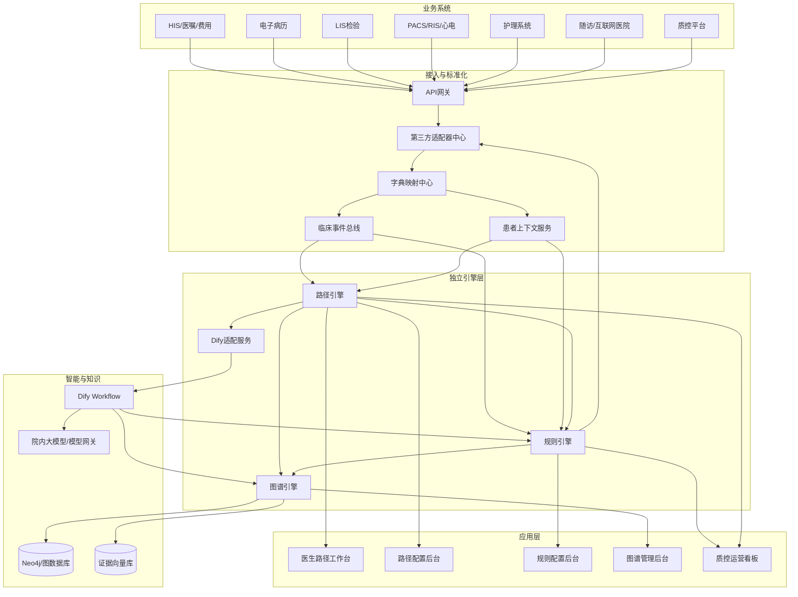
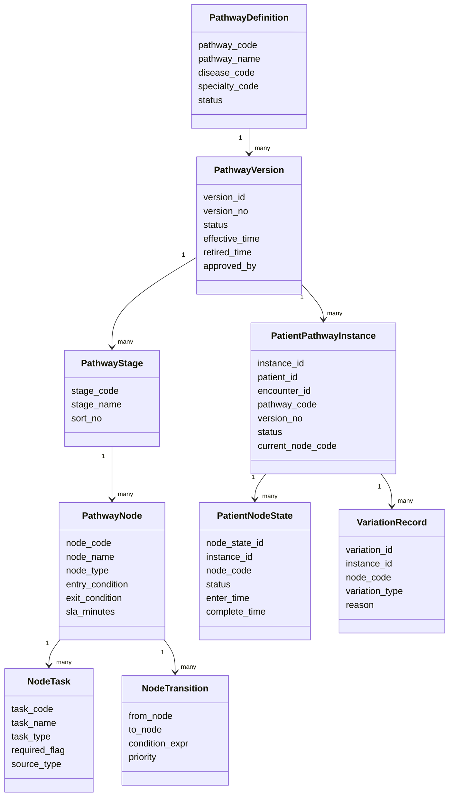
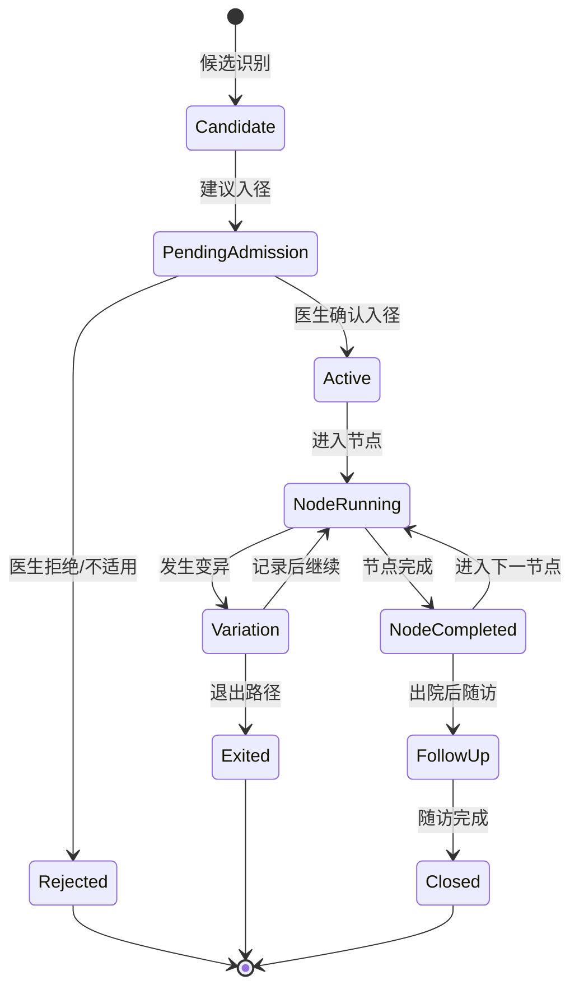
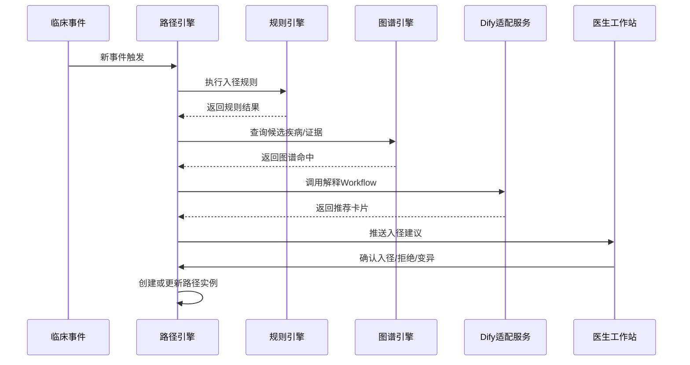
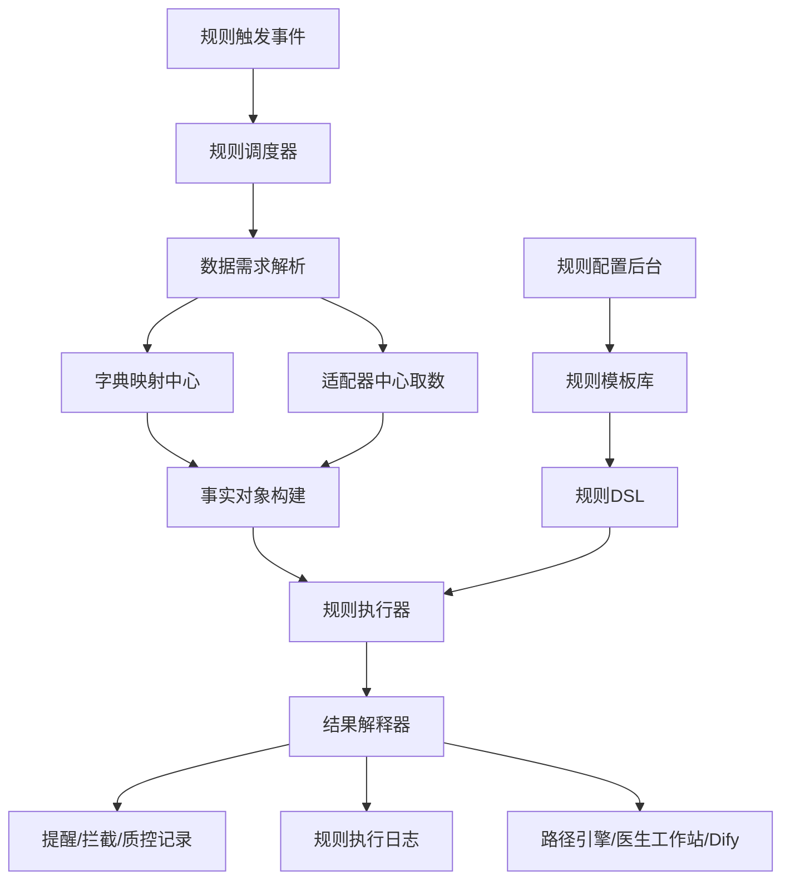
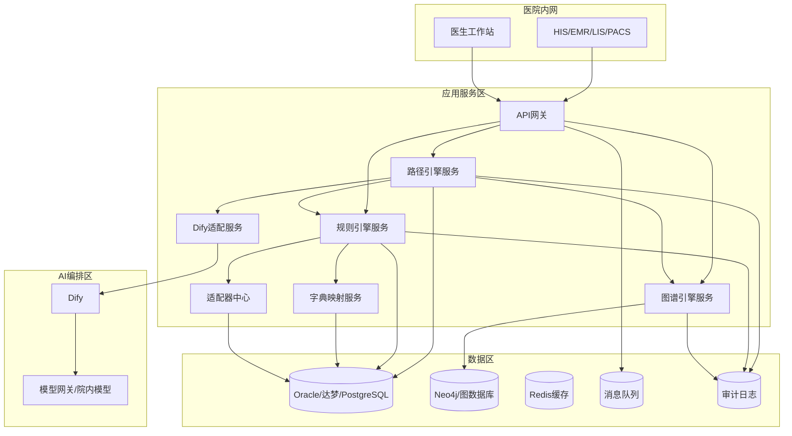

> ℹ️ **本文档是项目最早期的产品设计资料（2025-2026 初），现已被 `docs/` 金本位体系全面更新。**
>
> 保留供产品背景溯源用，**不可作为当前实施依据**。请阅读最新设计：[docs/README.md](../../README.md)
>
> ---

# 专科诊疗管理平台三大引擎建设规划与技术设计文档

版本：V1.0  
面向对象：产品设计师、系统架构师、后端开发工程师、前端开发工程师、测试工程师、实施工程师、医院信息科、临床路径/质控专家  
建设范围：路径引擎、规则引擎、图谱引擎，以及支撑三大引擎独立运行的字典映射、数据适配、流程编排适配、审计监控、数据库适配和国产化部署能力。  
建设原则：三大引擎均作为独立能力服务建设，可被诊疗路径平台、医生工作站、质控平台、随访平台、Dify工作流、第三方业务系统复用调用。

---

## 1. 文档目标

本文档用于指导专科诊疗管理平台后续研发建设，重点回答以下问题：

1. 路径引擎如何支持便捷配置、版本发布、患者入径、节点流转、变异记录，并调用Dify、规则引擎、图谱引擎等能力。
2. 规则引擎如何支持医院字典与系统字典不一致、第三方适配器取数、病历时限质控、内涵质控、路径质控、实时预警和工程人员快速配置。
3. 图谱引擎如何以独立服务方式提供疾病、症状、检查、检验、治疗、路径、证据、规则之间的关系查询与解释能力。
4. 三大引擎如何统一数据模型、接口规范、部署规范、审计规范、国产化适配规范。
5. 如何拆分研发阶段、模块边界、数据库表结构、接口和测试验收要求。

---

## 2. 总体建设原则

### 2.1 独立能力原则

三大引擎不能只作为某个页面的内部逻辑开发，而应作为独立平台能力建设。

| 引擎 | 独立能力定位 | 对外服务对象 |
|---|---|---|
| 路径引擎 | 管理路径定义、版本、患者路径实例、节点流转、变异、闭环 | 专科路径平台、医生工作站、随访平台、质控平台 |
| 规则引擎 | 管理规则定义、规则执行、数据取数、字典映射、结果解释、质控预警 | 路径引擎、医生工作站、病历质控、医务质控、Dify |
| 图谱引擎 | 管理医学知识图谱、路径图谱、证据关系、图查询、候选召回 | 路径引擎、规则引擎、Dify、智能推荐服务 |

### 2.2 清晰边界原则

```text
路径引擎：回答“患者现在在哪条路径、哪个节点、下一步做什么”
规则引擎：回答“当前事实是否违反规则、是否需要提醒或拦截”
图谱引擎：回答“疾病、症状、检查、治疗、证据之间有什么关系”
Dify引擎：回答“如何编排多工具、多步骤、LLM解释和生成文本”
```

### 2.3 配置优先原则

平台要尽量减少硬编码。以下内容必须可配置：

- 专病路径、路径版本、阶段、节点、节点任务。
- 入径条件、退出条件、节点流转条件。
- 节点绑定规则、图谱查询、Dify工作流、适配器取数。
- 规则定义、规则条件、规则动作、提醒级别、质控指标。
- 字典映射、单位换算、字段映射、第三方系统适配。
- 质控指标口径、统计周期、责任科室、整改闭环。

### 2.4 可审计原则

所有引擎动作都需要留痕：

- 谁配置了路径/规则/图谱。
- 何时发布了哪个版本。
- 哪个患者触发了哪个规则。
- 哪个Dify Workflow被调用。
- 哪个图谱版本被查询。
- 医生是否采纳、忽略或修改建议。
- 规则是否命中，命中原因是什么。
- 患者路径状态为什么发生流转。

---

## 3. 总体系统架构

### 3.1 逻辑架构



### 3.2 服务拆分建议

| 服务 | 建议服务名 | 主要职责 |
|---|---|---|
| 路径引擎服务 | `pathway-engine-service` | 路径定义、版本、患者路径实例、节点流转、变异 |
| 规则引擎服务 | `rule-engine-service` | 规则定义、规则执行、规则结果、质控预警 |
| 图谱引擎服务 | `graph-engine-service` | 图谱查询、候选召回、证据关系、路径图谱 |
| 字典映射服务 | `terminology-service` | 医院字典、系统字典、标准字典映射、单位换算 |
| 适配器中心 | `adapter-hub-service` | 第三方系统接口适配、取数、缓存、转换 |
| Dify适配服务 | `workflow-adapter-service` | 调用Dify Workflow，统一参数、鉴权、日志 |
| 患者上下文服务 | `clinical-context-service` | 聚合患者事实，统一输出引擎可使用的数据结构 |
| 审计服务 | `audit-service` | 配置变更、执行记录、医生反馈、调用链追踪 |
| 运行监控服务 | `engine-monitor-service` | 引擎健康状态、规则耗时、路径实例积压、告警 |

---

## 4. 公共平台能力设计

### 4.1 统一临床事件模型

所有引擎不直接依赖HIS/EMR/LIS/PACS原始接口，统一通过临床事件驱动。

```json
{
  "event_id": "evt_202605150001",
  "event_type": "EXAM_RESULTED",
  "event_time": "2026-05-15T10:09:00+08:00",
  "tenant_id": "hospital_001",
  "org_code": "HOSPITAL_A",
  "patient_id": "P123456",
  "encounter_id": "E987654",
  "visit_type": "EMERGENCY",
  "source_system": "ECG",
  "source_event_id": "ECG_888888",
  "payload": {
    "exam_code": "ECG_12_LEAD",
    "exam_name": "十二导联心电图",
    "report_text": "相邻导联ST段抬高，建议结合临床。",
    "report_time": "2026-05-15T10:09:00+08:00"
  }
}
```

### 4.2 统一患者上下文模型

规则引擎、路径引擎、图谱引擎均通过患者上下文服务获取患者事实。

```json
{
  "patient": {
    "patient_id": "P123456",
    "gender": "M",
    "age": 62
  },
  "encounter": {
    "encounter_id": "E987654",
    "visit_type": "EMERGENCY",
    "department_code": "ER",
    "arrival_time": "2026-05-15T10:02:00+08:00"
  },
  "facts": {
    "chief_complaints": [
      {"text": "胸痛2小时，伴大汗", "time": "2026-05-15T10:04:00+08:00"}
    ],
    "diagnoses": [],
    "labs": [],
    "exams": [
      {
        "code": "ECG_12_LEAD",
        "name": "十二导联心电图",
        "finding_codes": ["ST_ELEVATION_CONTIGUOUS_LEADS"],
        "report_text": "相邻导联ST段抬高"
      }
    ],
    "histories": [
      {"code": "HYPERTENSION", "name": "高血压"},
      {"code": "DIABETES", "name": "糖尿病"}
    ],
    "medications": [],
    "allergies": []
  }
}
```

### 4.3 统一调用链追踪

每次引擎调用必须生成 `trace_id`，贯穿：

```text
临床事件 -> 患者上下文 -> 路径引擎 -> 规则引擎 -> 图谱引擎 -> Dify -> 医生工作站 -> 反馈
```

核心字段：

| 字段 | 说明 |
|---|---|
| `trace_id` | 一次完整调用链ID |
| `span_id` | 当前服务调用ID |
| `parent_span_id` | 上游调用ID |
| `engine_type` | PATHWAY/RULE/GRAPH/DIFY |
| `engine_version` | 引擎版本 |
| `config_version` | 路径/规则/图谱配置版本 |
| `elapsed_ms` | 执行耗时 |
| `result_status` | SUCCESS/FAILED/TIMEOUT/SKIPPED |

---

## 5. 路径引擎建设规划

### 5.1 路径引擎定位

路径引擎负责把临床路径从“文档”变成“可配置、可运行、可追踪、可质控”的患者状态机。

路径引擎需要回答：

1. 当前患者是否适合进入某条路径。
2. 患者当前处于哪条路径、哪个阶段、哪个节点。
3. 当前节点需要完成哪些任务。
4. 哪些任务由医生完成，哪些任务由系统自动触发。
5. 当前节点是否满足流转条件。
6. 发生路径偏离时如何记录变异。
7. 路径完成、退出、随访关闭如何管理。

### 5.2 路径引擎核心能力清单

| 能力 | 说明 | 优先级 |
|---|---|---|
| 路径配置 | 配置病种、版本、阶段、节点、任务、流转 | P0 |
| 版本管理 | 草稿、审核、发布、停用、回滚 | P0 |
| 入径评估 | 根据条件、规则、图谱、Dify结果建议入径 | P0 |
| 患者路径实例 | 创建患者路径实例，记录状态 | P0 |
| 节点流转 | 节点进入、进行中、完成、跳过、退出 | P0 |
| 节点任务 | 配置检查、检验、评分、医嘱包、文书、随访任务 | P0 |
| 规则绑定 | 节点绑定规则引擎规则 | P0 |
| Dify调用 | 节点进入/完成/异常时调用Dify Workflow | P0 |
| 图谱调用 | 通过图谱引擎做候选召回、证据查询 | P0 |
| 变异管理 | 记录偏离路径原因、责任节点、医生说明 | P0 |
| SLA时限 | 节点时限、任务时限、超时事件 | P1 |
| 路径模拟 | 使用测试病例模拟路径执行 | P1 |
| 可视化设计器 | 拖拽/表单配置路径节点和流转 | P1 |
| 多路径并行 | 一个患者同时进入多个路径 | P1 |
| 路径互斥 | 多条路径之间准入互斥或优先级 | P2 |
| 路径推荐优化 | 基于运行数据优化入径策略 | P2 |

### 5.3 路径引擎领域模型



### 5.4 路径状态机



### 5.5 路径配置DSL样例

路径配置可以存储为JSON，同时在页面上通过表单/流程图配置生成。

```json
{
  "pathway_code": "AMI_STEMI",
  "pathway_name": "急性ST段抬高型心肌梗死路径",
  "version": "1.0.0",
  "specialty_code": "CARDIOLOGY",
  "entry_policy": {
    "mode": "DOCTOR_CONFIRM",
    "candidate_score_threshold": 85,
    "entry_rules": ["R_AMI_CANDIDATE_HIGH"],
    "graph_query": "GQ_AMI_CANDIDATE_RECALL",
    "dify_workflow": "WF_AMI_ENTRY_EXPLAIN"
  },
  "stages": [
    {
      "stage_code": "ER_STAGE",
      "stage_name": "急诊识别与再灌注评估",
      "nodes": [
        {
          "node_code": "AMI_CHEST_PAIN_IDENTIFY",
          "node_name": "胸痛识别",
          "node_type": "ASSESSMENT",
          "entry_condition": {
            "any": [
              {"fact": "chief_complaint", "contains_any": ["胸痛", "胸闷", "心前区痛"]},
              {"fact": "exam.finding", "in": ["ST_ELEVATION_CONTIGUOUS_LEADS"]}
            ]
          },
          "tasks": [
            {
              "task_code": "TASK_ECG",
              "task_name": "完成十二导联心电图",
              "task_type": "EXAM",
              "required": true,
              "sla_minutes": 10,
              "source": {
                "adapter_code": "ECG_ADAPTER",
                "query_code": "QUERY_ECG_REPORT"
              }
            }
          ],
          "bindings": {
            "rules": ["R_AMI_ECG_TIMELY"],
            "graph_queries": ["GQ_AMI_ECG_FINDING"],
            "dify_workflows": [
              {
                "trigger": "ON_NODE_ENTER",
                "workflow_code": "WF_AMI_NODE_SUMMARY"
              }
            ]
          },
          "transitions": [
            {
              "to_node": "AMI_REPERFUSION_EVAL",
              "condition": {"rule_result": "R_AMI_STEMI_SUSPECTED", "equals": true},
              "priority": 1
            }
          ]
        }
      ]
    }
  ]
}
```

### 5.6 路径节点任务类型

| 任务类型 | 说明 | 示例 |
|---|---|---|
| `FORM` | 结构化表单 | 溶栓禁忌证评估表 |
| `LAB` | 检验任务 | 肌钙蛋白、肾功能 |
| `EXAM` | 检查任务 | ECG、CTA、超声 |
| `ORDER_SET` | 医嘱包建议 | AMI初始治疗医嘱包 |
| `SCORE` | 评分量表 | GRACE、Caprini、NIHSS |
| `DOCUMENT` | 病历文书 | 首次病程、出院小结 |
| `CONSULT` | 会诊/MDT | 心内科会诊、MDT |
| `NURSING` | 护理任务 | VTE评估、宣教 |
| `FOLLOW_UP` | 随访任务 | 7日、30日随访 |
| `DIFY_WORKFLOW` | 智能编排任务 | 生成推荐说明 |
| `RULE_CHECK` | 规则检查任务 | 禁忌证、超时、完整性 |

### 5.7 路径引擎调用其他能力



### 5.8 路径引擎核心API

| API | 方法 | 说明 |
|---|---|---|
| `/api/pathways` | POST | 创建路径定义 |
| `/api/pathways/{code}` | GET | 查看路径定义 |
| `/api/pathways/{code}/versions` | POST | 创建路径版本 |
| `/api/pathways/{code}/versions/{version}/publish` | POST | 发布路径版本 |
| `/api/pathway-simulations` | POST | 使用测试病例模拟路径 |
| `/api/patient-pathways/candidates` | POST | 候选路径识别 |
| `/api/patient-pathways/admit` | POST | 医生确认入径 |
| `/api/patient-pathways/{instanceId}` | GET | 查询患者路径实例 |
| `/api/patient-pathways/{instanceId}/nodes/{nodeCode}/complete` | POST | 完成节点 |
| `/api/patient-pathways/{instanceId}/variation` | POST | 记录变异 |
| `/api/patient-pathways/{instanceId}/exit` | POST | 退出路径 |

### 5.9 路径引擎数据库核心表

| 表名 | 说明 |
|---|---|
| `pe_pathway_def` | 路径基本定义 |
| `pe_pathway_version` | 路径版本 |
| `pe_pathway_stage` | 路径阶段 |
| `pe_pathway_node` | 路径节点 |
| `pe_node_task` | 节点任务 |
| `pe_node_transition` | 节点流转 |
| `pe_node_binding` | 节点绑定规则、图谱查询、Dify工作流 |
| `pe_pathway_publish_log` | 发布日志 |
| `pe_patient_instance` | 患者路径实例 |
| `pe_patient_node_state` | 患者节点状态 |
| `pe_patient_task_state` | 患者任务状态 |
| `pe_variation_record` | 变异记录 |
| `pe_recommendation_record` | 路径推荐记录 |
| `pe_doctor_feedback` | 医生反馈 |

---

## 6. 规则引擎建设规划

### 6.1 规则引擎定位

规则引擎是医院质控、安全提醒、路径准入、节点流转、内涵质控的确定性判断中心。

规则引擎需要解决四类关键问题：

1. **医院字典不统一**：不同医院、不同系统对诊断、检查、检验、药品、科室、文书的编码不同。
2. **数据不在一个库里**：规则执行时需要从HIS、EMR、LIS、PACS、护理、随访等系统取数。
3. **规则配置难**：工程人员需要快速学习配置，不能每条规则都写代码。
4. **质控场景复杂**：需要支持时限质控、内涵质控、病历完整性、路径节点、单病种指标等多种规则。

### 6.2 规则引擎核心能力清单

| 能力 | 说明 | 优先级 |
|---|---|---|
| 规则配置 | 表单化/DSL配置规则 | P0 |
| 字典映射 | 标准字典、院内字典、系统字典映射 | P0 |
| 适配器取数 | 第三方接口实时/批量取数 | P0 |
| 规则执行 | 实时、异步、批量执行 | P0 |
| 规则结果 | 命中、不命中、异常、缺数据 | P0 |
| 时限质控 | 病历书写时限、检查处理时限、节点超时 | P0 |
| 内涵质控 | 病历内容完整性、一致性、合理性 | P0 |
| 路径规则 | 入径、节点完成、退出、变异规则 | P0 |
| 安全规则 | 禁忌、危急值、药物安全 | P1 |
| 规则模拟 | 输入测试病例验证规则 | P1 |
| 规则模板 | 工程人员快速套用配置 | P1 |
| 规则版本 | 草稿、审核、发布、回滚 | P1 |
| 规则性能监控 | 执行耗时、失败率、命中率 | P1 |
| 规则冲突检测 | 多规则之间矛盾检测 | P2 |

### 6.3 规则引擎总体架构



### 6.4 规则类型设计

| 规则大类 | 规则小类 | 示例 |
|---|---|---|
| 时限质控 | 病历时限 | 首次病程记录是否在规定时间内完成 |
| 时限质控 | 检查时限 | 疑似ACS是否及时完成心电图 |
| 时限质控 | 路径节点时限 | STEMI再灌注评估是否超时 |
| 内涵质控 | 完整性 | 出院小结是否包含诊疗经过、出院医嘱、随访建议 |
| 内涵质控 | 一致性 | 首页诊断与出院诊断、病程记录是否一致 |
| 内涵质控 | 合理性 | 抗菌药物使用是否有适应证记录 |
| 路径规则 | 入径规则 | 胸痛+ST段抬高建议进入AMI路径 |
| 路径规则 | 节点完成规则 | 再灌注策略评估资料齐全后节点完成 |
| 安全规则 | 禁忌规则 | 存在明确禁忌证时不推荐某治疗 |
| 安全规则 | 危急值规则 | 危急值是否通知并处理 |
| 运营规则 | 费用/DRG | 费用异常、耗材异常、住院日异常 |
| 随访规则 | 院后异常 | 随访中胸痛复发需回流医生 |

### 6.5 医院字典与系统字典不一致的解决方案

#### 6.5.1 字典分层

```text
标准概念层：平台内部统一概念，例如 AMI、TROPONIN_I、ECG_12_LEAD
院内字典层：医院统一字典，例如医院诊断码、检查码、检验项目码
系统字典层：HIS/EMR/LIS/PACS各系统自己的编码
规则使用层：规则只引用标准概念，不直接引用各系统原始编码
```

#### 6.5.2 字典映射模型

| 对象 | 说明 |
|---|---|
| 标准概念 `standard_concept` | 平台内部统一标准，如疾病、检验、检查、药品、文书 |
| 院内概念 `hospital_concept` | 医院统一字典项 |
| 系统概念 `source_concept` | HIS、EMR、LIS等系统原始编码 |
| 映射关系 `concept_mapping` | 系统码到院内码/标准码的映射 |
| 单位换算 `unit_mapping` | 检验单位换算，如mg/dL到mmol/L |
| 值域映射 `value_mapping` | 性别、状态、阴阳性、危急值标记等 |

#### 6.5.3 映射策略

| 场景 | 处理方式 |
|---|---|
| 一对一 | 直接映射 |
| 一对多 | 按系统、项目、上下文拆分映射 |
| 多对一 | 多个院内码映射到同一标准概念 |
| 无法映射 | 标记为待维护，进入字典治理队列 |
| 单位不同 | 先换算单位，再执行规则 |
| 名称相似但不确定 | 人工审核后发布 |

#### 6.5.4 字典映射表设计

| 表名 | 说明 |
|---|---|
| `tm_standard_concept` | 平台标准概念 |
| `tm_hospital_concept` | 院内字典 |
| `tm_source_concept` | 第三方系统字典 |
| `tm_concept_mapping` | 概念映射关系 |
| `tm_unit_mapping` | 单位换算 |
| `tm_value_mapping` | 值域映射 |
| `tm_mapping_audit` | 映射变更审计 |

### 6.6 第三方适配器取数设计

规则引擎不能假设所有数据都在同一个库中，需要适配器中心支持多种取数方式。

#### 6.6.1 适配器类型

| 类型 | 说明 | 示例 |
|---|---|---|
| REST适配器 | 调用HTTP API | 获取患者诊断、医嘱 |
| SQL适配器 | 查询第三方数据库视图 | 查询LIS结果 |
| WebService适配器 | 调用老系统SOAP接口 | 获取病历文书 |
| MQ适配器 | 消费消息事件 | 检验结果回报 |
| 文件适配器 | 读取中间文件 | 批量质控数据 |
| FHIR/HL7适配器 | 标准医疗接口 | Encounter、Observation |

#### 6.6.2 适配器返回统一格式

```json
{
  "adapter_code": "LIS_ADAPTER",
  "query_code": "QUERY_TROPONIN",
  "status": "SUCCESS",
  "data_time": "2026-05-15T10:20:00+08:00",
  "records": [
    {
      "source_code": "cTnI",
      "standard_code": "TROPONIN_I",
      "name": "肌钙蛋白I",
      "value": 1.24,
      "unit": "ng/mL",
      "abnormal_flag": "HIGH",
      "report_time": "2026-05-15T10:20:00+08:00"
    }
  ],
  "errors": []
}
```

### 6.7 规则DSL设计

#### 6.7.1 时限质控规则示例

```json
{
  "rule_code": "R_EMR_FIRST_COURSE_8H",
  "rule_name": "首次病程记录时限质控",
  "rule_type": "TIME_LIMIT_QC",
  "version": "1.0.0",
  "trigger": {
    "events": ["ADMISSION_CREATED", "DOCUMENT_CREATED", "BATCH_QC"],
    "scope": "INPATIENT"
  },
  "data_requirements": [
    {
      "fact_name": "admission_time",
      "source": {"adapter_code": "EMR_ADAPTER", "query_code": "QUERY_ADMISSION"}
    },
    {
      "fact_name": "first_course_doc",
      "source": {"adapter_code": "EMR_ADAPTER", "query_code": "QUERY_DOCUMENT"},
      "filter": {"document_type": "FIRST_COURSE"}
    }
  ],
  "condition": {
    "all": [
      {"exists": "admission_time"},
      {
        "any": [
          {"not_exists": "first_course_doc.create_time"},
          {
            "duration_minutes_between": ["admission_time", "first_course_doc.create_time"],
            "gt": 480
          }
        ]
      }
    ]
  },
  "result": {
    "hit": {
      "severity": "HIGH",
      "message": "首次病程记录未在8小时内完成，请补齐或说明原因。",
      "actions": ["CREATE_QC_TASK", "PUSH_TO_DOCTOR"]
    },
    "not_hit": {
      "message": "首次病程记录时限符合要求。"
    }
  }
}
```

#### 6.7.2 内涵质控规则示例

```json
{
  "rule_code": "R_DISCHARGE_SUMMARY_COMPLETENESS",
  "rule_name": "出院小结完整性检查",
  "rule_type": "CONTENT_QC",
  "trigger": {
    "events": ["DOCUMENT_SUBMITTED", "DISCHARGE_READY"]
  },
  "data_requirements": [
    {
      "fact_name": "discharge_summary",
      "source": {"adapter_code": "EMR_ADAPTER", "query_code": "QUERY_DOCUMENT"},
      "filter": {"document_type": "DISCHARGE_SUMMARY"}
    }
  ],
  "condition": {
    "any": [
      {"text_section_missing": ["discharge_summary.text", "入院情况"]},
      {"text_section_missing": ["discharge_summary.text", "诊疗经过"]},
      {"text_section_missing": ["discharge_summary.text", "出院诊断"]},
      {"text_section_missing": ["discharge_summary.text", "出院医嘱"]},
      {"text_section_missing": ["discharge_summary.text", "随访建议"]}
    ]
  },
  "result": {
    "hit": {
      "severity": "MEDIUM",
      "message": "出院小结存在关键段落缺失，请补充后提交。",
      "actions": ["BLOCK_DOCUMENT_SUBMIT", "PUSH_TO_DOCTOR"]
    }
  }
}
```

#### 6.7.3 路径节点规则示例

```json
{
  "rule_code": "R_AMI_REPERFUSION_EVAL_COMPLETE",
  "rule_name": "AMI再灌注策略评估节点完成判断",
  "rule_type": "PATHWAY_NODE",
  "trigger": {
    "events": ["ECG_RESULTED", "DOCTOR_FORM_SUBMITTED", "ORDER_CREATED"]
  },
  "condition": {
    "all": [
      {"exists": "facts.exams[ECG_12_LEAD]"},
      {"exists": "forms.reperfusion_eval"},
      {"exists": "forms.thrombolysis_contraindication_eval"},
      {
        "any": [
          {"exists": "orders.primary_pci"},
          {"exists": "orders.thrombolysis"},
          {"exists": "variation.reason"}
        ]
      }
    ]
  },
  "result": {
    "hit": {
      "severity": "INFO",
      "message": "再灌注策略评估节点资料已完整，可流转至下一节点。",
      "actions": ["NOTIFY_PATHWAY_ENGINE"]
    }
  }
}
```

### 6.8 规则配置后台设计要求

规则配置后台必须面向工程实施人员，不要求每个配置者都是高级开发。

#### 6.8.1 配置流程


#### 6.8.2 页面能力

| 页面 | 能力 |
|---|---|
| 规则列表 | 搜索、分类、状态、版本、启停 |
| 规则编辑 | 表单化配置，自动生成DSL |
| 数据需求配置 | 选择适配器、查询字段、缓存策略 |
| 条件配置 | all/any/not、比较、时间窗、文本段落、正则 |
| 动作配置 | 提醒、拦截、质控任务、调用路径引擎、调用Dify |
| 测试模拟 | 输入患者ID或测试JSON，查看命中原因 |
| 发布审核 | 草稿、待审核、已发布、已停用 |
| 执行日志 | 查看每次规则执行事实、结果、耗时 |

### 6.9 规则执行模式

| 模式 | 说明 | 场景 |
|---|---|---|
| 同步实时 | 调用后立即返回结果 | 医嘱拦截、文书提交拦截 |
| 异步实时 | 接收事件后后台执行 | 心电图回流、检验回报 |
| 批量质控 | 定时扫描历史数据 | 病历时限、内涵质控日报 |
| 手工触发 | 用户点击执行 | 单患者质控检查 |
| 模拟执行 | 配置时验证规则 | 测试病例 |

### 6.10 规则引擎核心API

| API | 方法 | 说明 |
|---|---|---|
| `/api/rules` | POST | 创建规则 |
| `/api/rules/{ruleCode}` | GET | 查看规则 |
| `/api/rules/{ruleCode}/publish` | POST | 发布规则 |
| `/api/rules/evaluate` | POST | 执行规则 |
| `/api/rules/evaluate-batch` | POST | 批量执行规则 |
| `/api/rules/simulate` | POST | 模拟执行 |
| `/api/rule-results/{resultId}` | GET | 查看执行结果 |
| `/api/rule-templates` | GET | 规则模板 |
| `/api/rule-logs` | GET | 执行日志 |

---

## 7. 图谱引擎建设规划

### 7.1 图谱引擎定位

图谱引擎对外提供稳定的医学关系查询能力，不要求业务系统直接写Cypher或了解Neo4j内部结构。

图谱引擎需要回答：

1. 某个患者事实可能关联哪些候选疾病。
2. 某个疾病有哪些症状、检查、检验、治疗、禁忌证。
3. 某个路径节点需要哪些证据支持。
4. 某个规则为什么成立，有哪些医学关系依据。
5. 某个治疗方案适用于哪些分型、分期和患者条件。

### 7.2 图谱引擎核心能力

| 能力 | 说明 | 优先级 |
|---|---|---|
| 图谱查询API | 封装Cypher，提供业务查询接口 | P0 |
| 候选疾病召回 | 根据症状、指标、检查发现召回疾病 | P0 |
| 证据查询 | 查询指南/路径证据和版本 | P0 |
| 路径图谱查询 | 查询路径节点、任务、规则关系 | P0 |
| 图谱版本管理 | 图谱发布、回滚、停用 | P0 |
| 图谱导入 | Excel/JSON/接口导入知识 | P1 |
| 图谱审核 | 专家审核后发布 | P1 |
| 图谱质量检查 | 孤立节点、重复关系、缺证据 | P1 |
| 图谱解释 | 输出可读解释路径 | P1 |
| 图谱适配抽象 | 支持后续替换图数据库 | P2 |

### 7.3 图谱分层

```text
医学知识图谱：疾病、症状、检查、检验、治疗、药品、禁忌、证据
路径知识图谱：路径、阶段、节点、任务、规则、质控指标
患者状态索引图谱：患者当前路径、当前节点、关键事实索引
```

### 7.4 图谱核心节点

| 节点 | 说明 |
|---|---|
| `Disease` | 疾病 |
| `Symptom` | 症状 |
| `RiskFactor` | 危险因素 |
| `LabItem` | 检验项目 |
| `Exam` | 检查项目 |
| `Finding` | 检查发现 |
| `Treatment` | 治疗方案 |
| `Drug` | 药品 |
| `Contraindication` | 禁忌证 |
| `Guideline` | 指南/共识/院内路径 |
| `Evidence` | 证据条款 |
| `Pathway` | 路径 |
| `PathwayNode` | 路径节点 |
| `Rule` | 规则 |
| `QualityIndicator` | 质控指标 |

### 7.5 图谱核心API

| API | 方法 | 说明 |
|---|---|---|
| `/api/graph/disease-candidates` | POST | 候选疾病召回 |
| `/api/graph/treatment-candidates` | POST | 候选治疗方案 |
| `/api/graph/evidence` | POST | 证据查询 |
| `/api/graph/pathway-relations` | POST | 路径关系查询 |
| `/api/graph/node-neighborhood` | POST | 查询节点邻域 |
| `/api/graph/explain-path` | POST | 解释两个节点之间的关系路径 |
| `/api/graph/import-jobs` | POST | 图谱导入任务 |
| `/api/graph/versions/{version}/publish` | POST | 发布图谱版本 |

### 7.6 候选疾病召回接口样例

请求：

```json
{
  "patient_id": "P123456",
  "encounter_id": "E987654",
  "symptom_codes": ["CHEST_PAIN", "SWEATING"],
  "finding_codes": ["ST_ELEVATION_CONTIGUOUS_LEADS"],
  "risk_factor_codes": ["HYPERTENSION", "DIABETES"],
  "lab_abnormal_codes": [],
  "limit": 10
}
```

响应：

```json
{
  "graph_version": "KG_2026_05",
  "candidates": [
    {
      "disease_code": "AMI_STEMI",
      "disease_name": "急性ST段抬高型心肌梗死",
      "raw_graph_score": 92,
      "matched_relations": [
        {"type": "HAS_CORE_SYMPTOM", "target": "胸痛", "weight": 1.0},
        {"type": "HAS_EXAM_FINDING", "target": "相邻导联ST段抬高", "weight": 1.0},
        {"type": "HAS_RISK_FACTOR", "target": "糖尿病", "weight": 0.45}
      ],
      "evidence_refs": ["EV_AMI_001", "EV_AMI_002"]
    }
  ]
}
```

---

## 8. Dify适配服务设计

### 8.1 为什么需要Dify适配服务

业务系统不应直接散落调用Dify接口，应通过统一适配服务管理：

- Workflow编码和版本。
- 输入参数脱敏和校验。
- 调用超时、重试、降级。
- 调用日志和审计。
- Dify返回JSON结构校验。
- 不同环境的Dify地址、鉴权、应用密钥。

### 8.2 Dify适配服务接口

```json
{
  "workflow_code": "WF_AMI_ENTRY_EXPLAIN",
  "workflow_version": "1.0.0",
  "trace_id": "trace_001",
  "patient_context": {
    "age": 62,
    "gender": "M",
    "facts": ["胸痛2小时", "ST段抬高", "糖尿病"]
  },
  "engine_context": {
    "graph_hits": [],
    "rule_hits": [],
    "pathway_code": "AMI_STEMI"
  },
  "output_schema": "RECOMMENDATION_CARD"
}
```

### 8.3 Dify调用原则

| 原则 | 说明 |
|---|---|
| 不保存核心状态 | 路径状态保存在路径引擎 |
| 不做强规则判断 | 禁忌、拦截由规则引擎决定 |
| 输出结构化JSON | 方便业务系统解析 |
| 必须有超时 | 防止影响医生工作站 |
| 必须有降级 | Dify不可用时不影响核心路径状态 |
| 必须有审计 | 输入、输出、版本、耗时留痕 |

---

## 9. 数据库与国产化适配要求

### 9.1 数据库适配目标

三大引擎的数据存储需要支持多种数据库：

- Oracle。
- 达梦数据库。
- PostgreSQL。
- MySQL或兼容数据库。
- 后续可扩展至人大金仓、神通等国产数据库。

### 9.2 数据库设计原则

1. **避免强绑定数据库特性**  
   核心业务SQL避免使用某一数据库独有语法。

2. **统一数据访问层**  
   使用Repository/DAO层屏蔽不同数据库方言。

3. **数据库方言配置化**  
   系统启动时通过 `db.dialect=oracle|dm|postgresql|mysql` 控制分页、序列、时间函数、锁语法。

4. **主键策略可切换**  
   使用雪花ID或应用层生成ID，减少序列差异。

5. **时间统一存储**  
   建议统一存储为数据库时间戳，应用层统一处理时区。

6. **JSON字段谨慎使用**  
   Oracle/达梦对JSON支持版本差异较大，核心查询字段必须结构化。配置DSL可存CLOB/TEXT，同时关键字段冗余结构化。

7. **迁移脚本分方言管理**  
   初始化DDL按数据库类型分目录维护。

### 9.3 推荐技术实现

| 层面 | 建议 |
|---|---|
| ORM/SQL | MyBatis / JPA均可，复杂SQL建议MyBatis |
| 迁移 | Flyway/Liquibase，按数据库方言拆脚本 |
| 主键 | 应用层雪花ID/UUID，避免依赖序列 |
| JSON | 配置原文存CLOB，检索字段结构化 |
| 分页 | 方言适配器统一处理 |
| 锁 | 使用乐观锁字段 `version_no`，减少数据库锁差异 |
| 大字段 | 规则DSL、路径DSL、执行上下文使用CLOB |

### 9.4 表设计公共字段

所有核心配置表建议包含：

```text
id
tenant_id
org_code
code
name
status
version_no
created_by
created_time
updated_by
updated_time
approved_by
approved_time
remark
```

所有执行日志表建议包含：

```text
id
trace_id
engine_type
config_code
config_version
patient_id
encounter_id
event_id
input_snapshot
output_snapshot
result_status
elapsed_ms
error_code
error_message
created_time
```

### 9.5 国产化服务器适配要求

部署需要满足国产化服务器和操作系统环境，建议从设计阶段约束：

| 类别 | 要求 |
|---|---|
| CPU架构 | 支持x86_64、ARM64；有条件支持鲲鹏、飞腾等架构 |
| 操作系统 | 支持主流Linux发行版和国产操作系统环境 |
| Java运行时 | 建议Java 17 LTS，需验证国产环境JDK兼容性 |
| 容器 | 支持Docker/Podman/Kubernetes；国产环境可使用适配容器平台 |
| 中间件 | Redis、Kafka/RabbitMQ可替换；提供抽象配置 |
| 数据库 | Oracle/达梦/PostgreSQL/MySQL方言适配 |
| 文件存储 | 本地NAS/对象存储可配置 |
| 日志 | 标准文件日志 + 可对接院内日志平台 |
| 监控 | Prometheus接口或标准健康检查接口 |

---

## 10. 部署架构

### 10.1 单院部署架构



### 10.2 高可用建议

| 组件 | 高可用要求 |
|---|---|
| API网关 | 双节点或集群 |
| 路径引擎 | 无状态服务，至少2实例 |
| 规则引擎 | 无状态服务，至少2实例 |
| 图谱引擎 | 无状态服务，至少2实例 |
| 数据库 | 使用医院现有数据库高可用方案 |
| Neo4j | 生产建议主从/集群或定期备份 |
| Redis | 可选集群或主从 |
| MQ | 生产建议集群 |
| Dify | 至少区分测试/生产环境 |

---

## 11. 安全、权限与审计

### 11.1 权限模型

| 角色 | 权限 |
|---|---|
| 临床医生 | 查看患者路径、处理推荐、记录变异 |
| 科主任 | 查看本科室路径运行和质控指标 |
| 质控人员 | 查看质控结果、规则命中、整改闭环 |
| 路径配置员 | 编辑路径草稿、提交审核 |
| 规则配置员 | 编辑规则草稿、测试规则 |
| 图谱维护员 | 导入图谱、维护关系、提交审核 |
| 专家审核员 | 审核路径、规则、图谱、证据 |
| 系统管理员 | 用户、权限、接口、部署配置 |

### 11.2 审计要求

必须审计：

- 配置创建、修改、发布、停用、回滚。
- 患者路径入径、退出、节点流转、变异。
- 规则执行输入、输出、命中原因。
- 字典映射修改。
- 第三方适配器调用。
- Dify调用输入输出摘要。
- 医生采纳、忽略、修改。

### 11.3 数据安全

1. 引擎之间只传递完成任务所需字段。
2. Dify和大模型调用前做脱敏或最小化处理。
3. 日志避免记录完整身份证、电话、地址等敏感信息。
4. 所有管理接口需要鉴权和操作审计。
5. 配置发布需要双人审核或专家审核。

---

## 12. 产品后台设计要求

### 12.1 路径配置后台

必须支持：

- 路径目录管理。
- 路径版本管理。
- 阶段和节点配置。
- 节点任务配置。
- 节点流转配置。
- 节点绑定规则、图谱查询、Dify Workflow。
- 路径模拟运行。
- 路径审核发布。
- 路径变异原因字典。

### 12.2 规则配置后台

必须支持：

- 规则模板选择。
- 触发事件配置。
- 数据需求配置。
- 字典映射选择。
- 条件表达式配置。
- 结果动作配置。
- 规则模拟测试。
- 规则审核发布。
- 规则命中日志查看。

### 12.3 图谱管理后台

必须支持：

- 节点管理。
- 关系管理。
- 证据来源管理。
- Excel/JSON导入。
- 图谱质量检查。
- 图谱版本发布。
- 图谱查询测试。

### 12.4 字典映射后台

必须支持：

- 标准概念维护。
- 院内字典导入。
- 第三方系统字典导入。
- 映射关系维护。
- 单位换算。
- 未映射项治理。
- 映射审核发布。

---

## 13. 开发阶段规划

### 13.1 第一阶段：引擎底座，8-10周

目标：完成三大引擎最小可用能力。

交付：

1. 路径引擎基础模型、路径配置、患者实例、节点流转。
2. 规则引擎基础DSL、同步执行、时限质控规则。
3. 图谱引擎基础查询、候选疾病召回、证据查询。
4. 字典映射中心基础能力。
5. Dify适配服务基础调用。
6. Oracle/达梦/PostgreSQL至少完成两种数据库适配验证。
7. AMI路径样例跑通。

### 13.2 第二阶段：配置化与质控，10-12周

目标：工程人员可通过后台配置路径和规则。

交付：

1. 路径可视化/表单配置后台。
2. 规则模板库和规则配置后台。
3. 适配器中心支持REST、SQL、WebService三类适配。
4. 病历时限质控和内涵质控规则集。
5. 规则模拟测试工具。
6. 质控看板基础版。
7. 路径版本审核发布流程。

### 13.3 第三阶段：多病种扩展，12-16周

目标：支持多个专病路径规模化上线。

交付：

1. AMI、脑梗死、VTE、糖尿病等路径模板。
2. 多路径并行和互斥策略。
3. 图谱批量导入和版本管理。
4. Dify多Workflow编排管理。
5. 规则性能优化和批量质控。
6. 高可用部署与监控。
7. 国产化环境完整验证。

### 13.4 第四阶段：智能优化与治理，持续迭代

目标：基于真实运行数据优化路径、规则和推荐。

交付：

1. 医生采纳率和规则误报率分析。
2. 路径变异原因分析。
3. 图谱质量治理。
4. 规则冲突检测。
5. 引擎运行评估报告。
6. 专家复盘和版本更新闭环。

---

## 14. 开发任务拆分建议

### 14.1 后端开发

| 模块 | 任务 |
|---|---|
| 路径引擎 | 数据模型、状态机、API、节点流转、变异 |
| 规则引擎 | DSL解析、执行器、函数库、结果解释 |
| 图谱引擎 | 查询封装、候选召回、证据查询 |
| 字典服务 | 标准概念、映射、单位换算 |
| 适配器中心 | REST/SQL/WebService适配 |
| Dify适配 | Workflow调用、超时、日志、JSON校验 |
| 审计监控 | 调用链、执行日志、健康检查 |
| 数据库适配 | Oracle/达梦/PostgreSQL方言 |

### 14.2 前端开发

| 页面 | 任务 |
|---|---|
| 路径设计器 | 路径、阶段、节点、流转配置 |
| 规则配置器 | 模板化配置、条件表达式、动作配置 |
| 图谱管理 | 节点、关系、证据维护 |
| 字典映射 | 字典导入、映射审核 |
| 患者路径工作台 | 当前节点、任务、推荐、变异 |
| 质控看板 | 规则命中、路径指标、整改 |
| 模拟测试 | 路径模拟、规则模拟、图谱查询测试 |

### 14.3 测试工程

| 测试类型 | 重点 |
|---|---|
| 单元测试 | 规则函数、路径状态机、字典映射 |
| 集成测试 | 路径调用规则、规则调用适配器、Dify调用 |
| 数据库测试 | Oracle/达梦/PostgreSQL兼容性 |
| 性能测试 | 高并发事件、批量质控、图谱查询 |
| 安全测试 | 权限、审计、敏感数据 |
| 回归测试 | 路径/规则/图谱版本升级 |
| 临床验证 | 专家病例集验证命中率和误报率 |

---

## 15. 验收标准

### 15.1 路径引擎验收

- 可配置一条完整AMI路径。
- 可发布路径版本。
- 可基于患者事件生成候选路径。
- 医生可确认入径。
- 可完成节点流转。
- 可记录变异。
- 可调用规则引擎、图谱引擎、Dify适配服务。
- 所有动作可审计。

### 15.2 规则引擎验收

- 可配置时限质控规则。
- 可配置内涵质控规则。
- 可通过字典映射解决院内码差异。
- 可通过适配器中心获取第三方数据。
- 可实时执行和批量执行。
- 可输出命中原因和处理动作。
- 工程人员可基于模板在1小时内配置一条常规时限规则。

### 15.3 图谱引擎验收

- 可查询疾病相关症状、检查、检验、治疗、证据。
- 可根据患者事实召回候选疾病。
- 可返回图谱命中关系和证据ID。
- 可支持图谱版本发布。
- 可供路径引擎、规则引擎、Dify调用。

### 15.4 国产化与数据库验收

- 至少完成Oracle和达梦数据库部署验证。
- 服务可在Linux/国产化服务器环境启动运行。
- 所有核心服务支持配置化数据库方言。
- 初始化脚本、升级脚本、回滚脚本可执行。
- 提供健康检查、日志、监控指标。

---

## 16. 核心结论

三大引擎建设不要按“单个业务页面功能”开发，而应建设为可复用、可配置、可审计、可部署、可扩展的独立能力平台：

```text
路径引擎负责患者路径状态和临床流程闭环；
规则引擎负责确定性判断、安全底线和质控执行；
图谱引擎负责权威知识关系、候选召回和证据解释；
Dify负责智能编排、工具调用和医生可读解释；
字典映射和适配器中心负责解决医院真实数据复杂性；
数据库和部署层必须从第一天开始考虑Oracle、达梦和国产化服务器。
```

这套建设方式可以支撑AMI等单病种试点，也能逐步扩展到脑梗死、VTE、糖尿病、肿瘤等更多专科路径，并为医院后续质控、随访、专病运营和智能决策支持打下统一底座。

