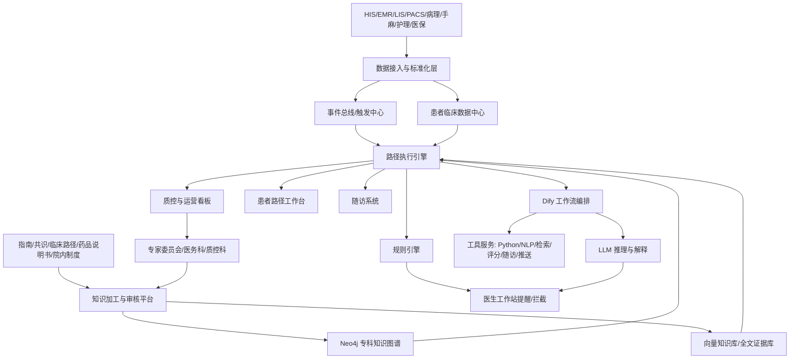
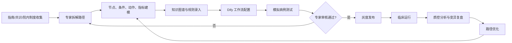
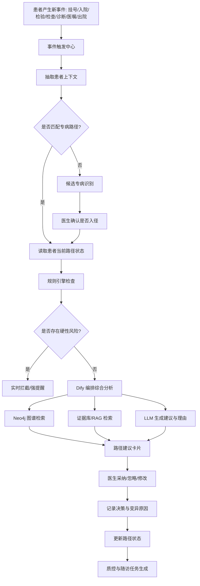
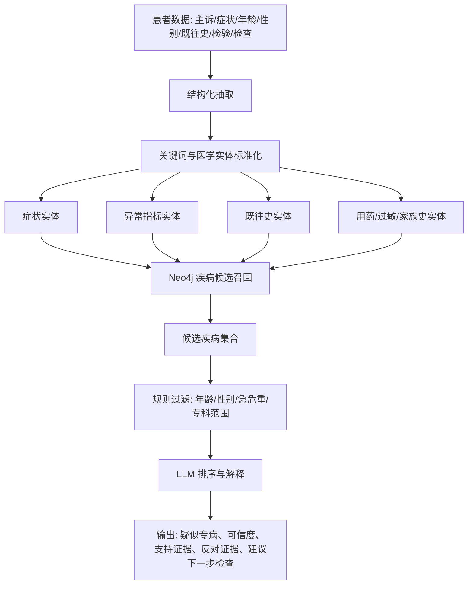
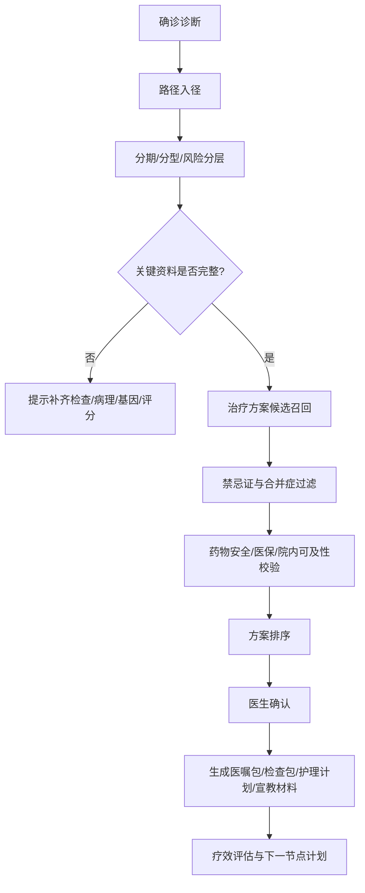
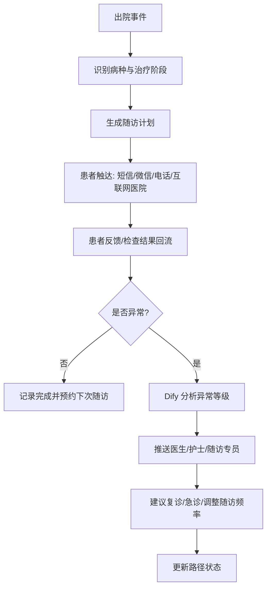

> ℹ️ **本文档是项目最早期的产品设计资料（2025-2026 初），现已被 `docs/` 金本位体系全面更新。**
>
> 保留供产品背景溯源用，**不可作为当前实施依据**。请阅读最新设计：[docs/README.md](../../README.md)
>
> ---

帮我调研及分析全世界最优秀的专科诊疗路径管理方案及系统设计，并输出完整的产品方案和技术设计路线架构，需要包含完善的流程图。需要符合中国环境下的实际临床使用。目前院内部署有dify系统，使用neo4j图谱数据库。以下是现有提出的设想，仅供参考：专科诊疗路径技术方向：
1.利用dify进行流程编排，把诊疗路径的治疗节点的流程编排清楚。比如确诊专病前，进行风险预测，专病推荐。确诊专病后，治疗方案推荐。出院后，定期随访建议及定期随访监控。通过流程编排把诊疗路径明确化。
2.针对每个治疗节点，进行流程细化。同样利用dify进行小节点的流程编排。比如确诊专病前，利用患者已产生的数据，如症状、年龄、性别、既往史、检验指标等内容，通过工具(Python拆分成关键词列表)进行处理，拆分出症状、异常指标、既往史等信息分别去知识图谱进行检索出候选疾病。在利用大模型的能力，根据患者的基本信息，指标信息等，针对候选疾病进行推荐可信度进行排序。并罗列出原由提供参考。【理由：充分利用知识图谱的权威性，确定性，同时利用大模型的分析能力辅助推荐】
3.提供诊疗路径的dify主动触发及定时触发机制。
4.核心构建：具有权威性、准确性的知识图谱。
5.诊疗路径中规则的触发拦截，保持规则引擎的模式进行实时监控。同时编排dify任务调用大模型进行风险把控，生成预警信息，通过推送机制传达医生。


下面给你一版可直接作为立项/蓝图评审材料的方案。核心判断是：不要把系统做成“一个会回答问题的大模型”，而要做成“可审计的临床路径执行引擎 + 权威知识图谱 + Dify 编排层 + 规则/质控实时监控 + 大模型辅助解释”的组合系统。这样最符合中国医院环境，也最容易过医务、质控、信息、伦理和安全评审。

**一、国际最佳实践结论**

全球优秀方案有几个共同点：

1. **路径不是静态文档，而是可计算知识资产**  
   HL7 的 CPG-on-FHIR 把指南、路径、质量指标、文书模板、决策支持统一成可计算资源，强调从叙述性指南转成可执行知识，避免各医院重复、人工翻译导致偏差。参考：[HL7 CPG-on-FHIR](https://hl7.org/fhir/uv/cpg/)。

2. **决策支持必须嵌入医生工作流**  
   CDS Hooks 的核心是：在开医嘱、看检验、入院、出院、用药等关键节点自动触发 CDS 服务，把建议以卡片形式返回给 EHR/HIS，而不是让医生另开一个系统。参考：[HL7 CDS Hooks](https://cds-hooks.hl7.org/hooks/index.html)、[FHIR Clinical Reasoning](https://www.hl7.org/fhir/clinicalreasoning-cds-on-fhir.html)。

3. **路径系统要同时服务诊疗、质控、支付和运营**  
   Elsevier ClinicalPath 的价值不只是推荐方案，还包括路径依从率、治疗方案分析、临床试验匹配、成本和质量分析。参考：[Elsevier ClinicalPath](https://www.elsevier.com/products/clinicalpath)。

4. **权威内容 + 工作流集成，比单纯 AI 更重要**  
   UpToDate、ClinicalKey、ClinicalPath 等方案都强调循证内容、专家审核、EHR 集成、药物安全、患者教育和持续更新。参考：[UpToDate EHR integration](https://www.uptodate.com/home/ehr-interface)、[Elsevier CDS](https://www.elsevier.com/solutions/clinical-decision-support)。

5. **中国落地必须对齐临床路径、单病种、质控和医保支付**  
   国家卫健委《医疗机构临床路径管理指导原则》强调临床路径要与医疗质量控制、绩效考核、费用调整、支付方式改革、信息化建设结合。参考：[国家卫健委临床路径管理指导原则解读](https://www.nhc.gov.cn/zwgk/jdjd/201709/e717bffb5fc445bcb4fa99e7063755c8.shtml)。  
   2025 年国家医疗质量安全目标还明确关注脑梗再灌注、肿瘤 TNM 分期、VTE 预防、感染性休克集束化治疗、四级手术 MDT、关键诊疗记录完整率等，非常适合作为首批路径场景。参考：[2025 年国家医疗质量安全改进目标](https://www.gov.cn/lianbo/bumen/202503/content_7014947.htm)。

---

**二、产品定位**

产品名称建议：**专科诊疗路径智能管理平台**

一句话定位：  
面向专科病种的“诊前识别、诊中路径推荐、住院过程质控、出院随访、指标分析”的全周期路径管理系统。

系统边界建议非常清楚：

- 系统提供：路径建议、风险提醒、证据出处、质控拦截、随访计划、路径偏离分析。
- 医生负责：最终诊断、治疗决策、医嘱下达、路径变异确认。
- 系统不应直接替代医生做自动诊断或自动开医嘱。

---

**三、总体产品模块**

1. **专病路径中心**
   - 专病目录管理：如肺癌、乳腺癌、卒中、房颤、糖尿病、慢阻肺、脓毒症、VTE 等。
   - 路径版本管理：草稿、专家审核、发布、停用、回滚。
   - 路径阶段管理：筛查、疑似、确诊、分期/分型、治疗、疗效评估、出院、随访、复发/再入院。
   - 节点管理：准入条件、退出条件、推荐动作、禁忌、质控指标、证据来源。

2. **患者路径工作台**
   - 当前患者是否进入某条专病路径。
   - 当前处于哪个路径阶段。
   - 已完成/未完成检查、评估、医嘱、文书。
   - 路径推荐、风险预警、变异原因记录。
   - 医生可采纳、忽略、修改，并填写原因。

3. **智能专病识别与推荐**
   - 基于症状、诊断、主诉、既往史、检验、检查、用药、年龄、性别等识别候选疾病。
   - Neo4j 检索候选疾病、症状、指标、鉴别诊断。
   - LLM 对候选疾病排序并生成理由。
   - 输出“疑似专病推荐”，而不是“确诊结论”。

4. **治疗方案推荐**
   - 根据诊断、分期、分型、病理、基因检测、合并症、肝肾功能、过敏史、妊娠状态、医保限制等推荐方案。
   - 输出方案优先级、适用条件、禁忌、必要检查、证据等级。
   - 推荐医嘱包/检查包/护理包/宣教材料，但由医生确认下达。

5. **实时规则拦截与预警**
   - 强规则：禁忌证、危急值、药物相互作用、重复检查、路径必做项缺失、抗菌药物限制、VTE 未评估等。
   - 弱规则：路径偏离、随访超期、指标趋势异常、疗效评估超期。
   - 高风险规则走实时拦截，低风险规则走提醒/待办。

6. **出院随访与院外管理**
   - 出院自动生成随访计划。
   - 按病种和治疗方案生成随访频率、检查项目、复诊提醒。
   - 支持微信/短信/电话/互联网医院/随访系统对接。
   - 随访异常自动回流医生工作台。

7. **质控与运营分析**
   - 路径入径率、完成率、变异率、退出率。
   - 单病种质控指标。
   - 平均住院日、费用结构、药占比、耗材、检查重复率。
   - 医生/科室路径依从率。
   - 关键国家质控目标监测，如 TNM 分期率、VTE 预防率、脑梗再灌注率等。

---

**四、总体架构**



推荐技术分层：

- **数据层**：患者主索引、诊疗事件库、标准术语映射、原始数据留痕。
- **知识层**：Neo4j 知识图谱 + Dify 知识库/向量库 + 证据文档库。
- **规则层**：Drools/NRules/自研规则引擎均可，负责确定性规则。
- **编排层**：Dify Workflow，负责复杂流程、多工具调用、LLM 辅助解释。
- **路径引擎层**：管理患者路径状态机、节点流转、变异、审计。
- **应用层**：医生工作站、路径工作台、医务质控看板、随访管理。
- **治理层**：专家审核、版本管理、权限、日志、模型评测、合规审计。

---

**五、路径生命周期流程**



每条路径建议拆成 5 类资产：

| 资产 | 说明 |
|---|---|
| 路径定义 | 病种、适用人群、准入/退出标准、阶段、节点 |
| 规则定义 | 必做项、禁忌、预警、拦截、质控指标 |
| 知识定义 | 疾病、症状、检查、治疗、药物、证据关系 |
| 工作流定义 | Dify 中的节点编排、工具调用、LLM 提示词 |
| 评估定义 | 入径率、完成率、变异率、结局、费用、医生采纳率 |

---

**六、患者运行时流程**



---

**七、确诊前：专病风险预测与候选疾病推荐**

你们已有设想是对的，但建议进一步产品化为“证据约束的候选疾病排序”，避免变成大模型自由诊断。



推荐评分公式：

```text
综合评分 = 图谱匹配分 * 0.45
        + 指南/路径证据分 * 0.25
        + 患者特征匹配分 * 0.15
        + LLM 语义一致性分 * 0.10
        + 本院历史病例相似度 * 0.05
```

输出示例：

| 候选专病 | 推荐等级 | 支持依据 | 反对依据 | 建议动作 |
|---|---:|---|---|---|
| 急性脑梗死 | 高 | 突发偏瘫、言语不清、年龄、既往房颤 | 影像未确认 | 启动卒中绿色通道，完善头颅 CT/CTA |
| TIA | 中 | 短暂神经功能缺损 | 症状持续时间不明 | 评估 ABCD2，完善血管检查 |

---

**八、确诊后：治疗路径推荐**



治疗推荐必须包含：

- 适用条件
- 禁忌条件
- 证据来源
- 推荐等级
- 替代方案
- 必要检查
- 风险提示
- 医生确认记录
- 变异原因

---

**九、出院后随访流程**



---

**十、Neo4j 知识图谱设计**

建议采用“医学知识图谱 + 路径图谱 + 患者状态图谱”三层设计。

核心节点：

```text
Disease 疾病
Symptom 症状
Sign 体征
LabItem 检验项目
Exam 检查项目
Finding 检查发现
Diagnosis 诊断
Stage 分期/分型
RiskScore 评分量表
Treatment 治疗方案
Drug 药品
Procedure 操作/手术
OrderSet 医嘱包
Contraindication 禁忌证
AdverseEvent 不良事件
FollowUp 随访任务
Guideline 指南/共识/路径文档
Evidence 证据条目
QualityIndicator 质控指标
Pathway 临床路径
PathwayNode 路径节点
PatientState 患者路径状态
```

核心关系：

```text
Disease -[:HAS_SYMPTOM]-> Symptom
Disease -[:HAS_LAB_ABNORMALITY]-> LabItem
Disease -[:REQUIRES_EXAM]-> Exam
Disease -[:HAS_STAGE]-> Stage
Stage -[:RECOMMENDS]-> Treatment
Treatment -[:CONTAINS_DRUG]-> Drug
Treatment -[:HAS_CONTRAINDICATION]-> Contraindication
Pathway -[:HAS_NODE]-> PathwayNode
PathwayNode -[:NEXT]-> PathwayNode
PathwayNode -[:REQUIRES]-> Exam/LabItem/RiskScore
PathwayNode -[:TRIGGERS]-> Rule
Evidence -[:SUPPORTS]-> Treatment/Rule/PathwayNode
Patient -[:CURRENTLY_AT]-> PathwayNode
Patient -[:HAS_STATE]-> PatientState
```

示例 Cypher：

```cypher
MATCH (d:Disease)-[:HAS_SYMPTOM]->(s:Symptom)
WHERE s.name IN $symptoms
WITH d, count(s) AS symptomScore
MATCH (d)-[:HAS_LAB_ABNORMALITY]->(l:LabItem)
WHERE l.code IN $abnormalLabs
RETURN d.name, symptomScore, count(l) AS labScore
ORDER BY symptomScore + labScore DESC
LIMIT 10;
```

---

**十一、Dify 工作流设计**

Dify 应定位为“智能流程编排层”，不要承担所有核心状态和强规则。

建议工作流分为：

| 工作流 | 触发方式 | 主要用途 |
|---|---|---|
| 专病识别 Workflow | 门诊/入院/检验异常事件 | 候选专病推荐 |
| 入径评估 Workflow | 医生诊断或疑似专病 | 判断是否建议入径 |
| 治疗推荐 Workflow | 确诊、分期完成 | 推荐治疗路径和下一步 |
| 风险预警 Workflow | 实时事件/Webhook | 生成风险解释和建议 |
| 出院随访 Workflow | 出院事件/定时任务 | 生成随访计划 |
| 随访异常 Workflow | 患者反馈/检查结果 | 异常分级与复诊建议 |
| 质控日报 Workflow | 定时触发 | 生成科室路径运行报告 |

Dify 能力可直接用：

- HTTP Request：调用 HIS、EMR、Neo4j API、规则服务、推送服务。
- Code Node：做关键词拆分、指标转换、评分计算、JSON 整形。
- Knowledge Retrieval：检索指南、路径、院内制度。
- Workflow Tool：把小流程封装成可复用工具。
- Schedule Trigger：定时跑随访、质控日报、超期任务。
- Webhook Trigger：接收 HIS/EMR 事件触发。参考：[Dify Trigger](https://docs.dify.ai/en/guides/workflow/node/trigger)、[Dify Webhook Trigger](https://docs.dify.ai/en/use-dify/nodes/trigger/webhook-trigger)、[Dify HTTP Request](https://docs.dify.ai/en/use-dify/nodes/http-request)。

---

**十二、规则引擎与 LLM 的职责边界**

| 类型 | 适合规则引擎 | 适合 LLM/Dify |
|---|---|---|
| 禁忌证 | 是 | 解释原因 |
| 危急值 | 是 | 生成处置建议摘要 |
| 路径必做项 | 是 | 解释遗漏风险 |
| 药物相互作用 | 是 | 生成医生可读说明 |
| 疑难鉴别诊断 | 部分 | 是 |
| 治疗方案理由 | 部分 | 是 |
| 文书完整性 | 是 | 辅助补全 |
| 随访宣教 | 部分 | 是 |
| 质控报告 | 部分 | 是 |

强建议：**拦截靠规则，解释靠大模型，证据靠图谱和知识库，决策靠医生。**

---

**十三、中国医院落地重点**

1. **对接系统**
   - HIS：患者、挂号、住院、医嘱、费用。
   - EMR：病历、诊断、病程、出院小结。
   - LIS：检验结果、危急值。
   - PACS/RIS：检查报告。
   - 病理系统：病理诊断、免疫组化、分子检测。
   - 手麻系统：手术、麻醉、术前讨论。
   - 护理系统：评估、护理计划、VTE、压疮、跌倒。
   - 随访系统/互联网医院/患者服务平台。
   - 医保/DRG/DIP/单病种质控系统。

2. **首批推荐病种**
   - 急性脑梗死：国家质控目标明确，再灌注治疗率价值高。
   - 肿瘤专病：如肺癌、乳腺癌、结直肠癌，适合 TNM、MDT、基因检测、方案推荐。
   - VTE 防治：路径清晰、规则强、院内质控价值高。
   - 感染性休克：集束化治疗、时效性强。
   - 糖尿病/慢病：适合出院随访和长期管理。

3. **合规提醒**
   - 如果系统输出用于辅助诊断、辅助治疗，并显著影响医生决策，可能触及 AI 医疗器械软件监管边界。国家药监局已发布人工智能医疗器械注册审查相关指导原则，强调生命周期管理、算法验证、临床评价、更新控制。参考：[人工智能医疗器械注册审查指导原则](https://www.innomd.org/index.php/article/622ed18023ce96793b0fcab7.html)。
   - 院内一期建议定位为“临床路径管理、质控提醒、医生辅助参考”，保留医生确认和审计闭环。

---

**十四、MVP 建设路线**

**第 1 阶段：基础底座，1-2 个月**

- 建立患者事件接入。
- 建立路径状态机。
- 建立 Neo4j 基础图谱模型。
- 打通 Dify 调用 Neo4j/规则服务/知识库。
- 选择 1 个病种试点。

**第 2 阶段：单病种闭环，2-3 个月**

- 完成“识别、入径、推荐、预警、出院随访、质控看板”闭环。
- 建立专家审核后台。
- 路径建议可采纳/忽略/变异记录。
- 输出科室质控日报和路径依从率。

**第 3 阶段：多病种扩展，3-6 个月**

- 扩展 5-10 个专病路径。
- 建立路径模板和节点复用机制。
- 建立医嘱包、检查包、护理包。
- 接入医保/DRG/DIP 和单病种指标。

**第 4 阶段：智能优化，6-12 个月**

- 引入真实世界数据分析。
- 建立路径效果评价。
- 做医生采纳率、患者结局、费用、住院日分析。
- 建立模型评测集和安全红线测试。

---

**十五、关键指标**

| 维度 | 指标 |
|---|---|
| 临床质量 | 路径入径率、完成率、变异率、关键节点完成率 |
| 安全 | 高危预警准确率、漏报率、误报率、医生响应时间 |
| 效率 | 平均住院日、重复检查率、文书完整率 |
| 费用 | 次均费用、DRG/DIP 偏差、药耗占比 |
| 医生体验 | 推荐采纳率、提醒关闭率、平均处理时长 |
| 随访 | 随访完成率、异常回流率、再入院率 |
| 知识治理 | 路径更新周期、证据覆盖率、专家审核通过率 |

---

**十六、最终建议架构原则**

最适合你们现状的设计是：

```text
Dify = 流程编排与大模型协作层
Neo4j = 权威医学知识与路径关系层
规则引擎 = 实时质控与安全拦截层
路径引擎 = 患者状态流转与审计层
医生工作站 = 临床落地入口
质控看板 = 管理闭环出口
```

这套设计既吸收了国际 CDS、FHIR CPG、CDS Hooks、ClinicalPath 的先进思路，又能落到中国医院真实场景：临床路径、单病种质控、医保支付、医生确认、院内专家审核、数据安全和本地化部署。