> ℹ️ **本文档是项目最早期的产品设计资料（2025-2026 初），现已被 `docs/` 金本位体系全面更新。**
>
> 保留供产品背景溯源用，**不可作为当前实施依据**。请阅读最新设计：[docs/README.md](../../README.md)
>
> ---

# 专科诊疗路径智能管理平台产品与技术设计方案

版本：V1.0  
适用对象：医院管理层、医务处、质控科、信息科、专科临床团队、数据与AI团队  
现有基础：院内部署 Dify，使用 Neo4j 图谱数据库  
首个落地样例：急性心肌梗死，AMI/ACS 场景

> 说明：本文是产品与技术设计方案，不替代临床指南、诊疗规范或医生判断。所有专病路径、规则阈值、用药建议和质控指标均需由院内专科专家、医务处、质控科和药学部审核后发布。

---

## 1. 建设目标与设计原则

### 1.1 建设目标

建设一个面向专科病种的诊疗路径智能管理平台，实现：

1. 诊前/入院早期：基于患者已产生数据进行风险识别、候选专病推荐、路径准入评估。
2. 诊中/住院过程：围绕路径节点进行检查、治疗、用药、护理、会诊、MDT、疗效评估和质控提醒。
3. 出院阶段：自动生成出院评估、二级预防建议、随访计划、患者宣教和复诊提醒。
4. 院后随访：定期触发随访任务，识别异常回流医生，形成闭环管理。
5. 管理闭环：统计入径率、完成率、变异率、关键节点达标率、质控指标、费用和结局。

### 1.2 设计原则

1. **路径管理优先于AI问答**  
   平台核心不是聊天机器人，而是“路径执行引擎 + 规则引擎 + 知识图谱 + Dify编排 + 大模型解释”的组合系统。

2. **强规则拦截，LLM辅助解释**  
   禁忌证、危急值、超时、路径必做项缺失、药物安全等用规则引擎确定性处理；LLM负责归纳、排序、解释和生成医生可读建议。

3. **证据可追溯，路径可审计**  
   每条推荐都必须有来源：患者事实、图谱关系、指南/路径证据、规则命中、模型版本、医生反馈。

4. **嵌入医生工作流**  
   临床决策支持要出现在医生实际工作场景中，如接诊、入院评估、开医嘱、看检查、出院、随访，而不是独立孤岛。

5. **中国医院真实可用**  
   对齐临床路径管理、单病种质控、DRG/DIP、医保、电子病历评级、危急值、胸痛/卒中/VTE中心等实际工作。

### 1.3 依据与参考

- 国家卫健委《医疗机构临床路径管理指导原则》强调组织管理、病种选择、准入/退出、变异记录、评价改进和信息系统衔接。
- HL7 CPG-on-FHIR 强调将指南转换成可计算、可共享、可执行的临床知识资产。
- CDS Hooks 强调在EHR/HIS等临床系统工作流节点触发CDS服务，以JSON/HTTPS方式返回建议卡片。
- Dify Workflow 支持Webhook触发、定时触发、HTTP请求、代码节点、知识检索、LLM节点，适合作为智能流程编排层。
- 国家药监局/器审中心医疗器械软件和人工智能医疗器械相关指导原则提示：若系统作为辅助诊断/辅助治疗产品使用，应关注软件生命周期、算法验证、临床评价、变更控制和风险管理。

---

## 2. 产品总体方案

### 2.1 产品定位

产品名称建议：**专科诊疗路径智能管理平台**

一句话定位：  
面向专科病种的全周期临床路径管理系统，覆盖“识别、入径、推荐、拦截、随访、质控、改进”。

### 2.2 用户角色

| 角色 | 核心诉求 | 主要功能 |
|---|---|---|
| 临床医生 | 少打扰、高可信、能解释 | 专病推荐、路径建议、医嘱包、风险预警、变异记录 |
| 护士 | 任务清楚、节点不漏 | 护理评估、宣教、随访、VTE/跌倒/压疮评估 |
| 个案管理员 | 路径执行与变异管理 | 入径审核、节点跟踪、变异汇总、患者沟通 |
| 科主任 | 科室质量与效率 | 路径完成率、关键节点达标率、费用、住院日 |
| 医务处/质控科 | 院级质控闭环 | 单病种指标、国家质控目标、变异分析、整改追踪 |
| 信息科 | 稳定、安全、可集成 | 接口、权限、日志、部署、监控、容灾 |
| 专家委员会 | 知识治理 | 路径审核、规则审核、版本发布、效果复盘 |

### 2.3 产品模块

```mermaid
flowchart TB
    A[专病路径中心] --> B[路径设计器]
    A --> C[路径版本管理]
    A --> D[专家审核发布]

    E[患者路径工作台] --> F[当前路径阶段]
    E --> G[推荐与预警卡片]
    E --> H[采纳/忽略/变异记录]

    I[智能识别推荐] --> J[候选专病排序]
    I --> K[入径评估]
    I --> L[下一步检查建议]

    M[治疗路径管理] --> N[治疗方案候选]
    M --> O[医嘱包/检查包/护理包]
    M --> P[疗效评估节点]

    Q[规则拦截中心] --> R[强拦截]
    Q --> S[弱提醒]
    Q --> T[危急值/超时/禁忌]

    U[随访管理] --> V[随访计划]
    U --> W[异常回流]
    U --> X[患者宣教]

    Y[质控运营看板] --> Z[入径率/完成率/变异率]
    Y --> AA[国家质控/单病种指标]
    Y --> AB[费用/住院日/结局分析]
```

---

## 3. 总体技术架构

### 3.1 总体分层

```text
Dify        = 流程编排与大模型协作层
Neo4j       = 权威医学知识与路径关系层
规则引擎     = 实时质控与安全拦截层
路径引擎     = 患者状态流转与审计层
医生工作站   = 临床落地入口
质控看板     = 管理闭环出口
```

### 3.2 总体架构图

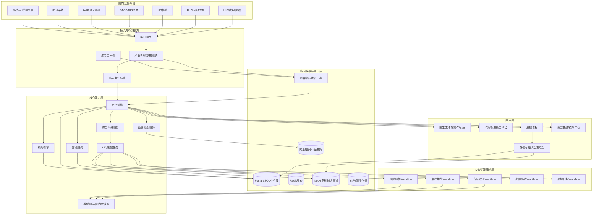

### 3.3 模块边界

| 模块 | 责任 | 不负责 |
|---|---|---|
| 路径引擎 | 患者入径、节点状态、流转、变异、退出、审计 | 复杂自然语言推理 |
| 规则引擎 | 禁忌、危急值、超时、必做项、质控规则 | 自由文本解释 |
| Neo4j图谱服务 | 疾病、症状、检查、治疗、规则、证据关系查询 | 患者主数据存储 |
| Dify编排 | 调用工具、RAG、LLM解释、多步骤智能流程 | 核心状态机、强拦截 |
| 综合评分服务 | 候选专病/方案排序、置信度、解释因子 | 直接替代医生诊断 |
| 证据库服务 | 指南、路径、院内制度、文献条款检索 | 实时规则执行 |
| 质控看板 | 指标统计、趋势、变异复盘 | 临床医嘱下达 |

---

## 4. 综合评分模型可落地算法

### 4.1 适用场景

综合评分用于以下任务：

1. 疑似专病推荐：患者尚未确诊时，召回并排序候选专病。
2. 入径评估：判断患者是否建议进入某条专病路径。
3. 治疗方案推荐：在诊断、分期、分型明确后，对候选治疗方案排序。
4. 风险预警分级：对路径偏离、并发症风险、随访异常进行分级。

### 4.2 总公式

```text
综合评分 = 图谱匹配分 * 0.45
        + 指南/路径证据分 * 0.25
        + 患者特征匹配分 * 0.15
        + LLM语义一致性分 * 0.10
        + 本院历史病例相似度 * 0.05
```

说明：

- 所有分项统一归一化到 0-100。
- 初始权重建议如上，后续通过回顾性数据和专家评审校准。
- 对高风险病种，如急性心肌梗死、脑卒中、感染性休克，宁可提高召回率，降低漏报。
- 对治疗推荐场景，若存在强禁忌证，直接进入“不可推荐/需人工复核”，不再只靠加权分。

### 4.3 数据来源

| 数据类型 | 来源系统 | 用途 |
|---|---|---|
| 基本信息 | HIS/EMR | 年龄、性别、就诊类型、科室 |
| 主诉/现病史 | EMR | 症状、起病时间、持续时间、伴随症状 |
| 既往史 | EMR | 冠心病、糖尿病、高血压、卒中、肿瘤史 |
| 用药/过敏 | HIS/EMR/药学 | 禁忌、相互作用、既往治疗 |
| 生命体征 | 护理/监护 | 血压、心率、氧饱和度、体温 |
| 检验 | LIS | 肌钙蛋白、D-二聚体、血糖、肌酐等 |
| 检查 | PACS/RIS/心电系统 | ECG、CT、超声、影像报告 |
| 病理/基因 | 病理/分子检测 | 肿瘤分型、基因突变 |
| 院内路径 | 路径中心 | 入径、节点、退出、变异 |
| 指南证据 | 证据库/知识库 | 推荐等级、证据等级、条款 |
| 历史病例 | CDR/病案首页 | 相似病例、结局、真实世界表现 |

### 4.4 计算流程

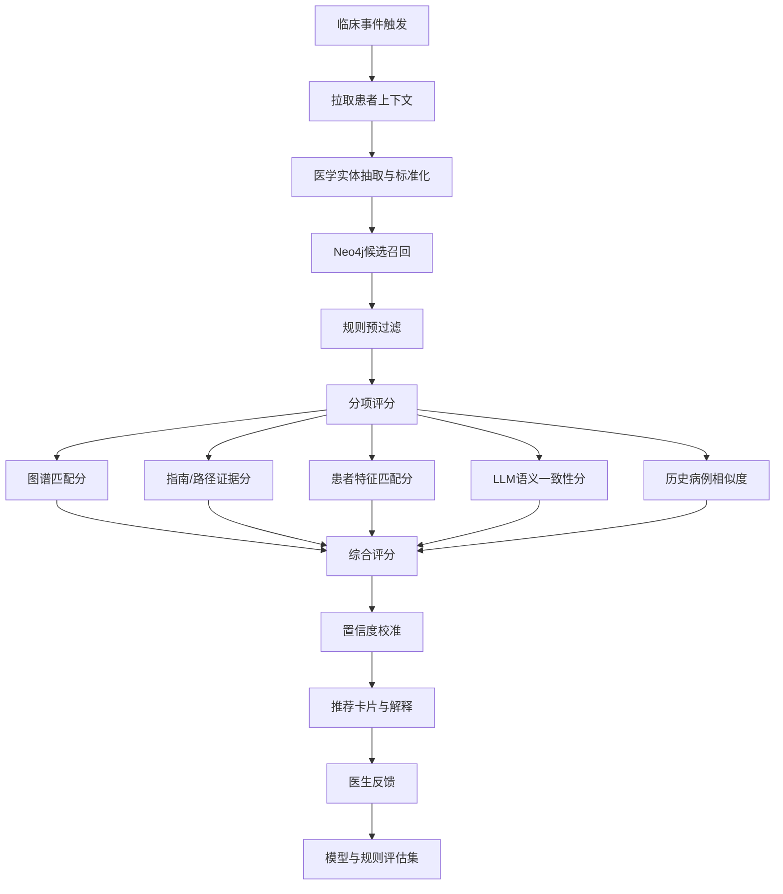

---

## 5. 分项评分设计

### 5.1 图谱匹配分 S_graph

#### 5.1.1 目标

衡量患者事实与疾病/路径/治疗节点在Neo4j中的结构化关系匹配程度。

#### 5.1.2 图谱关系权重示例

| 关系 | 含义 | 默认权重 |
|---|---|---:|
| Disease-[:HAS_CORE_SYMPTOM]->Symptom | 核心症状 | 1.00 |
| Disease-[:HAS_COMMON_SYMPTOM]->Symptom | 常见症状 | 0.65 |
| Disease-[:HAS_RISK_FACTOR]->RiskFactor | 危险因素 | 0.45 |
| Disease-[:HAS_LAB_ABNORMALITY]->LabItem | 异常检验 | 0.80 |
| Disease-[:HAS_EXAM_FINDING]->Finding | 检查发现 | 0.90 |
| Disease-[:REQUIRES_EXAM]->Exam | 必要检查 | 0.50 |
| Disease-[:DIFFERENTIAL_WITH]->Disease | 鉴别诊断 | 0.30 |
| Treatment-[:CONTRAINDICATED_BY]->Condition | 禁忌证 | 强规则，不加权 |

#### 5.1.3 原始得分

```text
raw_graph(d) =
  Σ[患者实体i命中图谱关系r] entity_confidence(i)
    * relation_weight(r)
    * evidence_weight(r)
    * time_decay(i)
    * polarity(i)
```

其中：

- `entity_confidence`：实体抽取可信度，来自NLP/结构化字段，结构化字段通常为1.0，自由文本抽取可为0.6-0.95。
- `relation_weight`：关系临床重要性权重。
- `evidence_weight`：关系来源权重，国家指南/院内专家审核高于普通资料。
- `time_decay`：时间衰减，急性病强调近期事件；慢病强调长期趋势。
- `polarity`：支持证据为正，反对证据为负。

#### 5.1.4 归一化

```text
S_graph(d) = 100 * (1 - exp(-raw_graph(d) / K_d))
```

`K_d` 是病种校准系数，避免症状多的疾病天然得分更高。  
初期可按专家规则设置，后续用历史病例校准。

#### 5.1.5 Neo4j候选召回示例

```cypher
// 输入：症状、异常检验、检查发现、危险因素
MATCH (d:Disease)
OPTIONAL MATCH (d)-[rs:HAS_CORE_SYMPTOM|HAS_COMMON_SYMPTOM]->(s:Symptom)
WHERE s.code IN $symptomCodes
OPTIONAL MATCH (d)-[rl:HAS_LAB_ABNORMALITY]->(l:LabItem)
WHERE l.code IN $abnormalLabCodes
OPTIONAL MATCH (d)-[rf:HAS_RISK_FACTOR]->(risk:RiskFactor)
WHERE risk.code IN $riskFactorCodes
OPTIONAL MATCH (d)-[re:HAS_EXAM_FINDING]->(f:Finding)
WHERE f.code IN $findingCodes
WITH d,
     collect(DISTINCT {type:'symptom', code:s.code, w:coalesce(rs.weight,0)}) AS symptoms,
     collect(DISTINCT {type:'lab', code:l.code, w:coalesce(rl.weight,0)}) AS labs,
     collect(DISTINCT {type:'risk', code:risk.code, w:coalesce(rf.weight,0)}) AS risks,
     collect(DISTINCT {type:'finding', code:f.code, w:coalesce(re.weight,0)}) AS findings
WITH d, symptoms + labs + risks + findings AS hits
WITH d, [x IN hits WHERE x.code IS NOT NULL] AS validHits
RETURN d.code AS diseaseCode,
       d.name AS diseaseName,
       validHits AS graphHits,
       reduce(score = 0.0, x IN validHits | score + x.w) AS rawScore
ORDER BY rawScore DESC
LIMIT 20;
```

### 5.2 指南/路径证据分 S_evidence

#### 5.2.1 目标

衡量候选疾病、路径节点或治疗方案是否被权威指南、国家路径、院内路径和专家审核证据支持。

#### 5.2.2 证据来源权重

| 来源 | 权重 |
|---|---:|
| 国家/卫健委/质控中心文件 | 1.00 |
| 中华医学会/国家级专科指南 | 0.95 |
| 国际权威指南 | 0.90 |
| 院内专家委员会审核路径 | 0.90 |
| 省市级规范/共识 | 0.80 |
| 本院真实世界研究 | 0.70 |
| 普通文献/教材 | 0.50 |

#### 5.2.3 计算公式

```text
S_evidence(x) = 100 * max_over_evidence(
  source_weight
  * recommendation_strength
  * evidence_level
  * version_validity
  * local_approval
)
```

示例取值：

- 推荐强度：I类/强推荐=1.0，IIa=0.85，IIb=0.65，III/不推荐=强规则排除。
- 证据等级：A=1.0，B=0.85，C=0.65，专家共识=0.55。
- 版本有效性：有效=1.0，过期但未替代=0.7，已废止=0。
- 院内审核：已审核=1.0，未审核=0.7，禁止使用=0。

#### 5.2.4 Neo4j证据查询示例

```cypher
MATCH (x {code:$targetCode})<-[:SUPPORTS]-(e:Evidence)-[:FROM_SOURCE]->(src:Source)
WHERE e.status = 'ACTIVE'
RETURN e.id AS evidenceId,
       e.title AS title,
       e.recommendationClass AS recommendationClass,
       e.evidenceLevel AS evidenceLevel,
       src.name AS sourceName,
       src.sourceType AS sourceType,
       src.weight AS sourceWeight,
       e.version AS version,
       e.effectiveDate AS effectiveDate,
       e.expireDate AS expireDate
ORDER BY src.weight DESC, e.effectiveDate DESC
LIMIT 10;
```

### 5.3 患者特征匹配分 S_patient

#### 5.3.1 目标

衡量患者人口学特征、时序特征、基础疾病、生命体征、病情严重程度与候选疾病/路径是否一致。

#### 5.3.2 特征组

| 特征组 | 示例 |
|---|---|
| 人口学 | 年龄、性别、妊娠状态 |
| 时序 | 起病时间、症状持续时间、入院时间、检查完成时间 |
| 合并症 | 糖尿病、高血压、肾功能不全、肿瘤、房颤 |
| 生命体征 | 血压、心率、SpO2、体温 |
| 严重程度 | Killip、GRACE、NIHSS、Caprini等评分 |
| 资源可及性 | 是否具备PCI、溶栓、ICU、MDT、专科床位 |

#### 5.3.3 计算公式

```text
S_patient(d) = 100 * weighted_mean(
  demographic_match,
  temporal_match,
  comorbidity_match,
  severity_match,
  resource_match
)
```

初始权重建议：

| 子项 | 权重 |
|---|---:|
| 时序匹配 | 0.30 |
| 严重程度/评分 | 0.25 |
| 合并症/危险因素 | 0.20 |
| 人口学 | 0.15 |
| 资源可及性 | 0.10 |

### 5.4 LLM语义一致性分 S_llm

#### 5.4.1 目标

LLM不直接做最终诊断，而是在候选集合已由图谱和规则收敛后，判断“患者事实、候选疾病、支持证据、反对证据”之间的语义一致性。

#### 5.4.2 Dify LLM输入约束

LLM输入只能包含：

1. 脱敏后的患者事实。
2. Neo4j召回的候选疾病/方案。
3. 命中的图谱关系。
4. 证据库检索到的证据摘要。
5. 规则引擎命中的风险/禁忌。

禁止LLM自行扩展未经检索的指南结论。输出必须是JSON。

#### 5.4.3 LLM输出格式

```json
{
  "candidate_code": "AMI_STEMI",
  "semantic_score": 88,
  "supporting_facts": [
    {"fact_id": "f001", "text": "胸痛持续2小时"},
    {"fact_id": "f002", "text": "相邻导联ST段抬高"}
  ],
  "opposing_facts": [
    {"fact_id": "f009", "text": "肌钙蛋白首次结果未回报"}
  ],
  "missing_key_facts": [
    "症状起始精确时间",
    "是否存在溶栓禁忌"
  ],
  "reasoning_summary": "候选疾病与急性胸痛、心电图改变高度一致，但仍需结合心肌损伤标志物及医生判断。",
  "safety_flags": [
    "不能作为确诊结论",
    "需医生确认"
  ]
}
```

#### 5.4.4 评分修正

```text
S_llm = clamp(
  semantic_score
  - hallucination_penalty
  - contradiction_penalty
  - missing_data_penalty,
  0, 100
)
```

如果LLM输出出现以下情况，应降权或拒绝：

- 引用了输入中不存在的事实。
- 给出确定性诊断口吻。
- 绕过规则引擎禁忌证。
- 没有返回证据ID或患者事实ID。

### 5.5 本院历史病例相似度 S_local

#### 5.5.1 目标

利用本院真实世界数据，判断当前患者与既往确诊病例、路径完成病例、预后相近病例的相似程度。

#### 5.5.2 计算方法

```text
S_local = 100 * max(similarity(current_case, historical_case_i) * outcome_weight_i)
```

相似度特征：

- 结构化特征：年龄、性别、诊断、检验、生命体征、评分。
- 文本特征：主诉、现病史、检查报告摘要。
- 时间特征：起病到就诊、入院到检查、入院到治疗。
- 结局权重：最终诊断明确、路径完成、结局清楚的病例权重更高。

初期如果历史数据质量不足，该项可固定为50或不启用，并将权重重新分配给前四项。

---

## 6. 综合置信度与解释

### 6.1 分数不等于置信度

综合评分表示“当前证据支持程度”；置信度表示“这个评分是否可靠”。两者应分开输出。

### 6.2 置信度公式

```text
confidence = data_completeness * source_coverage * score_margin
           * evidence_consistency * calibration_factor
```

| 因子 | 含义 |
|---|---|
| data_completeness | 关键数据是否完整，如主诉、核心检验、关键检查 |
| source_coverage | 是否有指南/路径/图谱/规则多源支持 |
| score_margin | 第一候选与第二候选分差 |
| evidence_consistency | 支持证据与反对证据是否一致 |
| calibration_factor | 回顾性验证后的校准因子 |

### 6.3 推荐等级

| 综合评分 | 置信度 | 系统动作 |
|---:|---|---|
| >=85 | 高 | 强提醒医生评估，建议入径/启动路径 |
| 70-84 | 中高 | 推荐候选专病，提示补齐关键资料 |
| 55-69 | 中 | 弱提醒，列为鉴别诊断或观察项 |
| 40-54 | 低 | 后台记录，不主动打扰医生 |
| <40 | 低 | 不推荐 |

高风险场景例外：急性心梗、脑卒中、感染性休克等可降低主动提醒阈值。

### 6.4 推荐卡片

医生看到的不是模型细节，而是一张可审计卡片：

```text
疑似专病：急性ST段抬高型心肌梗死
推荐等级：高
综合评分：90.7
置信度：高

主要支持依据：
1. 胸痛持续2小时，伴出汗。
2. 心电图提示相邻导联ST段抬高。
3. 患者有糖尿病、高血压等危险因素。

反对/不确定因素：
1. 首次肌钙蛋白结果尚未回报。
2. 溶栓禁忌证资料未完整。

建议下一步：
1. 请医生确认是否启动胸痛中心/STEMI路径。
2. 补齐再灌注适应证与禁忌证评估。
3. 若确认入径，进入“再灌注策略评估”节点。

证据来源：
- 院内AMI路径 V1.0
- 心血管专科专家审核规则 R-AMI-001
- ECG图谱关系 KG-ECG-STEMI-003
```

---

## 7. Dify工作流落地设计

### 7.1 Dify定位

Dify作为流程编排和大模型协作层，负责：

- Webhook接收临床事件。
- HTTP请求调用院内服务。
- Code节点做轻量结构化处理。
- 知识检索节点召回指南/院内路径。
- LLM节点生成解释、摘要、随访话术。
- 输出结构化JSON给路径引擎或医生工作站。

Dify不负责：

- 保存患者路径主状态。
- 执行强拦截规则。
- 直接下医嘱。
- 替代医生做确诊。

### 7.2 专病识别Workflow

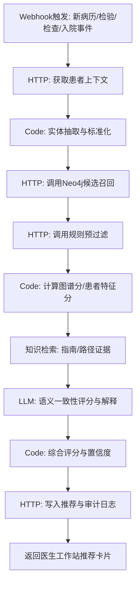

### 7.3 治疗推荐Workflow

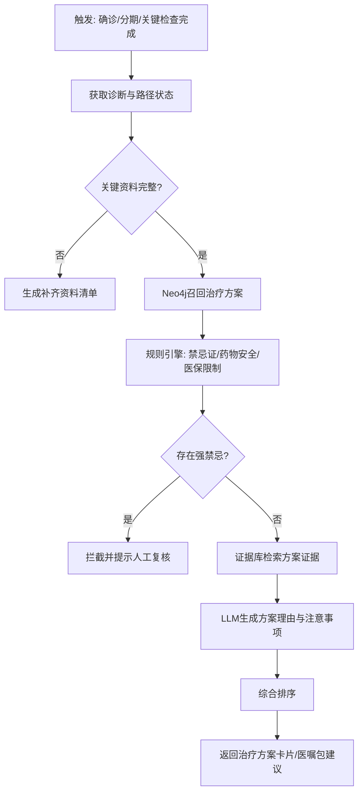

### 7.4 风险预警Workflow

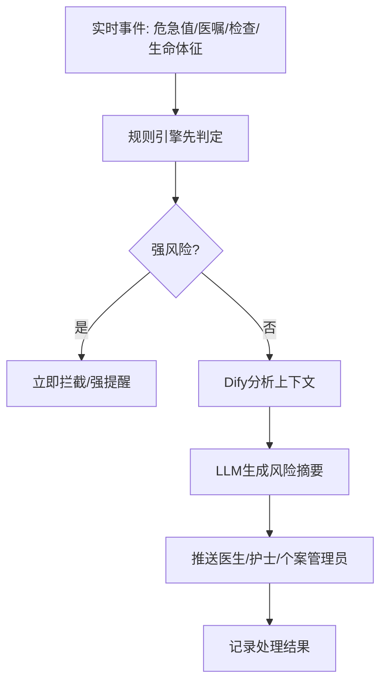

### 7.5 定时触发Workflow

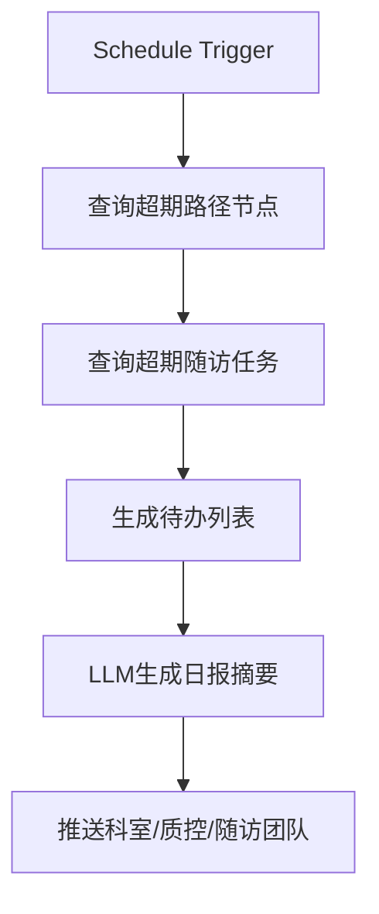

---

## 8. Neo4j知识图谱设计

### 8.1 三层图谱

1. **医学知识图谱**：疾病、症状、检验、检查、药物、治疗、禁忌、证据。
2. **路径图谱**：路径、阶段、节点、节点动作、准入/退出条件、质控指标。
3. **患者状态图谱**：患者当前路径、节点状态、已完成项目、变异、随访任务。

患者完整临床数据建议仍存CDR/业务库，Neo4j保存可推理关系和轻量状态索引。

### 8.2 核心节点

```text
Disease 疾病
Symptom 症状
RiskFactor 危险因素
LabItem 检验项目
Exam 检查项目
Finding 检查发现
Diagnosis 诊断
Stage 分期/分型
RiskScore 风险评分
Treatment 治疗方案
Drug 药品
Procedure 操作/手术
OrderSet 医嘱包
Contraindication 禁忌证
Guideline 指南/共识/院内制度
Evidence 证据条款
QualityIndicator 质控指标
Pathway 临床路径
PathwayStage 路径阶段
PathwayNode 路径节点
Rule 规则
FollowUpPlan 随访计划
PatientPathwayState 患者路径状态索引
```

### 8.3 核心关系

```text
Disease -[:HAS_CORE_SYMPTOM]-> Symptom
Disease -[:HAS_RISK_FACTOR]-> RiskFactor
Disease -[:HAS_LAB_ABNORMALITY]-> LabItem
Disease -[:HAS_EXAM_FINDING]-> Finding
Disease -[:REQUIRES_EXAM]-> Exam
Disease -[:HAS_DIAGNOSIS_CRITERIA]-> Diagnosis
Disease -[:RECOMMENDS_TREATMENT]-> Treatment
Treatment -[:CONTAINS_DRUG]-> Drug
Treatment -[:HAS_CONTRAINDICATION]-> Contraindication
Pathway -[:HAS_STAGE]-> PathwayStage
PathwayStage -[:HAS_NODE]-> PathwayNode
PathwayNode -[:NEXT]-> PathwayNode
PathwayNode -[:REQUIRES]-> LabItem/Exam/RiskScore
PathwayNode -[:TRIGGERS_RULE]-> Rule
Evidence -[:SUPPORTS]-> Disease/Treatment/Rule/PathwayNode
Guideline -[:CONTAINS]-> Evidence
QualityIndicator -[:MEASURES]-> PathwayNode
PatientPathwayState -[:CURRENT_AT]-> PathwayNode
```

### 8.4 AMI候选召回示例

```cypher
MATCH (d:Disease {code:'AMI'})
OPTIONAL MATCH (d)-[srel:HAS_CORE_SYMPTOM|HAS_COMMON_SYMPTOM]->(s:Symptom)
WHERE s.code IN $symptomCodes
OPTIONAL MATCH (d)-[erel:HAS_EXAM_FINDING]->(f:Finding)
WHERE f.code IN $ecgFindingCodes
OPTIONAL MATCH (d)-[lrel:HAS_LAB_ABNORMALITY]->(l:LabItem)
WHERE l.code IN $labCodes
OPTIONAL MATCH (d)-[rrel:HAS_RISK_FACTOR]->(r:RiskFactor)
WHERE r.code IN $riskFactorCodes
RETURN d.code,
       d.name,
       collect(DISTINCT s.name) AS matchedSymptoms,
       collect(DISTINCT f.name) AS matchedFindings,
       collect(DISTINCT l.name) AS matchedLabs,
       collect(DISTINCT r.name) AS matchedRisks;
```

---

## 9. 路径引擎设计

### 9.1 状态机

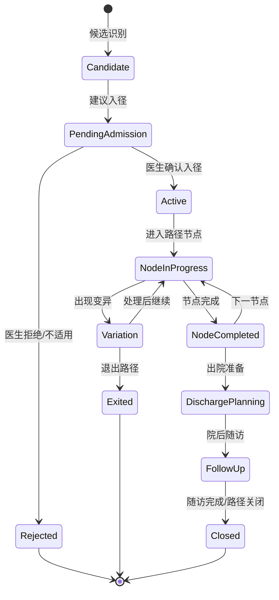

### 9.2 路径节点对象

```json
{
  "node_code": "AMI_REPERFUSION_EVAL",
  "node_name": "再灌注策略评估",
  "stage": "急诊/入院早期",
  "entry_condition": {
    "diagnosis": ["STEMI疑似", "STEMI确诊"],
    "onset_time_required": true
  },
  "required_actions": [
    "评估PCI可及性",
    "评估溶栓适应证/禁忌证",
    "完成抗栓治疗风险评估"
  ],
  "rules": [
    "R_AMI_REPERFUSION_TIMEOUT",
    "R_AMI_THROMBOLYSIS_CONTRA"
  ],
  "quality_indicators": [
    "QI_AMI_ECG_TIMELY",
    "QI_AMI_REPERFUSION_EVAL"
  ],
  "exit_condition": [
    "已完成再灌注策略确认",
    "医生记录不适合再灌注原因"
  ]
}
```

---

## 10. 规则引擎设计

### 10.1 规则分类

| 分类 | 示例 | 处理方式 |
|---|---|---|
| 强拦截 | 明确禁忌证仍推荐某治疗 | 拦截，需人工复核 |
| 强提醒 | 疑似STEMI未启动再灌注评估 | 弹窗/待办/推送 |
| 弱提醒 | 路径节点资料不完整 | 工作台提示 |
| 质控规则 | 心电图、再灌注、出院二级预防等 | 看板统计 |
| 随访规则 | 随访超期、异常结果回流 | 待办/推送 |

### 10.2 规则执行流程

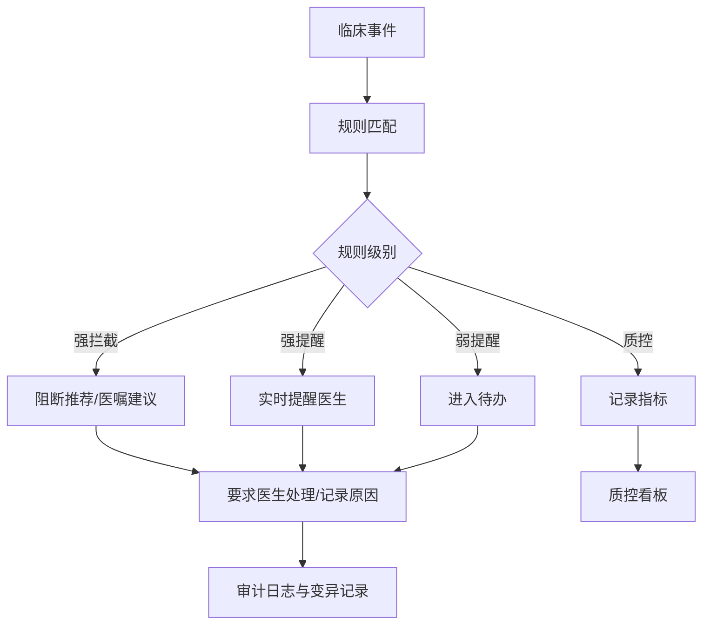

### 10.3 规则DSL示例

```json
{
  "rule_code": "R_AMI_ECG_TIMELY",
  "rule_name": "疑似急性冠脉综合征心电图超时提醒",
  "disease_scope": ["AMI", "ACS"],
  "trigger_event": ["ARRIVAL", "TRIAGE", "CHIEF_COMPLAINT_UPDATED"],
  "condition": {
    "all": [
      {"field": "chief_complaint", "contains_any": ["胸痛", "胸闷", "心前区痛"]},
      {"field": "ecg.completed", "equals": false},
      {"field": "arrival_minutes", "gte": 10}
    ]
  },
  "severity": "HIGH_ALERT",
  "action": {
    "type": "PUSH_CARD",
    "target": ["ER_DOCTOR", "CHEST_PAIN_NURSE"],
    "message": "疑似ACS患者尚未完成心电图，请评估是否启动胸痛流程。"
  },
  "audit_required": true
}
```

---

## 11. 接口设计

### 11.1 临床事件标准对象

```json
{
  "event_id": "evt_202605120001",
  "event_type": "LAB_RESULTED",
  "event_time": "2026-05-12T10:20:00+08:00",
  "patient_id": "P123456",
  "encounter_id": "E987654",
  "source_system": "LIS",
  "payload": {
    "item_code": "TROPONIN_I",
    "item_name": "肌钙蛋白I",
    "value": "1.24",
    "unit": "ng/mL",
    "abnormal_flag": "HIGH"
  }
}
```

### 11.2 核心服务API

| API | 方法 | 用途 |
|---|---|---|
| `/api/context/{patientId}` | GET | 获取患者上下文 |
| `/api/pathway/candidates` | POST | 候选专病召回与评分 |
| `/api/pathway/admission` | POST | 入径确认/拒绝 |
| `/api/pathway/state` | GET | 查询患者路径状态 |
| `/api/pathway/node/complete` | POST | 完成节点 |
| `/api/rules/evaluate` | POST | 规则执行 |
| `/api/kg/query` | POST | Neo4j图谱查询 |
| `/api/evidence/search` | POST | 指南/路径证据检索 |
| `/api/recommendations` | POST | 写入推荐卡片 |
| `/api/recommendations/{id}/feedback` | POST | 医生反馈 |
| `/api/followup/tasks` | POST | 生成随访任务 |
| `/api/quality/metrics` | GET | 质控指标查询 |

### 11.3 推荐结果对象

```json
{
  "recommendation_id": "rec_001",
  "patient_id": "P123456",
  "encounter_id": "E987654",
  "scenario": "DISEASE_CANDIDATE",
  "target_code": "AMI_STEMI",
  "target_name": "急性ST段抬高型心肌梗死",
  "score": 90.7,
  "confidence": "HIGH",
  "action_level": "STRONG_ALERT",
  "supporting_facts": [
    {"fact_id": "f001", "source": "EMR", "text": "胸痛持续2小时"},
    {"fact_id": "f002", "source": "ECG", "text": "相邻导联ST段抬高"}
  ],
  "missing_facts": ["溶栓禁忌证评估", "首次肌钙蛋白结果"],
  "evidence_refs": ["EV_AMI_001", "PATH_AMI_V1_NODE_02"],
  "suggested_next_actions": [
    "请医生确认是否启动AMI路径",
    "补齐再灌注适应证与禁忌证评估"
  ],
  "model_trace": {
    "workflow_id": "dify_ami_candidate_v1",
    "model": "hospital-llm",
    "prompt_version": "p_ami_001",
    "kg_version": "kg_2026_05",
    "pathway_version": "AMI_V1.0"
  }
}
```

---

## 12. 数据库设计

### 12.1 业务库核心表

| 表 | 说明 |
|---|---|
| `pathway_definition` | 路径定义 |
| `pathway_version` | 路径版本 |
| `pathway_stage` | 路径阶段 |
| `pathway_node` | 路径节点 |
| `pathway_transition` | 节点流转 |
| `pathway_rule_binding` | 路径节点与规则绑定 |
| `patient_pathway_instance` | 患者路径实例 |
| `patient_pathway_node_state` | 患者节点状态 |
| `recommendation_record` | 推荐记录 |
| `recommendation_feedback` | 医生反馈 |
| `variation_record` | 变异记录 |
| `rule_definition` | 规则定义 |
| `rule_execution_log` | 规则执行日志 |
| `alert_event` | 预警事件 |
| `followup_plan` | 随访计划 |
| `followup_task` | 随访任务 |
| `quality_metric_definition` | 质控指标定义 |
| `quality_metric_snapshot` | 指标快照 |
| `knowledge_version` | 知识版本 |
| `model_run_log` | 模型运行日志 |
| `audit_log` | 操作审计 |

### 12.2 患者路径实例表

```sql
CREATE TABLE patient_pathway_instance (
  id BIGSERIAL PRIMARY KEY,
  patient_id VARCHAR(64) NOT NULL,
  encounter_id VARCHAR(64) NOT NULL,
  pathway_code VARCHAR(64) NOT NULL,
  pathway_version VARCHAR(32) NOT NULL,
  status VARCHAR(32) NOT NULL,
  current_node_code VARCHAR(64),
  admission_time TIMESTAMP,
  admitted_by VARCHAR(64),
  exit_time TIMESTAMP,
  exit_reason TEXT,
  created_at TIMESTAMP NOT NULL DEFAULT now(),
  updated_at TIMESTAMP NOT NULL DEFAULT now()
);
```

### 12.3 推荐反馈表

```sql
CREATE TABLE recommendation_feedback (
  id BIGSERIAL PRIMARY KEY,
  recommendation_id VARCHAR(64) NOT NULL,
  doctor_id VARCHAR(64) NOT NULL,
  action VARCHAR(32) NOT NULL, -- ACCEPTED / IGNORED / MODIFIED / REJECTED
  override_reason TEXT,
  feedback_time TIMESTAMP NOT NULL DEFAULT now()
);
```

---

## 13. 部署架构

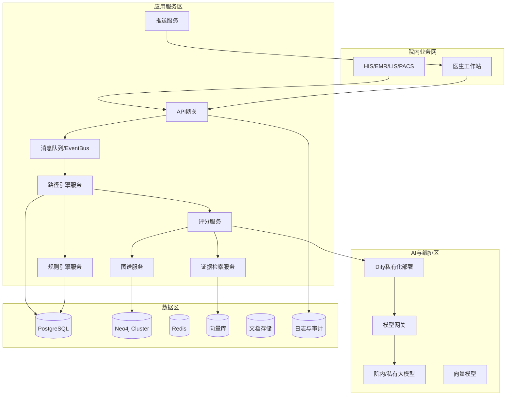

### 13.1 部署建议

| 组件 | 建议 |
|---|---|
| Dify | 院内私有化部署，区分测试/生产工作区 |
| Neo4j | 生产建议集群或主从备份，开启定期备份 |
| PostgreSQL | 保存路径状态、规则、推荐、反馈、审计 |
| Redis | 缓存患者上下文、规则结果、短期会话 |
| 消息队列 | Kafka/RabbitMQ/RocketMQ均可，保障事件解耦 |
| 模型网关 | 统一管理模型调用、脱敏、限流、日志 |
| 监控 | Prometheus/Grafana/ELK或院内统一监控平台 |

### 13.2 安全与合规

1. 数据最小化：Dify和LLM只接收完成任务所需字段。
2. 脱敏：患者姓名、身份证、电话等非必要身份信息不进入LLM。
3. 权限：按角色、科室、患者授权范围控制访问。
4. 审计：所有推荐、规则、医生反馈、模型输入输出均留痕。
5. 版本：路径版本、规则版本、知识图谱版本、提示词版本、模型版本可追溯。
6. 人工确认：所有诊断和治疗推荐必须由医生确认。
7. 监管边界：若产品定位从“院内质控/辅助参考”升级到“辅助诊断/辅助治疗产品”，需纳入医疗器械软件和AI医疗器械相关合规评估。

---

## 14. 质控闭环

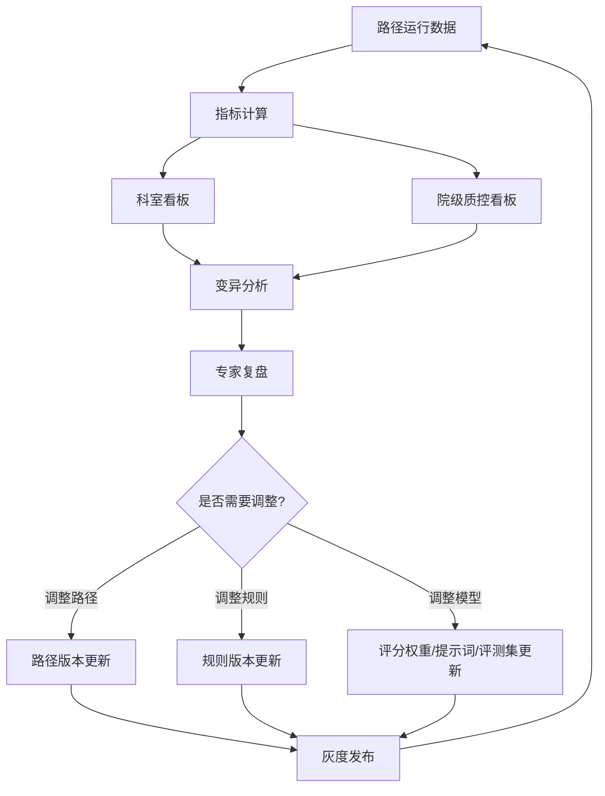

### 14.1 核心指标

| 维度 | 指标 |
|---|---|
| 路径执行 | 入径率、完成率、退出率、变异率、节点超时率 |
| 质量安全 | 危急值响应率、禁忌拦截率、漏提醒率、误提醒率 |
| 临床效率 | 平均住院日、检查等待时间、治疗启动时间 |
| 费用管理 | 次均费用、药耗占比、DRG/DIP偏差 |
| 医生体验 | 推荐采纳率、忽略率、关闭原因、平均处理时长 |
| 随访 | 随访完成率、异常回流率、再入院率 |
| 知识治理 | 路径更新周期、证据覆盖率、专家审核通过率 |

---

## 15. 急性心肌梗死AMI路径落地样例

### 15.1 选择AMI作为首批病种的原因

1. 急性、高风险、时间敏感，适合事件驱动和实时预警。
2. 胸痛中心、再灌注流程、心电图、肌钙蛋白、抗栓治疗等路径节点明确。
3. 质控指标清晰，便于评价系统价值。
4. 检验、心电、医嘱、介入、出院随访等多系统协同，能验证平台集成能力。

### 15.2 AMI路径阶段

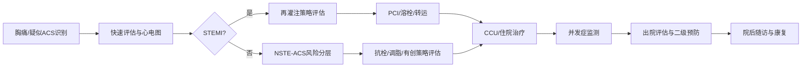

### 15.3 AMI核心触发事件

| 事件 | 触发动作 |
|---|---|
| 急诊到达/挂号 | 识别胸痛、胸闷、呼吸困难、上腹痛等疑似ACS表现 |
| 主诉/病历更新 | Dify专病识别Workflow |
| 心电图完成 | 判断是否命中STEMI/缺血性改变相关图谱关系 |
| 肌钙蛋白回报 | 触发AMI/NSTE-ACS风险评估 |
| STEMI诊断录入 | 进入再灌注策略评估节点 |
| PCI医嘱/介入记录 | 更新节点状态和时间指标 |
| 抗栓/抗凝/他汀医嘱 | 药物安全与路径完成检查 |
| 出院医嘱 | 二级预防与随访计划检查 |
| 随访时间到达 | Dify定时触发随访Workflow |

### 15.4 AMI候选识别评分示例

患者事实：

```text
男性，62岁。
主诉：胸痛2小时，伴大汗。
既往：高血压、糖尿病。
心电图：相邻导联ST段抬高。
肌钙蛋白：首次结果未回报。
```

分项评分：

| 分项 | 得分 | 理由 |
|---|---:|---|
| 图谱匹配分 | 92 | 胸痛、出汗、ST段抬高、高血压、糖尿病均命中AMI/STEMI图谱关系 |
| 指南/路径证据分 | 95 | 命中院内AMI路径和心血管专科审核证据 |
| 患者特征匹配分 | 90 | 年龄、危险因素、急性起病、症状持续时间高度匹配 |
| LLM语义一致性分 | 88 | 患者事实与候选疾病高度一致，但肌钙蛋白未回报 |
| 本院历史病例相似度 | 70 | 与既往胸痛中心确诊STEMI病例相似 |

```text
综合评分 = 92*0.45 + 95*0.25 + 90*0.15 + 88*0.10 + 70*0.05
        = 90.95
```

输出：

```text
候选专病：急性ST段抬高型心肌梗死
推荐等级：高
置信度：高
建议：请医生确认是否启动AMI/STEMI路径，并补齐再灌注适应证与禁忌证评估。
```

### 15.5 AMI路径节点设计

| 阶段 | 节点 | 系统动作 |
|---|---|---|
| 识别 | 疑似ACS识别 | 胸痛关键词、危险因素、ECG/LIS事件触发 |
| 评估 | 心电图与生命体征 | 超时提醒、检查结果回流 |
| 分型 | STEMI/NSTE-ACS/非ACS | 候选分型推荐，医生确认 |
| 治疗 | 再灌注策略评估 | PCI/溶栓/转运可及性与禁忌评估 |
| 住院 | 抗栓、调脂、并发症监测 | 禁忌、相互作用、肾功能、出血风险 |
| 出院 | 二级预防与康复 | 出院用药、生活方式、康复、复诊计划 |
| 随访 | 院后随访 | 症状、用药依从性、复查、再入院风险 |

### 15.6 AMI规则示例

| 规则 | 级别 | 触发 |
|---|---|---|
| 疑似ACS未及时完成心电图 | 强提醒 | 急诊到达后达到院内设定阈值仍无ECG |
| STEMI疑似但未进入再灌注评估 | 强提醒 | ECG命中STEMI相关发现 |
| 存在溶栓禁忌仍推荐溶栓 | 强拦截 | 禁忌证命中 |
| 肌钙蛋白危急/显著异常未处理 | 强提醒 | LIS异常回报 |
| 出院缺少二级预防评估 | 弱提醒/质控 | 出院医嘱阶段 |
| 随访超期 | 弱提醒 | 定时任务扫描 |

### 15.7 AMI推荐卡片

```text
标题：疑似急性心肌梗死，请评估是否启动AMI路径

推荐等级：高
综合评分：90.95
置信度：高

支持依据：
- 胸痛2小时，伴大汗。
- ECG提示相邻导联ST段抬高。
- 既往高血压、糖尿病。

需要补齐：
- 肌钙蛋白结果。
- 再灌注适应证/禁忌证。
- 出血风险、肾功能、过敏史。

建议动作：
1. 医生确认是否入径。
2. 若入径，进入再灌注策略评估节点。
3. 系统同步生成胸痛中心质控时间轴。

医生操作：
[确认入径] [暂不入径] [记录变异原因] [查看证据]
```

---

## 16. 实施路线

### 16.1 MVP，8-12周

1. 选择AMI作为试点路径。
2. 打通HIS/EMR/LIS/ECG或PACS关键数据。
3. 建立AMI基础知识图谱。
4. 实现候选识别、入径确认、路径状态、规则提醒。
5. 配置Dify专病识别Workflow和质控日报Workflow。
6. 上线医生推荐卡片和质控看板基础版。

### 16.2 第二阶段，3-6个月

1. 扩展脑梗死、VTE、糖尿病、心肌病等路径。
2. 建立通用路径模板、节点模板、规则模板。
3. 接入随访系统和患者触达渠道。
4. 建立医生反馈闭环和回顾性评测集。

### 16.3 第三阶段，6-12个月

1. 多病种质控闭环。
2. 引入真实世界数据分析和路径优化。
3. 完善模型校准、灰度发布、A/B评估。
4. 视产品定位开展医疗器械软件/AI医疗器械合规评估。

---

## 17. 项目验收标准

| 类别 | 验收标准 |
|---|---|
| 数据接入 | AMI关键事件稳定接入，延迟满足院内要求 |
| 路径执行 | 可完成入径、节点流转、变异、退出、随访 |
| 智能推荐 | 候选专病推荐可解释，有证据、有置信度 |
| 规则提醒 | 高风险规则可实时触发并留痕 |
| 医生反馈 | 支持采纳、忽略、修改、变异原因 |
| 质控看板 | 展示入径率、完成率、节点超时率、变异率 |
| 安全审计 | 模型输入输出、规则命中、医生操作可追溯 |
| 专家治理 | 路径、规则、证据、模型提示词可版本化审核 |

---

## 18. 关键结论

建议采用以下最终架构：

```text
以路径引擎管理患者状态，
以规则引擎保障安全底线，
以Neo4j承载权威医学关系，
以Dify编排智能分析流程，
以大模型生成可读解释，
以医生工作站完成临床闭环，
以质控看板推动持续改进。
```

这比单纯“大模型诊疗助手”更适合中国医院真实临床环境，也更容易被医务、质控、信息、安全和临床专家共同接受。

---

## 19. 参考来源

1. 国家卫生健康委员会：《医疗机构临床路径管理指导原则》解读  
   https://www.nhc.gov.cn/zwgk/jdjd/201709/e717bffb5fc445bcb4fa99e7063755c8.shtml

2. 国家卫生健康委员会：《临床路径管理指导原则（试行）》  
   https://www.nhc.gov.cn/zwgk/wtwj/201304/dde4228b3e0f4077937a1d5ca26641dd.shtml

3. HL7 Clinical Practice Guidelines Implementation Guide，CPG-on-FHIR  
   https://www.hl7.org/fhir/uv/cpg/

4. HL7 CDS Hooks 2.0  
   https://hl7.github.io/cds-hooks-hl7-site/2.0/

5. Dify Webhook Trigger 文档  
   https://docs.dify.ai/zh/use-dify/nodes/trigger/webhook-trigger

6. Dify Workflow Trigger 文档  
   https://docs.dify.ai/en/guides/workflow/node/trigger

7. 医疗器械软件注册审查指导原则（2022年修订版）  
   https://docs.team-ra.org/zh/nmpa/guidance/cmde-2022-9

8. 人工智能医疗器械注册审查指导原则相关发布信息  
   https://www.chima.org.cn/Html/News/Articles/12573.html

