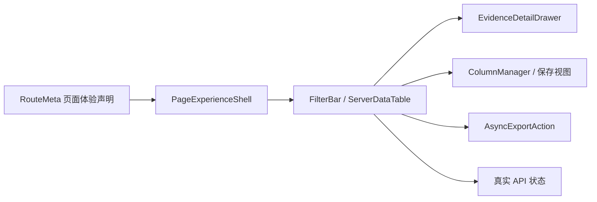

# GA-ENG-BASE-08 产品体验底座设计

> 日期：2026-05-26  
> 状态：已确认设计，待实施计划  
> 对应任务：`GA-ENG-BASE-08 产品体验底座`  
> 范围：一页一目标、角色默认视图、专家模式、服务端分页、详情抽屉、异步导出、保存视图

## 1. 背景

当前基础底座任务中，`GA-ENG-BASE-01` 至 `GA-ENG-BASE-07`、`GA-ENG-BASE-09`、`GA-ENG-BASE-10` 已完成或收口，剩余的 `GA-ENG-BASE-08` 是后续 E2 引擎接口页面化、E3 引擎执行页面化前必须补齐的公共体验能力。

现有前端已经具备以下基础：

| 已有能力 | 现状 |
|---|---|
| 5+1 菜单 | `routes.ts` 与 `menu.ts` 已作为路由、菜单、面包屑的单一事实源 |
| 通用页骨架 | `PageShell` 已约束标题、描述、主按钮和辅助动作 |
| 六态 | `PageState` 已覆盖加载、空、错误、无权限、部分成功、正常等状态 |
| 列管理 | `ColumnManager` 已提供列显示控制和受控 UI 偏好存储 |
| 真实样板接口 | 字典映射 API 已支持服务端分页，前端 `TerminologyMapping` 已接入真实查询 |
| 权限画像 | `/security/me` 已供前端判断菜单、按钮和专家模式可见性 |

但当前仍缺少一层“默认合规”的产品体验底座：页面体验声明没有沉入路由元数据，详情抽屉、专家模式、保存视图、异步导出和服务端分页表格仍容易被各页面重复实现。若继续直接开发 E2/E3 页面，会导致列表页、审核页、配置页的交互和安全边界发散。

## 2. 目标

本任务采用“公共底座 + 1 个真实样板页”的策略。

| 目标 | 说明 |
|---|---|
| 公共体验声明 | 在路由元数据中声明主要角色、页面主目标、默认视图、默认筛选、专家模式内容、打扰级别、证据入口和大规模数据处理方式 |
| 公共组件沉淀 | 在 `shared/ui` 中沉淀体验页骨架、筛选栏、服务端分页表格、详情抽屉、专家模式和异步导出动作 |
| 真实样板页验证 | 以“字典映射”作为唯一真实样板页，接现有真实分页 API，验证筛选、分页、详情、保存视图和导出入口 |
| 默认体验门禁 | 新增测试，阻断客户可见页面缺体验声明、默认筛选超过 3 个、专家内容默认暴露等问题 |
| 中文文档同步 | 更新 `frontend/README.md` 与 `docs/backlog.md`，用中文说明验收结果 |

## 3. 非目标

| 非目标 | 原因 |
|---|---|
| 一次性迁移 30 个页面 | 范围过大，容易把公共底座和业务页面迁移混在一起 |
| 新增业务闭环或 mock 数据 | 当前任务是体验底座，不应伪造临床、质控或规则执行完成 |
| 重写现有布局和菜单 | 现有 5+1 菜单、`PageShell`、`PageState` 已符合宪法方向，应复用和增强 |
| 新增后端导出接口 | 后端已有知识异步导出样例；本任务只提供前端统一入口和禁用态策略 |
| 完成所有 E2 引擎页面 | E2/E3 后续任务复用本底座逐步上线 |

## 4. 推荐方案

推荐方案是 **B：公共底座 + 1 个真实样板页**。

对比三种方案：

| 方案 | 优点 | 风险 | 结论 |
|---|---|---|---|
| A 公共底座优先 | 抽象纯粹、代码改动小 | 缺少真实页面验证，容易成为空组件 | 不采用 |
| B 公共底座 + 字典映射样板页 | 公共能力可复用，样板页接真实 API，可验收 | 只覆盖一个页面，需要后续分批迁移 | 采用 |
| C 公共底座 + 多页面迁移 | 表面成效明显 | 范围大、回归面宽、容易引入假闭环 | 不采用 |

选择 B 的原因：`GA-ENG-BASE-08` 是所有后续引擎页面的地基，必须先把规范沉入可复用能力；同时需要一个真实页面证明底座不是纸面抽象。“字典映射”已接真实服务端分页接口，业务风险低，最适合作为第一块样板。

## 5. 架构设计

### 5.1 分层



| 层 | 职责 |
|---|---|
| 路由元数据层 | 继续作为路由、菜单、面包屑、权限和页面体验声明的单一事实源 |
| 公共体验层 | 将一页一目标、角色默认视图、证据入口、专家模式和主动作约束沉入公共组件 |
| 数据展示层 | 统一服务端分页、默认筛选、排序、列管理、选择本页和详情打开 |
| 详情与证据层 | 用右侧详情抽屉展示摘要、来源、版本、影响、审计和专家技术详情 |
| 样板页面层 | 字典映射页面接真实 API 验证上述能力 |

### 5.2 路由体验声明

`RouteMeta` 增加可选的 `experience` 字段。所有有菜单入口的认证页面必须配置，包含面向专家角色的高级工具。可测试判定为：`requireAuth === true` 且存在 `menuKey` 的路由均必须配置；登录、404 和没有菜单入口的内部跳转页可以豁免。

建议类型：

```ts
type InterruptionLevel = "none" | "info" | "weak" | "strong";
type PageRiskLevel = "low" | "medium" | "high";

interface RouteExperience {
  primaryRole: string;
  goal: string;
  defaultView: string;
  defaultFilters: ExperienceFilterDefinition[];
  expertContent: string[];
  interruptionLevel: InterruptionLevel;
  evidence: string;
  dataScale: {
    expected: "small" | "large" | "massive";
    pagination: "page" | "cursor";
    exportStrategy: "none" | "disabled" | "async";
  };
  riskLevel: PageRiskLevel;
}
```

字段说明：

| 字段 | 含义 |
|---|---|
| `primaryRole` | 主要使用角色，例如“实施工程师”“信息科”“质控办” |
| `goal` | 页面唯一主目标，用业务语言描述 |
| `defaultView` | 默认视图，例如“待我处理”“高风险”“最近更新”“生效中” |
| `defaultFilters` | 默认筛选项，最多 3 个 |
| `expertContent` | 专家模式才展示的内容，例如 trace、原始字段、DSL、图谱 |
| `interruptionLevel` | 打扰级别：不打断、信息提示、弱打断、强打断 |
| `evidence` | 证据入口说明，例如来源、版本、审计、导出 |
| `dataScale` | 数据规模、分页类型和导出策略 |
| `riskLevel` | 页面风险等级，辅助决定确认、禁用和审计提示 |

验收规则：

1. 客户可见页面缺 `experience` 时测试失败。
2. `defaultFilters.length > 3` 时测试失败。
3. `expertContent` 不得默认出现在普通首屏。
4. `dataScale.expected` 为 `large` 或 `massive` 时，必须声明分页类型；导出策略不能缺省。
5. 路由元数据仍是菜单、面包屑和页面体验的单一事实源。

## 6. 组件设计

### 6.1 PageExperienceShell

`PageExperienceShell` 包装现有 `PageShell`，不替代它。

外部接口：

```ts
interface PageExperienceShellProps {
  meta: RouteMeta & { experience: RouteExperience };
  securityProfile?: SecurityProfile;
  primary?: React.ReactNode;
  extras?: React.ReactNode;
  expertMode?: boolean;
  onExpertModeChange?: (enabled: boolean) => void;
  children: React.ReactNode;
}
```

职责：

| 能力 | 行为 |
|---|---|
| 页面主目标 | 在标题下方展示清楚的业务目标，不使用技术语言 |
| 角色默认视图 | 展示主要角色和当前组织范围摘要，避免页面不知道给谁用 |
| 主按钮约束 | 保持每页最多 1 个主按钮，其它动作进入次按钮、菜单或抽屉 |
| 证据入口 | 在统一位置提供证据或审计入口 |
| 专家模式入口 | 只有具备权限画像或页面允许时展示专家模式开关 |
| 事件 | 只抛出 `onExpertModeChange`，不直接改变业务数据 |

### 6.2 ExperienceFilterBar

统一默认筛选展示。

外部接口：

```ts
interface ExperienceFilterOption {
  label: string;
  value: string;
}

interface ExperienceFilterDefinition {
  key: string;
  label: string;
  kind: "select" | "dateRange" | "search";
  placeholder?: string;
  options?: ExperienceFilterOption[];
  optionSource?: "static" | "api" | "routeMeta";
  apiPath?: string;
}

interface ExperienceFilterValue {
  key: string;
  value: string | [string, string] | undefined;
}

interface ExperienceFilterBarProps {
  filters: ExperienceFilterDefinition[];
  value: ExperienceFilterValue[];
  advanced?: React.ReactNode;
  renderFilter?: (filter: ExperienceFilterDefinition) => React.ReactNode;
  onChange: (next: ExperienceFilterValue[]) => void;
  onSaveView?: () => void;
}
```

规则：

| 规则 | 标准 |
|---|---|
| 默认筛选 | 最多 3 个 |
| 选择项来源 | `select` 类筛选必须提供静态 `options`、受控 `apiPath` 或自定义 `renderFilter` |
| 占位文案 | 每个筛选必须有中文 `placeholder` 或由组件按 `label` 生成“请选择/请输入”文案 |
| 高级筛选 | 超过 3 个进入折叠区域或抽屉 |
| 筛选状态 | 改变筛选后触发服务端查询，不前端全量过滤 |
| 保存视图 | 当前筛选、排序、分页、列配置和专家模式状态按 `ExperienceViewSnapshot` 保存 |

### 6.3 ServerDataTable

统一列表页的数据展示和分页行为。

公共底座不直接固化某个后端字段名，而是先归一化为前端体验契约。权威详细规范要求的分页字段为 `page_size`、`page_token` 或 `page_number`、`sort_by`、`sort_order`、`filters`，返回 `items`、`next_page_token`、`total_estimate`、`has_more`、`trace_id`。当前后端公共类 `PageResponse` 暂为 `page`、`size`、`total`、`hasNext`、`totalEstimated`；本任务通过适配器兼容当前实现，不把旧字段扩散到页面组件。

归一化接口：

```ts
interface ExperiencePageRequest {
  pageNumber?: number;
  pageSize: 20 | 50 | 100;
  pageToken?: string;
  sortBy?: string;
  sortOrder?: "asc" | "desc";
  filters: Record<string, unknown>;
}

interface ExperiencePageResponse<T> {
  items: T[];
  pageNumber?: number;
  pageSize: number;
  nextPageToken?: string | null;
  totalEstimate: number;
  hasMore: boolean;
  traceId?: string;
}

type ExperienceColumn<T> = {
  key: string;
  title: string;
  dataIndex?: keyof T;
  width?: number;
  always?: boolean;
  expertOnly?: boolean;
  render?: (value: unknown, record: T) => React.ReactNode;
};

interface ExperiencePartialResult {
  successCount: number;
  failureCount: number;
  failures: Array<{
    key: string;
    reason: string;
    retryable: boolean;
  }>;
  onRetryFailures?: () => void;
}

interface ServerDataTableProps<T> {
  rowKey: keyof T | ((record: T) => React.Key);
  columns: Array<ExperienceColumn<T>>;
  query: ExperiencePageResponse<T>;
  loading: boolean;
  error?: Error;
  partial?: ExperiencePartialResult;
  selectedRowKey?: React.Key;
  onRequestChange: (request: ExperiencePageRequest) => void;
  onOpenDetail: (record: T) => void;
}
```

能力：

| 能力 | 行为 |
|---|---|
| 服务端分页 | 页面组件使用 `ExperiencePageRequest/Response`，适配器负责映射到当前后端 `PageResponse` 或未来游标分页 |
| 默认列 | 客户可见列默认不超过 8 个 |
| 列管理 | 复用 `ColumnManager`，保存列可见性 |
| 详情打开 | 点击“查看”或行操作打开右侧详情抽屉，不刷新列表 |
| 六态 | 将查询状态映射到 `PageState`；部分成功必须展示成功数、失败数、失败原因和重试入口 |
| traceId | 错误或详情中保留 traceId 展示位 |

### 6.4 EvidenceDetailDrawer

统一详情抽屉。

外部接口：

```ts
interface EvidenceDetailSection {
  key: string;
  title: string;
  items: Array<{ label: string; value: React.ReactNode; expertOnly?: boolean }>;
}

interface EvidenceDetailDrawerProps<T> {
  open: boolean;
  title: string;
  record?: T;
  loading?: boolean;
  error?: Error;
  expertMode: boolean;
  sections: EvidenceDetailSection[];
  traceId?: string;
  onClose: () => void;
  onRetry?: () => void;
}
```

普通模式展示：

| 区域 | 内容 |
|---|---|
| 摘要 | 当前对象的业务名称、状态、风险等级和下一步动作 |
| 来源 | 来源系统、标准编码、版本或更新时间 |
| 影响 | 影响组织、科室、患者或业务范围 |
| 证据 | 审计摘要、确认人、确认时间和导出入口 |

专家模式展示：

| 区域 | 内容 |
|---|---|
| 原始字段 | ID、traceId、原始状态、接口字段 |
| 技术说明 | 仅专家可见的调试信息 |
| 限制 | 不展示患者隐私明细，不展示模型提示词，不改变业务状态 |

### 6.5 AsyncExportAction

统一异步导出入口。

外部接口：

```ts
type ExportJobStatus =
  | "pending"
  | "running"
  | "succeeded"
  | "failed"
  | "expired"
  | "disabled"
  | "forbidden";

interface AsyncExportRequest {
  resourceType: string;
  requestSnapshot: ExperienceViewSnapshot;
  selectedScope: "currentPage" | "filteredResult";
  selectionSnapshot?: {
    selectedRowKeys: React.Key[];
    rowCount: number;
  };
  reason: string;
}

interface AsyncExportJob {
  jobId: string;
  status: ExportJobStatus;
  submittedAt: string;
  submittedBy: string;
  traceId?: string;
  auditId?: string;
  downloadUrl?: string;
  failureReason?: string;
}

interface AsyncExportActionProps {
  enabled: boolean;
  disabledReason?: string;
  permissionGranted: boolean;
  onSubmit?: (request: AsyncExportRequest) => Promise<AsyncExportJob>;
  onPoll?: (jobId: string) => Promise<AsyncExportJob>;
}
```

规则：

| 场景 | 行为 |
|---|---|
| 已有真实导出接口 | 提交导出任务，立即返回 `jobId`、`status`、`traceId` 和审计标识；通过轮询或通知更新状态 |
| 暂无导出接口 | 按受控禁用态展示原因，不伪造完成 |
| 大范围导出 | 必须任务化并留审计，禁止阻塞页面 |
| 权限不足 | 按权限态隐藏或禁用，不泄露导出条件 |
| 失败重试 | 失败态展示中文原因、traceId 和重试入口；重试必须复用原筛选条件并生成新的审计记录 |
| 审批字段 | 高风险或大范围导出必须携带导出原因；未来接审批流时以 `reason` 和 `auditId` 对接 |
| 快照审计 | `requestSnapshot` 必须记录筛选、排序、分页页码或游标、页大小、列配置和专家模式状态；`selectionSnapshot` 记录当前页选择范围 |

### 6.6 视图与审计快照

保存视图和异步导出复用同一个 UI 状态快照，避免“用户看到的列表”和“系统导出的范围”无法复现。

```ts
interface ExperienceViewSnapshot {
  viewKey: string;
  filters: ExperienceFilterValue[];
  pageRequest: ExperiencePageRequest;
  visibleColumnKeys: string[];
  expertMode: boolean;
  capturedAt: string;
}
```

| 使用场景 | 行为 |
|---|---|
| 保存视图 | 将 `ExperienceViewSnapshot` 写入受控 UI 偏好存储，不保存敏感数据 |
| 异步导出 | 将 `ExperienceViewSnapshot` 随导出请求提交，用于审计和重试 |
| 失败重试 | 复用原快照生成新任务，保留新旧任务 traceId 对照 |
| 权限变化 | 重新打开保存视图时仍以后端权限裁决为准，不绕过菜单或数据范围 |

## 7. 字典映射样板页

样板页选择 `frontend/src/pages/tenant/TerminologyMapping.tsx`。

改造后应满足：

| 项 | 设计 |
|---|---|
| 页面主目标 | “核查院内码与标准码的映射关系，降低后续规则和路径执行风险” |
| 主要角色 | 实施工程师、信息科、医务处 |
| 默认视图 | 最近更新的待确认和高风险映射优先；全量和类别筛选进入高级筛选 |
| 默认筛选 | 映射状态、来源系统、关键词 3 项；类别进入高级筛选。映射状态使用静态选项 `DRAFT/CONFIRMED/SUPERSEDED/ROLLED_BACK`；来源系统使用 `search` 输入并传给服务端 `sourceSystem` 参数，占位文案为“输入来源系统”；关键词使用 `search` 输入并传给服务端 `keyword` 参数，占位文案为“输入院内码或标准码关键词” |
| 打扰级别 | `info`，普通列表不打断；发布、回滚等高风险动作不在本任务中实现 |
| 数据来源 | 当前已实现的 GA-ENG-API-04 引擎接口：后端 `/api/v1/engine/terminology/mappings`；前端 `apiClient` 的 baseURL 为 `/medkernel/api/v1`，因此 hook 调用路径为 `/engine/terminology/mappings` |
| 路径冲突处理 | 详细规范 S4 中的 `/api/v1/terminology/mappings` 视为后续业务服务包装路径；本任务不新增或迁移后端 API，只在前端适配当前引擎路径 |
| 动作边界 | 本任务只实现只读核查样板，不实现确认、发布、回滚或批量处理。后续若实现确认映射，必须进入配置类 7 步流、影响分析、审核和审计证据链 |
| 表格 | 默认列不超过 8 个；ID 类、原始字段和技术字段进入详情抽屉或专家模式 |
| 详情抽屉 | 展示映射摘要、风险、置信度、证据文本、确认人、审计和专家字段 |
| 保存视图 | 保存筛选、排序和列配置到受控 UI 偏好存储 |
| 异步导出 | 暂无字典映射导出接口时展示禁用态，说明“导出任务接口待引擎包发布任务接入” |
| 六态 | 加载、空、错误、无权限、部分成功、正常全部可测；部分成功用于导出任务或详情批量补充信息时展示成功数、失败数、失败明细、失败原因和重试入口 |

## 8. 错误处理与降级

| 场景 | 处理 |
|---|---|
| 列表加载失败 | 显示中文错误、重试入口和 traceId，不展示缓存假数据 |
| 筛选失败 | 保留用户筛选条件，允许重试，不清空已输入条件 |
| 详情加载失败 | 抽屉内显示错误态，不刷新列表 |
| 无权限 | 不展示表格数据和详情数据，只说明权限范围和申请路径 |
| 导出不可用 | 显示禁用态和原因，不生成假任务 |
| 导出任务失败 | 显示失败原因、traceId、重试入口和审计状态；重试生成新的任务记录 |
| 专家模式不可用 | 隐藏专家内容，不影响普通业务页面使用 |

## 9. 安全与合规

| 安全点 | 设计 |
|---|---|
| 授权边界 | 前端只做可见性；后端授权仍是最终裁决 |
| 敏感数据 | 页面底座不默认展示患者隐私、原始病历或敏感身份字段 |
| AI 内容 | 本任务不生成 AI 医疗建议；后续页面若展示 AI 候选，必须由页面体验声明标明 |
| 审计证据 | 详情抽屉和导出入口保留证据位，不伪造审计结果 |
| 专家模式 | 仅渐进披露技术信息，不提供越权能力 |
| B0 基线 | 模型、Dify、图投影不可用时，列表、筛选、详情和保存视图仍可运行 |
| 内网 / 外网双形态 | 公共组件只通过 `apiClient` 调用 MedKernel 后端，不直连外部模型、Dify、图数据库或第三方服务；内网国产化部署与外网 SaaS 部署均以后端授权、审计和降级结果为准 |
| 保存视图 | 只保存筛选、排序、分页、列配置和专家模式状态，不保存患者隐私、病历明细、token 或敏感身份字段 |
| 导出边界 | 导出接口缺失时在内外网均展示受控禁用态；未来接入真实导出接口后，导出审批、任务状态和审计记录仍由后端裁决 |

## 10. 测试设计

| 测试层 | 覆盖 |
|---|---|
| 路由元数据测试 | 客户可见页面必须有体验声明；默认筛选不超过 3 个 |
| 公共组件测试 | `PageExperienceShell`、筛选栏、详情抽屉、异步导出禁用态、保存视图 |
| 样板页测试 | 字典映射加载、空、错误、无权限、部分成功、分页、3 个默认筛选、打开详情、保存视图 |
| 分页适配测试 | 当前 `PageResponse` 能归一化为 `ExperiencePageResponse`；未来游标响应不需要改页面组件 |
| 导出动作测试 | 禁用态、权限不足、提交成功、运行中、失败重试和 traceId 展示 |
| 体验门禁测试 | 有 `menuKey` 的认证路由必须有体验声明；默认列不超过 8 个；详情抽屉不刷新列表；右上角证据/导出入口位置一致 |
| 内外网门禁 | 保存视图不得保存敏感数据；组件不得直连外部服务；无模型、无 Dify、无图投影时字典映射样板页仍可使用 |
| 视觉债门禁 | 保持无内联样式、无硬编码颜色、无生产 `console`、无敏感 `localStorage` 写入 |
| 类型检查 | 新组件泛型和 API 状态类型通过 TypeScript |
| 构建验证 | 前端 `lint`、`format:check`、`typecheck`、`test` 通过 |

## 11. 文档与验收

实施完成后同步更新：

| 文件 | 内容 |
|---|---|
| `frontend/README.md` | 增加产品体验底座使用方式、页面接入清单和样板页说明 |
| `docs/backlog.md` | 将 `GA-ENG-BASE-08` 标记为 `done`，修订记录说明范围和验证 |
| 必要测试文件 | 记录体验门禁和样板页验证 |

验收标准：

1. 字典映射页面使用公共体验底座，不再手写分散的筛选、分页、详情和导出入口。
2. 路由体验声明测试能阻断缺失声明和默认筛选超限。
3. 样板页接真实 API，不引入 mock 数据。
4. 详情抽屉在普通模式不暴露专家字段；专家模式仅授权可见。
5. 导出接口未接入时显示受控禁用态，不伪造异步任务。
6. 文档和任务台账用简体中文同步。

## 12. 后续迁移路径

本任务只迁移字典映射样板页。后续 E2/E3 页面按以下顺序复用底座：

1. 知识资产列表、审核队列和异步导出页面。
2. 规则库、路径配置和评估指标库配置页。
3. 审计日志、证据链、运行日志等大规模游标分页页面。
4. 质控预警、待办中心、临床提醒治理等告警和待办列表。

每个新页面进入实现前，必须先补齐路由体验声明，再接公共底座组件。
