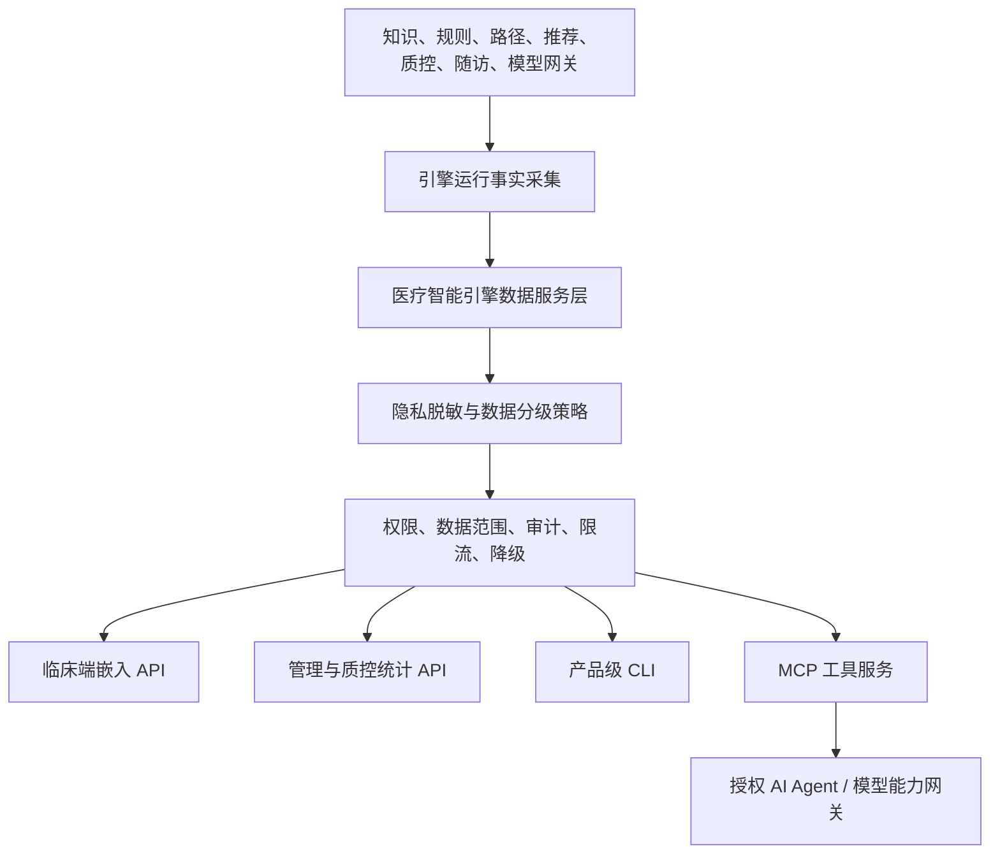

# 医疗智能引擎数据服务层设计

## 1. 决策结论

采用方案 B：建设统一的 **医疗智能引擎数据服务层**，把规则、知识、路径、推荐、质控、随访、模型网关和审计运行中产生的数据，沉淀为可权限控制、可脱敏、可审计、可解释、可统计的数据服务。

该服务层同时支撑四类入口：

| 入口 | 服务对象 | 核心价值 |
|---|---|---|
| 临床端嵌入 | 医生、护士、药师、医技人员 | 在工作站内查看当前场景相关规则、知识、路径提示和依据，不离开主流程 |
| 管理与质控端 | 院长、医务处、质控办、医保办 | 统计规则使用、风险趋势、路径变异、整改闭环和价值指标 |
| 产品级 CLI | 实施、信息科、运维、交付 | 检查知识包、规则包、字典映射、数据质量、脱敏样本和运行统计 |
| MCP 服务 | 授权 AI Agent、模型能力网关、开发者控制台 | 以受控工具形式查询知识、解释规则、判断知识是否存在、汇总引擎信号 |

MCP 与 CLI 不作为绕过系统治理的技术捷径。它们只能调用医疗智能引擎数据服务层暴露的受控工具，不能直连数据库、不能直接读取原始病历、不能绕过身份、权限、脱敏、审计和降级策略。

## 2. 目标

本设计要解决三件事：

1. 让引擎数据活起来：规则命中、知识检索、路径推进、推荐反馈、质控结果、模型调用和审计事件不只留在日志里，而是形成可查询、可统计、可改进的数据产品。
2. 让多入口统一：临床端、管理端、CLI、MCP、模型能力网关使用同一套后端合同，不出现页面一套、脚本一套、AI 工具一套的割裂。
3. 让隐私边界可证明：默认去除患者重要个人信息；任何需要患者上下文的临床使用都必须最小字段、授权会话、审计留痕、不可被模型或导出任务扩大使用。

## 3. 当前事实

- 产品宪法要求敏感字段必须脱敏、字段级加密和审计，任何医疗决策必须由医师确认才进病历。
- 模型能力必须经统一模型能力网关接入，并具备 B0 无模型可运行基线。
- 产品体验规范已经定义临床嵌入、低打扰、可信解释、驾驶舱下钻、异步导出和证据快照要求。
- 当前任务台账已有知识资产、规则引擎、路径引擎、推荐/CDSS、评估质控、嵌入 API、模型能力网关和大规模列表 API，但尚无 MCP 服务、产品级 CLI、统一引擎数据服务层的正式规格。
- 当前仓库已有知识资产、字典映射、审计、权限、运行底座等基础能力，可作为后续数据服务层的上游和治理基础。

## 4. 非目标

首版不做以下事情：

- 不让 MCP、CLI 或大模型直接访问数据库。
- 不把 MCP Server、Dify 或任何模型流程设为业务权威源。
- 不向大模型提供原始病历全文、完整医嘱明细、身份证号、手机号、住址、患者姓名等重要个人信息。
- 不自动诊断、不自动开医嘱、不自动写病历、不替代医师判断。
- 不提供未授权患者级明细导出；统计默认使用聚合数据或去标识化数据。
- 不在临床端做大而全的新页面；首版只提供可嵌入、低打扰、可解释的只读服务。

## 5. 总体架构

架构核心是一个统一的后端服务层，而不是多个入口各自拼数据。所有入口只能消费该服务层的工具和查询结果。

## 6. 能力分层

| 层 | 职责 | 关键要求 |
|---|---|---|
| 运行事实采集层 | 接收规则执行、知识检索、推荐触发、路径推进、反馈、质控、模型调用等事件 | 事件不可包含非必要明文个人信息；必须有租户、组织、场景、版本、traceId |
| 引擎数据服务层 | 形成规则使用、知识使用、临床信号、质控趋势、工具调用、导出任务等读模型 | 服务端分页、默认筛选、异步导出、total estimate、降级返回 |
| 隐私治理层 | 做字段分级、脱敏、去标识化、最小化、导出审批、用途限制 | 同一查询按角色和用途返回不同字段，不允许前端自行脱敏 |
| 访问入口层 | 提供临床嵌入 API、管理统计 API、CLI、MCP 工具 | 入口不同，治理相同；任何入口都必须审计 |
| 反馈闭环层 | 接收采纳、不采纳、忽略、误报、知识空白、规则空白、路径变异原因 | 回流到规则优化、知识更新、质控整改和模型评估 |

## 7. 数据分级与脱敏策略

| 级别 | 数据类型 | 默认策略 | 允许入口 |
|---|---|---|---|
| D0 | 系统运行元数据、工具状态、版本状态 | 可返回，但仍需权限 | 管理端、CLI、MCP |
| D1 | 已发布知识、规则、路径、配置包的元数据 | 可返回来源、版本、状态、风险级别 | 临床端、管理端、CLI、MCP |
| D2 | 聚合统计，例如规则命中量、知识命中率、科室趋势 | 去除患者标识，默认按组织和时间聚合 | 管理端、CLI、MCP |
| D3 | 去标识化病例上下文或样本 | 替换患者标识，移除直接识别字段；如需持久化患者相关字段，必须字段级加密 | 授权管理端、审批后 CLI、受控 MCP |
| D4 | 当前临床会话的最小患者上下文 | 只在授权临床启动会话内使用；如产生运行事实，只能保存字段级加密后的最小摘要 | 临床端嵌入、规则解释 |
| D5 | 患者姓名、身份证号、手机号、住址、完整病历原文、完整医嘱明细等重要个人信息 | 默认禁止进入数据服务、MCP、CLI 和模型输入；首版不开放例外路径 | 禁止 |

脱敏必须在后端完成。前端、CLI、MCP 客户端和模型提示词不得承担首要脱敏责任。

字段级加密是强制合同，不是实现建议：

- D3、D4 中任何需要落库的患者相关字段，必须使用字段级加密；数据库索引、日志、导出任务、审计摘要和缓存中不得出现明文。
- 可检索字段只能使用不可逆 hash、分桶值、标准化枚举或经批准的检索 token；禁止为了搜索方便保留患者标识明文。
- 密钥边界必须独立于业务表，后续实施计划需声明密钥来源、轮换方式、停用策略和本地开发替代策略。
- 审计事件只保存最小输入摘要、输出 hash、数据级别、脱敏策略和证据引用，不保存完整敏感入参。
- D5 数据若未来确有合规必要，必须另起隐私与合规审批规格；不得在本规格首版中通过配置开关启用。

## 8. 核心场景与需求

### 8.1 临床端使用

首版提供只读解释与依据服务：

- 当前患者或当前医嘱触发了哪些规则、路径节点、知识依据和风险提示。
- 为什么命中、适用条件是什么、来源版本是什么、是否为 AI 候选或确定性规则结果。
- 医生可采纳、不采纳并说明、稍后处理、查看依据；反馈必须回传并审计。
- 引擎不可用时显示“智能建议暂不可用”，不得阻断医生工作站主流程。

### 8.2 规则使用统计

规则统计至少覆盖：

- 命中次数、触发场景、命中科室、命中趋势。
- 采纳、不采纳、忽略、稍后处理、关闭等反馈分布。
- 误报反馈、疑似漏报回溯、规则空白区。
- 规则版本变化前后的命中差异和影响范围。
- 执行耗时、失败率、降级次数和异常原因。
- 高风险规则的人工确认率、确认延迟和证据完整性。

### 8.3 知识使用统计

知识统计至少覆盖：

- 检索次数、命中率、无结果问题、低置信问题。
- 被规则、路径、推荐、质控引用的次数。
- 来源版本、替换状态、过期风险和待审新版影响。
- 医生、护士、药师、质控人员在不同场景下的知识访问趋势。
- 高频知识空白和知识包补充建议。

### 8.4 质控与管理统计

管理视角必须面向行动：

- 按院区、科室、病种、规则域、路径包、时间范围聚合。
- 展示风险、异常、逾期、趋势变化和整改闭环率。
- 支持下钻到责任科室、问题类型、规则版本、知识依据和待办。
- 阶段报告和证据快照必须异步导出并留审计。

### 8.5 实施与信息科 CLI

产品级 CLI 面向交付和运维，不面向临床直接决策。首版命令域：

| 命令域 | 用途 |
|---|---|
| `knowledge` | 查询知识包状态、来源版本、无结果问题、知识空白统计 |
| `rules` | 检查规则包、规则使用统计、误报反馈、版本影响 |
| `clinical-signals` | 查看脱敏聚合后的临床信号和引擎降级情况 |
| `privacy` | 验证脱敏策略、字段分级、样本输出是否合规 |
| `exports` | 提交和查看异步导出任务 |
| `diagnostics` | 检查服务连通、权限、数据范围、MCP 工具状态 |

CLI 必须走后端 API 鉴权，不读取本地数据库连接串，不绕过导出审批。

### 8.6 MCP 服务

MCP 服务定位为“受控工具层”，给授权 AI Agent 和模型能力网关使用。首版工具建议：

| 工具 | 用途 | 默认数据级别 |
|---|---|---|
| `searchKnowledge` | 按场景、关键词、来源版本检索已发布知识 | D1 |
| `checkKnowledgeExistence` | 判断是否存在相关知识、是否过期、是否有待审新版 | D1 |
| `explainRule` | 解释规则含义、适用条件、来源和版本 | D1 |
| `queryRuleUsage` | 查询规则使用聚合统计 | D2 |
| `summarizeEngineSignals` | 汇总规则、知识、路径、质控的聚合信号 | D2 |
| `validatePrivacyPolicy` | 验证一次请求的数据级别和脱敏策略 | D0-D3 |
| `getClinicalContextExplanation` | 在授权临床会话内解释当前上下文命中依据 | D4，仅临床会话 |

MCP 工具返回必须包含 `traceId`、数据级别、脱敏策略、来源版本、权限结果和降级状态。工具失败时返回结构化原因，不允许把内部异常、SQL、原始提示词或敏感字段暴露给调用方。

MCP 默认只返回结构化结果，不返回可直接拼入模型提示词的患者上下文。D4 工具必须同时绑定临床 launch token、会话用途、过期时间、调用方能力代码和组织数据范围；任一条件缺失时只能返回无权限或降级结果。

## 9. 后端合同建议

首版 API 只定义服务边界，具体路径在实施计划中细化。建议分为四组：

| API 组 | 用途 |
|---|---|
| `/api/v1/engine-data/rule-usage/*` | 规则使用统计、反馈、版本影响、误报和漏报回溯 |
| `/api/v1/engine-data/knowledge-usage/*` | 知识检索统计、知识空白、来源版本和引用情况 |
| `/api/v1/engine-data/clinical-signals/*` | 脱敏临床信号、临床嵌入解释和授权会话内上下文 |
| `/api/v1/engine-data/tools/*` | MCP 与 CLI 共用的受控工具执行入口 |

所有接口必须使用统一 `ApiResult`、DTO 校验、分页或游标、错误码、traceId、审计事件和数据范围校验。写操作或导出任务必须具备幂等键。

实施计划必须继续拆清 DTO、权限码、数据级别枚举、错误码和审计事件枚举。任何包含 D3/D4 字段的 DTO 都必须标注字段级加密、脱敏展示值、可检索方式和禁止进入日志的字段清单。

## 10. 审计与证据

下列动作必须进入审计链：

- CLI 登录、工具调用、导出提交、导出下载、脱敏样本查看。
- MCP 工具调用、调用方身份、工具名、用途、数据级别、脱敏策略、输出 hash。
- 临床端查看依据、采纳、不采纳、忽略、稍后处理、关闭。
- 管理端下钻、证据快照、阶段报告导出。
- 模型能力网关调用引擎数据工具的输入摘要、输出 hash、模型模式、降级状态。

审计记录保存最小输入摘要，不保存完整敏感入参；需要证明输出内容时保存 hash、版本和证据引用。

## 11. 降级策略

| 故障 | 降级行为 |
|---|---|
| 模型不可用 | MCP 与 CLI 仍可查询 B0 确定性知识、规则和统计；模型增强摘要降级为结构化列表 |
| MCP 服务不可用 | 临床端和管理端不受影响；CLI 可继续走 REST API |
| CLI 不可用 | 不影响后端、临床端和 MCP |
| 数据服务聚合延迟 | 页面显示最新可用时间和延迟原因，禁止伪装实时 |
| 上游规则或知识引擎不可用 | 返回降级状态和最近可用快照，不阻断医生站主流程 |
| 权限不足 | 返回无权限状态，不以空数据伪装 |

## 12. 分期建议

| 阶段 | 内容 | 验收重点 |
|---|---|---|
| P0 规格与合同 | 形成统一设计、数据分级、API/MCP/CLI 工具边界 | 通过规格评审，不与宪法和体验规范冲突 |
| P1 数据服务最小闭环 | 规则使用统计、知识使用统计、脱敏聚合查询、审计 | B0 可运行，10 万级统计可分页筛选 |
| P2 CLI 与 MCP | CLI 命令骨架、MCP 工具服务、工具调用审计 | CLI/MCP 不绕过后端权限和脱敏 |
| P3 临床端只读解释 | 嵌入式依据卡片、当前上下文解释、反馈回流 | 低打扰、最小数据、医生反馈审计 |
| P4 管理与质控扩展 | 趋势、下钻、阶段报告、整改闭环输入 | 指标可行动、证据可导出 |

首版实施建议覆盖 P0-P2，并为 P3 临床端只读解释预留 API 合同；临床端正式嵌入可在嵌入 API 和 CDSS 任务具备后进入。

实施前置门禁：

| 阶段 | 前置条件 | 未满足时允许做什么 | 禁止做什么 |
|---|---|---|---|
| P1 数据服务最小闭环 | 已有真实知识资产 API、权限、审计、分页合同；规则统计至少具备真实规则执行合同或明确的上游事件合同 | 可实现服务骨架、数据分级、审计、权限、空状态和“上游未就绪”降级 | 禁止伪造规则命中、临床统计、采纳率或知识使用闭环 |
| P2 CLI 与 MCP | P1 的受控工具入口可用；认证、权限、审计、脱敏策略可由后端裁决 | 可实现确定性查询、状态检查、隐私策略验证和结构化工具错误 | 禁止 CLI/MCP 直连数据库、读取原始病历、拼接未脱敏模型提示词 |
| P3 临床端只读解释 | 嵌入 API、launch token、标准患者上下文、规则解释或 CDSS 合同具备真实上游 | 可接入只读依据卡片和反馈审计 | 禁止在没有真实上游时展示模拟临床结论 |
| P4 管理与质控扩展 | 评估质控、路径、整改闭环具备真实事件或合同 | 可展示聚合指标和下钻骨架 | 禁止把样例图表包装成生产统计 |

如果上游任务仍为 pending 或 partial，实施计划必须把对应能力标为合同预留或受控降级，不得用页面级 mock 或脚本假数据填充医疗统计。

## 13. 与现有任务台账的关系

该设计建议在台账中新增一个引擎数据服务任务组，承接但不替代现有任务：

| 建议任务 | 关系 |
|---|---|
| 引擎数据服务层 | 依赖知识、规则、路径、推荐、质控、模型网关和审计基础，提供统一读模型和工具网关 |
| 产品级 CLI | 依赖引擎数据服务层和权限审计，不独立直连系统内部实现 |
| MCP 服务 | 依赖模型能力网关策略和引擎数据服务层，不直接绑定模型供应商 |
| 临床端只读解释 | 依赖嵌入 API、推荐/CDSS、规则解释和最小患者上下文策略 |

后续更新 `docs/backlog.md` 时，应把这些任务放在 E2-E4 引擎能力阶段，而不是 E6 业务服务包装阶段。原因是它们是引擎能力的共用底座，不是某一个业务菜单的包装功能。

## 14. 验收标准

- MCP、CLI、临床端和管理端全部走统一后端服务层，无直连数据库路径。
- 任一工具调用都能说明调用方、用途、数据级别、脱敏策略、来源版本、traceId 和审计结果。
- 默认统计不包含患者姓名、身份证号、手机号、住址、完整病历原文或完整医嘱明细。
- D3、D4 持久化字段具备字段级加密合同，日志、索引、导出和审计摘要不含患者敏感明文。
- 关闭模型、Dify、图投影时，规则统计、知识统计、CLI 查询和确定性 MCP 工具仍可运行。
- 临床端只读解释不阻断医生站主流程，不暗示自动诊断或自动治疗。
- 规则使用统计和知识使用统计支持服务端分页、筛选、时间范围、组织范围和异步导出。
- 无权限、部分成功、降级、空数据、错误状态均有明确中文响应，不以空列表隐藏风险。
- 测试矩阵覆盖正常、空、错误、无权限、部分成功、降级、字段越权、模型关闭、MCP/CLI 越权、导出审批失败、审计写入失败。

## 15. 风险与控制

| 风险 | 控制 |
|---|---|
| 工具入口绕过产品治理 | MCP 和 CLI 只能调用后端受控工具；工具清单、权限、审计由后端裁决 |
| 统计数据重新识别患者 | 默认聚合；小样本阈值、科室维度、时间粒度和导出审批共同控制；默认低于 10 例的组合返回“已抑制（suppressed）”，跨维度下钻需逐级校验 |
| 临床端被误解为自动决策 | 文案、卡片、接口均标明依据与建议边界，必须保留医师反馈和人工确认 |
| 大模型扩大数据使用范围 | 模型能力网关必须声明用途、输入数据级别、脱敏策略和 B0 降级路径 |
| 数据口径碎片化 | 规则、知识、路径、推荐、质控统一写入运行事实和读模型，不允许入口自算核心指标 |
| 首版范围过大 | P0-P2 先落地服务层、统计、CLI、MCP；临床端正式嵌入按 P3 接入 |

## 16. 用户确认事项

用户已确认采用方案 B。本文后续进入规格评审；评审通过后，再由实施计划拆分具体文件、接口、测试、文档和 PR 交付步骤。
