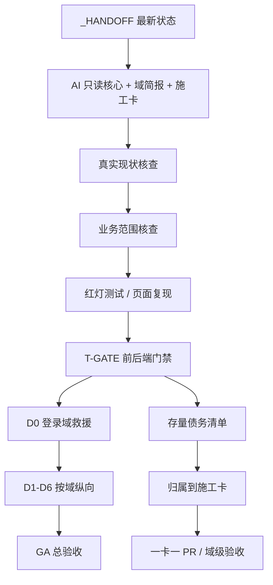

# 设计方案：真实性整治与研发重启闸门

> 设计日期：2026-05-31
> 状态：设计纠偏中
> 关联 OpenSpec：`engine-authenticity-remediation`

---

## 1. 设计原则

1. **先闸门后功能**：先把 T-GATE、登录域、证据模板和交接状态修到可信，再按施工卡推进业务。
2. **按卡收编，不搞大爆炸**：所有代码整改归属到 D0–D6 / wave2 / ga 的施工卡；本 OpenSpec 只负责纠偏和门禁设计。
3. **真实运行优先**：页面必须真实浏览器打开，接口必须真实测试，证据 hash 必须来自物理字节流，外部断连必须诚实降级。
4. **医学语义优先**：字典映射禁止把字符 LCS 作为语义判断依据；高危近似必须由负样本判别和人工确认保护。

---

## 2. 架构总览

---

## 3. 前端真实性门禁设计

### 3.1 拦截对象

- 业务页面与 feature 内的假数据数组、函数包装假数据、绕门禁注释。
- `Math.random()` 生成健康分、RTT、证据数量、业务 ID、hash、trace 等业务字段。
- `message.success` 或本地状态伪造后端成功。
- `<pre>{JSON.stringify(...)}</pre>`、`font-mono`、默认展示 trace / DSL / prompt。
- `.module.css` / inline style 中的 hex、rgb、hsl、硬编码圆角、硬编码字号。

### 3.2 放行方式

静态 UI 配置不可再靠整文件 `eslint-disable` 放行。允许三类：

1. 测试、Storybook、fixture 目录。
2. 菜单、表格列、步骤配置等非业务数据，迁到集中配置模块或 typed helper，并带中文业务说明。
3. 个别行级豁免必须有中文理由，且不得包含业务数据、医学常量、假 hash、假状态。

### 3.3 存量处理

研发重启初期允许门禁输出“存量债务清单 + touched file 硬阻断”；[BASE-09](../../../docs/cards/D0/BASE-09.md) 完成后切换为全量硬阻断。任何页面卡 done 前，相关页面必须零豁免、零假数据。

---

## 4. 后端真实性门禁设计

后端门禁由 [INFRA-02](../../../docs/cards/D0/INFRA-02.md) 承接：

- 阻断生产路径 `Math.random()` 业务造数。
- 阻断 UUID / 时间戳充当 hash；证据 hash 必须由物理内容生成，按配置选择 SM3 或 SHA-256。
- 阻断 catch 吞错返回成功。
- 阻断生产路径占位 Javadoc 和“模拟/占位/placeholder”公共说明。
- 阻断写死医学常量和单病种硬编码。

业务 ID 可用数据库序列、雪花算法或 UUID，但不得被描述为完整性 hash 或证据签名。

---

## 5. D0 登录域救援设计

D0 是重启第一闸：

1. **可渲染**：登录页在桌面和移动浏览器无空白、无重叠、无系统色/硬编码 token 违反。
2. **可提交**：`POST /auth/login` 使用 httpOnly cookie + CSRF；失败返回真实中文错误和 traceId。
3. **可导航**：登录后进工作台；401 / 会话过期 / 多 tab 登出回登录。
4. **可授权**：13 角色菜单按五维 RBAC 到 27 二级 + 5 高级粒度呈现。
5. **可审计**：登录、失败、登出、跨租户拒绝均有审计。
6. **可截图**：D0 PR 必须包含登录页、错误态、工作台、无权限态的浏览器证据。

---

## 6. 业务实现范围核查设计

业务范围核查由 `docs/BUSINESS_IMPLEMENTATION_SCOPE_AUDIT.md` 承接，作为每域开工前的硬闸：

1. **S 场景到卡**：S0–S40 必须有主卡；多卡承接时必须说明主卡和辅助卡。
2. **菜单到页面**：27 个客户二级菜单 + 5 个高级工具必须有页面卡或合并说明；实际路由不得游离于卡体系之外。
3. **卡到代码**：每卡进入实现前列出前端、后端、数据迁移、测试和 E2E 映射。
4. **B0 主链路**：D0–D6 每域必须有一条可自动化验证的无模型主链路。
5. **wave2 消费点**：AIK/LLM/KNOWGEN/DOMAIN 每张卡必须回指 D0–D6 的 B0 消费点。
6. **覆盖矩阵回填**：S17–S40 与 wave2 旧锚点仍待迁时，不得宣称业务范围零遗漏或 P8 巨物退役完成。

---

## 7. 医学语义映射纠偏

旧计划中的“实现 LCS 算法提升医学匹配”必须废止。新的 TERM 路径：

- B0：标准编码交叉表 + 同义词词典 + 来源分级 + 组织范围 + 高危负样本规则。
- B1/B2：可选模型嵌入仅经模型能力网关生成候选，不直接成为事实。
- 字符相似度：只可作为低权重召回信号；任何高危近似或高置信发布必须人工确认。
- 验收：钾/钠、肌钙蛋白 T/I、左/右、剂量量级等负样本必须被判为 HIGH，禁止批量确认与自动确认。

---

## 8. 回滚与渐进策略

- 本 OpenSpec 只改计划与门禁口径，可独立回滚。
- 后续代码按施工卡 PR 推进；每个 PR 小范围、可回滚。
- 门禁先 ratchet 再 full hard-block，避免一口气把存量债务变成不可定位的 CI 红海。
- D0 过闸前，不推进 D1–D6 新功能，防止继续在坏地基上堆页面。
