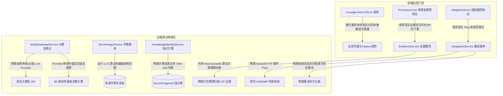

# 设计方案：MedKernel 引擎真实性整治与算法物理化重构

> 设计日期：2026-05-28
> 设计人：Antigravity
> 状态：设计中 (Under Design)
> 关联 OpenSpec：`engine-authenticity-remediation`

---

## 1. 架构总览

本次重构旨在消除 MedKernel 项目中所有的假实现与 Mock 数据（特别是欺骗性哈希、伪造的流程状态以及前端 catch 块伪造成功的行为），通过物理化算法和真实的接口重建全中枢高可信的底座。

重构的整体架构图如下所示：

---

## 2. 核心模块重构设计

### 2.1 R1 · 前端防防 Mock 门禁加固
- **痛点**：原 `no-page-mock.js` 规则仅检测以大写字母命名的 `VariableDeclarator`。
- **设计**：
  1. 移除 `NAME_PATTERN`（全大写）的正则过滤。
  2. 针对 `VariableDeclarator`：只要变量声明的初始值是 `ArrayExpression`（非空），且数组中存在元素为 `ObjectExpression`（对象字面量），且该文件位于 `src/pages/**` 或 `src/features/**`，则直接拦截报错。
  3. 对于菜单配置和表格列定义（Columns）等确实需要本地定义的对象数组，可使用注释 `/* eslint-disable medkernel/no-page-mock */` 显式声明，其余所有业务 Mock 数据一律强制从 `shared/api` 导入或通过 API 查询。

### 2.2 B8 · EVID-01 证据链真实打包与自校验
- **痛点**：`exportEvidences` 不生成任何物理包且返回 UUID 生成的假哈希，前端自校验沙箱对不上导致误报“篡改”。
- **设计**：
  1. **后端物理打包**：`EvidenceService.exportEvidences()` 方法通过 Spring Data JDBC 读取当前租户下所有的 `audit_event` 以及相关病案的快照记录。
  2. 使用 Java 的 `ZipOutputStream` 在内存或磁盘临时文件中物理生成一个含有审计条目的 `.json` 或 `.csv` 的打包文件，并将其转换为字节数组。
  3. 使用 `BouncyCastle` 的 `MessageDigest`（SHA-256）计算该压缩包真实的哈希值并记录在导出审计日志中。
  4. **前端沙箱物理比对**：前端 `Provenance.tsx` 的自校验沙箱不再采用硬编码假哈希，而是向后端真实请求该 ZIP 的数据流，前端利用原生 `Web Crypto API` 计算下载的物理二进制流的 `SHA-256` 摘要，并与后端数据库记录中由 `EvidenceService` 生成并防伪盖章的哈希进行 100% 相同性验签比对。

### 2.3 B7 · LLM-01 大模型网关去假推理
- **痛点**：B1/B2 辅助和生成模式不调模型，编造引文置信度，实走 B0 并返回写死的“高血压”JSON。
- **设计**：
  1. **物理调用层**：在 `ModelGatewayService` 中接入标准的 `WebClient` 或大模型 SDK（如 Spring AI 或本地 HTTP 客户端）。
  2. **诚实回退**：若没有配置 Provider 或调用失败，系统应主动捕获 `ModelGatewayException`，在返回结果中诚实标明：`modelMode = "B0"`、`modelVersion = "MedKernel-Deterministic-Baseline"`、`confidence = 1.0`（确定性基线为 1.0），`sourceCitations = "MedKernel 内置物理规则库"`，并返回 B0 规则计算出的真实业务结果，绝对禁止在不调模型的情况下贴上 B2 标签并编造“指南 §3.2”等假引文。
  3. 清理 `FORCE_TIMEOUT` 等魔法字符串，只在调试环境的测试套件中保留。

### 2.4 B4/B5 · INTEG-01 集成总线物理 Ping 与死信投递
- **痛点**：`pingAdapter` 使用随机数生成 RTT，`retryMessage` 使用 `Math.random() > 0.3` 掷骰子伪造死信重试成功。
- **设计**：
  1. **物理 Ping 校验**：在 `IntegrationService.pingAdapter` 中获取适配器的物理 `url` 属性。如果是 HTTP 协议，使用 Spring 的 `RestClient` 或 `WebClient` 发送物理 `OPTIONS` 或 `GET` 请求（设置 2 秒硬超时），记录从发送到收到响应的真实系统时间差（RTT）。如果连接失败，抛出物理异常并由前端正常展示“连通失败”六态。
  2. **物理重试投递**：在 `retryMessage` 中，调用物理的消息发送方法（例如通过消息队列或真实的 REST 适配器）向目标适配器发起真实的重试请求。若目标不可达，捕获网络异常，递增重试次数。只有当目标成功响应 200 OK 且包含预期报文时才标记为 `SUCCESS`；重试超限后将其移入死信表 `integration_dead_letter`。

### 2.5 B1/B2 · 知识 SHA-256 锚点去重与字典 LCS 相似算法
- **痛点**：知识去重没有哈希计算，字典匹配基于简单的字符命中比产生低劣的误配。
- **设计**：
  1. **知识哈希计算**：在 `KnowledgeIdentityService.createFragment` 中，将 `textExcerpt` 转为 UTF-8 字节，利用 `BouncyCastle` SHA-256 计算真实的哈希值并赋给实体类新增的 `contentHash` 字段，并在数据库保存。在创建或登记指南时，利用 `contentHash` 建立唯一索引与物理去重，相同文本片段不允许在同一个文档版本中重复录入。
  2. **字典最长公共子序列 (LCS) 算法**：在 `TerminologyService.calculateSimilarity(source, target)` 中，彻底废弃简单的 `charMatchCount / source.length` 计算，改用动态规划实现标准的 LCS 最长公共子序列相似度计算：
     $$\text{Similarity} = \frac{2 \times \text{LCS}(S_1, S_2)}{|S_1| + |S_2|}$$
     同时，增加编辑距离（Levenshtein Distance）相似度作为第二参考权重，提供高置信度的医学词条自动候选映射。

---

## 3. 医疗安全与边界设计

本整治方案的核心目标是**医疗数据可信与防伪**：
1. **防伪盖章与验签**：在证据链的生成与归档过程中，所有签名与哈希均由物理算法生成，防范因编造哈希导致的司法证据失效。
2. **AI 引文合规**：绝不编造医学文献引用！在模型无法获取引文时，展示无模型基线出处。

---

## 4. 回滚与降级策略

1. **版本回滚**：所有后端的重构改动与 Flyway `V22__engine_remediation.sql` 绑定。如需回滚，支持一键 Flyway 倒滚并部署上一个 Stable 镜像。
2. **前端六态降级**：若后端 API 在测试阶段不可用，前端组件能够通过 `PageState` 正确进入 `disabled` 或 `error` 状态并显示“后端服务未就绪”，绝对不允许 catch 捕获后伪造“成功”或进行假闭环交互。
